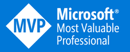

Hi, I'm Davide Bellone! I'm a software developer with more than 8 years of professional experience.

I'm currently employed as a senior backend developer in a private company in Turin, Italy.

I've been working with Microsoft platforms and frameworks since 2014: I started as a **SharePoint** developer, then I moved to **ASP.NET MVC 5**, **.NET API**, **Angular 6**, and finally I became a **full backend** developer.

I'm currently working with many tools and frameworks, like **Azure**, **RabbitMQ**, **MongoDB**, and **Docker**.

I love learning new things, and I think that the best way to learn is to share: that's why I started my journey as a content creator and conference speaker.

If you want to keep in touch, you can find me on [Twitter](https://twitter.com/BelloneDavide) and on [LinkedIn](https://www.linkedin.com/in/bellonedavide/) where I publish interesting (I hope😁) content about C# and .NET!

Ah, and I'm also a [Microsoft MVP](https://mvp.microsoft.com/en-us/PublicProfile/5005077?fullName=Davide%20Bellone) 🏆!

