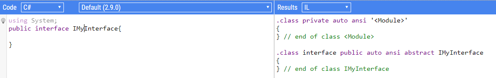

Friday, October 26th, 2018 I attended the .NET Conference in Milan, Italy. It was an event organized by [ASP Italia](http://www.aspitalia.com "ASP Italia website" ), with the sponsorship of Microsoft and [Icubed](https://icubed.it/ "Icubed website").

The conference was about the news in the .NET world: .NET Core 2.x, Azure, C# 8 and Blazor and so on.

I'm not going to talk about everything we discussed - of course, I cannot write everything we discussed in a whole day in just one article. I'll focus on random things I learned.

## Interfaces are abstract classes

I always thought that interfaces and abstract classes were totally different things. Using the [Sharplab](https://sharplab.io "Sharplab website") online tool, that shows the IL result of a C# snippet, they highlighted that __internally an interface is also an abstract class__.



Actually, __this doesn't mean that you can declare abstract methods in interfaces__. But that brought the Microsoft team to a brand new functionality in C# 8: default method implementations for interfaces.

## Interfaces will have default methods implementations

Yes, I know, this sounds a bit confusing.

What I mean is that, in C# 8, there will be (probably, currently it is just a proposal) the possibility to define the default behavior of an interface method.

```cs
public interface IMyInterface
{
    string getValue(string val);
    string getUpperValue(string val) => getValue(val.ToUpper());
}

public class MyImplementation : IMyInterface
{
    public String getValue(string value)
    {
    //do something awesome
    }
}
```

As you can see, in the interface it won't be mandatory to implement all the methods, but only the ones with no default behavior. The others can be obviously overridden. 

## Tiered Compilation for .NET Core 2.1

When setting up a project, choosing the compilation that fits the best can be hard.

An optimized compilation brings to high performance, but has the side effect that the application starts slowly.

On the other side, the simple compilation allows your application to start very quickly, but in general the application is slower.

__Tiered compilation__ takes the best of both worlds. It swaps the compilation method at runtime: the normal compilation can be used at start-up time, while in the background the optimized compilation is taking place. When it's ready, compilation methods are swapped.

[Here](https://blogs.msdn.microsoft.com/dotnet/2018/08/02/tiered-compilation-preview-in-net-core-2-1/ "Tiered compilation on Microsoft docs") you can find an interesting article that explains this kind of compilation more in detail.

## Blazor, an experiment framework

If you are used to .NET MVC, but you also want to write client-side logic in C#, [Blazor](https://blazor.net/ "Blazor website") can be the right choice.

This framework runs on [WebAssembly](https://webassembly.org/ "WebAssembly website"), which allows you to call .NET Standard libraries from the browser, using a syntax similar to Razor. And yes, "Blazor" is the crasis of Browser and Razor.

As you can see in the image below taken [from caniuse.com](https://caniuse.com/#search=webassembly "CanIUse link"), WebAssembly is supported by the most used browsers, even on mobile.


This is still an experiment. In my opinion, in a few years this project will be dropped, due to the constant improvement of client-side technologies based on JavaScript. This framework is not meant to replace pure JavaScript or other frameworks (like Angular, Vue.js), but it is oriented to server-side developers that want to approach client side development.

Who knows, only time will tell.

## .NET Core runs on Samsung TVs

__Tizen .NET TV Framework__ is the framework that runs on Samsung TVs since 2017. Natively it supports _.NET Core_ and _Xamarin.Forms_, but interacts with the Tizen APIs to enable platform-specific features.

In Visual Studio you can download tools for Tizen and write apps for Samsung TVs, and also download an emulator.

## Conclusion

The conference was really stimulating. In this article, I gave just a quick overview of some of the things I learned, but I didn't mention the main topics of the speeches. If you are curious to know what the conference was about, [you can have a look at the agenda](http://www.aspitalia.com/eventi/72/.NET-Conference-Italia-2018-Milano.aspx "DotNet conf agenda" ) (of course, in Italian).
