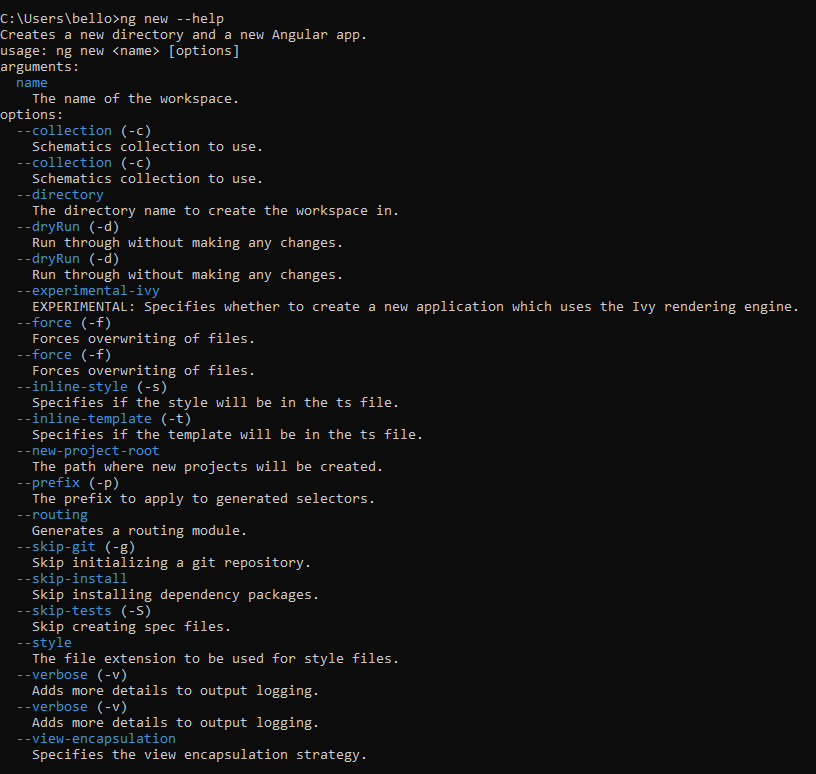
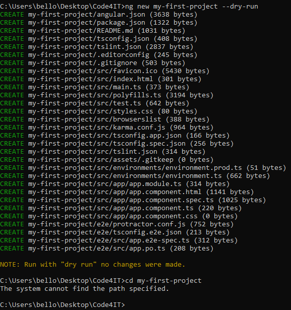
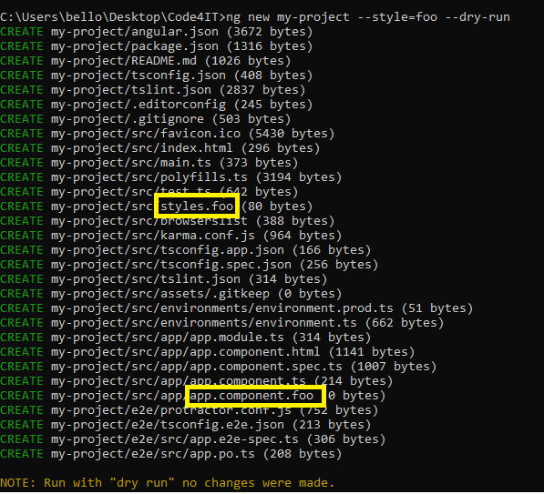
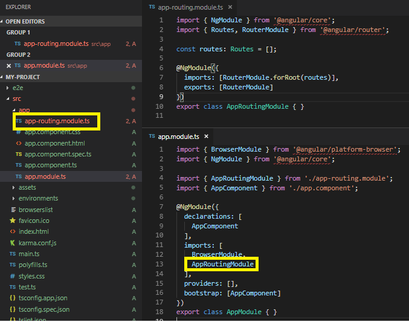
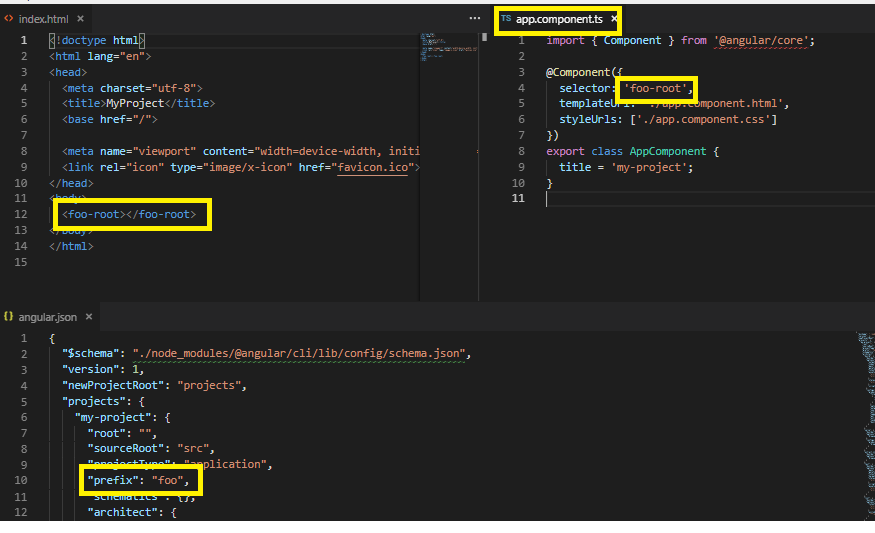

Before reading this article, be sure you know what **Node.js**, **NPM** and **Angular** are. If you are not sure, [here's a short reminder](/blog/angular-vs-npm-vs-node-js "A recap of Node.js, NPM and Angular").

In this article, I'm gonna use the **Angular CLI (Command line interface)** to create a simple Angular project. I have the version 6.2.0 of @angular/cli installed on my system. I know, Angular CLI v7 has recently been released, but these options are still valid.

## ng new

The ng new command allows you to create a new Angular project. You have to navigate to the folder that will contain the project and run the command `ng new project-name`. It will create the folder _project-name_ with the Angular project in it. There are few options that you can specify when creating the project, and you can see the list with the option --help.

Run `ng new --help`. You'll see something like this:

This is the list of available options. In this article I'll show you the most important ones, for me, to have a go with a project.

### --dry-run

One of the least used options (but one of the most useful) is `--dry-run`, that gives you a preview of the file generated with the command without really creating the files.

As you can see in the above picture, the _--dry-run_ (or the alias -d) shows you the file that would be created if you run the command without the --dry-run option. The yellow note confirms that the files weren't actually created, but that was a simulation.

This is also confirmed by the fact that looking up for the my-first-project dir, this doesn't exist.

### --skip-install

If you want to create a project without losing time with the installation of the node modules, `--skip-install` is your choice.

With this option, the project will contain only the files, but packages won't be available until you run the `npm install` command.

### --style

With the _style_ option, you can define the style of your style files for your project. The default is CSS, but you can specify your favorite kind with the command

`ng new my-project --syle=style-extension`

Common sense makes you think that the available values would be CSS, SCSS and LESS, but the fact is that you can specify whatever you want, even not existing style format.

In the example below I set the value to _foo_.

### --routing

Routing is one of the keys to the success of Angular, and of course of Angular-based sites.

With the `--routing` option you can tell the CLI to create the Routing Module and to add it to the AppModule.

## --prefix

The default prefix for the directives is _app_: you can find it in the AppComponent selector (app-root) and in every component or directive you create with the CLI.

To change the default prefix you can use the --prefix option:

`ng new my-project --prefix=foo`

This will set the default prefix to _foo_ for the whole application, updating also the corresponding property in the _angular.json_ file.

Note: the prefix isn't about the name of the components and directives, but only the way they are referenced in the templates.

### --inline-style

Sometimes you don't want to create files for styles. The `--inline-style` will prevent it.

Using this option the styles will be created directly in the component metadata. The styles file won't be created at all.

Notice that this option refers only to the component styles. The default style of the application (the one whose extension can be defined with the _--style_ option) will be created as usual.

### --inline-template

Similar to the _inline-style_ option, _inline-template_ won't create the HTML file but will allow you to add HTML structure directly in the component.

_This article first appeared on [Code4IT](https://www.code4it.dev/)_

## Wrapping up

In this article, I gave a glimpse of what the CLI can do for you when creating a new project. There are more options available, but I think that the most useful are the ones listed above.
