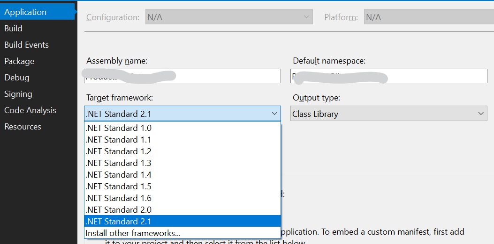

Something strange happened today.

I've developed a Class Library in .NET Framework and I tested it with the related test library.

So I've integrated the library into another project. Everything was fine, I used that library without problems.
But, all of a sudden:

_Error CS0246: The type or namespace name 'XX' could not be found (are you missing a using directive or an assembly reference?)._

**What?!?** I've been using it for the whole week. I've tested it. I've added the reference, and the Intellisense works as well.

C'mon, the class is here!

Clean the solution... nothing happens.

Close Visual Studio... still nothing.

Have a coffee... well, better now.

Suddenly, a doubt: _what if I've created it in .NET Core instead of .NET Framework?_

And, obviously... no, it wasn't that.

But I was close: the Class Library was in _.NET Framework 4.7.2_ but the application was in _.NET Framework 4.7.1_. **It was the patch version!**

So, I just downgraded the class library version through Visual Studio, and everything went well again.

You can find the version in the Properties screen of the project (right-click on the project in the Solution Explorer or _Alt+Enter_), in the _Application_ tab, then under the _Target framework_ field.

So, the lesson is: _know your enemy_ and check for the slight details.

_This article first appeared on [Code4IT](https://www.code4it.dev/)_
