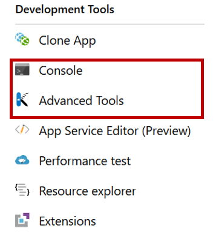
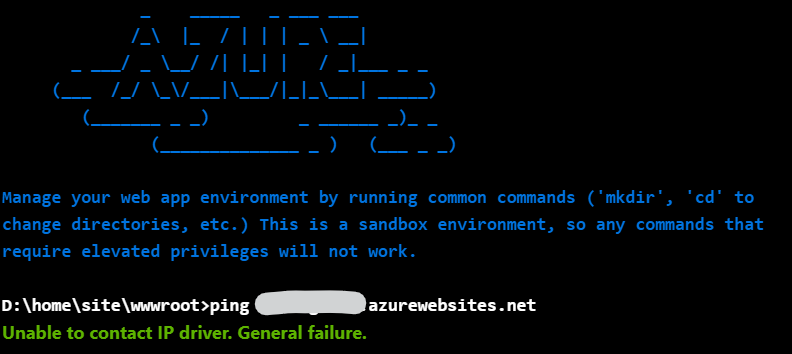
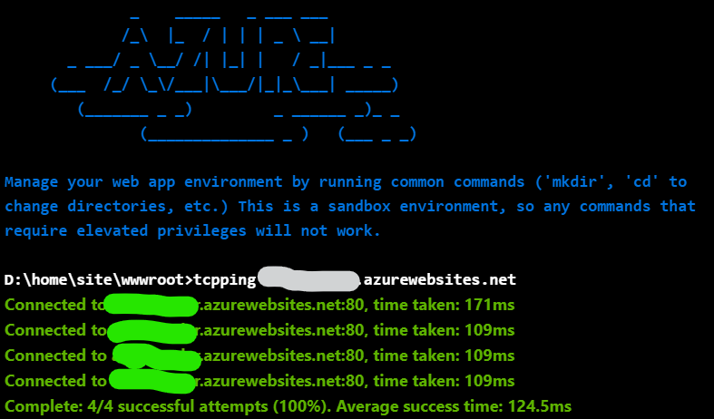

Probably you already know what **ping** is: it is a command that you can run on your terminal to see if a host is up and running.

It works by sending some packets to the host and waiting for a response, and it measures the round-trip time that the message takes to go to the host and come back to the client.


An example can be

```bash
ping code4it.dev
```

that can return something like

```bash
Pinging code4it.dev [165.22.65.139] with 32 bytes of data:

Reply from 165.22.65.139: bytes=32 time=17ms TTL=51
Reply from 165.22.65.139: bytes=32 time=20ms TTL=51
Reply from 165.22.65.139: bytes=32 time=15ms TTL=51
Reply from 165.22.65.139: bytes=32 time=16ms TTL=51

Ping statistics for 165.22.65.139:
    Packets: Sent = 4, Received = 4, Lost = 0 (0% loss),
Approximate round trip times in milli-seconds:
    Minimum = 15ms, Maximum = 20ms, Average = 17ms
```

**PSSS! Remember not to include the protocol!**

## ICMP

More in detail, **ping sends an ICMP echo request** to a specified interface and waits for a reply.

Just as a reminder, [ICMP (_Internet Control Message Protocol_)](https://en.wikipedia.org/wiki/Internet_Control_Message_Protocol "ICMP explanation on Wikipedia") is a network protocol that is at the same level as TCP and UDP on the networking stack, but it is typically not used for exchanging data between endpoints but only for sharing errors or information.

## Azure and ICMP

The problem comes when you want to ping a service hosted on Azure: in order to avoid DDoS attacks, the Azure team decided to block ICMP packets.

As [stated by the Azure Networking Team](https://feedback.azure.com/forums/217313-networking/suggestions/3346609-icmp-support-for-azure-websites-roles-cloud-serv "Azure Networking Team answer"):

> Unfortunately ICMP presents risks and problems for our underlying network infrastructure.

So you cannot ping them.

In fact, if you try it from your system, you will receive **Request time out**.

But at least you can try to reach it using a browser!

## A simple use case

Let's say that you have a website, _mysite.azurewebsites.net_, that must communicate with an API hosted at _myapi.azurewebsites.net_. Now you want to check if the networking between the two systems works well and check if everything is well configured.

Of course, you can't open a browser _inside_ the Azure portal. So what?

## TCPPing - the solution for you

First of all, you should try to ping the service within the Azure Portal, so that you are sure you're running the commands in the cloud environment. Azure Portal allows you to use multiple tools to interact and analyze what's going on on your App: just open your resource and head to **Development Tools**

You will find both a Console and an external tool called _Advanced Tools_: you can use both, but here I'm using the _Console_ tool:



If you try to ping _myapi_ from Azure, you won't receive a **Request time out**, but a different error:

```bash
Unable to contact IP driver. General failure
```



That's because the ping command has directly been disabled.

So how can we solve it?

Well, the solution is pretty easy! There is a command called **tcpping** that allows you to do something similar, and that can be called by both the Console and the Kudu advanced tool, accessible in the Development Tools section.

By running `tcpping myapi.azurewebsites.net`, you can get something similar:

```bash
Connected to myapi.azurewebsites.net:80, time taken: 171ms

Connected to myapi.azurewebsites.net:80, time taken: 109ms

Connected to myapi.azurewebsites.net:80, time taken: 109ms

Connected to myapi.azurewebsites.net:80, time taken: 109ms

Complete: 4/4 successful attempts (100%). Average success time: 124.5ms
```

That, in the console, looks like this:



If you wanna have more info about this command, you can simply type `tcpping`.

First of all, it explains what it is: _Opens a TCP socket to a target host:port and returns whether the initial handshake was successful and a connection was established_.

That's the way to avoid ICMP packets! Just use TCP!

There are also some flags that can be set:

- `-n`: the number of pings to perform. If not specified, the value is 4
- `-t`: loop infinitely
- `-s`: run for the specified seconds

_This article first appeared on [Code4IT](https://www.code4it.dev/)_

## Conclusion

Here we've seen how you can ping an Azure App Service inside the Azure Portal. This is a tiny tool that you must know if you want to check if your architecture is well configured. Do you know other ways?
