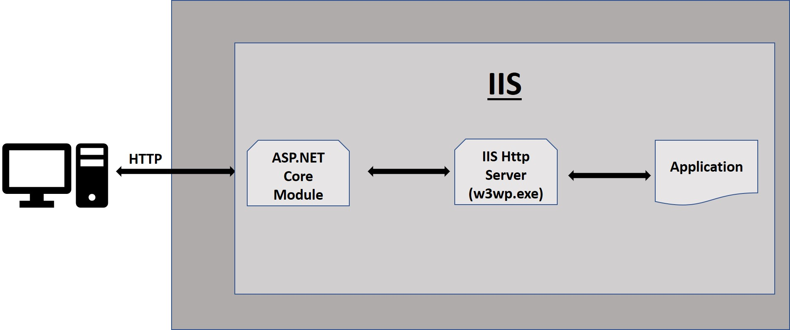
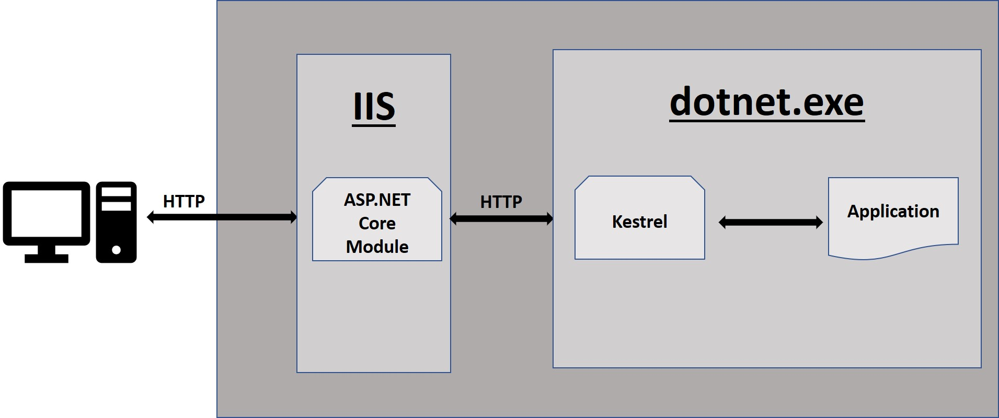

When talking about must-have for websites, performance is one of them. Why is it important? And how can you achieve it?

## 3 seconds are too much

Loading time for a web page is crucial, especially in mobile. More than 50% of mobile users abandon a website if it takes more than 3 seconds to load. This is why Google's ranking algorithm now considers the loading time for scoring pages during mobile searches.

There are different ways to achieve great results. The most common are: 

* split JavaScript and CSS files into different chunks, downloaded only when necessary
* compress content
* speed up backend calculations
* store images and static content on CDNs
* geographically distribute your endpoints

## Compression algorithms: Brotli

First of all: there's a huge difference between minification and compression:

 __Minification__ is the act of remove useless characters from files, like whitespaces and comments. It reduces the size of the file, but this process is done while building the application. The size of the file generated is the same of the one transmitted via HTTP calls;

__Compression__ is the act of reducing the size of the file downloaded via web using a compression algorithm: the file is compressed before being downloaded and decompressed when received by the client. So the HTTP call is lighter not because you removed contents from the file, but because the file is not transmitted as-is but compressed.

The compression algorithm can be seen in the response header of a HTTP call. You can create an HTTP request specifying the compression type you need, adding the __Accept-Encoding__ header.

For example

```
Accept-Encoding: gzip
```

In the response header you will see:

```
Content-Encoding: gzip
```

While the most common algorithm is _gzip_, another one is coming to fame: __Brotli__. This is a compression algorithm developed by Google with better performance for text content: the content is compressed using a dictionary shared between client and server, in a way that common keywords can be replaced with smaller keys.

Currently Brotli is supported by almost all the browsers, with - obviously :) - the exception of IE11. The list of supported browsers can be seen [here](https://caniuse.com/#search=brotli "Brotli usage on CanIUse").

You can read more about Brotli [here](https://medium.com/oyotech/how-brotli-compression-gave-us-37-latency-improvement-14d41e50fee4 "Brotli compression details").

When compared with the gzip algorithm, Brotli creates smaller files, with about 17% of compression. But... a smaller file does not mean more speed, because you can lose time processing the file.

Both gzip and Brotli have different levels of compression. For gzip the level range is 1 to 9, where 1 means "few compression for great speed" and 9 is the opposite. Brotli has a similar scale: 1 to 11. The difference comes for the default value: gzip's default is 6 (enough in the middle), but Brotli comes with 11 as default value. This means that by default this algorithm is a bit slower but it creates very compressed files.

To require a resource compressed with the Brotli algorithm you can add

```
Accept-Encoding: br
```

to the request.

### In-process vs Out-of-process

Just a reminder: __Kestrel__ is the cross-platform web server for ASP.NET Core. It's thanks to it that you can run the same application on Windows and on other operating systems. 

For ASP.NET Core apps you can choose the hosting model: with __in-process hosting model__, .NET Core apps run in the same process of the IIS worker: it means that when a request comes in, the app pipeline is executed directly; on the contrary, with __out-of-process hosting model__ the app runs on a separate process, so there must be a proxy between IIS and the app. 



The _out-of-process_ hosting model is slower than the other one, because when the ASP.NET Core Module receives an HTTP call (I'm simplifying a lot the process), it calls localhost via HTTP to a port where the Kestrel web server is running.




This is the default option for .NET Core apps, since .NET Core was built with cross-platform compatibility in mind. To change this behaviour you can modify the web.config and add

```xml
<PropertyGroup>
   <AspNetCoreHostingModel> InProcess </AspNetCoreHostingModel>
</PropertyGroup>
```

So, for applications running on a Windows machine, you should consider the _in-process_ hosting model and use IISHttpServer instead of Kestrel.

You can have additional info [here](https://docs.microsoft.com/en-us/aspnet/core/host-and-deploy/iis "IIS documentation on Microsoft docs") and [here](https://docs.microsoft.com/en-us/aspnet/core/host-and-deploy/aspnet-core-module "ASP.NET documentation on Microsoft docs").

## MiniProfiler

A tool that can be useful for analyzing performance is [MiniProfiler](https://miniprofiler.com/dotnet "Miniprofiler for .NET"). This is a profiler available for _.NET_, _Go_, _Ruby_ and _Node.js_. 
It does not profile every method called during an execution, but it provides some methods to profile a set of line of codes and define a name for that execution.
The simplest way is to use the _Step_ method:

```cs
// do something

using(MiniProfiler.Current.Step("Step label"))
{
   // do something to be profiled
}
```

You can configure your web application to use a SQLLite DB and expose the results at some endpoints.

For the .NET world, it is available for both .NET framework and .NET Core, and for both Web applications and Console applications.

## Conclusion

Now you have tools and ideas for improving performance for your websites. Have you tried them?

Happy coding!
