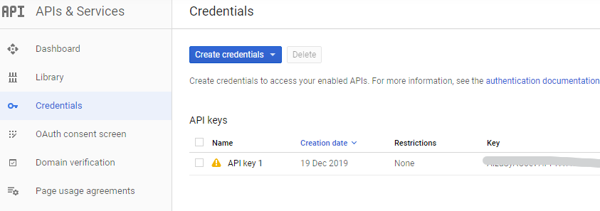

Let's say that you have a YouTube channel. Now, you want to list all the videos that you uploaded, and you are really strong in .NET Core 3.

So, what can you do?

First of all, you need to retrieve two information: your _API key_ and your _channel id_.

## Create your YouTube API Key

In order to use YouTube APIs, you need a developer key.

You can get it by simply visiting [the Google developers page](https://console.developers.google.com/getting-started "Google developer console page"), where you can set up a new project (it's just a grouping of functionalities) and then navigate to the _Credentials_ page where you can create the key.



Here you can set additional properties, like the key name and some restrictions.

## Get you Channel ID

This information is really simple to get. Just access your account, then navigate to [your advanced settings](https://www.youtube.com/account_advanced "YouTube advanced settings page").


Here you have info about your user id and your channel ID.

Ok, now we have everything we need! It's time to go!

## First steps with your codebase

Of course, you need an application to host the code. You can simply create a Console application with .NET Core 3.

Then, you need to download and install two NuGet packages: `Google.Apis` and `Google.Apis.YouTube.v3`; currently both packages are at version v1.43.0.

Now, since you need a list of videos, you must create a YouTubeVideo class:

```cs
public class YouTubeVideo
{
    public string Id { get; set; }
    public string Title { get; set; }
    public string Description { get; set; } 
    public string Thumbnail { get; set; }
    public string Picture { get; set; }
}
```

Nothing difficult. Just notice that I have 2 fields for the images: one for the Thumbnail and another for the main Picture.

## Add a YouTube Service

To download those data, you need to instantiate a YouTube Service:

```cs
using (var youtubeService = new YouTubeService(new BaseClientService.Initializer()
{
    ApiKey = '<your api key>'
}))
{
    // todo 
}
```

_NOTE_: here I only set the _ApiKey_ value in the `Initializer` constructor. You can add other properties, like `GZipEnabled`, `ApplicationName`, `Serializer` and so on.

## Download the list of result

Now that you have the client, you must create the request.

```cs
var searchListRequest = youtubeService.Search.List("snippet");
searchListRequest.Q = searchText;
searchListRequest.MaxResults = maxResult;
searchListRequest.ChannelId = '<your-channel-id>';
searchListRequest.Type = "video";
searchListRequest.Order = SearchResource.ListRequest.OrderEnum.Relevance;
```

The `YouTubeService` class contains references to most of the capabilities provided by YouTube, such as _Search_, _Video details_, _Channels_, _Captions_ and so on. Here we are interested in the Search functionality, so we must set it as "endpoint" and define where we want to search.

_Confession time!_ I still haven't figured out what the _snippet_ value means, and if there are other values. Every example in the documentation use this value.

The parameters meaning is straightforward. But just a consideration: since the service searches for each part of YouTube, __you can restrict the type of content that you want__. Here I set "video", but you can use a combination of "video", "channel" and "playlist", separated by a comma. 

Now that we have set our search parameters, we can get the results:

```cs
var searchListResponse = await searchListRequest.ExecuteAsync();
```

This method returns a _SearchListResponse_ object that contains items in the _Items_ field.

Now you have everything you need, so you can generate the list of YouTubeVideo elements this way:

```cs
List<YouTubeVideo> videos = new List<YouTubeVideo>();
string GetThumbnailImg(ThumbnailDetails thumbnailDetails)
{
    if (thumbnailDetails == null)
        return string.Empty;
    return (thumbnailDetails.Medium ?? thumbnailDetails.Default__ ?? thumbnailDetails.High)?.Url;
}


string GetMainImg(ThumbnailDetails thumbnailDetails)
{
    if (thumbnailDetails == null)
        return string.Empty;
    return (thumbnailDetails.Maxres ?? thumbnailDetails.Standard ?? thumbnailDetails.High)?.Url;
}

foreach (var responseVideo in searchListResponse.Items)
{
    videos.Add(new YouTubeVideo()
    {
        Id = responseVideo.Id.VideoId, 
        Description = responseVideo.Snippet.Description,
        Title = responseVideo.Snippet.Title,
        Picture = GetMainImg(responseVideo.Snippet.Thumbnails),
        Thumbnail = GetThumbnailImg(responseVideo.Snippet.Thumbnails)
    });
}
```

_Notice_: most of the interesting properties of a video are stored in the inner fields, like _Id.VideoId_ or _Snippet.Description_. Also, notice that __each element has 4 thumbnails__, one for each resolution. Since some of them might be empty, you should select a fallback value.

## Final result

Now you have all the info you need! You can have a look at a complete example on [my GitHub account](https://github.com/code4it-dev/youtube-search "GitHub repository for this article"). I have done a bit of refactoring: now the method is wrapped into an async method, and the configurations are stored outside the method.

## The pagination issue

As you might have noticed, I didn't mention the pagination.

YouTube uses a curious way to handle it: instead of allowing you to set the current page (or the typical skip and limit parameters), __it returns a token for the next page and a token for the previous page__.

In fact, the _searchListResponse_ contains two properties, `NextPageToken` and `PrevPageToken` that must be used for the pagination. So you must save the token somewhere and use it as a parameter of `searchListRequest`.

```cs

// when you read the content
var nextPageToken = searchListResponse.NextPageToken;

// when you are querying next page
searchListRequest.PageToken = nextPageToken;

``` 

## Wrapping up

Here I searched for content on YouTube using .NET Core 3. 
Just remember that the result data are about the search preview, so the description and the images are not the same that you would retrieve by analysing the detail of a single video. For example, the description field here is a shortened version of the real description of the video. You will see how to get those details in a separate article.
