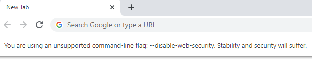

A few days ago I came across a problem: while developing a page I was integrating some external APIs. Those APIs were misconfigured, so running the application on localhost brought me a CORS error.

## CORS: a reminder

Just a reminder of what CORS is (taken from [MDN web docs](https://developer.mozilla.org/en-US/docs/Web/HTTP/CORS "MDN documentation on CORS")):

> **Cross-Origin Resource Sharing** (CORS) is a mechanism that uses additional HTTP headers to tell browsers to give a web application running at one origin, access to selected resources from a different origin. A web application executes a cross-origin HTTP request when it requests a resource that has a different origin (domain, protocol, or port) from its own.

In short: let's say that my site is running on _my-site.com_, and I need access to a resource from another domain (eg: _ext-site.com_). If the creators of ext-site.com want to allow my-site to use their resources on the browser, they must add an **HTTP header** that tells the browser that my-site is "authorized" to use their resources.

## Running Google Chrome without CORS

Of course, I couldn't update the configurations on API's server, so I was stuck.

Then, after some research, I came across an [article by Aleksandr Filatov](https://alfilatov.com/posts/run-chrome-without-cors/ "Run Chrome without CORS on other OSs") where the author suggests a way to open Google Chrome without CORS.

You can create a shortcut, as explained in his article. Otherwise, if running Windows 10, you can open a console and run

```bash
"C:\Program Files (x86)\Google\Chrome\Application\chrome.exe" --disable-web-security  --user-data-dir=~/chromeTemp
```

This command opens a new Google Chrome window and allows you to continue with your development.



As you can see, there is a warning stating that the flag `--disable-web-security` can bring security issues. You can just ignore it for local development.

Also, as you can see from the screenshot above, the bookmark bar is empty (because there is no associated user).

If you don't want to work on terminal each time, you can put the script directly into a .bat file, and run it as if it was a simple program.

_This article first appeared on [Code4IT](https://www.code4it.dev/)_

Happy coding!

🐧
