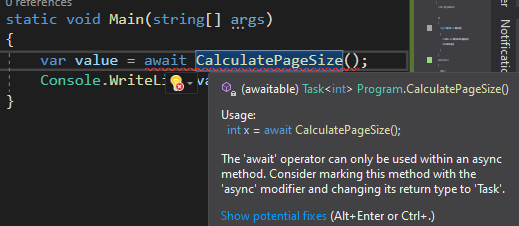
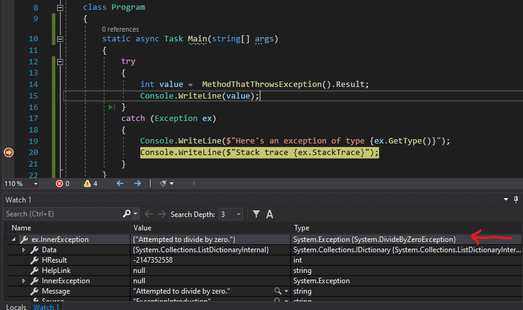

Asynchronous programming is a HUGE topic. That's why I'm not gonna talk of everything (even because I'm still learning).

I've always seen it as a difficult topic, and I thought it was kind of useless to know and implement it. But I was wrong: it's not difficult, and it brings lots of benefits to your systems. 

So, here's a short introduction. We'll have a look at what is asynchronous programming, why you should care about it and how to implement it in your codebase.

## Why async programming

Let's start with the typical example: you have a mobile or desktop application, and you need to fetch some data from an API that takes some seconds to do its job. In a synchronous way, the process handling the GUI will be stuck while waiting for the result from the API. Being stuck also means to freeze the application, not showing a progress bar and so on. If you make the application asynchronous, the process that handles the API call is different from the one that updates the GUI, so you can do whatever you want while downloading the data.

Almost every article and every tutorial use this kind of example as an introduction. This is not a bad example, but it doesn't make sense if I try to apply it to my job. Being a backend developer, I am the one who creates the APIs. So, why should I care about how you are handling the UI?

Then, thanks to [Filip Ekberg](https://twitter.com/fekberg "Filip Ekberg's Twitter profile") I finally realized that __synchronous APIs block the web server process__, slowing down its capability to process requests. That makes sense! With synchronous programming we are blocking the threads closer to the web server processes, so we are creating a bottleneck on the incoming requests.

## Async and Await keywords

The basis for asynchronous programming lays in two keywords: _async_ and _await_. 

__async__ marks a method as asynchronous: this is just a helper for the developers and the compiler, but it does nothing in practice.
__await__ is the king of this topic: it handles everything and creates the manages the underlying structure that keeps track of the progress of the operations.

Below you can see an example.

```cs
private static async Task<int> CalculatePageSize()
{
    var url = "https://code4it.dev";

    try
    {
        using (var httpClient = new HttpClient())
        {
            var content = await httpClient.GetStringAsync(url);
            return content.Length;
        }
    }
    catch (Exception ex)
    {
        return -1;
    }
}
```

The line `var content = await httpClient.GetStringAsync(url)` is the key. Here we are downloading the content using `httpClient.GetStringAsync`, but instead of blocking the calling process, we are associating a "mark" on this line, and free up the calling process. Then, when the operation completes, we store the result into the `content` variable and continue with our code. 

## Task and ValueTask

As you noticed, the return value for the _CalculatePageSize_ doesn't return a string, but a `Task<string>`. This object has been created for async programming and manages some information that helps .NET managing the state of processes.

If your method doesn't return anything, you must set `Task` as a return value instead of `void`. Otherwise, you can use the generic version, so `Task<T>`, where T is... well, everything else!

If you pay attention to memory allocation, remember that Task and Task<T> are referenced on the heap. If you have constraints on memory, you can use `ValueTask` and `ValueTask<T>` that are referenced on the stack.

You can read more in the article [Understanding the Whys, Whats, and Whens of ValueTask](https://devblogs.microsoft.com/dotnet/understanding-the-whys-whats-and-whens-of-valuetask/ "Understanding the Whys, Whats, and Whens of ValueTask on .NET blog") on the .NET blog.

Have you noticed the return statement? The statement is `return content.Length`, so I'm returning an _int_ instead of _Task&lt;int&gt;_. This is done automatically for you!

## Async Main 

For C# 7.1 there was a proposal for async Main for console applications. Now this is reality: in fact, your Main method can be the old good `static void Main(string[] args)` and `static int Main(string[] args)` and the new  `static async Task Main(string[] args)` and `static async Task<int> Main(string[] args)`.

So, you can write something like

```cs
static async Task Main(string[] args)
{
    var value = await CalculatePageSize();
    Console.WriteLine(value);
}
```

You can see more examples on [Microsoft Documentation](https://docs.microsoft.com/en-us/dotnet/csharp/programming-guide/main-and-command-args/main-return-values#async-main-return-values "Async main documentation").

## Adding some logs and seeing what happens

Now that we have more context, we can see what happens if we add some logs and try to get a result from an async method.
For clarity, I have split the statement `var value = await CalculatePageSize()` in two different statements: `Task<int> vTask = CalculatePageSize(); int value = await vTask;`.

```cs
 static async Task Main(string[] args)
{
    Console.WriteLine($"In {nameof(Main)}, before all");
    
    Task<int> vTask = CalculatePageSize();
    
    Console.WriteLine($"In {nameof(Main)}, after calling the method");
    
    int value = await vTask;
    
    Console.WriteLine($"In {nameof(Main)}, after awaiting the value");
    
    Console.WriteLine(value);
}
```

and, of course

```cs
private static async Task<int> CalculatePageSize()
{
    Console.WriteLine($"In {nameof(CalculatePageSize)}, in the beginning");

    var url = "https://code4it.dev";

    try
    {
        using (var httpClient = new HttpClient())
        {
            Console.WriteLine($"In {nameof(CalculatePageSize)}, before awaiting the result");

            var content = await httpClient.GetStringAsync(url);
           
            Console.WriteLine($"In {nameof(CalculatePageSize)}, after I got the result");

            return content.Length;
        }
    }
    catch (Exception ex)
    {
        return -1;
    }
}
```

While in a synchronous program all the logs generated by CalculatePageSize are printed one after the other, here we get something different:

```
In Main, before all
In CalculatePageSize, in the beginning
In CalculatePageSize, before awaiting the result
In Main, after calling the method
In CalculatePageSize, after I got the result
In Main, after awaiting the value
33514
```

When CalculatePageSize starts downloading the page content, it returns the control to the Main method. When it gets the result, the control comes back to CalculatePageSize, which does whatever it needs, and finally returns to the main method.

## Call async methods from sync context

What if you are running synchronous methods but you have to call an async method? You cannot use the _await_ method, because you will get this error: 
> The 'await' operator can only be used within an async method. Consider marking this method with the 'async' modifier and changing its return type to 'Task'.



So... what can you do? You can use the `GetAwaiter()` method, that returns a `TaskAwaiter<T>` object, on which you can call `GetResult()` to get the result.

```cs
static  void Main(string[] args)
{
    var value = CalculatePageSize().GetAwaiter().GetResult();
    Console.WriteLine(value);
}
```

This is also useful if your method "returns" void; simply you don't store the value.

There is another way, that's not recommended: instead of `.GetAwaiter().GetResult()` you can use `.Result` to retrieve the result. The problem with _Result_ is with error handling, and I'll explain later what happens.

## How to make a sync method asynchronous.

We are missing another use case. If you have a synchronous method like this

```cs
private static int DoSomethingSynchronous()
{
    Thread.Sleep(500);
    return 12;
}
```

that you want to make asynchronous, you can wrap it into a `Task.Run()` and then await for its result:

```cs
static async Task Main(string[] args)
{
    var taskResult = Task.Run( () => DoSomethingSynchronous() );
    int value = await taskResult;
    Console.WriteLine(value);
}
```

## Error handling

Exception handling can be a tricky argument. 

Usually, you can handle exceptions just like you do for synchronous programming.

Given a dummy method that throws an exception

```cs
private static async Task<int> MethodThatThrowsException()
{
    // do something
    throw new DivideByZeroException();
}
```

you can manage exception handling in a simple way:

```cs
static async Task Main(string[] args)
{
    try
    {
        int value = await MethodThatThrowsException();
        Console.WriteLine(value);
    }
    catch (Exception ex)
    {
        Console.WriteLine($"Here's an exception of type {ex.GetType()}");
        Console.WriteLine($"Stack trace {ex.StackTrace}");
    }
}
```

that will correctly print 

```
Here's an exception of type System.DivideByZeroException
Stack trace    
    at ExceptionIntroduction.Program.MethodThatThrowsException() in <path>\Program.cs:line 27
    at ExceptionIntroduction.Program.Main(String[] args) in <path>\Program.cs:line 14
```

So far, so good.

Before, I told you that you shouldn't use `Result` when trying to get the result from an asynchronous method. This is because when an error occurs, you will not have directly the exception, but everything is wrapped into an `AggregateException`. Even worse, the stack trace is different. If I update the snippet above and get the result with `int value =  MethodThatThrowsException().Result`, I'll get

```
Here's an exception of type System.AggregateException
Stack trace    
    at System.Threading.Tasks.Task.ThrowIfExceptional(Boolean includeTaskCanceledExceptions)
    at System.Threading.Tasks.Task`1.GetResultCore(Boolean waitCompletionNotification)
    at System.Threading.Tasks.Task`1.get_Result()
    at ExceptionIntroduction.Program.Main(String[] args) in <path>\Program.cs:line 14
```

The "real" exception is stored inside the `InnerException` field of the AggregateException object.



That's why you should always prefer, if you cannot await the result, to use `.GetAwaiter().GetResult()` instead of `.Result`.

## Wrapping up

Of course, I just scratched the surface of this topic. You should also learn about other things like `Task.WaitAll()`, `ConfigureAwait(false)` and so on.

But I'd like to recap a few things you should remember:

1. Async programming not only allows you to not freeze the GUI for desktop and mobile apps, but, if you are developing some API, allow your web server to handle more requests.
2. The keywords async and await are the kings of asynchronous programming in C#, but the real job is made by the await keyword.
3. An async method should return an object of type Task, Task&lt;T&gt;, ValueTask or ValueTask&lt;T&gt;. The conversion from int to Task&lt;int&gt; is made automatically by the compiler, while the conversion from Task&lt;int&gt; to int is made with the await keyword.
4. Now you can use async methods also in console applications since the Main method can be asynchronous
5. When you are awaiting a result, the program flow control goes to the caller method.
6. You can call an asynchronous method from a synchronous context and vice versa.
7. Error handling can be tricky if you don't follow the best practices.

This is a list of some of the things that I learned about async programming. 

If you are interested in more resources about asynchronous programming, I can suggest [Filip Ekberg's course on Pluralsight](https://app.pluralsight.com/library/courses/getting-started-with-asynchronous-programming-dotnet/table-of-contents) an [Jon Skeet's "C# in Depth"](https://csharpindepth.com/), which are some of the places I took for my first steps in this huge topic.

Happy coding!
