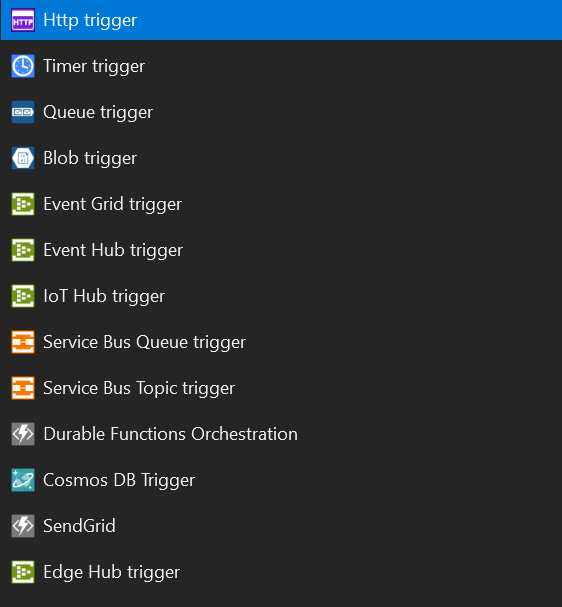
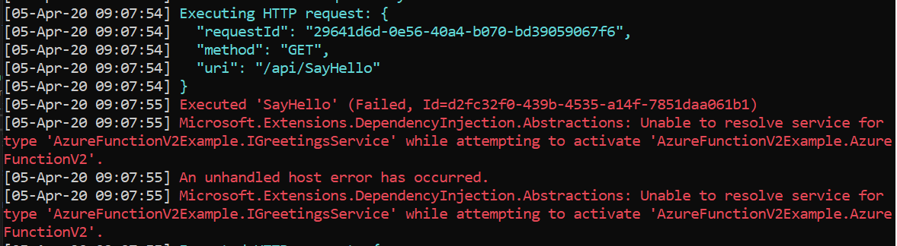

Azure Functions are event-driven applications that run serverless. Usually, they are triggered by an HTTP request, an update on Blob storage, a message on Service Bus or simply a timer.



You can build Azure Functions with different languages, such as C#, Java, JavaScript and so on. One of the features that made the success of Azure Functions is the pricing: **you pay only for the time spent running your code**.

If you want to know more about Azure Functions, you can refer to the official [Microsoft documentation](https://docs.microsoft.com/en-us/azure/azure-functions/functions-overview "Azure Functions overview").

When you create an Azure Function (version 2) following the Visual Studio wizard, the example code that you get is something like this:

```cs
public static class AzureFunctionV2
{
    [FunctionName("SayHello")]
    public static async Task<IActionResult> Run(
        [HttpTrigger(AuthorizationLevel.Anonymous, "get", "post", Route = null)] HttpRequest req,
        ILogger log)
    {
        log.LogInformation("C# HTTP trigger function processed a request.");

        string name = req.Query["name"];

        string requestBody = await new StreamReader(req.Body).ReadToEndAsync();
        dynamic data = JsonConvert.DeserializeObject(requestBody);
        name = name ?? data?.name;

        return name != null
            ? (ActionResult)new OkObjectResult($"Hello, {name}")
            : new BadRequestObjectResult("Please pass a name on the query string or in the request body");
    }
}

```

The first thing to notice is that **this is a static class**. So you can't use a constructor, so... bye-bye, Dependency Injection!

How can you implement it?

Before moving on, a plot twist!

## Azure Functions can also be non-static

Even though the wizard marks both the class and the function as static, they can also be used as non-static.

So, this function is equally valid:

```cs
public class AzureFunctionV2
{
    [FunctionName("SayHello")]
    public async Task<IActionResult> Run(
        [HttpTrigger(AuthorizationLevel.Anonymous, "get", "post", Route = null)] HttpRequest req,
        ILogger log)
    {
       // do something
    }
}
```

Now you can add a constructor and inject your dependencies on it. I've created a simple service that just says hi.

```cs
public interface IGreetingsService
{
    string SayHi(string name);
}

public class GreetingsService : IGreetingsService
{
    public string SayHi(string name)
    {
        return $"Hi, {name}! Pleased to meet you!";
    }
}
```

So now you can inject `IGreetingsService` into the constructor of you Azure Function and use it within your method (you'll notice I've done some refactoring in the Run method):

```cs
public class AzureFunctionV2
{
    private readonly IGreetingsService _greetingsService;

    public AzureFunctionV2(IGreetingsService greetingsService)
    {
        this._greetingsService = greetingsService;
    }

    [FunctionName("SayHello")]
    public async Task<IActionResult> Run(
        [HttpTrigger(AuthorizationLevel.Anonymous, "get", "post", Route = null)] HttpRequest req,
        ILogger log)
    {
        string name = req.Query["name"];

        return !string.IsNullOrWhiteSpace(name)
            ? (ActionResult)new OkObjectResult( _greetingsService.SayHi(name) )
            : new BadRequestObjectResult("Please pass a name on the query string or in the request body");
    }
}
```

Everything works fine!

No, just joking! 😅

If we try it at http://localhost:7071/api/SayHello?name=davide, we get this error:

> Microsoft.Extensions.DependencyInjection.Abstractions: Unable to resolve service for type 'AzureFunctionV2Example.IGreetingsService' while attempting to activate 'AzureFunctionV2Example.AzureFunctionV2'.



Obviously, this happens because we haven't defined that when we are injecting an `IGreetingsService` we want to use the `GreetingsService` concrete class. If you have already worked with .NET Core, you surely know that the dependencies are defined in the Startup class; but now that class is missing.

We can create it from scratch, but we must specify that this class implements `Microsoft.Azure.WebJobs.Hosting.IWebJobsStartup`. The Intellisense prompts us that we must implement the interface, so we'll get this empty class:

```cs
using Microsoft.Azure.WebJobs;
using Microsoft.Azure.WebJobs.Hosting;

namespace AzureFunctionV2Example
{
    public class Startup : IWebJobsStartup
    {
        public void Configure(IWebJobsBuilder builder)
        {
            throw new System.NotImplementedException();
        }
    }
}

```

By adding a reference to `Microsoft.Extensions.DependencyInjection.Extensions` we can define the dependencies within the Configure method:

```cs
public void Configure(IWebJobsBuilder builder)
{
    builder.Services.TryAddScoped<IGreetingsService, GreetingsService>();
    // OR
    builder.Services.TryAddScoped(typeof(IGreetingsService), typeof(GreetingsService));
}
```

As you might imagine, we can have _Scoped_, _Transient_ and _Singleton_ dependencies.

Now we have created also the `Startup` class; unluckily, it's not enough: we must declare that the whole assembly must look at this `Startup` class to find the `Startup` class to use. For typical .NET Core application, this is done automatically for us; here we must declare it explicitly.

We can do that by adding the attribute `[assembly: WebJobsStartup(typeof(Startup))]` to the namespace.

```diff
+ [assembly: WebJobsStartup(typeof(Startup))]
namespace AzureFunctionV2Example
{
```

## Wrapping up

We have seen how to define Dependency Injection in Azure Functions. We've done it by following a few steps:

1. Create the `Startup` class and implement the `IWebJobsStartup` interface
2. Add an attribute that specifies which class must be used as the `Startup` class for this assembly
3. Transform the Azure function to make it non-static
4. Inject the dependency in the constructor.

These few steps allow us to do great things, like reading values from the config file and inject them with an `IOptions<T>` class. Also, now we can test the Azure Functions by mocking the dependencies.

You can read a different point of view on this topic in [this article on Medium](https://medium.com/hitachisolutions-braintrust/azure-functions-v2-dependency-injection-using-net-core-fccd93b80c0).

Also, if you want to learn even more, you can refer to the [Microsoft documentation](https://docs.microsoft.com/en-us/azure/azure-functions/functions-dotnet-dependency-injection). Pay attention that this is updated to Azure Functions v3 instead of v2.

Finally, you can see a working example on [my GitHub repository](https://github.com/code4it-dev/AzureFunctionV2Example).

Happy coding!

_PS: in the next article I'll explain how to migrate from v2 to v3: this also implies a small change to the `Startup` class. Stay tuned!_
