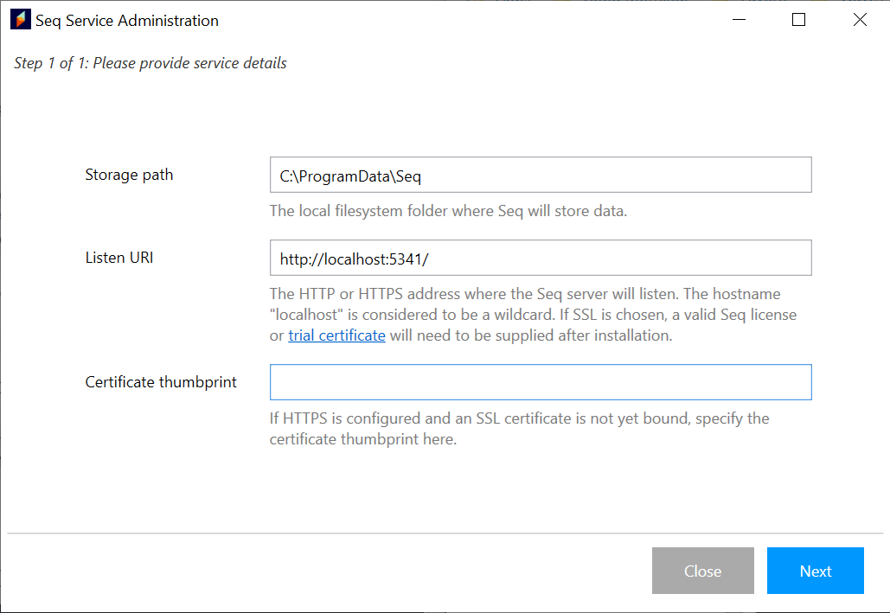
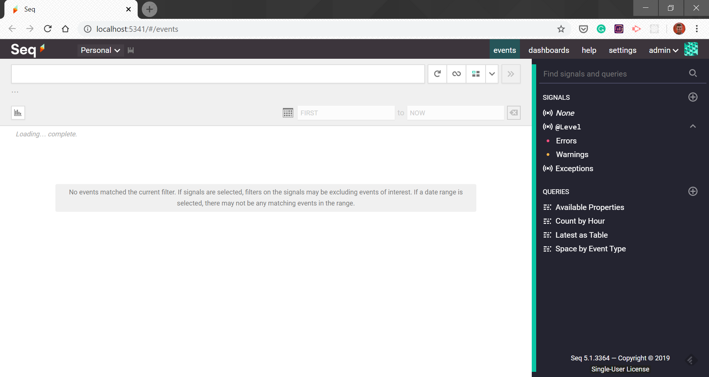
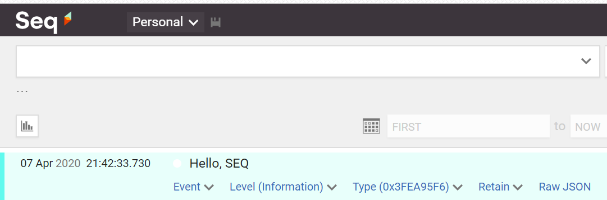
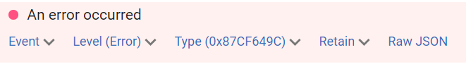
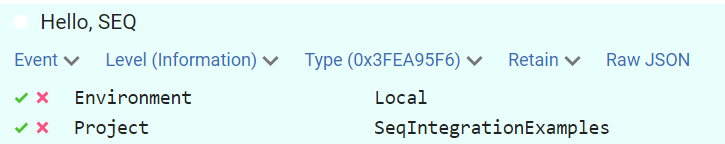
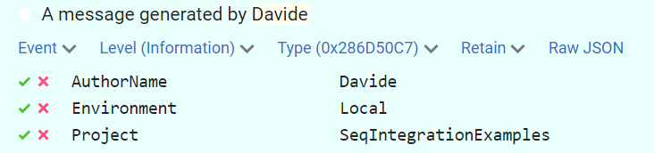
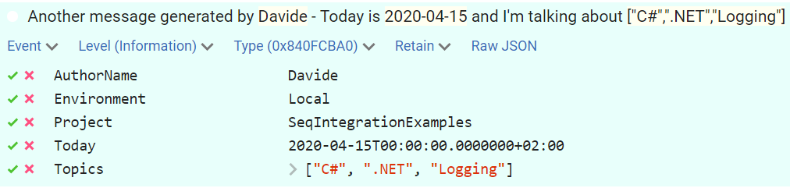
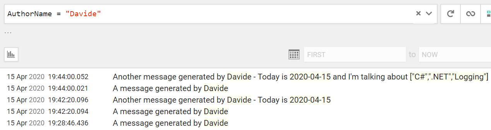
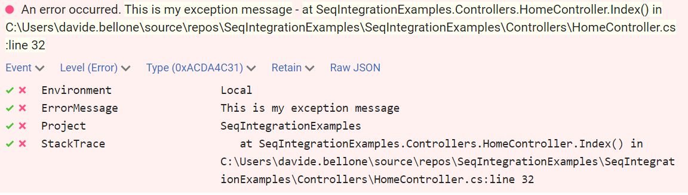
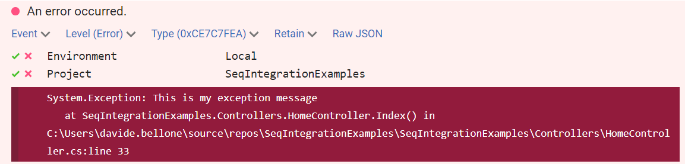

One of the most important things to consider when developing and application is logging: not only it is useful for tracking errors and check if the system works correctly, but also it helps you with additional info about the status of the application in a particular point of the code, making it easier to debug the application.

**Serilog is an open source .NET library for logging**. One of the best features of Serilog, as you can see in [its homepage](https://serilog.net/ "Serilog website"), is that messages are in the form of a template and you can easily format a value using its default formatter instead of calling `ToString()` for each value.

```cs
var position = new { Latitude = 25, Longitude = 134 };
var elapsedMs = 34;

log.Information("Processed {@Position} in {Elapsed:000} ms.", position, elapsedMs);
```

will capture a JSON like

```json
{
  "Position": {
    "Latitude": 25,
    "Longitude": 134
  },
  "Elapsed": 34
}
```

Of course, those logs must be collected somewhere. You can use even the console or a database if you want; otherwise, you can use an external platform.

One of my favorite logging platforms is **Seq**: developed by Datalust, [Seq](https://datalust.co/seq "Seq website") collects logs and allows you to search and analyze the records. The interesting thing is that, under the hood, those **data are stored as JSON**: this means that you can perform queries against them and get the results easily.

Good thing: for a single user, it is free. So, let's try it!

## Downloading Seq locally

I work on Windows 10: that's why I'm gonna download the _.msi_ installer from the [download page](https://datalust.co/Download "Seq download page").

Once downloaded, you must follow the wizard to have it installed locally. At the end of the installation, you will have it live on your _localhost_, in my case at _localhost:5341_.



Once the installation has finished, and you have started the service, you can see the newborn instance on Seq on your browser.



For now, we are ready. The next step is to create the application.

## Creating the application

I've created a simple Web Application with .NET Core.

Since we need Serilog, we must download it. You can run `dotnet add package Serilog --version 2.9.0` on the .NET CLI or, if you prefer the Package Manager command line, you can run `Install-Package Serilog -Version 2.9.0`. Of course, you can use the NuGet UI on Visual Studio.

Downloading the Serilog library is not enough: we need to install the _sink_ (its name for the log collector) for Seq: you must install Serilog.Sinks.Seq (again, with `dotnet add package Serilog.Sinks.Seq --version 4.0.0` or `Install-Package Serilog.Sinks.Seq -Version 4.0.0`). Of course, the versions for Serilog and Serilog.Sinks.Seq are the latest available at the time of writing, so probably you'll have to download different versions of those packages.

Now we're ready to instantiate the logger: within the `ConfigureServices` method in the Startup class, you need to create the new logger, declare that it must write to localhost, and finally add the dependency.

```cs
public void ConfigureServices(IServiceCollection services)
{
   services.AddControllersWithViews();

   Log.Logger = new LoggerConfiguration()
            .WriteTo.Seq("http://localhost:5341/")
            .CreateLogger();

   services.AddSingleton<Serilog.ILogger>(Log.Logger);
}
```

Of course, you can use Dependency Injection to inject this logger to any kind of application, like a Web Application or an [Azure Function](./azure-functions-startup-class "How to use Dependency injection in Azure Functions").

## Sending your first log

Now it's time to write our first log!

In the constructor of our class (in my case, HomeController), you must inject the dependency to `Serilog.Ilogger`.

```cs
Serilog.ILogger _logger;

public HomeController(Serilog.ILogger logger)
{
   _logger = logger;
}
```

and, in the Index action, we can add `_logger.Information("Hello, SEQ");`.

Just run your application, and you'll see the message in the Seq panel.



As you can see, your message is displayed with some additional info, such as the date and time of the event and the level (of course, since we used `_logger.Information`, the level value is Information). The last thing to notice is the _Raw JSON_ button: by clicking on it, you can download the inner JSON representation of the log, which can help you understand what happened.

Serilog supports various logs with different levels of criticalities; we've already seen _Information_, but we can also have _Verbose_, _Debug_, _Warning_, _Error_ and _Fatal_. Each level has [a specific meaning](https://github.com/serilog/serilog/wiki/Configuration-Basics "Logging levels values by Serilog"):

| Level       | Usage                                                                                                                                                                                |
| ----------- | ------------------------------------------------------------------------------------------------------------------------------------------------------------------------------------ |
| Verbose     | Verbose is the noisiest level, rarely (if ever) enabled for a production app.                                                                                                        |
| Debug       | Debug is used for internal system events that are not necessarily observable from the outside, but useful when determining how something happened.                                   |
| Information | Information events describe things happening in the system that correspond to its responsibilities and functions. Generally these are the observable actions the system can perform. |
| Warning     | When service is degraded, endangered, or may be behaving outside of its expected parameters, Warning level events are used.                                                          |
| Error       | When functionality is unavailable or expectations broken, an Error event is used.                                                                                                    |
| Fatal       | The most critical level, Fatal events demand immediate attention.                                                                                                                    |

So, just as we did for `_logger.Information("Hello, SEQ");`, we can log a message with a different level, like `_logger.Error("An error occurred")` that will be rendered as displayed in the following image:



You might want to define a **minimum level of log** to be stored: usually, levels like Debug and Verbose are fine for Develop and Staging environments, but for not for the Production environment. You can define the minimum level in the `Startup` class:

```cs
Log.Logger = new LoggerConfiguration()
               .MinimumLevel.Warning()
               .WriteTo.Seq("http://localhost:5341/")
               .CreateLogger();
```

This way we define that we want to log only events with level Warning, Error or Fatal. All the other levels will be ignored.

## Enriching logs

Sometimes you want to add for each log a set of properties that are **shared across your application**, like the name of your project or the environment. `Serilog` allows you to do that using **Enrichers**. While you can create your own, you can use predefined enrichers: simply add `.Enrich.WithProperty(PropertyName, PropertyValue)` in your logger definition.

```cs
Log.Logger = new LoggerConfiguration()
         //  .MinimumLevel.Warning()
         .Enrich.WithProperty("Project", "SeqIntegrationExamples")
         .Enrich.WithProperty("Environment", "Local")
         .WriteTo.Seq("http://localhost:5341/")
         .CreateLogger();
```

Now, for every log, we can see also the _Project_ and the _Environment_ properties. Of course, the values can be dynamically taken by a configuration file.



## Formatting strings

As shown at the beginning of this article, one of the features of Serilog is the possibility to format the strings as [Structured Data](https://github.com/serilog/serilog/wiki/Structured-Data "Structured data documentation by Serilog"). This means what when we log something, we can insert in the message a placeholder for each property that we want to track: this value will be replaced in the final string, and the field can be queried in Seq.

So, if we write

```cs
_logger.Information("A message generated by {AuthorName}", "Davide");
```

in Seq we will see _A message generated by Davide_, and, by clicking on the log, we can look at the key-values fields.



Of course, we can add more fields to a message.

Also, you can format automatically the output of those values: for instance, you can format a DateTime object as you would do with String.Format, and you can also pretty-print objects inheriting from IEnumerable, like arrays and Lists.

```cs
List<string> topics = new List<string> { "C#", ".NET", "Logging" };

_logger.Information("Another message generated by {AuthorName} - Today is {Today:yyyy-MM-dd} and I'm talking about {Topics}","Davide", DateTime.Now.Date, topics);
```

will result in



As you can see, the Date has been pretty-printed in the preview, while in the detail of the item the date is full. Also, the `List<string>` can be expanded in the item details.

Why is this functionality useful? As I touched upon before, these **logs can be filtered**. You can use a **SQL-like syntax** to retrieve all the logs that match the filter you defined. So, if in the query textbox on the Seq panel you set `"AuthorName = "Davide"`, you'll get only the logs that have the field AuthorName specified and whose value is "Davide".



## Handling exceptions properly

> Ok, ok, logging info is fine, but... what about exceptions??

At this point, you might think that you can use string interpolation to store exception details. I don't know, maybe something like:

```cs
try
{
   // something that throws an exception, like...
   throw new Exception("This is my exception message");
}
catch (Exception ex)
{
      _logger.Error("An error occurred. {ErrorMessage} - {StackTrace}", ex.Message, ex.StackTrace);

}
```

That works, but it's not the best idea. The result of this log is hard to read since it's all in the log message:



Luckily, there is an overload of the Error method that accepts an **Exception as a first parameter**. So you can write

```cs
try
{
   // something that throws an exception, like...
   throw new Exception("This is my exception message");
}
catch (Exception ex)
{
   _logger.Error(ex, "An error occurred.");
}
```

and have a cleaner message with all the exception details in the log detail.



## Wrapping up

Having a good logging infrastructure is for sure a must-have for every project that must be monitored. The union of Seq as a collector and Serilog as a logging library is very powerful, especially for the combo Structured Data + Queries. With Seq you can also create diagrams to track the overall occurrence of logs of a specific level or with a specific property.

If you want to read more, you should read more on the [Serilog documentation on GitHub](https://github.com/serilog/serilog/wiki "Serilog documentation") and have a look at [this article by Ben Foster](https://benfoster.io/blog/serilog-logging-best-practices "Logging best practices by Ben Foster").

What do you use for logging?

Happy coding!
