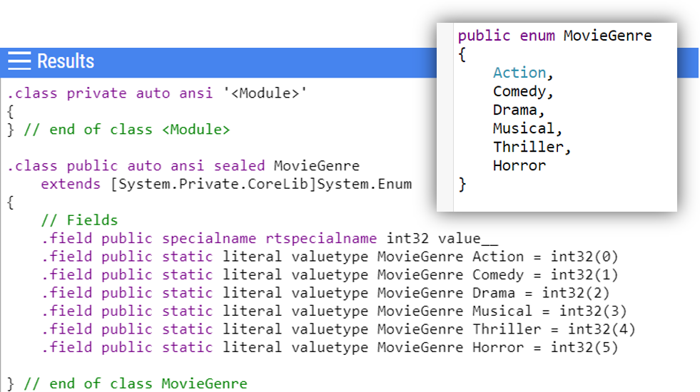
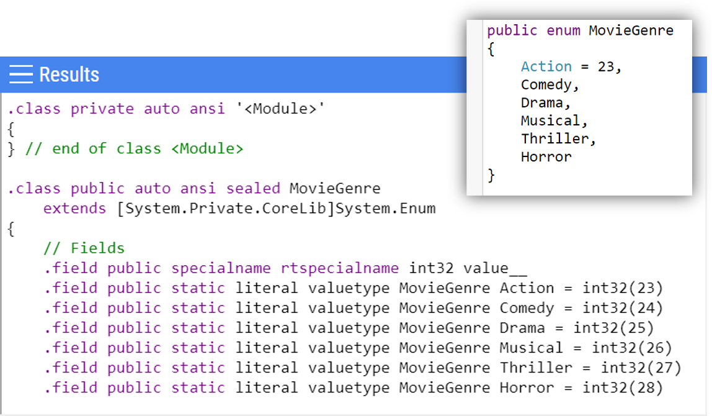

Enums are really useful if you want to, well, enumerate the possible values for a field. An example of enumeration is the list of movie genres:

```cs
public enum MovieGenre
{
    Action,
    Comedy,
    Drama,
    Musical,
    Thriller,
    Horror
}
```

This way, you can define that a field accepts only values coming from that specific enum, thus narrowing down the list of possible values:

```cs
public class Movie
{
    public string Name { get; set; }
    public DateTime ReleaseDate { get; set; }
    public MovieGenre Genre { get; set; }
}
```

So, now, you can instantiate a new movie as

```cs
new Movie()
{
    Name = "My movie",
    ReleaseDate = DateTime.Now,
    Genre = MovieGenre.Drama
};
```

Simple, right?

As usual, there is more than this, even if we are used to staying on the surface.

## #1: Enums are nothing but masked numbers

Even though their structure may let you think of a complex structure, enums are value types.
This means that if you pass an enum to a function, you will not modify it as if it were an object.

In fact, if we define a function that sets a given MovieGenre to Musical:

```cs
static void SetToMusical(MovieGenre genre)
{
    genre = MovieGenre.Musical;
}
```

and we try to update a value, we will notice that we haven't actually updated the value.

```cs
MovieGenre genre = MovieGenre.Action;
Console.WriteLine(genre);// Action

SetToMusical(genre);
Console.WriteLine(genre);// Action
```

Internally, **an enum is a numeric type**: it can be made of _byte_, _sbyte_, _short_, _ushort_, _int_, _uint_, _long_, or _ulong_ values.
By default, an enum is a **static, Int32 value**, whose first element has value 0 and all the following elements have their value increased by 1 compared to the previous one.



We can customize this default behavior by **using a different starting value** and then have all the other values will follow the numeric order.

```cs
public enum MovieGenre
{
    Action = 23,
    Comedy,
    Drama,
    Musical,
    Thriller,
    Horror
}
```



This means that if you reorder the elements (for example, because you want the values to be in alphabetic order, so moving Horror between Drama and Musical), you might mess up all the following values and bring subtle bugs in.

How to fix it? Simple: specify a value for each element!

```cs
public enum MovieGenre
{
    Action = 23,
    Comedy = 24,
    Drama = 25,
    Musical = 26,
    Thriller = 27,
    Horror = 28
}
```

This way you can reorder the items without the risk of creating bugs.

## #2: Many ways to get the value

Even if internally an enum is nothing but a number, you can get its friendly name. There are many ways to do that.

If you want the string value of a statically defined enum value, you can rely on the `nameof` operator, with

```cs
nameof(MovieGenre.Comedy);
```

or, using the Enums class, try with the GetName method:

```cs
Enum.GetName(typeof(MovieGenre), MovieGenre.Comedy);
```

The GetName method is a bit cumbersome to write, so probably you'd prefer using the _nameof_ operator, which was released with C# 6.

How can you get the value if it is set at runtime?

Of course, you may use the **ToString** method.

```cs
MovieGenre mg = MovieGenre.Musical;
var musicalValueAsString = mg.ToString();
```

Or, if you want to rely on the Enum class, you can try with

```cs
Enum.Format(typeof(MovieGenre), mg, "g")
```

Have you noticed the last parameter of the previous snippet? What does it mean?

Well, as [you can format Guids](./5-things-about-guid-in-csharp#4-a-guid-has-multiple-formats "How to format Guids on C#"), you can use flags to format an enum as well.

- **G** and **F** return the name of the enum. There is a small difference that occurs when an enum is used with the flag attribute (I'll talk about it later)
- **D** represents the value in decimal form
- **X** represents the value in hexadecimal form.

These flags can be used both on the `Enum.Format` and the `ToString` method.

```cs
var action = MovieGenre.Action; // remember, its value is 23

action.ToString("g"); // "Action"
action.ToString("x"); // "00000017"
action.ToString("d"); // "23"
```

You can read more details on those values on [Microsoft documentation](https://docs.microsoft.com/en-us/dotnet/api/system.enum.format?view=netcore-3.1#remarks "Formatting flags on Microsoft documentation").

If you need the numeric value of the enum, you can simply cast it.

```cs
(int)MovieGenre.Action
```

## #3: Parsing and casting enums

You can transform an enum to a string, and of course you can do the opposite!

```cs
MovieGenre e;
Enum.TryParse<MovieGenre>("Action", out e);
```

or, if you prefer defining the variable inline,

```cs
Enum.TryParse<MovieGenre>("Action", out MovieGenre e);
```

neat and clean, isn't it?

A thing that you must keep in mind is that, **if the string you pass to the method does not exist, TryParse will set to 0 the out variable**: this can cause bugs if you have defined a value associated with 0.

```cs
public enum Status
{
    OK = 0,
    Failed = 1,
    Waiting = 2
}

// and, within a method...

Enum.TryParse<Status>("Feiled", out Status st); // OK
```

In the above example, "Feiled" is not a valid value, so the assigned value is 0 which is casted to OK.

You can prevent this bug in 2 ways: by checking on the _returned value_ of TryParse, which returns true if the parsing was successful, false otherwise; or you can add an additional check before the parsing, using the **IsDefined** method, with something like `Enum.IsDefined(typeof(Status), "Feiled")`.

## #4: Flagged enums

What if an enum fields must allow multiple values? After all, a movie can have more than one genre, right?

You could implement it as a list (or an array) of flags, or... you can use the **Flags attribute**.
This flag allows to easily apply OR operations on enums, making the code cleaner and more readable. The downside is that now enums values can't have custom values, but **must be a power of 2**, so 1, 2, 4, 8 and so on.

```cs
[Flags]
public enum MovieGenre
{
    Action = 1,
    Comedy = 2,
    Drama = 4,
    Musical = 8,
    Thriller = 16,
    Horror = 32
}
```

So now we can create an action-comedy movie

```cs
var movie = new Movie()
{
    Name = "Bad Boys",
    ReleaseDate = new DateTime(1995, 4, 7),
    Genre = MovieGenre.Action | MovieGenre.Comedy
};
```

Now that you have flags on enums, _whatcha gonna do_?
You can use the HasFlag method to, well, check if a value has a certain flag

```cs
MovieGenre mg = MovieGenre.Action | MovieGenre.Comedy;

if (mg.HasFlag(MovieGenre.Comedy))
{
    // Do something
}
```

This is more performant than looping though a list of enums, since now we're working directly on bits.

## #5: Enum best practices

As always, there are some best practices to follow. The following ones are suggested directly on the [Microsoft documentation](https://docs.microsoft.com/en-us/dotnet/api/system.enum?view=netcore-3.1#enumeration-best-practices "Enums best practices on Microsoft documentation"):

1. If you have a default value for the enumeration, set its value to 0;
2. If there isn't an obvious default value, create a value (set to 0) that represents the fallback case (for example, create a _None_ value and set it to 0);
3. Validate inputs for methods that allow enums as parameters, since enums are nothing but numbers, so a simple cast can cause unexpected results;

Let me explain the third point: do you remember the _Status_ enum?

Here's a method that tells if the input is valid:

```cs
string printValidity(Status status){
    switch (status)
    {
        case Status.Failed:
        case Status.OK:
        case Status.Waiting:
            return "Valid input";
        default:
            return "Invalid input";
    }
}
```

and well, you can imagine how it works.

What happens if you do this?

```cs
var validity = printValidity((Status) 1234);
```

Exactly, the value is _Invalid input_. So, **remember to validate inputs**!

## Conclusion

In this article, we've seen that

- enums are just numbers in disguise;
- you can format an enum as a string, a hexadecimal value or a numeric value;
- you can use flags to define multiple values;
- you should follow best practices: remember to define a default value and to validate inputs;

Happy coding!
