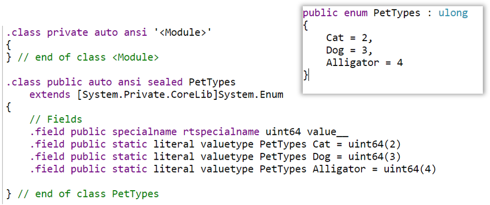

In a [previous article](./5-things-enums-csharp "5 things you didn't know about enums in C#"), I explained some details about enums in C#. Here I'll talk about some other things that are useful and/or curious to know about them.

## #1: Define enum internal type

If you remember, enums can be int, but also short, uint and so on. How can you define which type to use?

It's simple, you can add it after the declaration of the enum:

```cs
public enum PetTypes : ulong
{
    Cat = 2,
    Dog = 3,
    Alligator = 4
}
```

and, if we look at the generated IL, we'll see the result:



The fact that you can define them as int and as uint is a hint (pun intended) that you can also use negative numbers as inner value:

```cs
public enum Time
{
    Past = -1,
    Present = 0,
    Future = 1
}
```

## #2: Enums combination within the definition

If you set each element's value as a power of 2, like you did for Flags

```cs
enum Beverage
{
    Water = 1,
    Beer = 2,
    Tea = 4,
    RedWine = 8,
    WhiteWine = 16
}
```

you can write something like

```cs
var beverage = Beverage.RedWine | Beverage.WhiteWine;

if(beverage.HasFlag(Beverage.RedWine) || beverage.HasFlag(Beverage.WhiteWine)){
    Console.WriteLine("This is wine");
}
```

Now imagine that you have to check many times if a beverage is a wine: you can repeat the check, or extract it to a separate method.

Or you can add a value to the enum:

```cs
[Flags]
enum Beverage
{
    Water = 1,
    Beer = 2,
    Tea = 4,
    RedWine = 8,
    WhiteWine = 16,
    Wine = RedWine | WhiteWine
}
```

This simplifies your code to

```cs
var beverage = Beverage.RedWine | Beverage.WhiteWine;

if(beverage.HasFlag(Beverage.Wine)){
    Console.WriteLine("This is wine");
}
```

It's a small trick, but it can help you clean your code.

## #3: Serializer

Now it's time to use enums for real-word scenarios: maybe a .NET Core 3 API?

I have created a simple API controller that returns a single movie:

```cs
[Route("api/[controller]")]
[ApiController]
public class MoviesController : ControllerBase
{
    [HttpGet]
    public ActionResult<Movie> Get()
    {
        var movie = new Movie()
        {
            Name = "My action movie",
            ReleaseDate = new DateTime(2019, 3, 16),
            Genre = MovieGenre.Action
        };

        return movie;
    }
}
```

What will this endpoint return? As you've already learned, internally an enum is nothing but a number, so the returned JSON will be this one:

```json
{
  "name": "My action movie",
  "releaseDate": "2019-03-16T00:00:00",
  "genre": 23
}
```

Yes, I know, you were expecting the string value.

But you can have it by updating the Startup class:

```cs
public void ConfigureServices(IServiceCollection services)
{
    services.AddControllers().AddJsonOptions(o =>
    {
        o.JsonSerializerOptions.Converters.Add(new JsonStringEnumConverter());
    });
}
```

or, if you want to set a serializer only to a specific enum, you can add an attribute to it:

```diff
+   [JsonConverter(typeof(JsonStringEnumConverter))]
    public enum MovieGenre
    {
```

## #4: The real meaning of the Flags attribute

Thanks to [Insulind on Reddit](https://www.reddit.com/r/csharp/comments/gdszxz/5_things_you_didnt_know_about_enums_in_c/fplw77d "Reddit comment by Insulind") I found out that actually the `[Flags]` attribute's job is not to allow multiple values to be stored in a single field, rather to have a better string representation.

If we remove the Flags attribute on the Beverage enum, we can assign multiple values as if it had the attribute enabled.

```cs
enum Beverage
{
    Water = 1,
    Beer = 2,
    Tea = 4,
    RedWine = 8,
    WhiteWine = 16
}

// and, in a method

var beverage = Beverage.Water| Beverage.RedWine;
```

Everything works, even without the `HasFlag` method. The difference comes if we get the string value of that variable: now __it returns 9__, because it's getting directly the numeric value.

If we put the Flags attribute, everything changes: the string value will be __Water, RedWine__, so the comma-separated list of their values.

This makes sense __only if you use multiple values__: as we've already seen, if you print a single value you'll get the string value of it.

If you remember when I talked about [how to format an enum](./5-things-enums-csharp#2-many-ways-to-get-the-value "How to get enum values"), you can use `ToString("g")` and `ToString("f")` to get the enum name. I specified that there is a small difference but I haven't explained what was it about.

If you set a combined enum value but you don't add the Flags attribute, you'll end up with different results:

```cs
    var beverage = Beverage.Water | Beverage.RedWine;
    beverage.ToString(); //9
    beverage.ToString("g"); //9
    beverage.ToString("f"); //Water, RedWine
```

On the contrary, if you add the Flags attribute, they all return _Water, RedWine_.

## #5 Flags best practices

As always, there are some best practices you should follow. The following ones are about the usage of Enums with the _Flags_ attribute.

1. Use only powers of two when defining flags, so that you won't overlap values when combining more enums; this will give you also the possibility to use bitwise operators, like OR, AND and XOR.
2. You should add a _None_ value, and set it to 0, to represent the lack of value. Of course, consider that `HasFlag(EnumName.None)` will always return true.
3. In older versions of .NET, the HasFlag method was less efficient than a bitwise AND check. So, to check if a value contains _Beverage.Water_, you could do `((beverage & Beverage.Water) == Beverage.Water)`. With newer versions this problem has been fixed.
4. As always, remember to validate input parameters, just like you [should do for simple enums](./5-things-enums-csharp#5-enum-best-practices "Why you should validate inputs").

For more, you can refer to [Microsoft documentation](https://docs.microsoft.com/en-us/dotnet/api/system.flagsattribute?view=netcore-3.1#guidelines-for-flagsattribute-and-enum "Microsoft best practices about Flags attribute").

## Wrapping up

Here we've seen more things to know about enums. Probably you won't use all of these capabilities in real-world scenarios, but I think you should know that they exist.

To recap, we've seen that

* you can change the underlying type to _short_, _uint_ and similar;
* you can also define negative values;
* inside the enum definition, you can create values that represent the union of other two (or more);
* by default, .NET APIs return enum values as numbers; to fix it, you must add a configuration in your Startup class;
* you can also omit the Flags attribute; the downside is that when you print the value of a variable that is the union of 2 enums, the returned string is the sum of the enums stored inside that variable, not the string representation.

Do you know something to add?

Happy coding!
