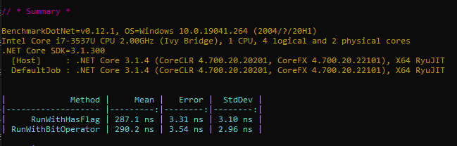
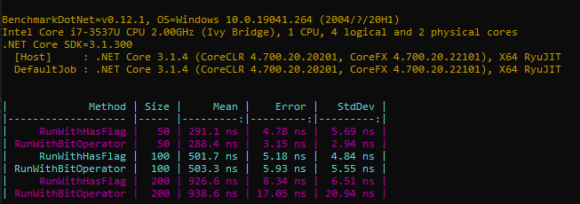
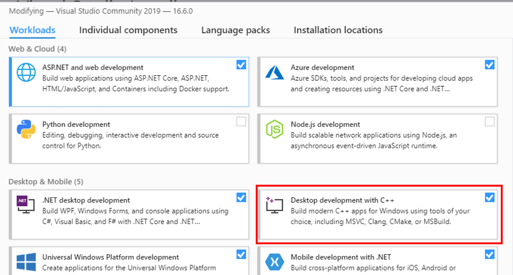
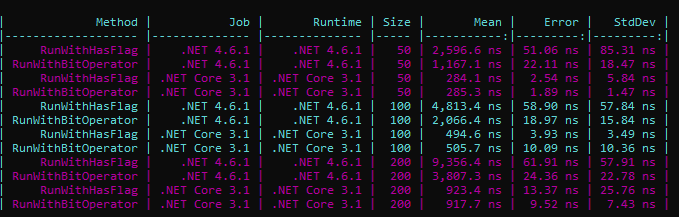

I've recently published two articles about some of the things you probably didn't know about Enums. I had too much to write that I split the original article into 2 parts: [here's the first part](./5-things-enums-csharp "5 things you didn't know about enums in C#") and [here's the second](./5-more-things-about-enums-csharp "5 more things about enums in C#").

In both articles I talked about _flagged enums_ This is a way to define Enum types that allow you to join multiple values inside a single variable.

```cs
enum Beverage
{
    Water = 1,
    Beer = 2,
    Tea = 4,
    Wine = 8
}

// and, somewhere else
var beverage = Beverage.Water | Beverage.Tea;
```

The key point is that all enum values are power of 2 (so 1, 2, 4, 8 and so on).

To check if a variable includes a specific value, you can use the HasFlags method:

```cs
if(beverage.HasFlag(Beverage.Water)){
// do something
}
```

But many users reported that the HasFlag method in really inefficient, and it's better to work at bit-level:

```cs
if((beverage & Beverage.Water) == Beverage.Water){
// do something
}
```

Is it true? Is there so much difference? Let's check it using a benchmark.

## BenchmarkDotNet

To test performance you can act in two ways: build you own framework or use an existing one.

[BenchmarkDotNet](https://benchmarkdotnet.org/ "BenchmarkDotNet website") is a .NET framework that tracks methods performance and analyses them to give you statistical results.

Let's build the application!

I've created a Console application in .NET Core 3.1. Then I've installed BenchmarkDotNet via NuGet:

`Install-Package BenchmarkDotNet` and `Install-Package BenchmarkDotNet.Annotations`

All you need to do is create a class with certain attributes that tell the framework how to process benchmarking, how to setup the environment and so on. The benchmarking is defined in a single class, and it's run on the Main method of the console application:

```cs
class Program
{
    static void Main(string[] args)
    {
        var summary = BenchmarkRunner.Run<EnumsBenchmark>();
    }
}

public class EnumsBenchmark
{
    [Benchmark]
    public void MethodToBeBanchmarked()
    {
        // add some logic here
    }
}
```

By running the application, BenchmarkDotNet calls several times the _MethodToBeBanchmarked_ method and calculates some values, such as the mean value for the execution time and several other statistical values, like [standard deviation](https://en.wikipedia.org/wiki/Standard_deviation "Standard deviation definition") and [error](https://en.wikipedia.org/wiki/Standard_error "Standard error definition").

The default output is the console: you can customize the output to have the result printed in a CSV file, in a JSON format and also in an R plot.

## Our first benchmarking

It's time to add some code!

To create the first benchmarking, I'll create a array where every item is the "union" of 2 random Enum values.

```cs
[GlobalSetup]
public void Setup()
{
    tests = new List<Beverage>();
    int[] values = new int[] { 1, 2, 4, 8 };

    for (int i = 0; i < 50; i++)
    {
        Beverage firstElm = (Beverage)values.GetRandomFromArray<int>();
        Beverage secondElm = (Beverage)values.GetRandomFromArray<int>();
        tests.Add(firstElm | secondElm);
    }
}
```

This is marked with the GlobalSetup attribute. As the [official documentation](https://benchmarkdotnet.org/articles/features/setup-and-cleanup.html "BenchmarkDotNet documentation") states,

> A method which is marked by the GlobalSetup attribute will be executed only once per a benchmarked method after initialization of benchmark parameters and before all the benchmark method invocations.

Well, the documentation is pretty straightforward! The last step is to add the methods to be analysed:

```cs
[Benchmark]
public void RunWithHasFlag()
{
    tests.Select(x => x.HasFlag(Beverage.Tea)).ToList();
}

[Benchmark]
public void RunWithBitOperator()
{
    tests.Select(x => (x & Beverage.Tea) == Beverage.Tea).ToList();
}
```

That's it: **switch the build configuration to Release** and run the program!



The result is provided in the console as a table:

| Method             |         Mean |   Error |  StdDev |
| ------------------ | -----------: | ------: | ------: |
| RunWithHasFlag     | **287.1 ns** | 3.31 ns | 3.10 ns |
| RunWithBitOperator | **290.2 ns** | 3.54 ns | 2.96 ns |

As you can see, the two ways took almost the same time: 2.87ns against 290ns.

Are we finished yet? Nah, let's do something more.

## Parameterized values

You can also set up parameterized values, by adding a field enriched with the Params attribute. We can use it to set up different sizes of the array: bigger arrays bring to a more precise average value.

```cs
[Params(50, 100, 200)]
public int Size { get; set; }
```

and, in the Setup method, just replace the end value in the for loop.



| Method             | Size |         Mean |    Error |   StdDev |
| ------------------ | ---- | -----------: | -------: | -------: |
| RunWithHasFlag     | 50   | **291.1 ns** |  4.78 ns |  5.69 ns |
| RunWithBitOperator | 50   | **288.4 ns** |  3.15 ns |  2.94 ns |
| RunWithHasFlag     | 100  | **501.7 ns** |  5.18 ns |  4.84 ns |
| RunWithBitOperator | 100  | **503.3 ns** |  5.93 ns |  5.55 ns |
| RunWithHasFlag     | 200  | **926.6 ns** |  8.34 ns |  6.51 ns |
| RunWithBitOperator | 200  | **938.6 ns** | 17.05 ns | 20.94 ns |

As you see, nothing changes if we change the array size.

So, was everyone wrong about the performance issue?

## Testing multiple runtimes

That's simple: it's an old problem, which has been fixed in 2017. That's one of the fixes [documented here](https://devblogs.microsoft.com/dotnet/ryujit-just-in-time-compiler-optimization-enhancements/ "2017 fix that addresses the performance issue").

So the best way to try it is to try with different runtimes.

To set up the benchmarking on multiple runtimes we need to do few additional steps:
first of all, you need to **install the C++ Desktop libraries** using the Visual Studio installer.



This provides the underlying libraries used by BenchmarkDotNet to run the different frameworks.

Next step is to **edit the csproj file** of your project, transform the `TargetFramework` to `TargetFrameworks` (just the plural) and specify the list of libraries you want to target, separated by semicolon.

```xml
<PropertyGroup>
    <OutputType>Exe</OutputType>
    <TargetFrameworks>netcoreapp3.1;net461</TargetFrameworks>
</PropertyGroup>
```

Finally, decorate the benchmarked class with `SimpleJobs` attributes to indicate which runtimes must be used:

```diff
+[SimpleJob(RuntimeMoniker.Net461)]
+[SimpleJob(RuntimeMoniker.NetCoreApp31)]
public class EnumsBenchmark
{
```

That's it! Now run the project and see how the performances dramatically changed.



This execution took about 7 minutes, because it run 12 benchmarks and, for each one, there was a warming up phase (which can be skipped, if you prefer).

| Method             | Job           | Runtime       | Size |           Mean |    Error |   StdDev |
| ------------------ | ------------- | ------------- | ---- | -------------: | -------: | -------: |
| RunWithHasFlag     | .NET 4.6.1    | .NET 4.6.1    | 200  | **9,356.4 ns** | 61.91 ns | 57.91 ns |
| RunWithBitOperator | .NET 4.6.1    | .NET 4.6.1    | 200  | **3,807.3 ns** | 24.36 ns | 22.78 ns |
| RunWithHasFlag     | .NET Core 3.1 | .NET Core 3.1 | 200  |   **923.4 ns** | 13.37 ns | 25.76 ns |
| RunWithBitOperator | .NET Core 3.1 | .NET Core 3.1 | 200  |   **917.7 ns** |  9.52 ns |  7.43 ns |

The above table is a part of the result that you see in the previous image.

Notice the in .NET 4.6.1 the HasFlag method was more than twice slower than the bit comparison, and notice also how performance improved between .NET 4.6.1 and .NET Core 3.1. Amazing, isn't it?

## Wrapping up

If you want to easily create benchmarks, probably BenchmarkDotNet is the best choice. You can customize many aspects of the performance analysis, like the [columns to be displayed](https://benchmarkdotnet.org/articles/configs/columns.html) and how to [export the result](https://benchmarkdotnet.org/articles/configs/exporters.html) (for instance, JSON, CSV and XML).

Talking about the performance about HasFlag now we can demonstrate that yes, in the past there was a HUGE difference about performance, but now the problem does not exist anymore.

If you want to try it on your own, [here's the project](https://github.com/code4it-dev/EnumHasFlagMethodBenchmarking) I set up for this article.

Happy coding!
