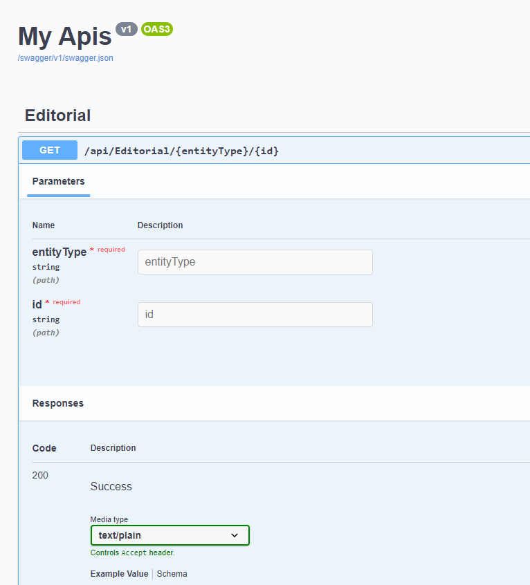
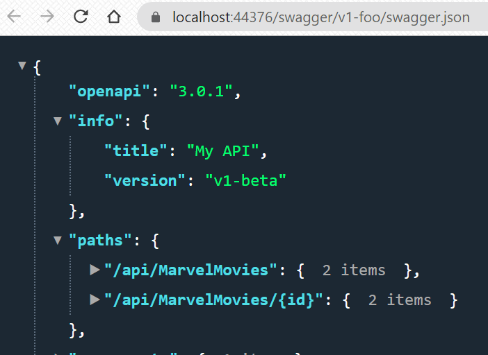
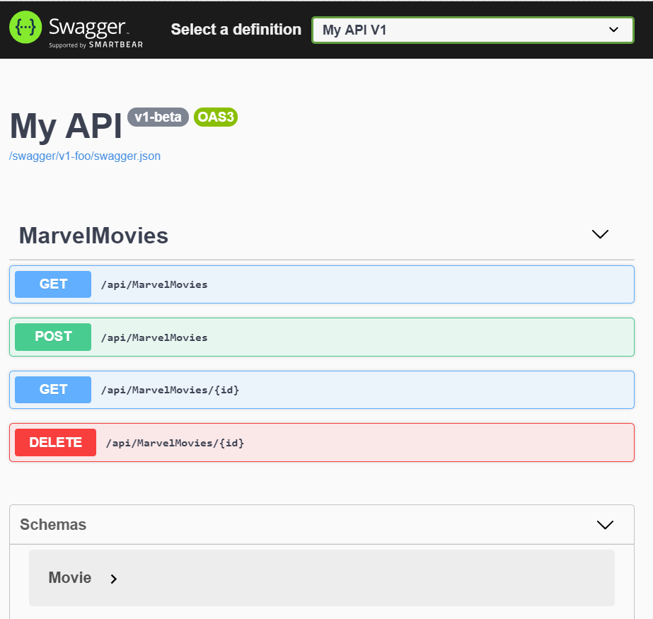
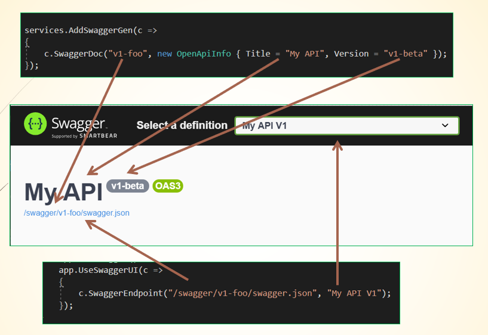
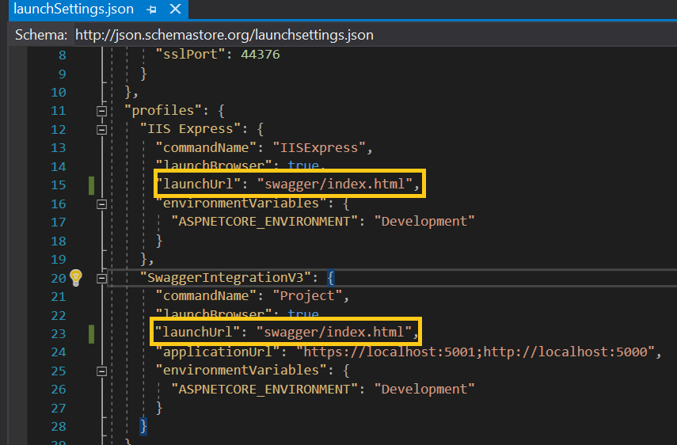
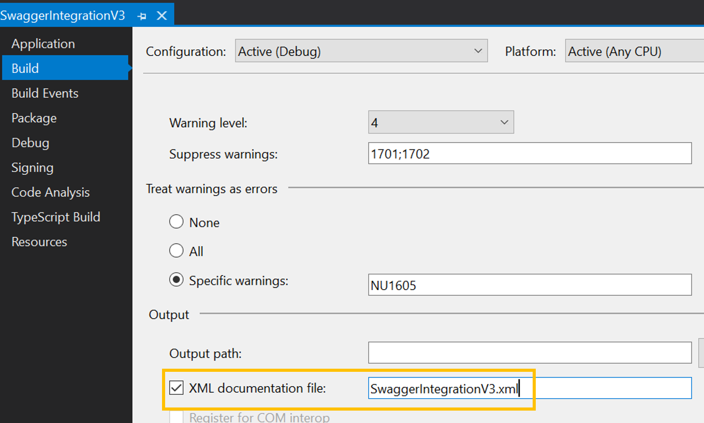
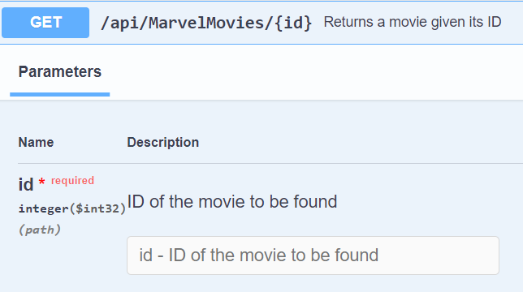
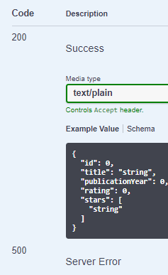

When I write some APIs with .NET Core, one of the very first things I do is to add Swagger.
This helps me test my code and helps other developers integrating the APIs I'm exposing.

In this article, we're going to add Swagger to an API built with .NET Core 3, and we're going to learn how to show the description of the methods and how to show which status codes you could expect from our APIs.

I think you already know what is Swagger, but let's have a recap.

## What is Swagger

[Swagger](https://swagger.io/about/ "Swagger website") is a suite of products that help developers documenting and testing APIs. If you are interested in the source code for their C# repository, [you can see it on GitHub](https://github.com/domaindrivendev/Swashbuckle.AspNetCore.git "GitHub repository for the .NET implementation").

I'm quite sure you've already seen a page like this:



That's a typical UI generated with Swagger that allows you to interact with the APIs and view the endpoint definitions defined using the __OpenAPI format__, a format ideated by the Swagger team which became the _de facto_ standard for API definition.

## How to integrate Swagger in .NET Core

Let's integrate it with a .NET Core 3 project. The steps are the same even if you have a .NET Core 2 application since the latest Swagger version (5.5.0) is compatible with any ASP.NET Core version greater than 2.0.

### Project setup

I've created a simple .NET Core 3 API project, and exposed a single controller:

```cs
[Route("api/[controller]")]
[ApiController]
public class MarvelMoviesController : ControllerBase
{
    // GET: api/<MarvelMoviesController>
    [HttpGet]
    public IEnumerable<Movie> Get()
    {
        return movies;
    }

    // GET api/<MarvelMoviesController>/5
    [HttpGet("{id}")]
    public Movie Get(int id)
    {
        return movies.FirstOrDefault(x => x.Id == id);
    }

    // POST api/<MarvelMoviesController>
    [HttpPost]
    public void Post([FromBody] Movie value)
    {
        movies.Add(value);
    }

    // DELETE api/<MarvelMoviesController>/5
    [HttpDelete("{id}")]
    public void Delete(int id)
    {
        movies.RemoveAll(m => m.Id == id);
    }
}
```

Nothing odd, right? Notice that I've exposed endpoints reachable with different HTTP verbs: _GET_, _POST_ and _DELETE_.

### Adding Swagger dependencies

To use Swagger you have to install it from NuGet. You can run `dotnet add package Swashbuckle.AspNetCore` to include it in your project.

Actually, that dependency installs three other packages that you can also see in the NuGet explorer screen on Visual Studio:

* `Swashbuckle.AspNetCore.SwaggerGen` analyses the project endpoints and generates the OpenAPI documents
* `Swashbuckle.AspNetCore.Swagger` exposes those documents
* `Swashbuckle.AspNetCore.SwaggerUi` creates the UI you see when running the project

__Remember to get the version 5.5.0!__

### Include Swagger in the project

As you know, one of the core parts of every .NET Core API project is the `Startup` class. Here you must add Swagger in the middleware pipeline and declare that it must be used to provide the UI.

In the `ConfigureServices` method we must add the Swagger generator and define some metadata about the _OpenApi_ file to be generated:

```cs
services.AddSwaggerGen(c =>
{
    c.SwaggerDoc("v1-foo", new OpenApiInfo { Title = "My API", Version = "v1-bar" });
});
```

This statement must be added __after__ any `services.AddControllers()` or `services.AddMvc()` calls.

Let's dig a little deeper in the `OpenApiInfo` class: first of all, we must remember to include the `Microsoft.OpenApi.Models` namespace! Then we can notice that this object includes more fields that can be specified for your OpenAPI document, like a description, contact info and so on:

```cs
//REQUIRED. The title of the application.
public string Title { get; set; }

//A short description of the application.
public string Description { get; set; }

//REQUIRED. The version of the OpenAPI document.
public string Version { get; set; }

//A URL to the Terms of Service for the API. MUST be in the format of a URL.
public Uri TermsOfService { get; set; }

//The contact information for the exposed API.
public OpenApiContact Contact { get; set; }

//The license information for the exposed API.
public OpenApiLicense License { get; set; }
```

The only required fields are Title and Version.

Now it's time to add Swagger as a middleware: in the `Configure` method, add this line

```cs
app.UseSwagger();
```

This single line creates the OpenAPI file under _/swagger/v1-foo/swagger.json_, as you can see in the image below.



One last step: again in the `Configure` method, add the Swagger UI:

```cs
app.UseSwaggerUI(c =>
{
    c.SwaggerEndpoint("/swagger/v1-foo/swagger.json", "My API V1");
});
```

With these instructions, you define where to find the _swagger.json_ file and what is the title of the page.

### Run the project

The basic setup is done!

Now you can run the project, navigate to your _<localhost>/swagger/index.html_ and see your wonderful page!



The UI is pretty clear: on the very top of the page we have the API metadata, like title, version and licensing; in the middle, we have the endpoints exposed, that can also be called to try the API; in the bottom of the page we have the _schemas_, so the definition of the objects that interact with the endpoints.

Finally, have a look at how the different parameters we've set in the configurations appear in the UI:



## Set Swagger as startup page

When you run your project you may want to have the Swagger page displayed as soon as possible, without typing anything in the address bar.

To do so, you must update the _launchSettings.json_ file, which is available under the _Properties_ folder. This is a hidden file, so to edit it you must click on _Show all files_ in Visual Studio or search for it in the resource explorer.

Here, for your profiles, you must set _swagger/index.html_ as a value for the _launchUrl_ field.



## Adding documentation to your endpoints

Once you have created your endpoints and exposed the Swagger UI, the best thing to do is to add some detailed documentation to help other developers know what every endpoint does.

_PSST! You know that there's a blurred line between good and bad comments, and endpoint documentation is exaclty on that line? [If you wanna know more...](./clean-code-names-and-functions "Clean code tips - names and functions")_

```cs
/// <summary>
/// Returns a movie given its ID
/// </summary>
/// <param name="id">ID of the movie to be found</param>
/// <returns>The related movie if found. Null otherwise</returns>
// GET api/<MarvelMoviesController>/5
[HttpGet("{id}")]
public Movie Get(int id)
{
    return movies.FirstOrDefault(x => x.Id == id);
}
```

Let's run the project and... __nothing happens!__ Why?

SwaggerGen can "see" only the executable code, not the comments. So we need to generate a different file and include it in the building of our OpenAPI file.

In Visual Studio, open the _Properties_ view of your API project, head to the _Build_ tab, and select the _XML documentation file_ under the _Output_ section.

By clicking on that checkbox, Visual Studio will populate the textbox with the absolute path for the generated file. __Remember to replace it with a relative path, or simply the file name__, because when you'll share the repository with other colleagues they will reference the path on your pc, not on theirs.



So, every time you build your project, you'll create or update that XML, which contains other metadata related to your endpoints.

I have added comments only to a single endpoint, so the generated XML is this one:

```xml
<?xml version="1.0"?>
<doc>
    <assembly>
        <name>SwaggerIntegrationV3</name>
    </assembly>
    <members>
        <member name="M:SwaggerIntegrationV3.Controllers.MarvelMoviesController.Get(System.Int32)">
            <summary>
            Returns a movie given its ID
            </summary>
            <param name="id">ID of the movie to be found</param>
            <returns>The related movie if found. Null otherwise</returns>
        </member>
    </members>
</doc>
```

Now it's time to use this file in combination with Swagger. In the `ConfigureServices` method, update the Swagger integration like this:

```cs
services.AddSwaggerGen(c =>
{
    c.SwaggerDoc("v1-foo", new OpenApiInfo { Title = "My API", Version = "v1-beta" });
    var xmlFile = $"{Assembly.GetExecutingAssembly().GetName().Name}.xml";
    var xmlPath = Path.Combine(AppContext.BaseDirectory, xmlFile);
    c.IncludeXmlComments(xmlPath);
});
```

The new lines use reflection to create the path to the XML file we've just generated; finally, we can the comments in our UI.



## How to display returned status codes

There are lots of status codes that the developer who's integrating your API needs to handle. Why not help him by adding some info about the returned status codes?

It's really simple: you just have to add some `ProducesResponseType` attributes to your endpoints.

```cs
/// <summary>
/// Returns a movie given its ID
/// </summary>
/// <param name="id">ID of the movie to be found</param>
/// <returns>The related movie if found. Null otherwise</returns>
// GET api/<MarvelMoviesController>/5
[HttpGet("{id}")]
[ProducesResponseType(StatusCodes.Status200OK)]
[ProducesResponseType(StatusCodes.Status500InternalServerError)]
public Movie Get(int id)
{
    return movies.FirstOrDefault(x => x.Id == id);
}
```

Then will be able to see the status codes in the UI.



## Wrapping up

We've seen what is Swagger, how it can help you and other developers interacting with your APIs, and how to configure it.

Usually, this integration is one of the very first things I do when I create a new API project.

If you want to see the full example, head to [this repository](https://github.com/code4it-dev/SwaggerIntegration "Repository on GitHub used for this article").

Happy coding!
