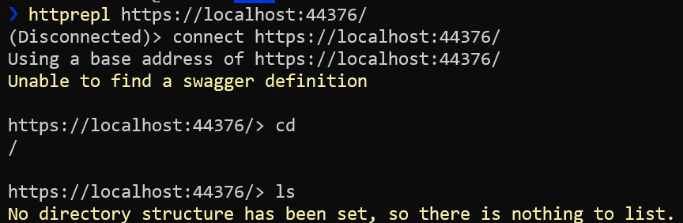
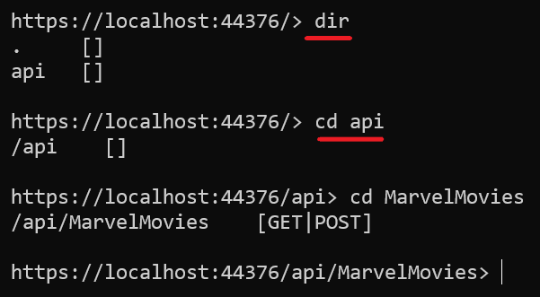
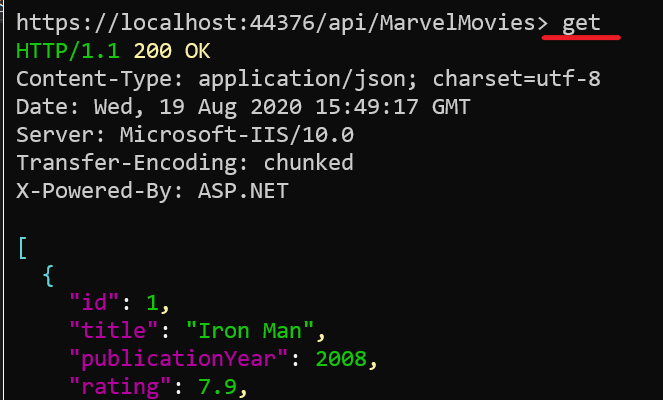
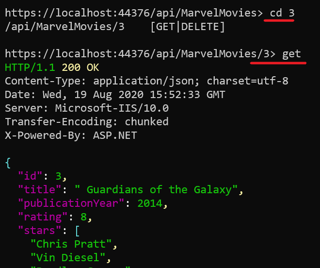
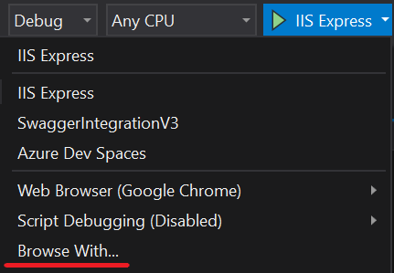

Ever wondered if it's possible to interact with some APIs using the CLI instead of writing a client or using tools like Postman or Insomnia? One of the most used tools is _cURL_, that you can use to call an endpoint via HTTP and print the result on the console. One of its limits is that you must know exactly the URL to call: you can't discover the endpoints exposed by the target API.

A less-known tool is **HttpRepl**: this is a command-line tool built by the ASP.NET team which lets you navigate RESTful HTTP services **as if you were navigating folders with the command-line**, using _cd_, _dir_, and _ls_.

## Prerequisites

To try this tool you need two things: the tool itself and an API to call.

For the API, I'm going to use the project I've created for the article where I explain [how to add Swagger to your API](./swagger-integration "Effective Swagger integration in .NET Core"). It will give us the opportunity to talk about a few details about HttpRepl that you must consider when you use it.

Talking about the tool itself, to install it you must run `dotnet tool install -g Microsoft.dotnet-httprepl` on a console; remember that **you must have .NET Core 2.1 (or later)** installed on your machine.

## Available HTTP operations

Just like most of the CLI tools, HttpRepl exposes a `--help` flag as well. If you run it you can get more info about the usage of the tool.

For instance, one of the things to notice is that with HttpRepl you can interact with HTTP APIs **using several HTTP verbs**: _GET_, _POST_, _PUT_, _DELETE_, _PATCH_, _HEAD_, and _OPTIONS_.

You can also **set HTTP headers**, and perform operations using a body that can come from the console, from a temporary file or from a physical file on your machine.

## Run it

If you haven't downloaded it yet, [this is the link to the Marvel Movies project](https://github.com/code4it-dev/SwaggerIntegration "Repository used for the examples") which I used to explain how to integrate Swagger.

Now, run it: you'll see it running on `https://localhost:44376/swagger/index.html`.

Finally, you can open a console and run your first command: `httprepl https://localhost:44376/`.

**But hey, it doesn't work! 😕**

```bash
(Disconnected)> connect https://localhost:44376/
Using a base address of https://localhost:44376/
Unable to find a swagger definition

https://localhost:44376/>
```

The error says that HttpRepl couldn't find a valid Swagger definition, meaning that **it can't find the OpenAPI file** generated by Swagger. That's because of the location of that JSON file.

## Using a swagger.json file

By default HttpRepl uses some predefined relative paths to discover the Swagger files:

- swagger.json
- swagger/v1/swagger.json
- /swagger.json
- /swagger/v1/swagger.json

If you remember from the article about Swagger, we've defined a different path for the creation of that json file, using these instructions:

```cs
services.AddSwaggerGen(c =>
{
    c.SwaggerDoc("v1-foo", new OpenApiInfo { Title = "My API", Version = "v1-beta" });
});
```

The first parameter of the `SwaggerDoc` method, _v1-foo_, is used to define the path for the OpenAPI JSON file: in this case is _https://localhost:44376/swagger/v1-foo/swagger.json_

This URL doesn't match with any of the paths searched by HttpRepl, thus the _Unable to find a swagger definition_ message. By the way, notice that you're still connected to the endpoint, even though you can't perform any operations, because without knowing the structure provided by the OpenAPI file, HttpRepl can't evaluate the different routes.



We can solve the issue in two simple ways:

1. Change the _v1-foo_ parameter to _v1_ in our API project
2. Run a more complex command with a `--swagger` flag to specify the URL of _swagger.json_ : `httprepl https://localhost:44376/ --swagger https://localhost:44376/swagger/v1-foo/swagger.json`

Choose a way, close the command line (or _Ctrl+c_ to stop HttpRepl), and run the command again.

Now we're ready to use it!

## Setting up the default editor

There's a step I ignored thinking that it wasn't useful. It turned out that this step solved many issues I had while trying HttpRepl, especially for POST and UPDATE commands: I haven't **set the default text editor!**

This is a crucial step because, when performing some operations that require a _body_, **HttpRepl opens a text editor with a temporary file** that you must edit to perform the request.

Once you figure out which is the path for favorite editor, run this command:

`pref set editor.command.default "<path to your editor>"`

Since I use Visual Studio Code, I ran this command:

`pref set editor.command.default "C:\Users\my-user\AppData\Local\Programs\Microsoft VS Code\Code.exe"`

Now every time I need to write a _body_ for a request, HttpRepl opens an instance of VS Code and, when I save the file, it performs the request with the right content.

## Using the basic commands

There are only 2 available commands: _cd_ and _ls_ (or _dir_, it's the same).

With `cd` you change the current directory (and with `cd ..` you navigate to the parent node), while with `ls` or `dir` you can see the available routes and the operations you can perform on these endpoints.



Finally, when you've reached the target folder, you can type the HTTP verb you need (and the parameters, if any) and call the endpoint.



You'll also get info about the status code, the content type and other metadata.


A nice thing of this tool is that even routes with route parameters (for instance, _/MarvelMovies/1_) can be navigated as if they were real folders:



## Performing POST operations

What about POST requests? They're not as easy as GET requests, because they also require a body attached to the request.

I still haven't found a complete resource that explains how to perform them, so I spent lots of hours trying to understand how they work. Here's what I discovered.

First of all, you must have set a default text editor. As I explained before, all the operations that need a _body_ require a text editor.

Once you navigated to the right path, run a simple `post` command. HttpRepl will open your default editor (in my case VS Code) with a new temporary file with the structure that represents the empty object for your DTO.

```json
{
  "id": 0,
  "title": "",
  "publicationYear": 0,
  "rating": 1.1,
  "stars": [""]
}
```

Now you can edit it as you prefer, save it and close the editor.

I struggled for many hours before completing a POST request because there were some steps that I was missing: as you know, I haven't set my default editor (I have already said that, haven't I?). And, more tricky to solve, I haven't closed my editor **both before and after running the command**.

There's an issue with HttpRepl that occurs when the text editor is already in use: this bug causes the tool to perform the operation _before_ editing the JSON file, so sending an "empty" requests. I've opened [an Issue on GitHub](https://github.com/dotnet/HttpRepl/issues/378 "GitHub issue for the bug"), so... let's hope they solve it!

In the meantime, **they proposed a workaround**: run `pref set editor.command.default.arguments "-w"` to tell HttpRepl to _wait_ until the editor is closed to run the commands.

## Adding HttpRepl to Visual Studio 2019

Wouldn't it be nice to have HttpRepl easily selectable as a running context in Visual Studio when hitting F5 for debugging?

It's quite simple: in the Debug target menu, select **Browse With**



and add a profile with the following path:

_C:\Users\your-user\.dotnet\tools\httprepl.exe_

and then set it as default.

Now if you click F5, you'll have your HttpRepl instance ready to go!

**Notice that, since in this example the json file is in an "unexpected" path, it will show the same error we've seen before.** If you know how to fix it, just drop me a comment here or on Twitter 😉

## Wrapping up

For sure this is a nice tool. Of course, there are some pros and cons.

Pro:

- it's easy to use
- it can help automatize tasks, since it's running on the command line
- it's perfect if you have to perform some kind of _reverse engineering_ when there's no Swagger UI
- you'll feel super cool if you use it in front of your colleagues 😁

Cons:

- there isn't enough documentation on the internet
- it doesn't show endpoint documentation (since it doesn't reference the XML file which contains the comments related to the endpoints)
- it's easy to use for GET requests but it can be a bit cumbersome for POST and PUT requests if you don't set up the environment as I showed before

I doubt anyone will use this tool daily; after all, if the OpenAPI file can be inspected through the Swagger UI, why not using it? On the other side, this is a nice tool that can come in handy if the targeted API doesn't expose a UI or if you are exploring the APIs from a system without a browser.

If you want to know more about HttpRepl, you can have a look at [this article on the Microsoft blog](https://devblogs.microsoft.com/aspnet/httprepl-a-command-line-tool-for-interacting-with-restful-http-services/ "HttpRepl article on Microsoft blog") or you can refer to the [official documentation](https://docs.microsoft.com/en-gb/aspnet/core/web-api/http-repl "HttpRepl documentation on Microsoft Docs").

If you're more interested in the code, you can see the [GitHub repository for HttpRepl](https://github.com/dotnet/HttpRepl "HttpRepl repo on GitHub").

Happy coding!
