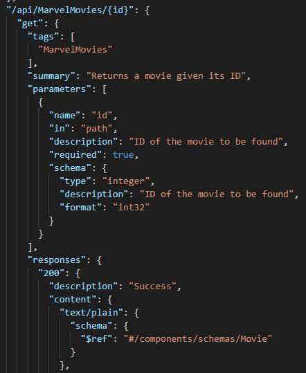
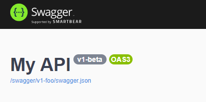
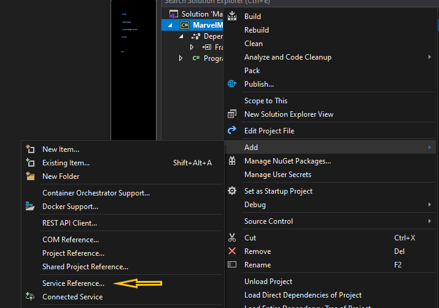
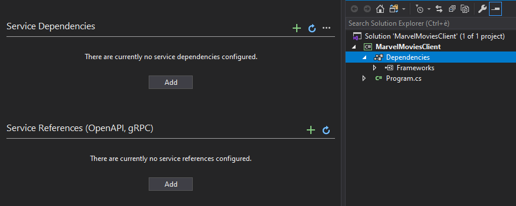
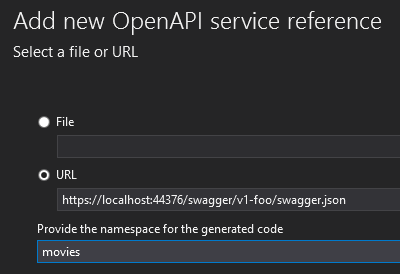
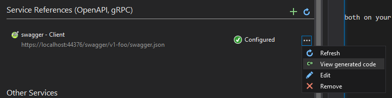
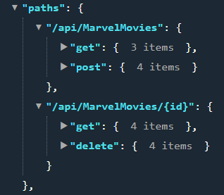

We've already seen [how to document your APIs with Swagger](./swagger-integration "Integrate Swagger to your APIs"): include some NuGet packages to your project, define some settings on your _Startup_ class and _voilà_, you have a handy UI for discovering the endpoints and for testing your APIs. Everything works thanks to an OpenAPI file generated by Swagger, which will be used by the UI to describe your endpoints. The general shape of this file is this one:



As you see, for every endpoint (in this case I've shown only one) this file describes

* the name of the method
* the parameters (if present) with name, type, and description
* the return value, with type and reference to the schema of the returned object
* the available status codes.

We've also seen that you can use the OpenAPI file to [navigate the APIs via the CLI with HttpRepl](./httprepl "Use HttpRepl to navigate APIs") as if they were folders within a file system. It's interesting for discovering the possible operations, but not really that useful for real integration with a project.

In this article, I'm going to explain how you can use the OpenAPI file to automatically generate code with Visual Studio 2019 so that you can use the boilerplate code instead of writing your own client.

## Where to find the OpenAPI file

I'm going to use the _MarvelMovies_ project I used for both the Swagger and the HttpRepl articles: you can [download it from GitHub](https://github.com/code4it-dev/SwaggerIntegration "SwaggerIntegration repository on GitHub").

Now, restore the NuGet packages and run the project: you'll be able to see the Swagger UI. This time we won't use the UI, but only the JSON definition of the endpoints. You can find the link in the UI, right below the title.



Download it or copy the URL, we're going to use it in a while.

## Create the client

It's time to create the client. For the following tests I used a simple Console Application I called _MarvelMoviesClient_.

Once created, in the Solution Explorer, right-click on the project, then click on _Add > Service Reference_



Here you can add references to _OpenAPIs_, _gRPC_, and other external services.

Now, click on _Add_ under the OpenAPI section.



Finally, you can add a new API reference by specifying the location of the OpenAPI, both on your local machine or online. You can also define a namespace for the generated code.



Now move on with the wizard: you'll see Visual Studio installing some NuGet packages for you:

* NSwag.ApiDescription.Client
* Microsoft.Extensions.ApiDescription.Client
* Newtonsoft.Json

and finally... no, still no code for you! Well, _apparently_.

## What's been generated?

After the wizard, Visual Studio adds an OpenAPIs folder in your solution files, but without showing any code.

To see the code, you must go back to the Service Reference screen, locate the OpenAPI reference, and click on _View generated code_.



Now you can see the code that has automatically been generated by Visual Studio.

This is a C# file created under the _obj_ folder, called _swaggerClient.cs_

Let's analyze the scaffolded code.

### Namespace and Constructor

```cs
namespace movies
{
    [System.CodeDom.Compiler.GeneratedCode("NSwag", "13.0.5.0 (NJsonSchema v10.0.22.0 (Newtonsoft.Json v11.0.0.0))")]
    public partial class swaggerClient 
    {
        private string _baseUrl = "";
        private System.Net.Http.HttpClient _httpClient;
        private System.Lazy<Newtonsoft.Json.JsonSerializerSettings> _settings;
    
        public swaggerClient(string baseUrl, System.Net.Http.HttpClient httpClient)
        {
            BaseUrl = baseUrl; 
            _httpClient = httpClient; 
            _settings = new System.Lazy<Newtonsoft.Json.JsonSerializerSettings>(() => 
            {
                var settings = new Newtonsoft.Json.JsonSerializerSettings();
                UpdateJsonSerializerSettings(settings);
                return settings;
            });
        }
        
        // Other
    }
}
```  

Do you remember that in the wizard I set up the namespace value? Here you can see where it is used (of course, for the namespace!).

Have a look at the constructor: it requires a _baseUrl_, which in our case will be localhost, and a `HttpClient` to perform the operations. Also, you can see a Lazy initialization of a `JsonSerializerSettings` object: this lazy loading dramatically boosts the performance.

Notice that the class name does not relate in any way to the Marvel endpoint: this is because a single OpenAPI document can be used to document endpoints from different "worlds", like the Marvel movies, some sort of authentication and any other things you can do with APIs; so the class name must be more generic as possible, to cover all the possibilities. 

Now you can understand why I often complain about the fact that there should be the possibility to define an OpenAPI file for each API controller, not only for the entire project.😒

### Models

Using the OpenAPI file, the tool can generate for you the ViewModel classes. In our case, it generates this DTO:

```cs
[System.CodeDom.Compiler.GeneratedCode("NJsonSchema", "10.0.22.0 (Newtonsoft.Json v11.0.0.0)")]
public partial class Movie 
{
    [Newtonsoft.Json.JsonProperty("id", Required = Newtonsoft.Json.Required.DisallowNull, NullValueHandling = Newtonsoft.Json.NullValueHandling.Ignore)]
    public int Id { get; set; }

    [Newtonsoft.Json.JsonProperty("title", Required = Newtonsoft.Json.Required.Default, NullValueHandling = Newtonsoft.Json.NullValueHandling.Ignore)]
    public string Title { get; set; }

    [Newtonsoft.Json.JsonProperty("publicationYear", Required = Newtonsoft.Json.Required.DisallowNull, NullValueHandling = Newtonsoft.Json.NullValueHandling.Ignore)]
    public int PublicationYear { get; set; }

    [Newtonsoft.Json.JsonProperty("rating", Required = Newtonsoft.Json.Required.DisallowNull, NullValueHandling = Newtonsoft.Json.NullValueHandling.Ignore)]
    public double Rating { get; set; }

    [Newtonsoft.Json.JsonProperty("stars", Required = Newtonsoft.Json.Required.Default, NullValueHandling = Newtonsoft.Json.NullValueHandling.Ignore)]
    public System.Collections.Generic.ICollection<string> Stars { get; set; }
}
```

Of course, __it does not include class methods__ (because you can't export the implementation). Also, the `Stars` list has been transformed from a `string[]` to an `ICollection<string>`.

### Get All

The `GetAll` method is the one that returns the list of all the Marvel Movies.

As you can see, there are two overloads: one with a `CancellationToken`, one without it.

_Just skim_ the code below: the interesting thing is that __it creates and manages for you the `HttpRequest`__ with the correct HTTP verb and the necessary headers; it also checks for the returned status codes and parses the result to the correct data type.

```cs
/// <summary>Get all the Marvel movies</summary>
/// <returns>Success</returns>
/// <exception cref="ApiException">A server side error occurred.</exception>
public System.Threading.Tasks.Task<System.Collections.Generic.ICollection<Movie>> MarvelMoviesAllAsync()
{
    return MarvelMoviesAllAsync(System.Threading.CancellationToken.None);
}

/// <param name="cancellationToken">A cancellation token that can be used by other objects or threads to receive notice of cancellation.</param>
/// <summary>Get all the Marvel movies</summary>
/// <returns>Success</returns>
/// <exception cref="ApiException">A server side error occurred.</exception>
public async System.Threading.Tasks.Task<System.Collections.Generic.ICollection<Movie>> MarvelMoviesAllAsync(System.Threading.CancellationToken cancellationToken)
{
    var urlBuilder_ = new System.Text.StringBuilder();
    urlBuilder_.Append(BaseUrl != null ? BaseUrl.TrimEnd('/') : "").Append("/api/MarvelMovies");

    var client_ = _httpClient;
    try
    {
        using (var request_ = new System.Net.Http.HttpRequestMessage())
        {
            request_.Method = new System.Net.Http.HttpMethod("GET");
            request_.Headers.Accept.Add(System.Net.Http.Headers.MediaTypeWithQualityHeaderValue.Parse("text/plain"));

            PrepareRequest(client_, request_, urlBuilder_);
            var url_ = urlBuilder_.ToString();
            request_.RequestUri = new System.Uri(url_, System.UriKind.RelativeOrAbsolute);
            PrepareRequest(client_, request_, url_);

            var response_ = await client_.SendAsync(request_, System.Net.Http.HttpCompletionOption.ResponseHeadersRead, cancellationToken).ConfigureAwait(false);
            try
            {
                var headers_ = System.Linq.Enumerable.ToDictionary(response_.Headers, h_ => h_.Key, h_ => h_.Value);
                if (response_.Content != null && response_.Content.Headers != null)
                {
                    foreach (var item_ in response_.Content.Headers)
                        headers_[item_.Key] = item_.Value;
                }

                ProcessResponse(client_, response_);

                var status_ = ((int)response_.StatusCode).ToString();
                if (status_ == "200") 
                {
                    var objectResponse_ = await ReadObjectResponseAsync<System.Collections.Generic.ICollection<Movie>>(response_, headers_).ConfigureAwait(false);
                    return objectResponse_.Object;
                }
                else
                if (status_ != "200" && status_ != "204")
                {
                    var responseData_ = response_.Content == null ? null : await response_.Content.ReadAsStringAsync().ConfigureAwait(false); 
                    throw new ApiException("The HTTP status code of the response was not expected (" + (int)response_.StatusCode + ").", (int)response_.StatusCode, responseData_, headers_, null);
                }
    
                return default(System.Collections.Generic.ICollection<Movie>);
            }
            finally
            {
                if (response_ != null)
                    response_.Dispose();
            }
        }
    }
    finally
    {
    }
}
```

### All the other methods

Of course, I'm not going to focus on all the methods generated by Visual Studio. But it's really important to notice the signatures: you'll find

* `Task<ICollection<Movie>> MarvelMoviesAllAsync()` to get all the movies
* `Task MarvelMoviesAsync(Movie body)` to perform a POST
* `Task<Movie> MarvelMovies2Async(int id)` to GET a single item
* `Task MarvelMovies3Async(int id)` to DELETE a movie

The names are quite meaningless, aren't they?

That's because the names of the endpoints we have defined on our Marvel API are all the same, the only thing that changes is the Http verb. You can see how the OpenAPI file describes them in the JSON:



So maybe the tool could create better names given the HttpVerb and the parameters. I would've expected names like

* `Task<ICollection<Movie>> GetAllMarvelMoviesAsync()` - knowing that it's a __GET__ and returns a list of items
* `Task PostMarvelMoviesAsync(Movie body)` - since it's a __POST__
* `Task<Movie> GetMarvelMoviesByIdAsync(int id)` - since it's a __GET with a parameter named id__
* `Task DeleteMarvelMovieAsync(int id)` - knowing that's a __DELETE__ operation

Even better, I'd added an additional step in the wizard to allow the developers to choose the names and map them to every exposed method. Who knows, maybe in the future they'll add it!

## How to use it

I don't like the names generated by this tool, you already know it. So, for me, the best usage is _within a wrapper class_: I don't want to use the name `MarvelMovies3Async` on my code and force the other developers to lose time searching for the meaning of this method.

By the way, you can perform all the operations in a very simple way: just create a new instance of the `swaggerClient`, pass the correct parameters and... you're ready to go!

```cs
private static async Task PrintMarvelMovies()
{
    using (var httpClient = new HttpClient())
    {
        var baseUrl = "https://localhost:44376/";
        var client = new swaggerClient(baseUrl, httpClient);
        var movies = await client.MarvelMoviesAllAsync().ConfigureAwait(false);
        foreach (var movie in movies)
        {
            Console.WriteLine(movie.Title);
        }
    }
}
```

Of course, for real-life examples, don't create and discard `HttpClient` instances every time, use an `HttpClientFactory`!

In the same way, you can perform the other operations, like adding a new movie:

```cs
private static async Task SendNewMarvelMovie()
{
    using (var httpClient = new HttpClient())
    {
        var baseUrl = "https://localhost:44376/";
        var client = new swaggerClient(baseUrl, httpClient);
        var newMovie = new Movie()
        {
            Id = 4,
            Title = "Captain Marvel",
            PublicationYear = 2019,
            Rating = 6.9f,
            Stars = new [] { "Brie Larson", "Samuel L. Jackson", "Ben Mendelsohn", "Jude Law" }
        };

        await client.MarvelMoviesAsync(newMovie).ConfigureAwait(false);
    }
}
```

## Conclusion

Here we've seen how Visual Studio can help you develop your applications faster than ever.

It's not a perfect solution, I know: the names created by the tool are not the best ones. But at least you have a client already in place.

Probably the best part of this tool is that it creates the models exposed by the external APIs so that you don't have to write them by scratch (of course, if you don't have access to the source code to do some _copy-and-paste_).

If you want to have a look at the client I've created, you can [find it on GitHub](https://github.com/code4it-dev/MarvelMoviesClient "MarvelMoviesClient project on GitHub").

Tell me if you already knew about this tool and what are its pros and cons in your opinion!

Happy coding!
