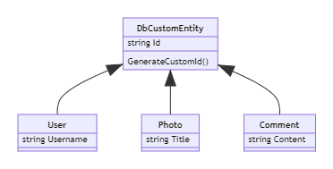

Testing static properties can be tough. Even more when you don't have full control over them. So, what to do?

We need a way to mock or substitute those values to write better tests.

Let's create a simple method to understand what is the problem and which approaches we can use to remove external dependencies.

## Understanding the problem

Have a look at the following code:

```cs
public class Calendar
{
    public int DaysToNextChristmas()
    {
        var today = DateTime.Now.Date;
        var christmas = new DateTime(today.Year, 12, 25).Date;

        if (today > christmas)
            christmas.AddYears(1);

        return (christmas - today).Days;
    }
}
```

Although it's not recommended to reference the current date inside the method that uses it to perform some calculations - it would be better to pass it as a parameter - this is still a reasonable code.

But we have a problem: we have a strong relation to the current date. The issue will be clear if we write some tests.

```cs
[Test]
public void TestSimpleCalendar()
{
    var calendar = new MyCalendar();
    var daysToChristmas = calendar.DaysToNextChristmas();

    Assert.AreEqual(18, daysToChristmas);
}
```

Considering that, at the time of writing, today it's December, the 7th, the test surely passes. And what if we run the test again tomorrow, or in a month? Of course, it will fail because we don't have control over the date used as a comparison. Also, we cannot test edge cases, like when today it's Christmas and when we are in the days between the 26th and the 31st of December.

So what? In this article, I'll propose three approaches. They have pros and cons, so the choice is yours.

## Using abstract classes and virtual methods

If we can transform our class into an abstract class, we can extract the method to get the current date, make it abstract and let the concrete classes implement it.

For a more concrete example, let's transform our `Calendar` class into an abstract class.

```cs
 public abstract class AbstractCalendar
{
    public virtual int DaysToNextChristmas()
    {
        var today = GetTodayDate().Date;
        var christmas = new DateTime(today.Year, 12, 25).Date;

        if (today > christmas)
            christmas.AddYears(1);

        return (christmas - today).Days;
    }

    public abstract DateTime GetTodayDate();
}
```

Our abstract class exposes a `virtual` method that manages the general structure of our algorithm. To get the current date it references the `GetTodayDate` method, which here is marked as `abstract`. This means that we have to create a concrete class and implement this method:

```cs
public class MyConcreteCalendar : AbstractCalendar
{
    public override DateTime GetTodayDate()
    {
        return DateTime.UtcNow;
    }
}
```

We are good to go! We have removed the dependency from the algorithm and moved to something we can control.

And we can test the general calculations by creating a stub class used only for our tests.

```cs
public class StubCalendar : AbstractCalendar
{
    public DateTime Today { get; set; }
    public override DateTime GetTodayDate()
    {
        return Today;
    }
}
```

In this way, we can use the `StubCalendar` class to write our tests

```cs
[Test]
public void TestAbstractCalendar()
{
    var calendar = new StubCalendar { 
        Today = new DateTime(2020,12,19)
    };
    var daysToChristmas = calendar.DaysToNextChristmas();

    Assert.AreEqual(6, daysToChristmas);
}
```

If we prefer a mocking library, we can use Moq and create a stub object in which we only keep `virtual` methods and replace only the `abstract` ones.

```cs
[Test]
public void TestAbstractCalendarWithMoq()
{
    var mockCalendar = new Mock<AbstractCalendar>() { 
        CallBase = true // Reuse code from the abstract class
    };
    mockCalendar.Setup(c => c.GetTodayDate())
        .Returns(new DateTime(2020, 12, 19));

    var daysToChristmas = mockCalendar.Object.DaysToNextChristmas();

    Assert.AreEqual(6, daysToChristmas);
}
```

If you're not familiar with Moq, let me explain the code: first of all, we create a mock of `AbstractCalendar` using `new Mock<AbstractCalendar>()`; the property `CallBase` tells Moq that it needs to use the actual code defined in the virtual methods. If you don't add this property, all the methods will return their default values (`0` for DaysToNextChristmas, `null` for strings and so on).

Then we specify that when we call `GetTodayDate` we want to have that specific date returned. Finally, we execute the code on the actual object with `mockCalendar.Object.DaysToNextChristmas()`.

## Using functions in the constructor

A different approach is to move the definition of the current date to the constructor. We can define an optional function in the constructor whose meaning is to define how to get the current date; this function will be nullable, so that if we don't pass anything we use the default value, otherwise we use the custom value.

```cs
public class MyFunctionCalendar
{
    private Func<DateTime> _now;

    public MyFunctionCalendar(Func<DateTime> now = null)
    {
        _now = now != null ? now : new Func<DateTime>(() => DateTime.UtcNow.Date);
        // or, more concisely, _now = now ?? new Func<DateTime>(() => DateTime.UtcNow.Date);
    }

    public int DaysToNextChristmas()
    {
        var today = _now();
        var christmas = new DateTime(today.Year, 12, 25).Date;

        if (today > christmas)
            christmas.AddYears(1);

        return (christmas - today).Days;
    }
}
```

That's an odd way to solve the problem, but it works!

You can test it like this:

```cs
[Test]
public void MyFunctionCalendarWithDefaultDate() {

    var calendar = new MyFunctionCalendar();
    var daysToChristmas = calendar.DaysToNextChristmas();

    Assert.AreEqual(18, daysToChristmas);
}

[Test]
public void MyFunctionCalendarWithCustomDate()
{
    Func<DateTime> fakeDate = () => new DateTime(2020, 12, 24).Date;
    var calendar = new MyFunctionCalendar(fakeDate);
    var daysToChristmas = calendar.DaysToNextChristmas();

    Assert.AreEqual(1, daysToChristmas);
}
```

## Injecting dates from a different service

This is the most common and clean way: you create a separate service by creating an interface and its concrete class.

```cs
public interface IDateTimeProvider {
    DateTime GetCurrentDate();
}

public class DateTimeProvider : IDateTimeProvider
{
    public DateTime GetCurrentDate() => DateTime.UtcNow;
}
```

Then, you inject the interface into the client classes:

```cs
public class InjectedCalendar
{
    private readonly IDateTimeProvider _dateTimeProvider;

    public InjectedCalendar(IDateTimeProvider dateTimeProvider)
    { 
        _dateTimeProvider = dateTimeProvider;
    }

    public int DaysToNextChristmas()
    {
        var today = _dateTimeProvider.GetCurrentDate();
        var christmas = new DateTime(today.Year, 12, 25).Date;

        if (today > christmas)
            christmas.AddYears(1);

        return (christmas - today).Days;
    }
}
```

You will need to inject it using your favourite Dependency Injection engine and by choosing the right lifetime. If you want to learn the difference between _Singleton, Scoped and Transient_ lifetimes in .NET, [here's a deep explanation](./dependency-injection-lifetimes).

Finally, you can test the `InjectedCalendar` class in a similar way as we did with abstract classes:

```cs
[Test]
public void InjectedCalendarTest() {
    var mockDateTimeProvider = new Mock<IDateTimeProvider>();
    mockDateTimeProvider.Setup(c => c.GetCurrentDate())
        .Returns(new DateTime(2020, 12, 20));

    var calendar = new InjectedCalendar(mockDateTimeProvider.Object);
    var daysToChristmas = calendar.DaysToNextChristmas();
    
    Assert.AreEqual(5, daysToChristmas);
}
```

This method allows you to use a single implementation used across your project and to change it in a single point to propagate the change in a simple and consistent way.

## When to use each approach

The usage of _abstract methods_ is great when the code to be injected is something __strictly related to the boundaries of the hierarchy__ of the abstract class.

Say that you have some DTO classes stored on a database, and you need a custom Id that relies on some complex and custom calculation (let's say, it concatenates the current timestamp and a random GUID). A good idea is to mark the method that generates the Id as `abstract` to make it accessible only by the concrete classes.



In this way you define the `GenerateCustomId` method only in the base abstract class, `DbCustomEntity`, share the implementation with the concrete classes and narrow down the visibility of that specific method. To test it, you'll write a stub class that overrides the `GenerateCustomId` method.

And what about _functions on the constructor_?

This way to inject functionalities is fine for those one-shot projects that you run only once, like for importing data from an external source: you may not want to create a complex project and use the dependency injection engine, but still, you may want to test the code before running it. Well, in this case, that quick and dirty solution is fine, it's the best of the two words.

For all the other cases, so when you are building a complex system (maybe an API project) and you want to share the same implementation with lots of the classes in your project, the best approach is to use dependency injection and mock it in your tests.

## Wrapping up

Not always you have control over your code: you cannot control time by specifying the value of `DateTime.Now`, so you have to abstract it to run consistent tests. The same happens for other classes, like `Guid`.

In this article, we've seen three ways you can use to have more control over those dependencies: each one is fine for a specific use case, but in general you might want to use the dear old dependency injection.

Have you ever used the other methods?

Happy coding!