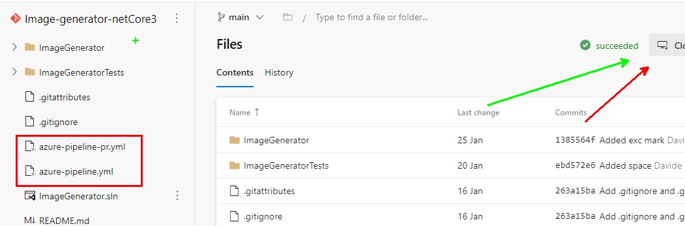

More and more developers crave to be also tech speakers. We can see every day dozens of meetups, live streaming, and YouTube videos by developers from all over the world. But regardless of the topic and the type of talk you're doing, there are a few tips you should keep in mind to rock the execution.

Those tips are not about the content, but about the presentation itself. So, maybe, consider re-reading this checklist about 30 minutes before your next virtual conference.

## 1- Hide desktop icons

Many of you have lots of icons on your desktop, right? Me too. I often save on Desktop temporary files (that I always forget to move or delete) and many program icons, like Postman, Fiddler, Word, and so on.

They are just a distraction to your audience. You should keep the desktop as clean as possible.

You can do it in 2 ways: __hide all the icons__ (on Windows: _right-click_ > _View_ > untick _Show desktop icons_) or just remove the ones that are not necessary. 

The second option is better if you have lots of content to show from different sources, like images, plots, demo with different tools, and so on.

If you have everything under a single folder, you can simply hide all icons and pin that folder on Quick Access.

## 2- Choose a neutral desktop background

Again, your audience should focus on your talk, not on your desktop. So just remove funny or distracting background images.

Even more, if you use memes or family photos as desktop background.

A good idea is to create a custom desktop background for the event you are participating in: a simple image with the name of the talk, your name, and your social contacts.

## 3- Mute your phone

Avoid all the possible distractions. WhatsApp notifications, calls from Call Centres, alarm clocks you forgot to turn off... 

So, just use Airplane mode.

## 4- Remove useless bookmarks (or use a different browser)

Just as desktop icons, bookmarks can distract your audience.

You don't want to show everyone which social networks are you using, what are the projects you're currently working on, and other private info about you.

A good alternative is to use a different browser. But remember to do a rehearsal with that browser: sometimes some JavaScript and CSS functionalities are not available on every browser, so don't take anything for granted.

## 5- Close background processes

What if you get an awkward message on Skype or Slack while you're sharing your screen?

So, remember to close all useless background processes: all the chats (Skype, Discord, Telegram...) and all the backup platforms (OneDrive, Dropbox, and so on).

A risk: unwanted notifications that appear while sharing your screen. And even worse, __all those programs require network bandwidth and use CPU and Memory__: shutting them down will boost the other applications and make everything run smoother.

## 6- Check font size and screen resolution

You don't know the device your audience will use. Some of them will watch you talk on a smartphone, some others on a 60" TV.

So, even if you're used to small fonts and icons, make everything bigger. Start with screen resolution. If it is OK, now increase the font size for both your slides and your IDE.

Make sure everyone can read it. If you can, during the rehearsals share your screen with a smartphone and a big TV, and find the balance.

## 7- Disable dark mode

__Accessibility is the key__, even more for virtual events. And not everyone can see everything as you do. So, switch everything to light mode: IDEs, websites, tools. Everything that natively comes with light mode.

## 8- Check mic volume

This is simple: if your mic volume is too low, your audience won't hear a word from you. So, instead of screaming for one hour, just put your mic near you or increase the volume.

## 9- Use ZoomIt to draw on your screen

«Ok, now, I click on this button on the top-left corner with the Home icon».

How many times have you heard this phrase? It's not wrong to say so, but you can simply show it. Remember, __show, don't tell!__

For Windows, you can install a small tool, __ZoomIt__, that allows you to draw lines, arrows, and shapes on your screen.

You can read more [on this page](https://docs.microsoft.com/en-gb/sysinternals/downloads/zoomit) by Microsoft, where you can find the download file, some shortcuts, and more info.

So, download it, try out some shortcuts (eg: _R_, _G_, _B_ to use a red, green, or blue pen, and _Hold Ctrl + Shift_ to draw an arrow) and use it to help your audience see what you're indicating with your mouse.

## 10- Have a backup in case of network failures

Your internet connection goes down during the live. _First reaction: shock_. But then, you remember you have everything under control: you can use your smartphone as a hotspot and use that connection to move on with your talk. So, always have a plan B.

And what if the site you're showing for your demos goes down? Say that you're explaining what are Azure Functions, and suddenly the Azure Dashboard becomes unavailable. How to prevent this situation?

_You can't._ But you can have a backup plan: __save screenshots and screencasts__, and show them if you cannot access the original sites.

## Wrapping up

We've seen that there are lots of things to do to improve the quality of your virtual talks. If you have more tips to share, share them in the comment section below or on [this discussion on Twitter](https://twitter.com/BelloneDavide/status/1354080402659553288).

Performing your first talks is really challenging, I know. But it's worth a try. If you want to read more about how to be ready for it, [here's the recap](https://www.code4it.dev/blog/thoughts-after-my-first-public-speech) of what I've learned after my very first public speech.

