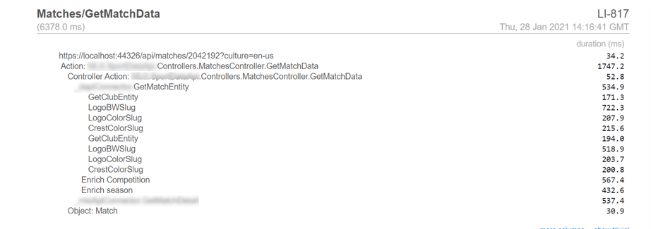
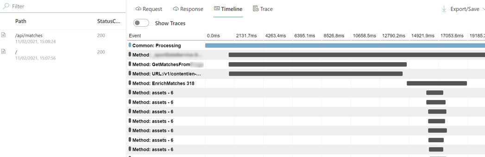

A few weeks ago I was tasked to improve the performance of an API project that was really, _really_ slow.

After more than 3 weeks of work, I managed to improve performance: **the initial 14 seconds became less than 3 seconds!** Not enough, I know, but still a great result!

So here's a recap of this journey. I will list some of the steps that brought me to that result and that maybe can help you.

**I will not give you any silver bullet to achieve this result - there aren't any**. I'm just going to list some of the steps that helped me figuring out how to improve the overall performance and be sure to do it in the best way.

Since there's so much to learn, I've split this article into 2 parts: in this part, you'll see some generic tips, not related to a particular technology. In the next article, we'll see some improvements strictly related to .NET applications.

## A short recap for the lazy reader

As I've already explained [on Twitter](https://twitter.com/BelloneDavide/status/1352564267858481152), there are some tips that can help you find performance issues. Those tips are not strictly technical; rather they are a general approach to this problem.

1. cover your application with **e2e and integration tests**. You're going to change the implementation details, so your unit tests will fail.
2. use tools to **profile performance**: you can use advanced tools or create custom stopwatches.
3. **study the logic before the implementation details**. Performance issues usually come from wrong `if` statements, useless loops, or excessive data retrieval.
4. **Disable cache**. An application must be performant regardless of cache mechanisms. Caching is just an additional improvement, but it's not the solution to performance issues.
5. **Learn language and platform details**. This step is the only one that strictly depends on the language you are using. I'm going to show a few common errors in .NET applications that can slow down your application.

But there is more, of course. If you have more tips to share, feel free to share your experience in the comments.

## The original problem

To fully understand how I acted and what issues I came across, I need to explain the general problem and the data flow. Of course, I have to censor the name of the project and the client, so I'll use generic names.

The 14-second endpoint is used to get info about all the matches that were played for a certain sport on a range of dates. The API retrieves data from 3 sources: the _internal CMS_, an _external API_, and an _assets management platform_ - like Cloudinary, but created and maintained by my company.

So, when a client calls our API, we perform the following steps:

1. Get all the matches from the external API
2. Get for each match
   1. Get match details from the CMS - including the IDs of the clubs that played that match, the venue, and some other info
   2. Get club details from CMS (both home and away clubs)
   3. Get venue details from CMS
   4. Get assets info for the clubs
   5. Get assets info for the venue
   6. Get assets info for the other fields

![Initial sequence of operations of the 14 seconds endpoint](https://mermaid.ink/img/eyJjb2RlIjoic2VxdWVuY2VEaWFncmFtXG4gICAgcGFydGljaXBhbnQgQVBJXG4gICAgcGFydGljaXBhbnQgRXh0QVBJXG4gICAgcGFydGljaXBhbnQgQ01TXG4gICAgcGFydGljaXBhbnQgQXNzZXRzXG4gICAgQVBJLT4-K0V4dEFQSTogR2V0IGFsbCBtYXRjaGVzXG4gICAgRXh0QVBJLS0-Pi1BUEk6IGxpc3Qgb2YgbWF0Y2hlc1xuICAgIGxvb3AgZm9yIGVhY2ggbWF0Y2hcbiAgICAgICAgQVBJLT4-K0NNUzogR2V0IG1hdGNoIGRldGFpbHNcbiAgICAgICAgQ01TLS0-Pi1BUEk6IG1hdGNoZXNcbiAgICAgICAgQVBJLT4-K0NNUzogR2V0IGhvbWUgY2x1YiBkZXRhaWxzXG4gICAgICAgIENNUy0tPj4tQVBJOiBob21lIGNsdWJcbiAgICAgICAgQVBJLT4-K0NNUzogR2V0IGF3YXkgY2x1YiBkZXRhaWxzXG4gICAgICAgIENNUy0tPj4tQVBJOiBhd2F5IGNsdWJcbiAgICAgICAgQVBJLT4-K0NNUzogR2V0IHZlbnVlIGRldGFpbHNcbiAgICAgICAgQ01TLS0-Pi1BUEk6IHZlbnVlXG4gICAgICAgIEFQSS0-PitBc3NldHM6IGhvbWUgY2x1YiBhc3NldHNcbiAgICAgICAgQXNzZXRzLS0-Pi1BUEk6IGFzc2V0c0luZm9cbiAgICAgICAgQVBJLT4-K0Fzc2V0czogYXdheSBjbHViIGFzc2V0c1xuICAgICAgICBBc3NldHMtLT4-LUFQSTogYXNzZXRzSW5mb1xuICAgICAgICBBUEktPj4rQXNzZXRzOiB2ZW51ZSBhc3NldHNcbiAgICAgICAgQXNzZXRzLS0-Pi1BUEk6IGFzc2V0c0luZm9cbiAgICBlbmRcbiAgICBBUEktPj5BUEk6IG1lcmdlIGluZm8gZnJvbSBFeHRBUEkgYW5kIENNUyIsIm1lcm1haWQiOnt9LCJ1cGRhdGVFZGl0b3IiOmZhbHNlfQ)

As you can see, there are lots of sequential calls to compose just one object.

Another problem: the whole project was a mess. **Not a single test, a huge amount of technical debt**; it was a managers' choice: they needed to integrate the API as soon as possible, without worrying about maintainability, performance, and so on. In my opinion, not the best choice; but if they took this decision, \__they surely had a reason to choose this path_.: I trust my team and the management: they generally crave good quality software.

So, how did I approach the problem?

## Create end-to-end tests

Probably you're going to change _a lot_ of stuff in your code. So, your unit tests will fail. And even if you fix the tests, it doesn't provide any value in this step. **You want to get the same results as before, but in a faster way**.

It's useless - even dangerous - to mock all the dependencies just to keep the unit tests passing. **In this phase, you have to focus on avoiding regressions on your code**. If a field is populated with a certain value, you need to ensure that, at the end of the refactoring, you receive the same, exact result.

I created an E2E project with one purpose: call the actual API, read the result, and then compare the result with the one I stored in a JSON file.

So, the first step: **create Manifest files** with the JSON result coming from the dev environment. You can see how to create and use Manifest files in .NET [in this article](https://www.code4it.dev/blog/mock-dependency-with-manifest-resources).

Once I have some of the possible results stored in JSON files, I read them and compare the actual call result to the original one. No changes -> no regression.

To run the test I set up an In-memory Server as [I explained in this article](https://www.code4it.dev/blog/integration-tests-for-dotnet-api). So, a sample test has this shape:

```cs
[Test]
public async Task Matches_WithDates()
{
    // read from Manifest File
    var fakeMatchesWithDates = await GetFakeMatchesWithDates();

    // call the actual URL on my In-memory server
    HttpResponseMessage httpResponse = await client.GetAsync($"/api/matches?culture=en-us&dateFrom=2020-11-01&dateTo=2021-03-01");

    // read and parse the result
    var actualResult = await TestUtils.DeserializeHttpResponseContent<List<Match>>(httpResponse);

    // check the content
    actualResult.Should().BeEquivalentTo(fakeMatchesWithDates);
}
```

You should write a test for each endpoint you're going to update.

**But this approach has a downside that made me delete every test!** In fact, as I explained before, one of the parts to be integrated was the internal CMS. But, since other colleagues were working on the same set of data, I needed to update the JSON files every time they modified one of the entities.

The result? Lots of time spent updating the JSON.

So, I can propose 2 possible solutions:

- write _loose_ tests. Don't test for the exact value of each field, but check if the general structure is the same (the result has the same items count, the field names are the same, and so on)
- use a sandboxed environment: create a clone of a real environment, import some content, and run tests on that new environment.

## Use profiling tools

You must not assume that a certain operation is the application bottleneck. You have to prove it.

So, use tools to keep track of the progress. To track performance in .NET you can use the dear old `System.Diagnostics.Stopwatch` class: you create a `StopWatch`, make it start, execute the code and then stop it; then, you print/store the result.

```cs
void Main()
{
    Stopwatch sw = new Stopwatch();

    sw.Start();
    var x = LooongOperation();
    sw.Stop();

    Console.WriteLine("Time (ms): " + sw.ElapsedMilliseconds);
}

int LooongOperation() {
    Thread.Sleep(1250);
    return 42;
}
```

If you want something more complex, you can use external tools for .NET like [MiniProfiler](https://miniprofiler.com/dotnet/AspDotNetCore) and [Rin](https://github.com/mayuki/Rin): with these tools, you define the portion of code to be profiled and, instead of saving manually the results, you analyze the results in the UI provided by the tool itself.

With MiniProfiler the results are displayed in a simple, textual format:



With Rin, you see them with a more complex UI with a timeline:



Rin and Miniprofiler must be added in the `Startup` class, so their best usage is in .NET MVC/API applications and Azure Functions (yes, [you can use the `Startup` class even for Azure Functions!](https://www.code4it.dev/blog/azure-functions-startup-class))

So, how do you collect tracing data with Miniprofiler and Rin?

In both cases, you wrap the code in a `using` block. With MiniProfiler you use this way:

```cs
using (MiniProfiler.Current.Step("Performing loong operation"))
{
    var x = LooongOperation();
}
```

while in Rin you use this other.

```cs
using (TimelineScope.Create("Performing loong operation"))
{
    var x = LooongOperation();
}
```

So, now, run the code, watch the performance traces and store them somewhere (I stored the screenshots in a Word file).

## Refactor, refactor, refactor

As I said, the code was a total mess. Duplicated methods, repeated business logic, enormous classes...

So, the only thing that can save you is a long, focused day of pure refactoring.

You need to come up with a code that can be easily manipulated and updated: use generics, abstract classes, refactor the modules, and clean up the code.

This part has 3 main advantages, in our specific case:

- you (almost) fully understand how the code works
- you can improve the single steps without the worry of breaking other code
- you can add the profiling steps (Rin, MiniProfiler, or similar) in your code without adding too much mess

So, take a whole day to refactor the project.

## Disable cache

Your application must be performant even without cache mechanisms. So, disable it!

Yes, you should access remote resources placed under an external cache (like sites under Akamai). But your application should not use local cache - in this phase.

**The cache must improve an already performant application**: don't rely on it to find performance issues.

Yes, if you cache everything, you'll surely have great results (I went from 14 seconds to 40 milliseconds). But once the cache expires or the application is restarted, you'll going to face the same problem over and over again.

## Understand and update the logic of the application

Once you have the code clean enough to understand the data flow, and you have tools that show you the timings, find the bottleneck.

In my case, I had 2 main bottlenecks: the access to the ExtAPI and the retrieval of assets info.

So, I found two ways to improve the business logic.

### Reduce calls to the ExtAPI

First of all, I narrowed down the items to be retrieved from the ExtAPI. To do so, I added one more call to the CMS to get only the items that matched a certain filter.

Then, I used _only the returned ids_ to get data from ExtAPI and CMS.


Then, I **studied better the ExtAPI endpoints** and found out that we could perform a single call to get details for every match passed in query string: just this single trick improved a lot the performance: instead of N API calls, I performed a single API call for N items.


### Reduce calls to Assets

Similarly, I optimized the access to the Assets endpoint.

Instead of performing a call for every item I needed (so, venue images + home club images + away club images, one for each match), I performed a single call for every match with all the images I needed.

So, I transformed this:


Into this:


What do I mean by _"for each image needed, get the right info"_?

I stored all the info coming from the Assets on a `Dictionary<string, ImageInfo>`.

This allowed me to get the correct info in this way:

```cs
string[] ids = GetRequiredImagesIds(match);

Dictionary<string, ImageInfo> infoDictionary = assetsWrapper.GetImages(ids);

// other stuff

match.Venue.MainImage = infoDictionary[match.Venue.MainImageId];
match.HomeClub.MainImage = infoDictionary[match.HomeClub.MainImageId];
// and so on...
```

Of course, the `GetRequiredImagesIds` method analyses the input match and returns all the image ids that need to be retrieved.

Again, just changing the order of the operations and optimizing the external calls, I minimized the number of remote calls, thus reducing the general timing.

## Study well and deeply your external dependencies

As I already stated, I found out that the Assets API allowed executing a query for a list of values at the same time: this simple discovery boosted the performance of the application.

So, my suggestion is: study and experiment with the external APIs you are working with. Maybe you'll find an endpoint or a flag that allows you to reach better performance in terms of calculation and data transportation.

Look if you can:

- get multiple items by **passing multiple IDs**: if you have an endpoint like `/matches?id=123`, you can search for something like `/matches?id=123,456` or `/matches?id=123&id=456`. Maybe it does not exist, but just in case...
- **reduce the number of fields** to be returned: sometimes you can ask for the exact fields you need, like in **OData** and in **GraphQL** endpoints; so, instead of return a whole, complex object when you just need a name, just ask for that single field.
- apply **strict filters on search from remote endpoints**: instead of getting 1000 items from the APIs, fetching them to exclude the ones that do not match your requirements, thus getting only 30 items, push the filtering on the API side. If you're interested in the result of a club's matches, filter all the matches played by that club and _already played_: you are not interested in a match not played yet, are you?

Remember that not always the documentation is well written and with all the options: so try and experiment by yourself

## Wrapping up

In this first part, we've seen general concepts to approach the performance analysis of an application. As you have seen, there is almost nothing related to the .NET world, even though all the examples are written having .NET in mind; by the way, those general rules can be applied to every language and platform.

In the next article, we're going to see something more related to .NET and C#.

Happy coding!
