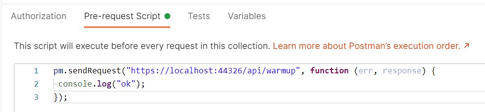

In this second article, I'm going to share some more tips that brought me to improve the performance of an API from 14sec to less than 3 seconds: an improvement of 82%.

In the previous article, we've seen some general, language-agnostic ways to approach this kind of problem, and what you can try (and avoid) to do to achieve a similar result.

In this article, we're going to see some .NET-related tips that can help to improve your APIs performance.

## WarmUp your application using Postman to create Singleton dependencies

In my application, we use (of course) dependency injection. Almost all the dependencies are marked ad `Singleton`: this means that every dependency is created at the start-up of the application and is then shared through all the lifespan of the application.

_Pss_: if you want to know the difference between `Singleton`, `Transient`, and `Scoped` lifetimes with _real_ examples, [check out this article](./dependency-injection-lifetimes "The difference between Singleton, Transient, and Scoped")!

It makes sense, right? But have a closer look at the timing in this picture:


The blue line is the whole HTTP call, and the black line is the API Action.

__There are almost 2 seconds of _nothing_!__ Why?

Well, as explained in the article ["Reducing initial request latency by pre-building services in a startup task in ASP.NET Core"](https://andrewlock.net/reducing-latency-by-pre-building-singletons-in-asp-net-core/ "Andre Lock's article about Startup tasks") by Andrew Lock, __singletons are created during the first request__, not at the real start-up of the application. And, given that all the dependencies in this application are singletons, the first 2 seconds are being used to create those instances.

While Andrew explains how to create a Startup task to warm up the dependencies, I opted for a _quick-and-dirty_ option: create a Warmup endpoint and call it before any call in Postman.

```cs
[HttpGet, Route("warmup")]
public ActionResult<string> WarmUp()
{
    var obj = new
    {
        status = "ready"
    };

    return Ok(obj);
}
```

__It is important to expose that endpoint under a controller that uses DI__: as we've seen before, dependencies are created during the first request they're needed; so, if you create an empty controller with only the `WarmUp` method, you won't build any dependency and you'll never see improvements. My suggestion is to place the `WarmUp` method under a controller that requires one of the root services: in this way, you'll create the services and all their dependencies.

To call the WarmUp endpoint before every request, I've created this simple script:

```js
pm.sendRequest("https://localhost:44326/api/warmup", function (err, response) {
 console.log("ok");
});
```

So, if you paste it in Postman, into the _Pre-requests Script_ tab, it executes this call before the main HTTP call and warms up your application.



__This tip will not speed up your application but gives your a more precise value for the timings.__

## Improve language-specific details

Understanding how C# works and what functionalities it offers is crucial to get well working applications.

There's plenty of articles around the Internet that tell you some nice tips and trick to improve .NET performance; here I'll list some of my favorite tips an why you should care about them.

### Choose the correct data type

There's a lot you can do, like choosing the right data type: if you are storing a player's age, is `int` the right choice? Remember that `int.MinValue` is `-2147483648` and `int.MaxValue` is `-2147483648`.

You could use `byte`: its range is `[0,255]`, so it's perfectly fine to use it.

To have an idea of what data type to choose, here's a short recap with the Min value, the Max value, and the number of bytes occupied by that data type:

| Data type | Min value | Max Value | # of bytes |
|------|--------|---------|--------|
|byte |0|255|1|
|short|-32768|32767|2|
|ushort|0|65535|2|
|int|-2147483648|2147483647|4|
|uint|0|4294967295|4|

So, just by choosing the right data type, you'll improve memory usage and then the overall performance.

It will not bring incredible results, but it's a good idea to think well of what you need and why you should use a particular data type.

### StringBuilder instead of string concatenation

__Strings are immutable__, in C#. This means that every time you concatenate 2 strings, you are actually creating a third one that will contain the result.

So, have a look at this snippet of code:

```cs
string result = "<table>";
for (int i = 0; i < 19000; i++)
{
    result += "<tr><td>"+i+"</td><td>Number:"+i+"</td></tr>";
}

result += "</table>";

Console.WriteLine(result);
```

This loop took _2784 milliseconds_.

That's where the `StringBuilder` class comes in handy: you avoid all the concatenation and store all the substrings in the `StringBuilder` object:

```cs
StringBuilder result = new StringBuilder();

result.Append("<table>");
for (int i = 0; i < 19000; i++)
{
    result.Append("<tr><td>");
    result.Append(i);
    result.Append("</td><td>Number:");
    result.Append(i);
    result.Append("</td></tr>");
}

result.Append("</table>");

Console.WriteLine(result.ToString());
```

Using `StringBuilder` instead of string concatenation I got the exact same result as the example above but in _58 milliseconds_.

So, just by using the `StringBuilder`, you can speed up that part by 98%. 

### Don't `return await` if it's the only operation in that method

Every time you mark a method as `async`, behind the scenes .NET creates a _state machine_ that keeps track of the execution of each method.

So, have a look at this program where every method returns the result from another one. Pay attention to the many `return await` statements;

```cs
async Task Main()
{
    var isAvailable = await IsArticleAvailable();
    Console.WriteLine(isAvailable);
}

async Task<bool> IsArticleAvailable()
{
    var articlePath = "/blog/clean-code-error-handling";
    return await IsPathAvailable(articlePath);
}

async Task<bool> IsPathAvailable(string articlePath)
{
    var baseUrl = "https://www.code4it.dev/";
    return await IsResourceAvailable(baseUrl, articlePath);
}

async Task<bool> IsResourceAvailable(string baseUrl, string articlePath)
{
    using (HttpClient client = new HttpClient() { BaseAddress = new Uri(baseUrl) })
    {
        HttpResponseMessage response = await client.GetAsync(articlePath);
        return response.IsSuccessStatusCode;
    }
}
```

So, what did I mean with _state machine_?

Here's _just a small part_ of the result of the decompilation of that code. It's a looooong listing: don't focus on the details, just have a look at the general structure:

If you are interested in the full example, [here](https://gist.github.com/bellons91/8677083ffd3325cef61d683c6c3af7f8 "Gist with full async methods decompiled") you can find the gist with both the original and the decompiled file.

```cs
internal static class <Program>$
{
    private sealed class <<<Main>$>g__Main|0_0>d : IAsyncStateMachine
    {
        public int <>1__state;

        public AsyncTaskMethodBuilder <>t__builder;

        private bool <isAvailable>5__1;

        private bool <>s__2;

        private TaskAwaiter<bool> <>u__1;

        private void MoveNext()
        {
            int num = <>1__state;
            try
            {
                TaskAwaiter<bool> awaiter;
                if (num != 0)
                {
                    awaiter = <<Main>$>g__IsArticleAvailable|0_1().GetAwaiter();
                    if (!awaiter.IsCompleted)
                    {
                        num = (<>1__state = 0);
                        <>u__1 = awaiter;
                        <<<Main>$>g__Main|0_0>d stateMachine = this;
                        <>t__builder.AwaitUnsafeOnCompleted(ref awaiter, ref stateMachine);
                        return;
                    }
                }
                else
                {
                    awaiter = <>u__1;
                    <>u__1 = default(TaskAwaiter<bool>);
                    num = (<>1__state = -1);
                }
                <>s__2 = awaiter.GetResult();
                <isAvailable>5__1 = <>s__2;
                Console.WriteLine(<isAvailable>5__1);
            }
            catch (Exception exception)
            {
                <>1__state = -2;
                <>t__builder.SetException(exception);
                return;
            }
            <>1__state = -2;
            <>t__builder.SetResult();
        }

        void IAsyncStateMachine.MoveNext()
        {
            //ILSpy generated this explicit interface implementation from .override directive in MoveNext
            this.MoveNext();
        }

        [DebuggerHidden]
        private void SetStateMachine(IAsyncStateMachine stateMachine)
        {
        }

        void IAsyncStateMachine.SetStateMachine(IAsyncStateMachine stateMachine)
        {
            //ILSpy generated this explicit interface implementation from .override directive in SetStateMachine
            this.SetStateMachine(stateMachine);
        }
    }

    private sealed class <<<Main>$>g__IsArticleAvailable|0_1>d : IAsyncStateMachine
    {
        public int <>1__state;

        public AsyncTaskMethodBuilder<bool> <>t__builder;

        private string <articlePath>5__1;

        private bool <>s__2;

        private TaskAwaiter<bool> <>u__1;

        private void MoveNext()
        {
            int num = <>1__state;
            bool result;
            try
            {
                TaskAwaiter<bool> awaiter;
                if (num != 0)
                {
                    <articlePath>5__1 = "/blog/clean-code-error-handling";
                    awaiter = <<Main>$>g__IsPathAvailable|0_2(<articlePath>5__1).GetAwaiter();
                    if (!awaiter.IsCompleted)
                    {
                        num = (<>1__state = 0);
                        <>u__1 = awaiter;
                        <<<Main>$>g__IsArticleAvailable|0_1>d stateMachine = this;
                        <>t__builder.AwaitUnsafeOnCompleted(ref awaiter, ref stateMachine);
                        return;
                    }
                }
                else
                {
                    awaiter = <>u__1;
                    <>u__1 = default(TaskAwaiter<bool>);
                    num = (<>1__state = -1);
                }
                <>s__2 = awaiter.GetResult();
                result = <>s__2;
            }
            catch (Exception exception)
            {
                <>1__state = -2;
                <articlePath>5__1 = null;
                <>t__builder.SetException(exception);
                return;
            }
            <>1__state = -2;
            <articlePath>5__1 = null;
            <>t__builder.SetResult(result);
        }

        void IAsyncStateMachine.MoveNext()
        {
            //ILSpy generated this explicit interface implementation from .override directive in MoveNext
            this.MoveNext();
        }

        [DebuggerHidden]
        private void SetStateMachine(IAsyncStateMachine stateMachine)
        {
        }

        void IAsyncStateMachine.SetStateMachine(IAsyncStateMachine stateMachine)
        {
            //ILSpy generated this explicit interface implementation from .override directive in SetStateMachine
            this.SetStateMachine(stateMachine);
        }
    }

    [AsyncStateMachine(typeof(<<<Main>$>g__IsArticleAvailable|0_1>d))]
    [DebuggerStepThrough]
    internal static Task<bool> <<Main>$>g__IsArticleAvailable|0_1()
    {
        <<<Main>$>g__IsArticleAvailable|0_1>d stateMachine = new <<<Main>$>g__IsArticleAvailable|0_1>d();
        stateMachine.<>t__builder = AsyncTaskMethodBuilder<bool>.Create();
        stateMachine.<>1__state = -1;
        stateMachine.<>t__builder.Start(ref stateMachine);
        return stateMachine.<>t__builder.Task;
    }
```

Every method marked as `async` "creates" a class that implements the `IAsyncStateMachine` interface and implements the `MoveNext` method.

So, to improve performance, we have to get rid of lots of this stuff: we can do it by simply removing `await` calls __when there is only one awaited method__ and __you do nothing after calling that method__.

So, we can transform the previous snippet:

```cs
async Task Main()
{
    var isAvailable = await IsArticleAvailable();
    Console.WriteLine(isAvailable);
}

async Task<bool> IsArticleAvailable()
{
    var articlePath = "/blog/clean-code-error-handling";
    return await IsPathAvailable(articlePath);
}

async Task<bool> IsPathAvailable(string articlePath)
{
    var baseUrl = "https://www.code4it.dev/";
    return await IsResourceAvailable(baseUrl, articlePath);
}

async Task<bool> IsResourceAvailable(string baseUrl, string articlePath)
{
    using (HttpClient client = new HttpClient() { BaseAddress = new Uri(baseUrl) })
    {
        HttpResponseMessage response = await client.GetAsync(articlePath);
        return response.IsSuccessStatusCode;
    }
}

```

into this one:

```cs
async Task Main()
{
    var isAvailable = await IsArticleAvailable();
    Console.WriteLine(isAvailable);
}

Task<bool> IsArticleAvailable()
{
    var articlePath = "/blog/clean-code-error-handling";
    return IsPathAvailable(articlePath);
}

Task<bool> IsPathAvailable(string articlePath)
{
    var baseUrl = "https://www.code4it.dev/";
    return IsResourceAvailable(baseUrl, articlePath);
}

async Task<bool> IsResourceAvailable(string baseUrl, string articlePath)
{
    using (HttpClient client = new HttpClient() { BaseAddress = new Uri(baseUrl) })
    {
        HttpResponseMessage response = await client.GetAsync(articlePath);
        return response.IsSuccessStatusCode;
    }
}
```

Notice that I removed both `async` and `await` keywords in the `IsArticleAvailable` and `IsPathAvailable` method.

So, as you can see [in this Gist](https://gist.github.com/bellons91/c84c552da6185af6821b0155091e4874 "Gist with only necessary methods marked as async"), the only state machines are the ones for the `Main` method and for the `IsResourceAvailable` method.

As usual, the more we improve memory usage, the better our applications will work.

### Other stuff

There's a lot more that you can improve. Look for articles that explain the correct usage of LINQ and why you should prefer `HttpClientFactory` over `HttpClient`.

## Run operations in parallel - but pay attention to the parallelism

Let's recap a bit what problem I needed to solve: I needed to get some details for a list of sports matches:

![Initial sequence diagram](https://mermaid.ink/img/eyJjb2RlIjoic2VxdWVuY2VEaWFncmFtXG4gICAgcGFydGljaXBhbnQgQVBJXG4gICAgcGFydGljaXBhbnQgRXh0QVBJXG4gICAgcGFydGljaXBhbnQgQ01TXG4gICAgcGFydGljaXBhbnQgQXNzZXRzXG4gICAgICAgICAgICBcbiAgICBBUEktPj4rQ01TOiBHZXQgYWxsIG1hdGNoZXMgd2l0aCBhIGZpbHRlclxuICAgIENNUy0tPj4rQVBJOiBTb21lIG1hdGNoZXMgaWRzXG4gICAgQVBJLT4-K0V4dEFQSTogR2V0IGFsbCBtYXRjaGVzIGJ5IGlkc1tdXG4gICAgRXh0QVBJLS0-PitBUEk6IEFsbCBtYXRjaGVzXG5cbiAgICBsb29wIGZvciBlYWNoIG1hdGNoaWRcbiAgICAgICAgQVBJLT4-K0NNUzogR2V0IG1hdGNoIGRldGFpbHMgYnkgSURcbiAgICAgICAgQ01TLS0-Pi1BUEk6IG1hdGNoZXNcbiAgICAgICAgQVBJLT4-K0NNUzogR2V0IGhvbWUgY2x1YiBkZXRhaWxzXG4gICAgICAgIENNUy0tPj4tQVBJOiBob21lIGNsdWJcbiAgICAgICAgQVBJLT4-K0NNUzogR2V0IGF3YXkgY2x1YiBkZXRhaWxzXG4gICAgICAgIENNUy0tPj4tQVBJOiBhd2F5IGNsdWJcbiAgICAgICAgQVBJLT4-K0NNUzogR2V0IHZlbnVlIGRldGFpbHNcbiAgICAgICAgQ01TLS0-Pi1BUEk6IHZlbnVlXG4gICAgICAgIEFQSS0-PitBUEk6IHN0b3JlIGFsbCB0aGUgYXNzZXRzIElEcyBuZWVkZWQgZnJvbSBDbHVicywgVmVudWUgYW5kIE1hdGNoXG4gICAgICAgIEFQSS0-PitBc3NldHM6IEdldEFsbEFzc2V0c0luZm86IGlkc1tdXG4gICAgICAgIEFzc2V0cy0tPj4tQVBJOiBpbmZvIGZvciBhbGwgdGhlIHBhc3NlZCBJRHNcbiAgICAgICAgQVBJLT4-K0FQSTogZm9yIGVhY2ggaW1hZ2UgbmVlZGVkLCBnZXQgdGhlIHJpZ2h0IGluZm9cbiAgICBlbmQiLCJtZXJtYWlkIjp7fSwidXBkYXRlRWRpdG9yIjpmYWxzZX0 "Initial sequence diagram")

As you see, I perform the same set of operations for every match. Working on them in parallel improved a bit the final result.


Honestly, I was expecting a better improvement. _Parallel calculation is not the silver bullet_. And you should know how to implement it.

_And I still don't know._

After many attempts, I've created this class that centralizes the usage or parallel operations, so that if I find a better way to implement it, I just need to update a single class.

Feel free to copy it or suggest improvements.

```cs
public static class ParallelHelper
{
    public static IEnumerable<Out> PerformInParallel<In, Out>(IEnumerable<In> items, Func<In, Out> fn, int maxDegreeOfParallelism = 10)
    {
        var options = new ParallelOptions { MaxDegreeOfParallelism = maxDegreeOfParallelism };

        ConcurrentBag<Out> cb = new ConcurrentBag<Out>();

        Parallel.ForEach(items, options, item =>
        {
            cb.Add(fn(item));
        });
        return cb.ToList();
    }

    public static IEnumerable<Out> PerformInParallel<In, Out>(IEnumerable<IEnumerable<In>> batches, Func<In, Out> fn, int maxDegreeOfParallelism = 10)
    {
        var options = new ParallelOptions { MaxDegreeOfParallelism = maxDegreeOfParallelism };
        ConcurrentBag<Out> cb = new ConcurrentBag<Out>();

        foreach (var batch in batches)
        {
            Parallel.ForEach(batch, options, item =>
            {
                cb.Add(fn(item));
            });
        }
        return cb.ToList();
    }

    public static IEnumerable<Out> PerformInParallel<In, Out>(IEnumerable<IEnumerable<In>> batches, Func<IEnumerable<In>, IEnumerable<Out>> fn, int maxDegreeOfParallelism = 10)
    {
        var options = new ParallelOptions { MaxDegreeOfParallelism = maxDegreeOfParallelism };
        ConcurrentBag<Out> cb = new ConcurrentBag<Out>();

        Parallel.ForEach(batches, options, batch =>
            {
                var resultValues = fn(batch).ToList();
                foreach (var result in resultValues)
                {
                    cb.Add(result);
                }
            });
        return cb.ToList();
    }
}
```

The first method performs the operation specified in the `Func` on every item passed in the `IEnumerable` parameter: then it aggregates the result in the `ConcurrentBag` object (it's a _thread-safe_ collection) and then returns the final result.

The other methods do a similar thing but to a list of lists: this is useful when splitting the calculation into batches and performing each of these batches in sequence.

But, why the `MaxDegreeOfParallelism`? Well, _resources are not infinite_; you can't perform the same heavy operation on 200000 items at the same time, even more, if many requests arrive simultaneously. You have to reduce the number of items processed in parallel.


In the picture above you can see the parallel execution of the search for assets: every call begins at the same moment, so the final timing is a lot better than if I had performed all the operations in sequence.

## Move to .NET 5

As reported by the official documentation, there has been a huge improvement in performance in the latest version of .NET.

Those improvements are mainly about the usage of Garbage Collector, JIT optimization, and usage of strings and Regex-s.

If you are interested, here's a [good article on Microsoft's blog](https://devblogs.microsoft.com/dotnet/performance-improvements-in-net-5 ".NET 5 performance improvements").

So, did it really improved my application?

Well, _no_.

As you already know, the main bottlenecks are because of external dependencies (aka API calls). So, nothing that an update of the whole framework could impact.

But, just to try it, I moved my application from .NET Core 3.1 to .NET 5: __the porting was incredibly easy__. But, as I was expecting, I did not get any significant improvement.

So, since the application was a dependency of a wider system, I rolled it back to .NET 3.1.

## Ask, discuss, communicate

The last tip is one of the most simple yet effective ones: talk with your colleagues, keep track of what worked and what didn't, and communicate with other developers and managers.

Even if a question is silly, ask. Maybe you'll find some tip that gives you the best idea.

Have a call with your colleagues, share your code and let them help you: even a simple trick, a tool they can suggest, an article that solves one of your problems, can be the key to the success.

Don't expect any silver bullet: you'll improve your application with small steps.

## Wrapping up

We've seen how I managed to improve the performance of an API endpoint passing from 14 seconds to 3.

In this article you've seen some .NET-related tips to improve the performance of your applications: nothing fancy, but those little steps _might_ help you reach the desired result.

Of course, there is more: if you are want to know how __compression algorithms__ and __hosting models__ affect your applications, [check out this article](./few-tips-for-performance-optimization "More tips for performance optimization")!

If you have more tips, feel free to share them in the comments session!

Happy coding!
