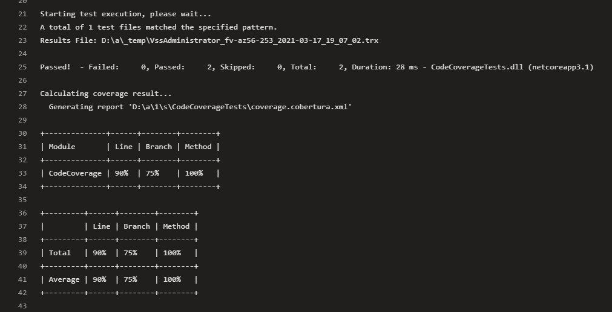
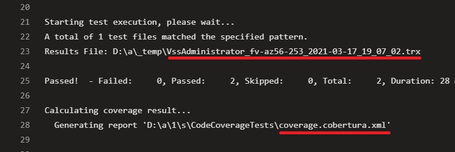
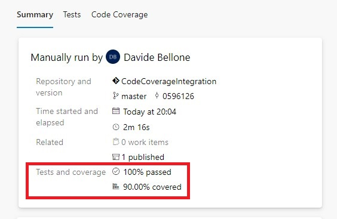
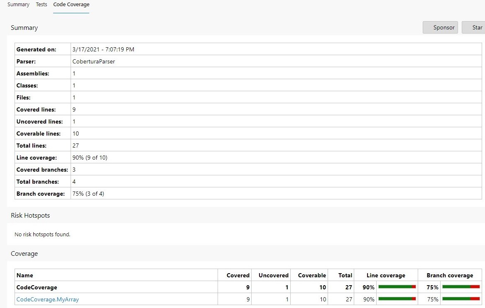
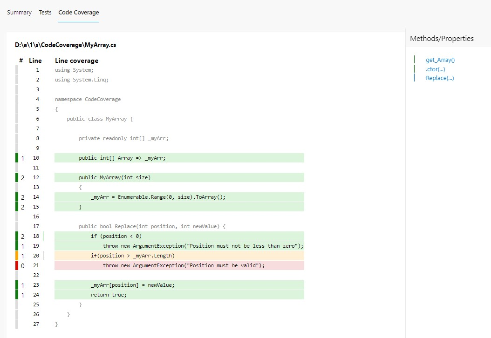
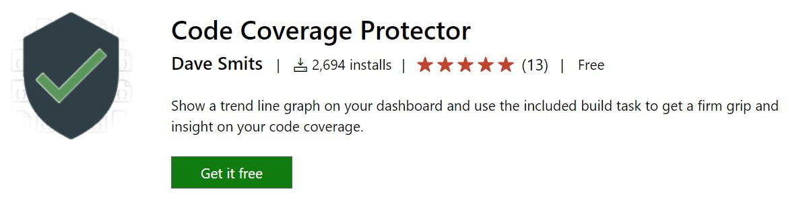
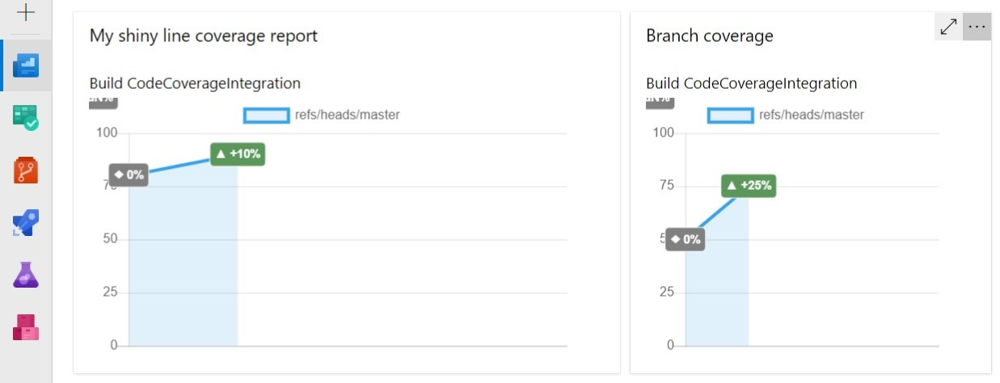

Code coverage is a good indicator of the health of your project: the more your project is covered by tests, the lesser are the probabilities that you have easy-to-find bugs in it.

__Even though 100% of code coverage is a good result, it is not enough: you have to check if your tests are meaningful and bring value to the project__; it really doesn't make any sense to cover each line of your production code with tests valid only for the happy path; you also have to cover the edge cases!

But, even if it's not enough, having an idea of the code coverage on your project is a good practice: it helps you understanding where you should write more tests and, eventually, help you removing some bugs.

In a previous article, we've seen how to use Coverlet and Cobertura to view the code coverage report on Visual Studio (of course, for .NET projects).

In this article, we're gonna see how to show that report on Azure DevOps: by using a specific command (or, even better, a set of flags) on your YAML pipeline definition, we are going to display that report for every build we run on Azure DevOps. This simple addition will help you see the status of a specific build and, if it's the case, update the code to add more tests.

Then, in the second part of this article, we're gonna see how to view the coverage history on your Azure DevOps dashboard, by using a plugin called _Code Coverage Protector_.

But first, let's start with the YAML pipelines!

## Coverlet - the NuGet package for code coverage

As already explained [in my previous article](./code-coverage-vs-2019-coverlet#coverlet---the-nuget-package-for-code-coverage "How to install Coverlet on .NET Test projects"), the very first thing to do to add code coverage calculation is to install a NuGet package called _Coverlet_. This package __must__ be installed in every test project in your Solution.

So, running a simple `dotnet add package coverlet.msbuild` on your test projects is enough!

## Create YAML tasks to add code coverage

Once we have Coverlet installed, it's time to add the code coverage evaluation to the CI pipeline.

We need to add two steps to our YAML file: one for collecting the code coverage on test projects, and one for actually publishing it.

### Run tests and collect code coverage results

Since we are working with .NET Core applications, we need to use a _DotNetCoreCLI@2_ task to run `dotnet test`. But we need to specify some attributes: in the _arguments_ field, add `/p:CollectCoverage=true` to tell the task to collect code coverage results, and `/p:CoverletOutputFormat=cobertura` to specify which kind of code coverage format we want to receive as output.

The task will have this form:

```yaml
- task: DotNetCoreCLI@2
  displayName: 'Run tests'
  inputs:
    command: 'test'
    projects: '**/*[Tt]est*/*.csproj'
    publishTestResults: true
    arguments: '--configuration $(buildConfiguration) /p:CollectCoverage=true /p:CoverletOutputFormat=cobertura'
```

You can see the code coverage preview directly in the log panel of the executing build. The ASCII table tells you the code coverage percentage for each module, specifying the lines, branches, and methods covered by tests for every module.




Another interesting thing to notice is that this task generates two files: a _trx_ file, that contains the test results info (which tests passed, which ones failed, and other info), and a _coverage.cobertura.xml_, that is the file we will use in the next step to publish the coverage results.



### Publish code coverage results

Now that we have the _coverage.cobertura.xml_ file, the last thing to do is to publish it.

Create a task of type _PublishCodeCoverageResults@1_, specify that the result format is Cobertura, and then specify the location of the file to be published.

```yml
- task: PublishCodeCoverageResults@1
  displayName: 'Publish code coverage results'
  inputs:
    codeCoverageTool: 'Cobertura'
    summaryFileLocation: '**/*coverage.cobertura.xml'
```

### Final result

Now that we know what are the tasks to add, we can write the most basic version of a build pipeline: 

```yaml
trigger:
- master

pool:
  vmImage: 'windows-latest'

variables:
  solution: '**/*.sln'
  buildPlatform: 'Any CPU'
  buildConfiguration: 'Release'

steps:
- task: DotNetCoreCLI@2
  displayName: 'Build'
  inputs:
    command: 'build'
- task: DotNetCoreCLI@2
  displayName: 'Run tests'
  inputs:
    command: 'test'
    projects: '**/*[Tt]est*/*.csproj'
    publishTestResults: true
    arguments: '--configuration $(buildConfiguration) /p:CollectCoverage=true /p:CoverletOutputFormat=cobertura'
- task: PublishCodeCoverageResults@1
  displayName: 'Publish code coverage results'
  inputs:
    codeCoverageTool: 'Cobertura'
    summaryFileLocation: '**/*coverage.cobertura.xml'

```

So, here, we simply build the solution, run the tests and publish both test and code coverage results.

Where can we see the results?

If we go to the build execution details, we can see the tests and coverage results under the _Tests and coverage_ section.



By clicking on the Code Coverage tab, we can jump to the full report, where we can see how many lines and branches we have covered.



And then, when we click on a class (in this case, `CodeCoverage.MyArray`), you can navigate to the class details to see which lines have been covered by tests.



## Code Coverage Protector: an Azure DevOps plugin

Now what? We should keep track of the code coverage percentage over time. But open every Build execution to see the progress is not a good idea, isn't it? We should find another way to see the progress.

A really useful plugin to manage this use case is _Code Coverage Protector_, developed by [Dave Smits](https://twitter.com/davesmits "Dave Smits on Twitter"): among other things, it allows you to display the status of code coverage directly on your Azure DevOps Dashboards.

To install it, head to the [plugin page on the marketplace](https://marketplace.visualstudio.com/items?itemName=davesmits.codecoverageprotector "Code Coverage Protector plugin") and click _get it free_. 



Once you have installed it, you can add one or more of its widgets to your project's Dashboard, define which Build pipeline it must refer to, select which metric must be taken into consideration (line, branch, class, and so on), and set up a few other options (like the size of the widget).



So, now, with just one look you can see the progress of your project.

## Wrapping up

In this article, we've seen how to publish code coverage reports for .NET applications on Azure DevOps. We've used Cobertura and Coverlet to generate the reports, some YAML configurations to show them in the related build panel, and Code Coverage Protector to show the progress in your Azure DevOps dashboard.

If you want to do one further step, you could use Code Coverage Protector as a build step to make your builds fail if the current Code Coverage percentage is less than the one from the previous builds.

Happy coding!
