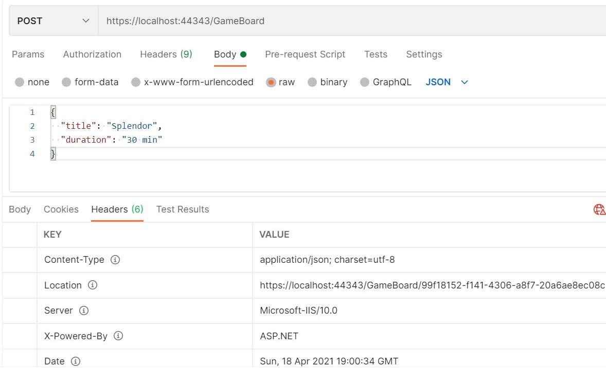
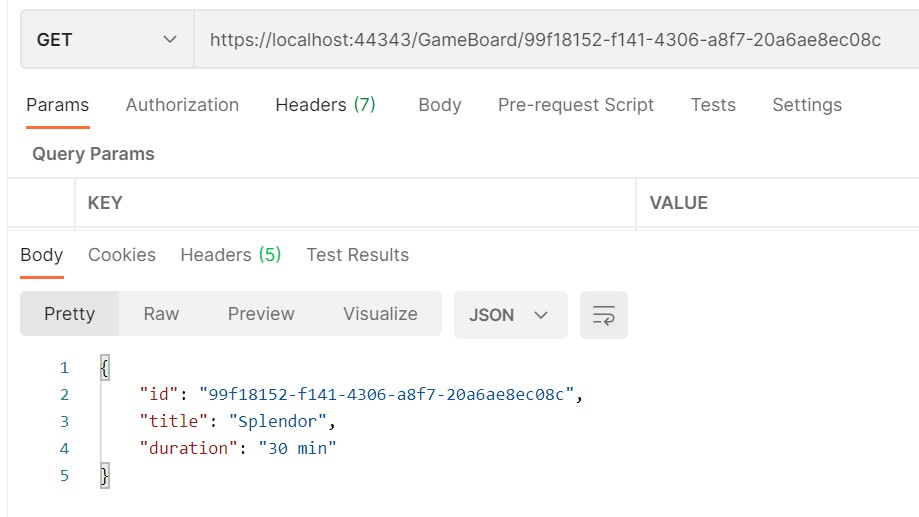
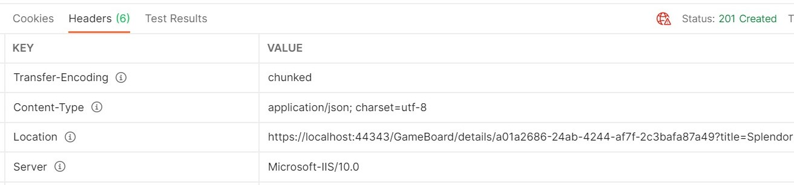

Even though many devs (including me!) often forget about it, REST is not a synonym of HTTP API: it is an architectural style based on the central idea of **resource**.

So, when you are seeing an HTTP request like `GET http://api.example.com/games/123` you may correctly think that you are getting the details of the _game_ with ID _123_. You are asking for the _resource with ID 123_.

But what happens when you create a new resource? You perform a POST, insert a new item... and then? How can you know the ID of the newly created resource - if the ID is created automatically - and use it to access the details of the new item?

## Get item detail

For .NET APIs, all the endpoints are exposed inside a Controller, which is a class that derives from `ControllerBase`:

```cs
[ApiController]
[Route("[controller]")]
public class GameBoardController : ControllerBase
{
    // all the actions here!
}
```

So, to define a GET endpoint, we have to create an Action and specify the HTTP verb associated by using `[HttpGet]`.

```cs
[HttpGet]
[Route("{id}")]
 public IActionResult GetDetail(Guid id)
{
    var game = Games.FirstOrDefault(_ => _.Id.Equals(id));
    if (game is not null)
    {
        return Ok(game);
    }
    else
    {
        return NotFound();
    }
}
```

This endpoint is pretty straightforward: if the game with the specified ID exists, the method returns it; otherwise, the method returns a `NotFoundResult` object that corresponds to a 404 HTTP Status Code.

Notice the `[Route("{id}")]` attribute: it means that the ASP.NET engine when parsing the incoming HTTP requests, searches for an Action with the required HTTP method and a route that matches the required path. Then, when it finds the Action, it maps the route parameters (`{id}`) to the parameters of the C# method (`Guid id`).

**Hey! in this section I inserted not-so-correct info: I mean, it is generally right, but not precise. Can you spot it? Drop a comment😉**

## What to do when POST-ing a resource?

Of course, you also need to create new resources: that's where the HTTP POST verb comes in handy.

Suppose a simple data flow: you create a new object, you insert it in the database, and it is the database itself that assigns to the object an ID.

Then, you need to use the newly created object. How to proceed?

You could return the ID in the HTTP Response Body. But we are using a POST verb, so you should not return data - POST is meant to insert data, not return values.

Otherwise, you can perform a query to find an item with the exact fields you've just inserted. For example

1. `POST /item {title:"foo", description: "bar"}`
2. `GET /items?title=foo&description=bar`

Not a good idea to use those ways, uh?

We have a third possibility: return the resource location in the HTTP Response Header.


How to return it? We have 2 ways: returning a `CreatedAtActionResult` or a `CreatedAtRouteResult`.

## Using CreatedAtAction

With `CreatedAtAction` you can specify the name of the Action (or, better, the name of the method that implements that action) as a parameter.

_ps: for the sake of simplicity, the new ID is generated directly into the method - no DBs in sight!_

```cs
[HttpPost]
public IActionResult Create(GameBoard game)
{
    var newGameId = Guid.NewGuid();
    var gameBoard = new GameBoardEntity
    {
        Title = game.Title,
        Duration = game.Duration,
        Id = newGameId
    };

    Games.Add(gameBoard);

    return CreatedAtAction(nameof(GetDetail), new { id = newGameId }, game);
}
```

What are the second and third parameters?

We can see a `new { id = newGameId }` that indicates the route parameters defined in the GET endpoint (remember the `[Route("{id}")]` attribute? ) and assigns to each parameter a value.

The last parameter is the newly created item - or any object you want to return in that field.

## Using CreatedAtRoute

Similar to the previous method we have `CreatedAtRoute`. As you may guess by the name, it does not refer to a specific Action by using the name, but it refers to the Route.

```cs
[HttpPost]
public IActionResult Create(GameBoard game)
{
    var newGameId = Guid.NewGuid();
    var gameBoard = new GameBoardEntity
    {
        Title = game.Title,
        Duration = game.Duration,
        Id = newGameId
    };

    Games.Add(gameBoard);
    return CreatedAtRoute("EndpointName", new { id = newGameId }, game);
}
```

To give a Route a name, we need to add a `Name` attribute to it:

```diff
[HttpGet]
- [Route("{id}")]
+ [Route("{id}", Name = "EndpointName")]
public IActionResult GetDetail(Guid id)
```

That's it! Easy Peasy!



Needless to say, when we perform a GET at the URL specified in the Location attribute, we get the details of the item we've just created.



## What about Routes and Query Strings?

We can use the same technique to get the details of an item by retrieving it using a query string parameter instead of a route parameter:

```diff
[HttpGet]
- [Route("{id}")]
- public IActionResult GetDetail(Guid id)
+ [Route("details")]
+ public IActionResult GetDetail([FromQuery] Guid id)
{
```

This means that the corresponding path is `/GameBoard/details?id=123`.

And, without modifying the `Create` methods we've seen before, we can let ASP.NET resolve the routing and create for us the URL:


And, surprise surprise, there's more!

We can mix route parameters with query string parameters, and the Location attribute will hold the right value for the path.

Let's update the GetDetail method: now the resource ID is included in the route, and a new parameter - title - is passed in query string to filter for the name of the game:

```cs
[HttpGet]
[Route("details/{id}")]
public IActionResult GetDetail([FromRoute] Guid id, [FromQuery] string title)
{
    var game = Games.FirstOrDefault(_ =>
        _.Id.Equals(id) && _.Title.Equals(title, StringComparison.OrdinalIgnoreCase)
    );

```

This means that we need to pass a new field in the object passed to the `CreatedAtRoute` and `CreatedAtAction` methods:

```diff
- return CreatedAtRoute("EndpointName", new { id = newGameId }, game);
+ return CreatedAtRoute("EndpointName", new { id = newGameId, title = game.Title }, game);
```

see, the `title` field?

When creating a new item, we can see the correct path in the Response Header:



## Wrapping up

We've seen how to manage the creation of an item when developing a REST API: depending on the way you define routes, you can use `CreatedAtRoute` or `CreatedAtAction`.

Remember that REST APIs are based on the idea of manipulation of resources: you should remember that every HTTP Verb has its meaning, and you should always consider it when developing an endpoint. Is it a GET? We should not change the status of a resource. Is it a POST? We should not return the resource itself - but we can return a _reference_ to it.

Happy coding!
