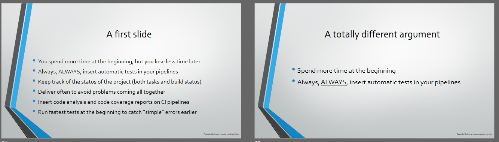

I love to deliver tech talks: they help me improve both my technical and communication skills.

_Hey! If you're starting doing tech talks, don't miss my article [Thoughts after my very first public speech](https://www.code4it.dev/blog/thoughts-after-my-first-public-speech "my article Thoughts after my very first public speech") where I explained what I did right and what I did wrong at my very first tech talk. Learn from my errors, and avoid them!💪_

On one hand, teaching stuff requires technical preparations: you need to know what you're talking about, and you need to know it pretty well. Even more, you need to know some advanced stuff to give the audience something they will remember - if everything is obvious, what will they remember from your talk?

On the other hand, tech talks require good communication skills: your job is to deliver a message to your audience, and you can do it only if your intent is clear and you avoid talking of useless (or misleading) stuff.

But, in the end, only having good content is not enough: you need to shape the talk in a way that stimulates the attention of the public and does not bore them.

**note: I still have a lot of room for improvement, so I still have to work on myself to improve my talks!**

## 1- Tell what are the topics covered by your talk

Why should someone attend your talk?

This is a simple question, but it must be clear to you _way before_ submitting your talk to CFPs. Usually, the best reason to attend is because of the content of the conference (unless you attend a conference only for the free pizza and swags!).

You should always express what is the topic of your talk.

Where, and when?

1. **In the title**: the title should express what you're going to say. «Azure DevOps: an intro to build and release pipelines» is better than «Let's work with Azure DevOps!». Yes, it's less fancy, but you are making the scope clear (build and release pipelines), the tool (Azure DevOps), and the difficulty of your talk (it's an intro, not a talk that targets experts)
2. **In the description of your talk**: when submitting CFP, when sharing it on social media, and everywhere else you can add some text to describe your talk, you should add some more details. For instance, «In this session, we're gonna see how to build and release .NET Core projects with Azure DevOps pipelines, how to use PR builds, how to manage variable substitution with Variable Groups...». This will help the reader decide whether or not attending to your session.
3. **At the beginning of your talk**: this is for people who forgot to read the session description. Repeat the points you're gonna cover at the beginning of your talk, like right after the title and the slide about who are you. In this way, attendees can leave if they find out that the topic is not what they were expecting from the title. They don't lose time on anything not interesting for them, and you don't lose your focus watching at their bored faces.

## 2- Divide the talks into smaller blocks

Think of your own experience: are you able to keep the focus on a 1-hour long talk? Or do you get distracted after 10 minutes, start wandering with the mind, and so on?

Well, that's normal. Generally, people have a short attention span. This means that you cannot talk for 60 minutes about the same topic: your audience will get bored soon.

So, you should split your talk into several smaller blocks. A good idea is to separate the sub-topics into 5 or 10 minutes slots, to help people understanding the precise topic of a block and, in case, pay less attention to that specific block (maybe because that's a topic they already know, so not focusing 100% is fine).

## 3- Wake up the audience with simple questions

Sometimes the easiest way to regain the attention of the attendees is to ask them some simple questions: «Can you see my screen?», «Does any of you already used this tool?».

It's easy to reply to these questions, even without thinking too much about the answer.

This kind of questions will wake up the audience and let them focus on what you're saying for a bit more.

Needless to say, avoid asking those questions too many times, and don't repeat always the same question.

## 4- Choose the right slide layout

Many monitors and screens are now in 16:9. So remember to adapt the slide layout to that format.

In the image below, we can see how the slide layout impacts the overall look: slides with a 4:3 layout are too small for current devices, and they just look... ugly!

Slides in 16:9 feel more natural for many screen layouts.

It's a simple trick to remember, but it may have a great impact on your delivery.

## 5- Don't move hands and body if it's not necessary

Moving too much your body drives the attention away from the content of your talk. Avoid fidgeting, moving too much your hands and head.

Remember that every movement of your body should have a meaning. Use your movements to drive attention to a specific topic, or to imitate and explain some details.
For instance, use your hands to simulate how some modules communicate with each other.

## 6- Install a tool for performing live zoom

When preparing your presentation, you are used to thinking of how _you_ see the screen: you have your monitor size and resolution, and you can adjust your content based on that info.

But you don't know how the audience will see your screen.

If you are doing an in-person talk, pay attention to the screens the audience sees: is the resolution fine? Do you have to increase the font size? Is it fine both for folks on the front and the last seats?

On the contrary, when doing an online talk, you don't know the device your audience will use: PC, tablet, smart tv, smartphone?

This means that you can't rely on the mouse cursor to point at a specific part of your monitor (eg: some text, a button, a menu item) as your audience may not see it.

A good idea is to use some kind of tools like [ZoomIt](https://docs.microsoft.com/it-it/sysinternals/downloads/zoomit "Zoomit link and documentation"): it allows you to zoom in a part of your screen and to draw lines in a virtual layer.

So, instead of saying «now click this button - hey, can you see my cursor?», use Zoomit to zoom on that button or, even better, to draw a rectangle or an arrow to highlight it.

## 7- Pin presentation folder on Resource Explorer

As we've already discussed in my article [10 underestimated tasks to do before your next virtual presentation](https://www.code4it.dev/blog/10-tasks-before-virtual-talk#1--hide-desktop-icons "link to my article about underestimated tasks to do before your next virtual presentation"), you should hide all the desktop icons - they tend to distract the audience. This also implies that even your folder you use to store the presentation assets has to be hidden.

_But now... Damn, you've just closed the folder with all the conference assets! Now you have to find it again and navigate through your personal folders._

If you use Windows, luckily you can simply right-click on your folder, click _Pin to Quick access_

and have it displayed on the right bar of any folder you open.

In this way, you can easily reach any folder with just one click.

So your "main" folder will not be visible on your desktop, but you can still open it via the Quick Access panel.

## 8- Stress when a topic is important

You have created the presentation. You know why you built it, and what are the important stuff. Does your audience know what is important to remember?

If you are talking for one hour, you are giving the public **a lot** of information. Some are trivia, some are niche details, some are the key point of a topic.

So, make it clear what is important to remember and what is just a "good-to-know".

For instance, when talking about clean code, stress why it is important to follow a certain rule if it can be a game-changer. «Use consistent names when classes have similar meaning» and «Choose whether using tabs or spaces, and use them for all your files» are both valid tips, but the first one has a different _weight_ compared to the latter one.

Again, spend more time on the important stuff, and tell explicitly the audience that that part is important (and why).

## 9- Use the slide space in the best way possible

Let's talk about the size of the slides' font: keep it consistent or adapt it to the text and space in the slide?

I thought that keeping it consistent was a good idea - somehow it hurts my brain seeing different sizes in different slides.

But then I realized that there are some exceptions: for example, when a slide contains only a few words or a few points in a bullet list. In that case, you should occupy the space in a better way, to avoid all the emptiness around your text.

Here we have 2 slides with the same font:

The first one is fine, the second one is too empty.

Let's adjust the font of the second slide:

It's a bit better. Not excellent, but at least the audience can read it. The text is a bit bigger, but you'll hardly notice it.

## 10- Turn off all the notifications

It's simple: if you are sharing your screen, you don't want your audience to see those weird messages you receive on Discord or the spam emails on Outlook.

So, turn off all the notifications. Of course, unless you are demonstrating how to integrate your stuff with platforms like Slack, Teams et cetera.

## 11- Use the slides as a reference, not as a teleprompter

Avoid full sentences in your slides. Nobody's gonna read them - even more, if the audience is not paying attention!

So, prefer putting just a few words instead of full, long sentences: you should not read your slides as if they were a teleprompter, and you should help your audience getting back on track if they lost their focus.

Two bullet points like "Keep track of your progress" and "Fix weakness" are better than a single phrase like "Remember to use some tool to keep track of the progress of your project, so that you can find the weak points and fix them".

-- of course, unless it is a quote: you should write the full text if it is important.

## 12- "End" is the word

> We're nearly at the end of this session.

A simple yet powerful statement that can wake up your audience.

When you've lost your focus, you get triggered by some words, like _end_. You unconsciously remember that you are at that conference for some reason, and you have to focus to get the most from the last minutes of the conference.

So, try triggering the subconscious of your audience with some words like _ending_.

## 13- Recap what you've explained

Finally, you're at the end of your talk.

What should the audience remember from it?

Spend some time to recap what you've seen, what are the key points of your conference, and what you'd like the others to remember.

It is a good way to help the audience focus again and thinking of questions to bring to your attention.

## Wrapping up

In this article, I've summarized some of the things I've worked on to improve my tech talks.

There is still a lot to do, and a lot to learn. But I hope that those simple tricks will help other newbies like me to improve their talks.

If you are interesting on learning from a great speaker, you should definitely watch [Scott Hanselman's "The Art of Speaking"](https://www.pluralsight.com/courses/hanselman-speaking "Scott Hanselman's course on Pluralsight") course on Pluralsight.

Do you have any other resources to share? The comment section is here for you!
