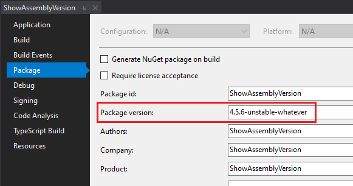
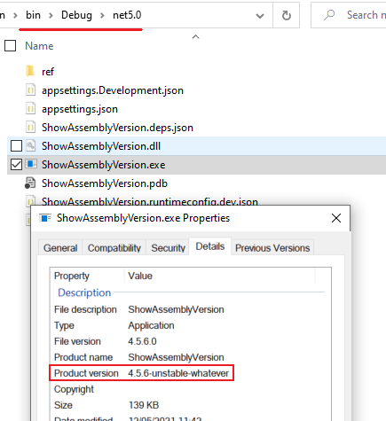
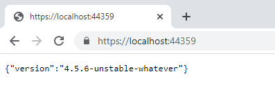

Sometimes it can be useful to show the version of the running Assembly in one .NET Core API endpoint: for example, when you want to know which version of your code is running in an environment, or to expose a simple endpoint that acts as a "minimal" health check.

In this article, we're going to see how to retrieve the assembly version at runtime using C#, then we will expose it under the root endpoint of a .NET Core API without creating an API Controller, and lastly we'll see how to set the Assembly version with Visual Studio.

## How to get Assembly version

To get the Assembly version, everything we need is this snippet:

```cs
Assembly assembly = Assembly.GetEntryAssembly();
AssemblyInformationalVersionAttribute versionAttribute = assembly.GetCustomAttribute<AssemblyInformationalVersionAttribute>();
string assemblyVersion = versionAttribute.InformationalVersion;
```

Let's break it down!

The first step is to **get the info about the running assembly**:

```cs
Assembly assembly = Assembly.GetEntryAssembly();
```

The `Assembly` class is part of the `System.Reflection` namespace, so you have to declare the corresponding `using` statement.

The `AssemblyInformationalVersionAttribute` attribute comes from the same namespace, and contains some info for the assembly manifest. You can get that info with the second line of the snippet:

```cs
AssemblyInformationalVersionAttribute versionAttribute = assembly.GetCustomAttribute<AssemblyInformationalVersionAttribute>();
```

Lastly, we need the string that represents the assembly version:

```cs
string assemblyVersion = versionAttribute.InformationalVersion;
```

If you want to read more about Assembly versioning in .NET, just [head to the official documentation](https://docs.microsoft.com/en-us/dotnet/standard/assembly/versioning "Assemby versioning documentation on Microsoft Docs").

## How to expose an endpoint with Endpoint Routing

Next, we need to expose that value using .NET Core API.

Since we're exposing only that value, we might not want to create a new Controller with a single Action: in this case, **endpoint routing** is the best choice!

In the _Startup.cs_ file, under the `Configure` method, we can define how the HTTP request pipeline is configured.

By default, for ASP.NET Core APIs, you'll see a section that allows the engine to map the Controllers to the endpoints:

```cs
app.UseEndpoints(endpoints =>
{
    endpoints.MapControllers();
});
```

In this section, we can configure some other endpoints.

The easiest way is to _map_ a single path to an endpoint and specify the returned content. We can do it by using the `MapGet` method, which accepts a string for the _path pattern_ and an async Delegate for the execution:

```cs
app.UseEndpoints(endpoints =>
{
    endpoints.MapGet("/", async context =>
    {
        await context.Response.WriteAsync("Hi there!!");
    });

    endpoints.MapControllers();
});
```

In this way, we will receive the message _Hi there_ every time we call the root of our API (because of the first parameter, `/`), and it happens **only when we use the GET HTTP Verb**, because of the `MapGet` method.

## Putting all together

Now that we have all in place, we can join the two parts and return the Assembly version on the root of our API.


You could just return the string as it is returned from the `versionAttribute.InformationalVersion` property we've seen before. Or you could wrap it into an object.

If you don't want to specify a class for it, you can use an `ExpandoObject` instance and create new properties _on the fly_. Then, you have to serialize it into a string, and return it in the HTTP Response:

```cs
endpoints.MapGet("/", async context =>
{
    // get assembly version
    Assembly assembly = Assembly.GetEntryAssembly();
    AssemblyInformationalVersionAttribute versionAttribute = assembly.GetCustomAttribute<AssemblyInformationalVersionAttribute>();
    string assemblyVersion = versionAttribute.InformationalVersion;

    // create the dynamic object
    dynamic result = new ExpandoObject();
    result.version = assemblyVersion;

    // serialize the object
    string versionAsText = JsonSerializer.Serialize(result);

    // return it as a string
    await context.Response.WriteAsync(versionAsText);
});
```

That's it!

Of course, if you want only the version as a string without the dynamic object, you can simplify the `MapGet` method in this way:

```cs
endpoints.MapGet("/", async context =>
{
    var version = Assembly.GetEntryAssembly().GetCustomAttribute<AssemblyInformationalVersionAttribute>().InformationalVersion;
    await context.Response.WriteAsync(version);
});
```

But, for this example, let's stay with the full object.

## Let's try it: update Assembly version and retrieve it from API

After tidying up the code, the `UseEndpoints` section will have this form:

```cs
app.UseEndpoints(endpoints =>
{
    endpoints.MapGet("/", async context =>
    {
        dynamic result = new ExpandoObject();
        result.version = Assembly.GetEntryAssembly().GetCustomAttribute<AssemblyInformationalVersionAttribute>().InformationalVersion;
        string versionAsText = JsonSerializer.Serialize(result);
        await context.Response.WriteAsync(versionAsText);
    });

    endpoints.MapControllers();
});
```

or, if you want to clean up your code, you could simplify it like this:

```cs
app.UseEndpoints(endpoints =>
{
    endpoints.WithAssemblyVersionOnRoot();
    endpoints.MapControllers();
});
```

`WithAssemblyVersionOnRoot` is an **extension method** I created to wrap that logic and make the `UseEndpoints` method cleaner. If you want to learn how to create extension methods with C#, and what are some gotchas, head to this [article](./csharp-extension-methods "How you can create extension methods in C#")!

To see the result, open Visual Studio, select the API project and click _alt + Enter_ to navigate to the Project properties. Here, under the _Package_ tag, define the version in the _Package version_ section.



In this screen, you can set the value of the package that will be built.

To double-check that the version is correct, head to the _bin_ folder and locate the _exe_ related to your project: _right-click_ on it, go to _properties_ and to the _details_ tab. Here you can see the details of that exe:



Noticed the _Product version_? That's exactly what we've set up on Visual Studio.

So, now it's time to run the application.

Get back to Visual Studio, run the application, and navigate to the root of the API.

Finally, we can enjoy the result!



Quite simple, isn't it?

## Wrapping up

In this article, we've seen how to expose on a specific route the version of the assembly running at a specified URL.

This is useful to help you understand which version is currently running in an environment without accessing the CD pipelines to see which version has been deployed.

Also, **you can use this information as a kind of health check**, since the data exposed are static and do not depend on any input or database status: the simplest match for getting info about the readiness of your application.

What other info would you add to the exposed object? Let me know in the comment section 👇

Happy coding!
