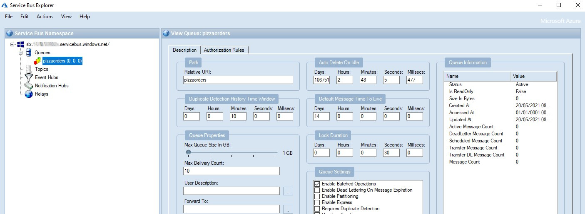

__Azure Service Bus is a _message broker_ that allows you to implement queues and pub-subs topics__. It is incredibly common to use queues to manage the communication between microservices: it is a simple way to send messages between applications without bind them tightly.

In this introduction, we're going to learn the basics of Azure Service Bus: what it is, how to create a Bus and a Queue, how to send and receive messages on the Bus with C#, and more.

This is the first part of a series about Azure Service Bus. We will see:

1. An introduction to Azure Service Bus with C#
2. Queues vs Topics
3. Error handling

But, for now, let's start from the basics.

## What is Azure Service Bus?

Azure Service Bus is a complex structure that allows you to send content through a __queue__. 

As you may already know, a queue is... well, a queue! __First in, first out__!

This means that the messages will be delivered in the same order as they were sent.


_Why using a queue is becoming more and more common, for scalable applications?_
Let's consider this use case: you are developing a __microservices-based application__. With the common approach, communication occurs via HTTP: this means that 

* if the receiver is unreachable, the HTTP message is lost (unless you add some kind of retry policy)
* if you have to scale out, you will need to add a traffic manager/load balancer to manage which instance must process the HTTP Request

On the contrary, by using a queue,

* if the receiver is down, the message stays in the queue until the receiver becomes available again
* if you have to scale out, nothing changes, because the first instance that receives the message removes it from the queue, so you will not have multiple receivers that process the same message.

## How to create an Azure Service Bus instance

It is really simple to create a new Service Bus on Azure!

Just open [Portal Azure](https://portal.azure.com/ "Portal Azure"), head to the _Service Bus_ section, and start creating a new resource.

You will be prompted to choose which subscription will be linked to this new resource, and what will be the name of that resource.

Lastly, you will have to choose which will be the pricing tier to apply.


__There are 3 pricing tiers available__:

* _Basic_: its price depends on how many messages you send. At the moment of writing, with Basic tier you pay 0.05$ for every million messages sent.
* _Standard_: Similar to the Basic tier, but allows you to have both Queues and Topics. You'll see the difference between Queue and Topics in the next article
* _Premium_: zone-redundant, with both Queues and Topics; of course, quite expensive

So now, you can create the resource and see it directly on the browser.

## Policies and Connection Strings

The first thing to do to connect to the Azure Service Bus is to __create a Policy__ that allows you to perform specific operations on the Bus.

By default, under the _Shared access policies_ tab you'll see a policy called _RootManageSharedAccessKey_: this is the default Policy that allows you to send and receive messages on the Bus.

To get the connection string, click on that Policy and head to _Primary Connection String_:


A connection string for the Service Bus looks like this:

```
Endpoint=sb://c4it-testbus.servicebus.windows.net/;SharedAccessKeyName=RootManageSharedAccessKey;SharedAccessKey=my-secret-key
```

Let's break it down: 

The first part represents the __Host__ name: this is the value you've set in the creation wizard, and the one you can see on the Overview tab:


Then, you'll see the __SharedAccessKeyName__ field, which contains the name of the policy to use (in this case, _RootManageSharedAccessKey_).

Then, we have the __secret Key__. If you select the Primary Connection String you will use the Primary Key; same if you use the Secondary Connection String.

Keep that connection string handy, we're gonna use it in a moment!

## Adding a queue

Now that we have created the general infrastructure, we need to create a Queue. This is the core of the bus - __all the messages pass through a queue__.

To create one, on the Azure site head to _Entities > Queues_ and create a new queue.

You will be prompted to add different values, but for now, we are only interested in defining its name. 

Write the name of the queue and click _Create_.


Once you've created your queue (for this example, I've named it _PizzaOrders_), you'll be able to see it in the Queues list and see its details.

You can even define one or more policies for that specific queue just as we did before: you'll be able to generate a connection string similar to the one we've already analyzed, with the only difference that, here, you will see a new field in the connection string, __EntityPath__, whose value is the name of the related queue.

So, a full connection string will have this form:


## ServiceBusExplorer - and OSS UI for accessing Azure Service Bus

How can you see what happens inside the Service Bus?

You have two options: use the Service Bus Explorer tool directly on Azure:


Or use an external tool.

I honestly prefer to use __ServiceBusExplorer__, a project that you can [download from Chocolatey](https://community.chocolatey.org/packages/ServiceBusExplorer): this open source tool allows you to see what is happening inside Azure Service Bus: just insert your connection string and... voilá! You're ready to go!



With this tool, you can see the status of all the queues, as well as send, read, and delete messages.

__If you want to save a connection, you have to open that tool as Administrator__, otherwise, you won't have enough rights to save it.

## How to send and receive messages with .NET 5

To test it, we're gonna create a simple project that manages pizza orders.
A .NET 5 API application receives a list of pizzas to be ordered, then it creates a new message for every pizza received and sends them into the _PizzaOrders_ queue.

With another application, we're gonna receive the order of every single pizza by reading it from the same queue.

For both applications, you'll need to install the _Azure.Messaging.ServiceBus_ NuGet package.

### How to send messages on Azure Service Bus 

The API application that receives pizza orders from the clients is very simple: just a controller with a single action.

```cs
[ApiController]
[Route("[controller]")]
public class PizzaOrderController : ControllerBase
{
    private string ConnectionString = ""; //hidden

    private string QueueName = "PizzaOrders";

    [HttpPost]
    public async Task<IActionResult> CreateOrder(IEnumerable<PizzaOrder> orders)
    {
        await ProcessOrder(orders);
        return Ok();
    }
}
```

Nothing fancy, just receive a list of Pizza Orders objects with this shape:

```cs
public class PizzaOrder
{
    public string Name { get; set; }
    public string[] Toppings { get; set; }
}
```

and process those with a valid quantity.

As you can imagine, the core of the application is the `ProcessOrder` method.

```cs
private async Task ProcessOrder(IEnumerable<PizzaOrder> orders)
{
    await using (ServiceBusClient client = new ServiceBusClient(ConnectionString))
    {
        ServiceBusSender sender = client.CreateSender(QueueName);

        foreach (var order in orders)
        {
            string jsonEntity = JsonSerializer.Serialize(order);
            ServiceBusMessage serializedContents = new ServiceBusMessage(jsonEntity);
            await sender.SendMessageAsync(serializedContents);
        }
    }
}
```

Let's break it down.

__We need to create a client to connect to the Service Bus__ by using the specified Connection string:

```cs
await using (ServiceBusClient client = new ServiceBusClient(ConnectionString))
{
}
```

This client must be disposed after its use.

Then, __we need to create a `ServiceBusSender` object__ whose sole role is to send messages to a specific queue:

```cs
ServiceBusSender sender = client.CreateSender(QueueName);
```

Lastly, for every pizza order, we convert the object into a string and we send it as a message in the queue.

```cs
// Serialize as JSON string
string jsonEntity = JsonSerializer.Serialize(order);

/// Create Bus Message
ServiceBusMessage serializedContents = new ServiceBusMessage(jsonEntity);

// Send the message on the Bus
await sender.SendMessageAsync(serializedContents);
```

> Hey! Never used `async`, `await`, and `Task`? If you want a short (but quite thorough) introduction to asynchronous programming, [head to this article](./asynchronous-programming-in-csharp "Getting started with Asyncrhonous Programming in C#")!

And that's it! Now the message is available on the PizzaOrders queue and can be received by any client subscribed to it.


Here I serialized the PizzaOrder into a JSON string. This is not mandatory: __you can send messages in whichever format you want: JSON, XML, plain text, BinaryData__... It's up to you!

Also, you can add lots of properties to each message. To read the full list, head to the [ServiceBusMessage Class documentation](https://docs.microsoft.com/en-us/dotnet/api/azure.messaging.servicebus.servicebusmessage?view=azure-dotnet). 

### How to receive messages on Azure Service Bus 

Once we have the messages on the Bus, we need to read them.

To demonstrate how to read messages from a queue using C#, I have created a simple Console App, named _PizzaChef_. The first thing to do, of course, is to install the _Azure.Messaging.ServiceBus_ NuGet package.

As usual, we need a `ServiceBusClient` object to access the resources on Azure Service Bus. Just as we did before, create a new Client in this way:

```cs
ServiceBusClient serviceBusClient = new ServiceBusClient(ConnectionString);
```

This time, instead of using a `ServiceBusSender`, we need to create a `ServiceBusProcessor` object which, of course, will process all the messages coming from the Queue. Since receiving a message on the queue is an asynchronous operation, we need to register an Event Handler both for when we receive the message and when we receive an error:

```cs
ServiceBusProcessor   _ordersProcessor = serviceBusClient.CreateProcessor(QueueName); 
_ordersProcessor.ProcessMessageAsync += PizzaItemMessageHandler;
_ordersProcessor.ProcessErrorAsync += PizzaItemErrorHandler;
```

For now, let's add an empty implementation of both handlers.

```cs
private Task PizzaItemErrorHandler(ProcessErrorEventArgs arg)
{
    
}

private async Task PizzaItemMessageHandler(ProcessMessageEventArgs args)
{
  
}
```

_Note:_ in this article I'll implement only the `PizzaItemMessageHandler` method. __The `PizzaItemErrorHandler`, however, must be at least declared, even if empty__: you will get an exception if you forget about it. Anyways, we'll implement it in the last article of this series, the one about error handling.


To read the content received in the `PizzaItemMessageHandler` method, you must simply access the `Message.Body` property of the `args` parameter:

```cs
string body = args.Message.Body.ToString();
```

And, from here, you can do whatever you want with the body of the message. For instance, deserialize it into an object. Of course, you can reuse the `PizzaOrder` class we used before, or create a new class with more properties but, still, compatible with the content of the message.

```cs
public class ProcessedPizzaOrder
{
    public string Name { get; set; }
    public string[] Toppings { get; set; }

    public override string ToString()
    {
        if (Toppings?.Any() == true)
            return $"Pizza {Name} with some toppings: {string.Join(',', Toppings)}";
        else
            return $"Pizza {Name} without toppings";
    }
}
```

Lastly, we need to _mark the message as complete_.

```cs
await args.CompleteMessageAsync(args.Message);
```

Now we can see the full example of the `PizzaItemMessageHandler` implementation:

```cs
private async Task PizzaItemMessageHandler(ProcessMessageEventArgs args)
{
    try
    {
        string body = args.Message.Body.ToString();
        Console.WriteLine("Received " + body);

        var processedPizza = JsonSerializer.Deserialize<ProcessedPizzaOrder>(body);

        Console.WriteLine($"Processing {processedPizza}");

        // complete the message. messages is deleted from the queue.
        await args.CompleteMessageAsync(args.Message);
    }
    catch (System.Exception ex)
    {
        // handle exception
    }
}
```

_Does it work? NO._

We forgot to start processing the incoming messages. It's simple: in the Main method, right after the declaration of the `ServiceBusProcessor` object, we need to call `StartProcessingAsync` to start processing and, similarly, `StartProcessingAsync` to end the processing.

Here's the full example of the Main method: pay attention to the calls to Start and Stop processing.

```cs
private static async Task Main(string[] args)
{
    ServiceBusProcessor _ordersProcessor = null;
    try
    {
        ServiceBusClient serviceBusClient = new ServiceBusClient(ConnectionString);

        _ordersProcessor = serviceBusClient.CreateProcessor(QueueName); //SPIEGA
        _ordersProcessor.ProcessMessageAsync += PizzaItemMessageHandler;
        _ordersProcessor.ProcessErrorAsync += PizzaItemErrorHandler;
        await _ordersProcessor.StartProcessingAsync();

        Console.WriteLine("Waiting for pizza orders");
        Console.ReadKey();
    }
    catch (Exception)
    {
        throw;
    }
    finally
    {
        if (_ordersProcessor != null)
            await _ordersProcessor.StopProcessingAsync();
    }
}
```

While the call to `StartProcessingAsync` is mandatory (otherwise, how would you receive messages?), the call to `StopProcessingAsync`, in a console application, can be skipped, since we are destroying the application. _At least, I think so_. I still haven't found anything that says whether to call or skip it. If you know anything, please contact me on Twitter or, even better, here in the comments section - so that we can let the conversation going.

## Wrapping up

This is part of what I've learned from my first approach with Azure Service Bus, and the use of Queues in microservice architectures.

Is there anything else I should say? Have you ever used queues in your applications? As usual, feel free to drop a comment in the section below, or to contact me on Twitter.

In the next article, we're gonna explore another topic about Azure Service Bus, called... Topic! We will learn how to use them and what is the difference between a Queue and a Topic.

But, for now, happy coding!
