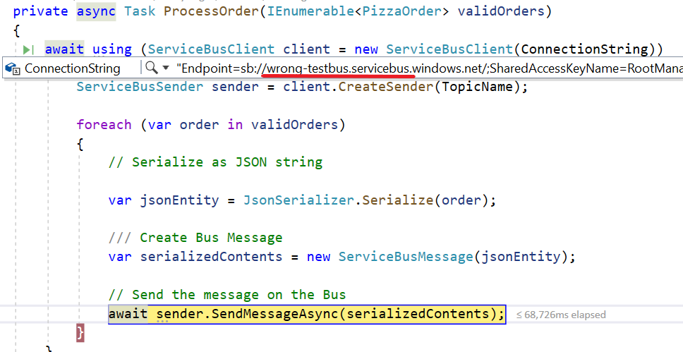
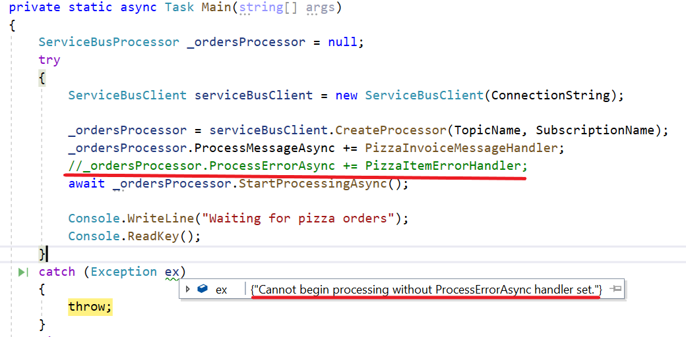
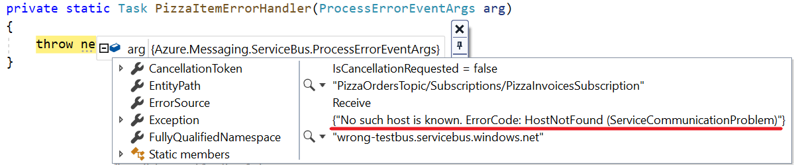
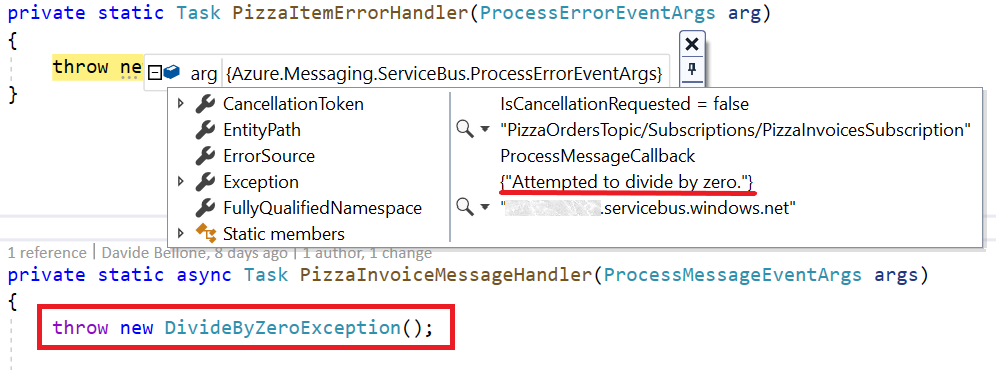
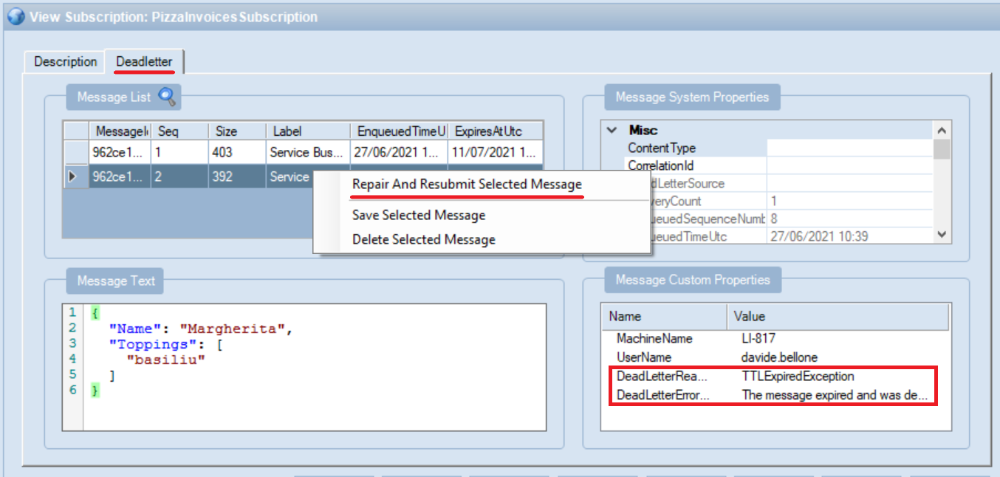

In this article, we are gonna see which kind of errors you may get on Azure Service Bus and how to fix them. We will look at simpler errors, the ones you get if configurations on your code are wrong, or you've not declared the modules properly; then we will have a quick look at _Dead Letters_ and what they represent.

This is the last part of the series about Azure Service Bus. In the previous parts, we've seen

1. [Introduction to Azure Service Bus](./azure-service-bus-introduction "Introduction to Azure Service Bus")
2. [Queues vs Topics](./azure-service-bus-queue-vs-topic "Azure Service Bus: Queues vs Topics")
3. Error handling

For this article, we're going to introduce some errors in the code we used in the previous examples.

Just to recap the context, our system receives orders for some pizzas via HTTP APIs, processes them by putting some messages on a Topic on Azure Service Bus. Then, a different application that is listening for notifications on the Topic, reads the message and performs some dummy operations.

## Common exceptions with .NET SDK

To introduce the exceptions, we'd better keep at hand the code we used in the previous examples.

Let's recall that a connection string has a form like this:

```cs
string ConnectionString = "Endpoint=sb://<myHost>.servicebus.windows.net/;SharedAccessKeyName=<myPolicy>;SharedAccessKey=<myKey>=";
```

To send a message in the Queue, remember that we have 3 main steps:

1. create a new `ServiceBusClient` instance using the connection string
2. create a new `ServiceBusSender` specifying the name of the queue or topic (in our case, the Topic)
3. send the message by calling the `SendMessageAsync` method

```cs
await using (ServiceBusClient client = new ServiceBusClient(ConnectionString))
{
    ServiceBusSender sender = client.CreateSender(TopicName);

    foreach (var order in validOrders)
    {

        /// Create Bus Message
        ServiceBusMessage serializedContents = CreateServiceBusMessage(order);

        // Send the message on the Bus
        await sender.SendMessageAsync(serializedContents);
    }
}
```

To receive messages from a Topic, we need the following steps:

1. create a new `ServiceBusClient` instance as we did before
2. create a new `ServiceBusProcessor` instance by specifying the name of the Topic and of the Subscription
3. define a handler for incoming messages
4. define a handler for error handling

```cs
ServiceBusClient serviceBusClient = new ServiceBusClient(ConnectionString);
ServiceBusProcessor _ordersProcessor = serviceBusClient.CreateProcessor(TopicName, SubscriptionName);
_ordersProcessor.ProcessMessageAsync += PizzaInvoiceMessageHandler;
_ordersProcessor.ProcessErrorAsync += PizzaItemErrorHandler;
await _ordersProcessor.StartProcessingAsync();
```

Of course, I recommend reading the previous articles to get a full understanding of the examples.

Now it's time to introduce some errors and see what happens.

### No such host is known

When the connection string is invalid because the host name is wrong, you get an `Azure.Messaging.ServiceBus.ServiceBusException` exception with this message: _No such host is known. ErrorCode: HostNotFound_.

**What is the host? It's the first part of the connection string**. For example, in a connection string like

```txt
Endpoint=sb://myHost.servicebus.windows.net/;SharedAccessKeyName=myPolicy;SharedAccessKey=myKey
```

the host is _myHost.servicebus.net_.

So we can easily understand why this error happens: that host name does not exist (or, more probably, there's a typo).

_A curious fact about this exception_: it is thrown later than I expected. I was expecting it to be thrown when initializing the `ServiceBusClient` instance, but it is actually thrown only when a message is being sent using `SendMessageAsync`.



You can perform all the operations you want without receiving any error until you really access the resources on the Bus.

### Put token failed: The messaging entity X could not be found

Another message you may receive is **Put token failed. status-code: 404, status-description: The messaging entity 'X' could not be found**.

The reason is pretty straightforward: the resource you are trying to use does not exist: by _resource_ I mean Queue, Topic, and Subscription.

Again, that exception is thrown only when interacting directly with Azure Service Bus.

### Put token failed: the token has an invalid signature

If the connection string is not valid because of invalid _SharedAccessKeyName_ or _SharedAccessKey_, you will get an exception of type `System.UnauthorizedAccessException` with the following message: **Put token failed. status-code: 401, status-description: InvalidSignature: The token has an invalid signature.**

The best way to fix it is to head to the Azure portal and copy again the credentials, as I explained in the introductory article.

### Cannot begin processing without ProcessErrorAsync handler set.

Let's recall a statement from my first article about Azure Service Bus:

> The PizzaItemErrorHandler, however, must be at least declared, even if empty: you will get an exception if you forget about it.

That's odd, but that's true: you have to define handlers both for manage success and failure.

If you don't, and you only declare the `ProcessMessageAsync` handler, like in this example:

```cs
ServiceBusClient serviceBusClient = new ServiceBusClient(ConnectionString);
ServiceBusProcessor _ordersProcessor = serviceBusClient.CreateProcessor(TopicName, SubscriptionName);
_ordersProcessor.ProcessMessageAsync += PizzaInvoiceMessageHandler;
//_ordersProcessor.ProcessErrorAsync += PizzaItemErrorHandler;
await _ordersProcessor.StartProcessingAsync();
```

you will get an exception with the message: **Cannot begin processing without ProcessErrorAsync handler set**.



So, the simplest way to solve this error is... to create the handler for `ProcessErrorAsync`, even empty. But why do we need it, then?

## Why do we need the ProcessErrorAsync handler?

As I said, yes, you could declare that handler and leave it empty. But if it exists, there must be a reason, right?

The handler has this signature:

```cs
private Task PizzaItemErrorHandler(ProcessErrorEventArgs arg)
```

and acts as a `catch` block for the receivers: all the errors we've thrown in the first part of the article can be handled here. Of course, we are not directly receiving an instance of `Exception`, but we can access it by navigating the `arg` object.

As an example, let's update again the host part of the connection string. When running the application, we can see that the error is caught in the `PizzaItemErrorHandler` method, and the `arg` argument contains many fields that we can use to handle the error. One of them is `Exception`, which wraps the Exception types we've already seen.



This means that in this method you have to define your error handling, add logs, and whatever may help your application managing errors.

**The same handler can be used to manage errors that occur while performing operations on a message**: if an exception is thrown when processing an incoming message, you have two choices: handle it in the `ProcessMessageAsync` handler, in a try-catch block, or leave the error handling on the `ProcessErrorAsync` handler.



In the above picture, I've simulated an error while processing an incoming message by throwing a new `DivideByZeroException`. As a result, the `PizzaItemErrorHandler` method is called, and the `arg` argument contains info about the thrown exception.

I personally prefer separating the two error handling situations: in the `ProcessMessageAsync` method I handle errors that occur in the business logic, when operating on an already received message; in the `ProcessErrorAsync` method I handle error coming from the _infrastructure_, like errors in the connection string, invalid credentials and so on.

## Dead Letters: when messages become stale

When talking about queues, you'll often come across the term _dead letter_. What does it mean?

**Dead letters are unprocessed messages**: messages _die_ when a message cannot be processed for a certain period of time. You can ignore that message because it has become obsolete or, anyway, it cannot be processed - maybe because it is malformed.

Messages like these are moved to a specific queue called _Dead Letter Queue (DLQ)_: messages are moved here to avoid making the _normal_ queue full of messages that will never be processed.

You can see which messages are present in the DLQ to try to understand the reason they failed and put them again into the main queue.



in the above picture, you can see how the DLQ can be navigated using Service Bus Explorer: you can see all the messages in the DLQ, update them (not only the content, but even the associated metadata), and put them again into the main Queue to be processed.

## Wrapping up

In this article, we've seen some of the errors you can meet when working with Azure Service Bus and .NET.

We've seen the most common Exceptions, how to manage them both on the Sender and the Receiver side: on the Receiver you must handle them in the `ProcessErrorAsync` handler.

Finally, we've seen what is a Dead Letter, and how you can recover messages moved to the DLQ.

This is the last part of this series about Azure Service Bus and .NET: there's a lot more to talk about, like dive deeper into DLQ and understanding Retry Patterns.

For more info, you can read [this article about retry mechanisms on the .NET SDK](https://docs.microsoft.com/en-us/azure/architecture/best-practices/retry-service-specific#service-bus "Retry mechanisms on the .NET SDK") available on Microsoft Docs, and have a look at [this article](https://medium.com/guidesmiths-dev/error-handling-on-a-service-bus-5c11e4c10bf0 "Error handling on a service bus") by Felipe Polo Ruiz.

Happy coding! 🐧
