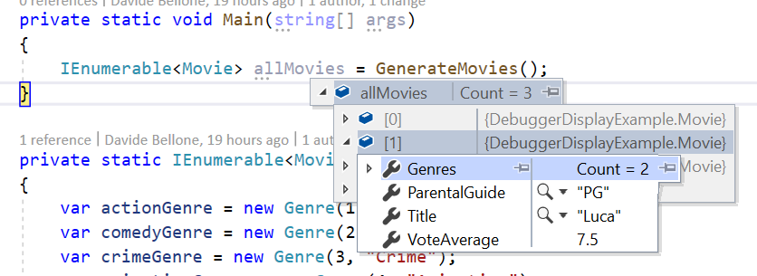
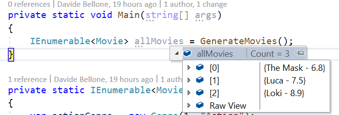
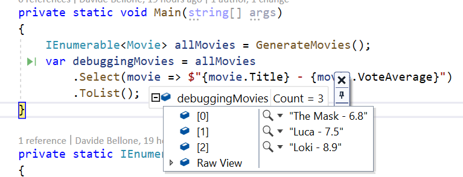
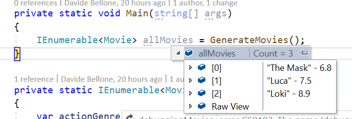
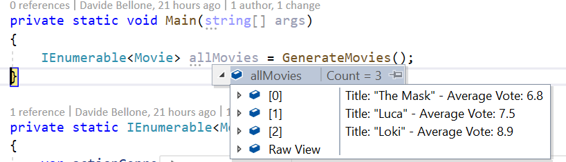
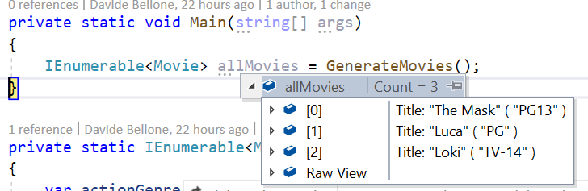
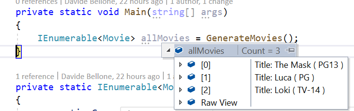
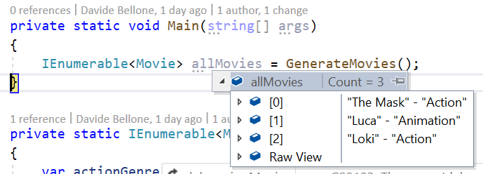
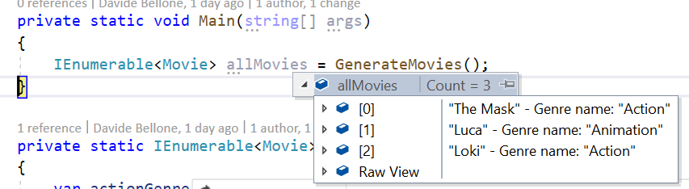

Picture this: you are debugging a .NET application, and you need to retrieve a list of objects. To make sure that the items are as you expect, you need to look at the content of each item.

For example, you are retrieving a list of `Movies` - an object with dozens of fields - and you are interested only in the `Title` and `VoteAverage` fields. How to view them while debugging?

There are several options: you could override `ToString`, or use a projection and debug the transformed list. Or you could use the `DebuggerDisplay` attribute to define custom messages that will be displayed on Visual Studio. Let's see what we can do with this powerful - yet ignored - attribute!

## Simplify debugging by overriding ToString

Let's start with the definition of the Movie object:

```cs
public class Movie
{
    public string ParentalGuide { get; set; }
    public List<Genre> Genres { get; set; }
    public string Title { get; set; }
    public double VoteAverage { get; set; }
}

public class Genre
{
    public long Id { get; set; }
    public string Name { get; set; }
}
```

This is quite a small object, but yet it can become cumbersome to view the content of each object while debugging.



As you can see, to view the content of the items you have to open them one by one. When there are only 3 items like in this example, it still can be fine. But when working with tens of items, that's not a good idea.

Notice what is the default text displayed by Visual Studio: does it ring you a bell?

**By default, the debugger shows you the `ToString()` of every object.** So an idea is to override that method to view the desired fields.

```cs
public override string ToString()
{
    return $"{Title} - {VoteAverage}";
}
```

This override allows us to see the items in a much better way:



So, yes, this could be a way to achieve this result.

## Using LINQ

Another way to achieve the same result is by using LINQ. Almost every C# developer has
already used it, so I won't explain what it is and what you can do with LINQ.

By the way, one of the most used methods is `Select`: it takes a list of items and, by applying a function, returns the result of that function applied to each item in the list.

So, we can create a list of strings that holds the info relevant to us, and then use the debugger to view the content of that list.

```cs
IEnumerable<Movie> allMovies = GenerateMovies();
var debuggingMovies = allMovies
        .Select(movie => $"{movie.Title} - {movie.VoteAverage}")
        .ToList();
```

This will result in a similar result to what we've already seen before.



But there's still a better way: `DebuggerDisplay`.

## Introducing DebuggerDisplay

`DebuggerDisplay` is a .NET attribute that you can apply to classes, structs, and many more, to create a custom view of an object while debugging.

The first thing to do to get started with it is to include the `System.Diagnostics` namespace. Then you'll be able to use that attribute.

But now, it's time to try our first example. If you want to view the `Title` and `VoteAverage` fields, you can use that attribute in this way:

```cs
[DebuggerDisplay("{Title} - {VoteAverage}")]
public class Movie
{
    public string ParentalGuide { get; set; }
    public List<Genre> Genres { get; set; }
    public string Title { get; set; }
    public double VoteAverage { get; set; }
}
```

This will generate the following result:



There are a few things to notice:

1. The fields to be displayed are wrapped in `{` and `}`: it's `"{Title}"`, not `"Title"`;
2. The names must match with the ones of the fields;
3. You are viewing the `ToString()` representation of each displayed field (notice the `VoteAverage` field, which is a `double`);
4. When debugging, you don't see the names of the displayed fields;
5. You can write whatever you want, not only the fields name (see the hyphen between the fields)

The 5th point brings us to another example: adding custom text to the display attribute:

```cs
[DebuggerDisplay("Title: {Title} - Average Vote: {VoteAverage}")]
```

So we can customize the content as we want.



_What if you rename a field?_ Since the value of the attribute is a simple string, it will not notice any update, so you'll miss that field (it does not match any object field, so it gets used as a simple text).

To avoid this issue you can simply use _string concatenation_ and the `nameof` expression:

```cs
[DebuggerDisplay("Title: {" + nameof(Title) + "} - Average Vote: {" + nameof(VoteAverage) + "}")]
```

I honestly don't like this way, but it is definitely more flexible!

## Getting rid of useless quotes with 'nq'

There's one thing that I don't like about how this attribute renders string values: _it adds quotes around them_.

Nothing important, I know, but it just clutters the view.

```cs
[DebuggerDisplay("Title: {Title} ( {ParentalGuide} )")]
```

shows this result:



**You can get rid of quotes by adding `nq` to the string**: add that modifier to every string you want to escape, and it will remove the quotes (in fact, _nq_ stands for _no-quotes_).

```cs
[DebuggerDisplay("Title: {Title,nq} ( {ParentalGuide,nq} )")]
```

Notice that I added `nq` to every string I wanted to escape. This simple modifier makes my debugger look like this:



There are other format specifiers, but not that useful. You can find the complete list [here](https://docs.microsoft.com/en-us/visualstudio/debugger/format-specifiers-in-csharp "Format specifiers in C# in the Visual Studio debugger").

## How to access nested fields

What if one of the fields you are interested in is a `List<T>`, and you want to see one of its fields?

You can use the positional notation, like this:

```cs
[DebuggerDisplay("{Title} - {Genres[0].Name}")]
```

As you can see, we are accessing the first element of the list, and getting the value of the `Name` field.



Of course, you can also add the `DebuggerDisplay` attribute to the nested class, and leave to it the control of how to be displayed while debugging:

```cs
[DebuggerDisplay("{Title} - {Genres[0]}")]
public class Movie
{
    public List<Genre> Genres { get; set; }
}

[DebuggerDisplay("Genre name: {Name}")]
public class Genre
{
    public long Id { get; set; }
    public string Name { get; set; }
}
```

This results in this view:



## Advanced views

Lastly, you can write complex messages by adding method calls directly in the message definition:

```cs
[DebuggerDisplay("{Title.ToUpper()} - {Genres[0].Name.Substring(0,2)}")]
```

In this way, we are modifying how the fields are displayed directly in the attribute.

I honestly don't like it so much: you don't have control over the correctness of the expression, and it can become hard to read.

A different approach is to create a read-only field used only for this purpose, and reference it in the Attribute:

```cs
[DebuggerDisplay("{DebugDisplay}")]
public class Movie
{
    public string ParentalGuide { get; set; }
    public List<Genre> Genres { get; set; }
    public string Title { get; set; }
    public double VoteAverage { get; set; }

    private string DebugDisplay => $"{Title.ToUpper()} - {Genres.FirstOrDefault().Name.Substring(0, 2)}";
}
```

In this way, we achieve the same result, and we have the help of the Intellisense in case our expression is not valid.

## Why not overriding ToString or using LINQ?

Ok, `DebuggerDisplay` is neat and whatever. But why can't we use LINQ, or override ToString?

That's because of the side effect of those two approaches.

**By overriding the ToString method you are changing its behavior all over the application**. This means that, if somewhere you print on console that object (like in `Console.WriteLine(movie)`), the result will be the one defined in the `ToString` method.

**By using the LINQ approach you are performing "useless" operations**: every time you run the application, even without the debugger attached, you will perform the transformation on every object in the collection.This is fine if your collection has 3 elements, but it can cause performance issues on huge collections.

That's why you should use the `DebuggerDisplay` attribute: it has no side effects on your application, both talking about results and performance - it will only be used when debugging.

## Additional resources

[🔗 DebuggerDisplay Attribute | Microsoft Docs](https://docs.microsoft.com/en-us/visualstudio/debugger/using-the-debuggerdisplay-attribute)

[🔗 C# debugging: DebuggerDisplay or ToString()? | StackOverflow](https://stackoverflow.com/questions/3190987/c-sharp-debugging-debuggerdisplay-or-tostring)

[🔗 DebuggerDisplay attribute best practices | Microsoft Docs](https://docs.microsoft.com/en-gb/archive/blogs/jaredpar/debuggerdisplay-attribute-best-practices)

## Wrapping up

In this article, we've seen how the `DebuggerDisplay` attribute provided by .NET is useful to perform smarter and easier debugging sessions.

With this Attribute, you can display custom messages to watch the state of an object, and even see the state of nested fields.

We've seen that you can customize the message in several ways, like by calling `ToUpper` on the string result. We've also seen that for complex messages you should consider creating a new `internal` field whose sole purpose is to be used during debugging sessions.

So, for now, happy coding!
🐧
