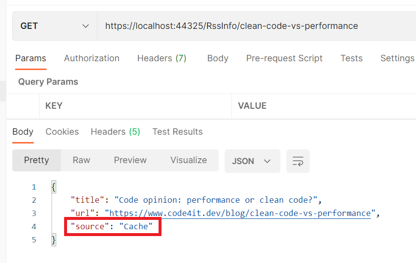

When fetching external resources - like performing a GET on some remote APIs - you often need to cache the result. Even a simple caching mechanism can boost the performance of your application: the fewer actual calls to the external system, the faster the response time of the overall application.

We should not add the caching layer directly to the classes that get the data we want to cache, because it will make our code less extensible and testable. On the contrary, we might want to **decorate** those classes with a specific caching layer.

In this article, we will see how we can use the **Decorator Pattern** to add a cache layer to our repositories (external APIs, database access, or whatever else) by using **Scrutor**, a NuGet package that allows you to _decorate_ services.

## Context: an RSS reader

Before understanding what is the Decorator Pattern and how we can use it to add a cache layer, let me explain the context of our simple application.

We are exposing an API with only a single endpoint, _GetBySlug_, which returns some data about the RSS item with the specified slug if present on my blog.

To do that, we have defined a simple interface:

```cs
public interface IRssFeedReader
{
    RssItem GetItem(string slug);
}
```

That interface is implemented by the `RssFeedReader` class, which uses the `SyndicationFeed` class (that comes from the `System.ServiceModel.Syndication` namespace) to get the correct item from my RSS feed:

```cs
public class RssFeedReader : IRssFeedReader
{
    public RssItem GetItem(string slug)
    {
        var url = "https://www.code4it.dev/rss.xml";
        using var reader = XmlReader.Create(url);
        var feed = SyndicationFeed.Load(reader);

        SyndicationItem item = feed.Items.FirstOrDefault(item => item.Id.EndsWith(slug));

        if (item == null)
            return null;

        return new RssItem
        {
            Title = item.Title.Text,
            Url = item.Links.First().Uri.AbsoluteUri,
            Source = "RSS feed"
        };
    }
}
```

The `RssItem` class is incredibly simple:

```cs
public class RssItem
{
    public string Title { get; set; }
    public string Url { get; set; }
    public string Source { get; set; }
}
```

Pay attention to the `Source` property: we're gonna use it later.

Then, in the `ConfigureServices` method, we need to register the service:

```cs
services.AddSingleton<IRssFeedReader, RssFeedReader>();
```

_Singleton, Scoped, or Transient? If you don't know the difference, [here's an article for you!](./dependency-injection-lifetimes "Dependency Injection lifetimes in .NET - my epiphany | Code4IT")_

Lastly, our endpoint will use the `IRssFeedReader` interface to perform the operations, without knowing the actual type:

```cs
public class RssInfoController : ControllerBase
{
    private readonly IRssFeedReader _rssFeedReader;

    public RssInfoController(IRssFeedReader rssFeedReader)
    {
        _rssFeedReader = rssFeedReader;
    }

    [HttpGet("{slug}")]
    public ActionResult<RssItem> GetBySlug(string slug)
    {
        var item = _rssFeedReader.GetItem(slug);

        if (item != null)
            return Ok(item);
        else
            return NotFound();
    }
}
```

When we run the application and try to find an article I published, we retrieve the data directly from the RSS feed (as you can see from the value of `Source`).


The application is quite easy, right?

Let's translate it into a simple diagram:


The sequence diagram is simple as well- it's almost obvious!


Now it's time to see what is the Decorator pattern, and how we can apply it to our situation.

## Introducing the Decorator pattern

**The Decorator pattern is a design pattern that allows you to add behavior to a class at runtime, without modifying that class**. Since the caller works with interfaces and ignores the type of the concrete class, it's easy to "trick" it into believing it is using the simple class: all we have to do is to add a new class that implements the expected interface, make it call the original class, and add new functionalities to that.

Quite confusing, uh?

To make it easier to understand, I'll show you a simplified version of the pattern:


In short, the Client needs to use an `IService`. Instead of passing a `BaseService` to it (as usual, via Dependency Injection), we pass the Client an instance of `DecoratedService` (which implements IService as well). `DecoratedService` contains a reference to another `IService` (this time, the actual type is BaseService), and calls it to perform the `doSomething` operation. But `DecoratedService` not only calls `IService.doSomething()`, but enriches its behavior with new capabilities (like caching, logging, and so on).

In this way, our services are focused on a single aspect (Single Responsibility Principle) and can be extended with new functionalities (Open-close Principle).

Enough theory! There are plenty of online resources about the Decorator pattern, so now let's see how the pattern can help us adding a cache layer.

Ah, I forgot to mention that the original pattern defines another object between `IService` and `DecoratedService`, but it's useless for the purpose of this article, so we are fine anyway.

## Implementing the Decorator with Scrutor

Have you noticed that we almost have all our pieces already in place?

If we compare the Decorator pattern objects with our application's classes can notice that:

- `Client` corresponds to our `RssInfoController` controller: it's the one that calls our services
- `IService` corresponds to `IRssFeedReader`: it's the interface consumed by the Client
- `BaseService` corresponds to `RssFeedReader`: it's the class that implements the operations from its interface, and that we want to decorate.

So, we need a class that decorates `RssFeedReader`. Let's call it `CachedFeedReader`: it checks if the searched item has already been processed, and, if not, calls the decorated class to perform the base operation.

```cs
public class CachedFeedReader : IRssFeedReader
{
    private readonly IRssFeedReader _rssFeedReader;
    private readonly IMemoryCache _memoryCache;

    public CachedFeedReader(IRssFeedReader rssFeedReader, IMemoryCache memoryCache)
    {
        _rssFeedReader = rssFeedReader;
        _memoryCache = memoryCache;
    }

 public RssItem GetItem(string slug)
        {
            var isFromCache = _memoryCache.TryGetValue(slug, out RssItem item);
            if (!isFromCache)
            {
                item = _rssFeedReader.GetItem(slug);
            }
            else
            {
                item.Source = "Cache";
            }

            _memoryCache.Set(slug, item);
            return item;
        }
}
```

There are a few points you have to notice in the previous snippet:

- this class implements the `IRssFeedReader` interface;
- we are passing an instance of `IRssFeedReader` in the constructor, _which is the class that we are decorating_;
- we are performing other operations both before and after calling the _base_ operation (so, calling `_rssFeedReader.GetItem(slug)`);
- we are setting the value of the `Source` property to _Cache_ if the object is already in cache - its value is _RSS feed_ the first time we retrieve this item;

Now we have all the parts in place.

To decorate the `RssFeedReader` with this new class, you have to [install a NuGet package called **Scrutor**](https://www.nuget.org/packages/Scrutor "Official page for Scrutor NuGet page").

Open your project and install it via UI or using the command line by running `dotnet add package Scrutor`.

Now head to the `ConfigureServices` method and use the `Decorate` extension method to decorate a specific interface with a new service:

```cs
services.AddSingleton<IRssFeedReader, RssFeedReader>(); // this one was already present
services.Decorate<IRssFeedReader, CachedFeedReader>(); // add a new decorator to IRssFeedReader
```

... and that's it! You don't have to update any other classes; everything is transparent for the clients.

If we run the application again, we can see that the first call to the endpoint returns the data from the RSS Feed, and all the followings return data from the cache.



We can now update our class diagram to add the new `CachedFeedReader` class


And, of course, the sequence diagram changed a bit too.


## Benefits of the Decorator pattern

Using the Decorator pattern brings many benefits.

**Every component is focused on only one thing**: we are separating responsibilities across different components so that every single component does only one thing and does it well. `RssFeedReader` fetches RSS data, `CachedFeedReader` defines caching mechanisms.

**Every component is easily testable**: we can test our caching strategy by mocking the `IRssFeedReader` dependency, without the worrying of the concrete classes called by the `RssFeedReader` class. On the contrary, if we put cache and RSS fetching functionalities in the `RssFeedReader` class, we would have many troubles testing our caching strategies, since we cannot mock the `XmlReader.Create` and `SyndicationFeed.Load` methods.

**We can easily add new decorators**: say that we want to log the duration of every call. Instead of putting the logging in the `RssFeedReader` class or in the `CachedFeedReader` class, we can simply create a new class that implements `IRssFeedReader` and add it to the list of decorators.

An example of Decorator outside the programming world? The following video from YouTube, where you can see that each cup (component) has only one responsibility, and can be easily decorated with many other cups.

<iframe width="560" height="315" src="https://www.youtube.com/embed/T_7aVZZDGNM" title="Decorator pattern as a Cup drawing" frameborder="0" allow="accelerometer; autoplay; clipboard-write; encrypted-media; gyroscope; picture-in-picture" allowfullscreen></iframe>

## Additional links

🔗[Scrutor project on GitHub](https://github.com/khellang/Scrutor "GitHub page for Scrutor")

🔗[An Atypical ASP.NET Core 5 Design Patterns Guide | Carl-Hugo Marcotte](https://www.packtpub.com/product/an-atypical-asp-net-core-5-design-patterns-guide/9781789346091 "An Atypical ASP.NET Core 5 Design Patterns Guide book published by PacktPub")

🔗[GitHub repository for this article](https://github.com/code4it-dev/DecoratorPatternWithScrutor "The GitHub repository for the code in this article")

## Wrapping up

In this article, we've seen that the Decorator pattern allows us to write better code by focusing each component on a single task and by making them easy to compose and extend.

We've done it thanks to Scrutor, a NuGet package that allows you to decorate services with just a simple configuration.

I hope you liked this article.

Happy coding! 🐧
