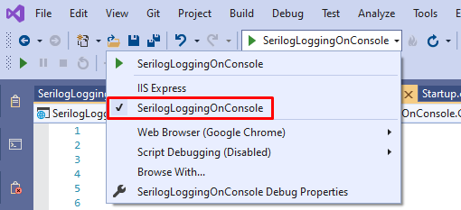
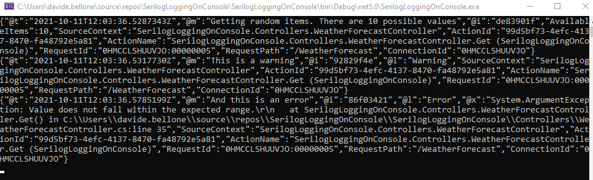
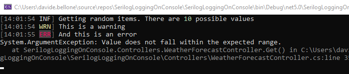

Having meaningful logs is crucial for any application: without logs, we would not be able to see if errors occur, what's the status of the application, if there are strange behaviors that should worry us, and so on.

To define a good logging strategy, we need two parts, equally important: adding logs to our code and analyzing the data produced by our logs.

In this article, we will see how to add **Serilog**, a popular logger library, to our .NET projects: we will learn how to configure it to print the logs on a Console.

## Why logging on console

I can guess what you're thinking:

> why should we write logs on Console? We should store them somewhere, to analyze them!

And... you'd be right!

But still, printing logs on Console can be useful in many ways.

First of all, by printing on Console you can check that the logging is actually working, and you haven't missed a configuration.

Then, writing on Console is great when debugging locally: just spin up your application, run the code you need, and check what happened on the logs; in this way you can understand the internal state of the application, which warnings and errors occurred, and more.

Lastly, because of an odd strategy that I've seen implemented in many projects: print the logs on console, add an agent that reads them and stores them in memory, and then send all the logs to the destination platform at once; in this way, you'll perform fewer HTTP requests against those platforms, making you save money and avoiding reaching the connection limit of the destination platform.

Now that we have good reasons to log on Console, well... let's do it!

## Adding Serilog on Program class

For this article, we will add Serilog logs to a simple .NET API project.

Create a new API project - you know, the one with the `WeatherForecast` controller.

Then, navigate to the `Program` class: by default, it should look like this:

```cs
public class Program
{
    public static void Main(string[] args)
    {
        CreateHostBuilder(args).Build().Run();
    }

    public static IHostBuilder CreateHostBuilder(string[] args) =>
        Host.CreateDefaultBuilder(args)
        .ConfigureWebHostDefaults(webBuilder =>
        {
            webBuilder.UseStartup<Startup>();
        });
}
```

There are no references to any logger, and, of course, to Serilog.

So the first thing to do is to install it: via NuGet install _Serilog.AspNetCore_ and _Serilog.Extensions.Logging_. The first one allows you to add Serilog to an ASP.NET project, while the second one allows you to use the native .NET logger in the code with all the capabilities provided by Serilog.

Then, we need to add the logger to our project:

```diff
public class Program
{
    public static void Main(string[] args)
    {
+        Log.Logger = new LoggerConfiguration()
+                .CreateLogger();

        CreateHostBuilder(args).Build().Run();
    }

    public static IHostBuilder CreateHostBuilder(string[] args) =>
        Host.CreateDefaultBuilder(args)
+        .UseSerilog((hostingContext, loggerConfiguration) =>
+                    loggerConfiguration.ReadFrom.Configuration(hostingContext.Configuration))
            .ConfigureWebHostDefaults(webBuilder =>
            {
                webBuilder.UseStartup<Startup>();
            });
}
```

There are two snippets to understand:

```cs
Log.Logger = new LoggerConfiguration().CreateLogger();
```

creates a new logger with the specified configurations (in our case, we use the default values), and then assigns the newly created logger to the globally-shared logger `Log.Logger`.

`Log.Logger` lives in the `Serilog` namespace, so you have to add it to the `using` list.

Then, we have this second part:

```cs
.UseSerilog((hostingContext, loggerConfiguration) =>
        loggerConfiguration.ReadFrom.Configuration(hostingContext.Configuration)
    )
```

This snippet defines where to get the Serilog configurations (in this case, from the same place used by the hosting context), and then sets Serilog as the logging provider.

## Inject the logger into constructors

Since we have bound the Serilog logger to the one native on .NET - the one coming from `Microsoft.Extensions.Logging` - we can use the native logger everywhere in the project.

Add a dependency to `ILogger<T>` in your constructor, where `T` is the name of the class itself:

```cs
public class WeatherForecastController : ControllerBase
{

    private readonly ILogger<WeatherForecastController> _logger;

    public WeatherForecastController(ILogger<WeatherForecastController> logger)
    {
        _logger = logger;
    }
}
```

So that you can use the different levels of logging and the **Structured Data** (see links below) to add more info:

```cs
_logger.LogInformation("Getting random items. There are {AvailableItems} possible values", Summaries.Count());

_logger.LogWarning("This is a warning");

try
{
    throw new ArgumentException();
}
catch (Exception ex)
{
    _logger.LogError(ex, "And this is an error");
}
```

## Update the AppSettings file

But that's not enough. We aren't saying that our logs should be printed on Console. To do that, we must update the _appsettings.json_ file and add some new configurations.

```json
"Serilog": {
    "Using": [ "Serilog.Sinks.Console" ],
    "MinimumLevel": {
        "Default": "Verbose",
        "Override": {
            "Microsoft": "Warning",
            "Microsoft.AspNetCore": "Warning",
            "System": "Error"
        }
    },
    "WriteTo": [
        {
        "Name": "Async",
        "Args": {
            "configure": [
            {
                "Name": "Console",
                "Args": {
                    "formatter": "Serilog.Formatting.Compact.RenderedCompactJsonFormatter, Serilog.Formatting.Compact"
                }
            }
            ]
        }
        }
    ]
}
```

As usual, let's break it down.

The first thing to notice is the **root of the JSON section**: `Serilog`. This value is the default when defining the configuration values for Serilog (remember the ` loggerConfiguration.ReadFrom.Configuration(hostingContext.Configuration)`? It binds the settings _automagically_!)

The `Using` section defines the types of Sinks that will be used. A **Sink** is just the destination of the logs. So, just **download the `Serilog.Sinks.Console` NuGet package** and add that value to the `Using` array to use the Console as a Sink.

Then, we have the `MinimumLevel` object: it defines the minimum levels of logs that will be taken into consideration. Here the default value is `Verbose`, but you'll probably want it to be `Warning` in your production environment: is this way, all the logs with a level lower than Warning will be ignored.

Lastly, we have the `WriteTo` section, which defines the exact configurations of the sinks. Notice the `Async` value: we need this value because writing logs is an asynchronous operation - logs must be printed in real-time. So, **after you've installed the `Serilog.Sinks.Async` NuGet package**, you must add the `Async` value to that object. And then you can configure the different Sinks: here I'm adding some simple JSON Formatters to the Console Sink.

## Run the application

We're finally ready to run our application.

Just run it with the usual IIS profile and... nothing happens! Where is the Console??

_With IIS you cannot see any Console_, since it simply does not exist - if the application runs as a web application, we don't need the Console.

So, you have to change the running profile and select the name of your application (in my case, _SerilogLoggingOnConsole_).



Then you can run the application, navigate to an endpoint, and see the logs!



But I don't like how logs are displayed, too many details!

Let me add a _theme_: in the AppSettings file, I can add a `theme` configuration:

```diff
"Args": {
    "configure": [
    {
        "Name": "Console",
        "Args": {
+        "theme": "Serilog.Sinks.SystemConsole.Themes.AnsiConsoleTheme::Code, Serilog.Sinks.Console",
        "formatter": "Serilog.Formatting.Compact.RenderedCompactJsonFormatter, Serilog.Formatting.Compact"
        }
    }
    ]
}
```

This makes Serilog show the logs with a different shape:



So, just by updating the AppSettings file, you can fine-tune the behavior and the output of the logger. In this way, you can customize Release builds to update the AppSettings file and define custom properties for every deploy environment.

## Further reading

If you want to learn more about the different topics discussed in this article:

🔗 [Serilog Structured Data | Code4IT](https://www.code4it.dev/blog/logging-with-serilog-and-seq#formatting-strings "Serilog Structured Data | Code4IT")

🔗 [Serilog Console Sink | GitHub](https://github.com/serilog/serilog-sinks-console "Serilog Console Sink | GitHub")

🔗 [How to integrate Serilog and Seq | Code4IT](https://www.code4it.dev/blog/logging-with-serilog-and-seq "How to integrate Serilog and Seq | Code4IT")

## Wrapping up

In this article, we've seen how to integrate Serilog in a .NET application to print the logs on the application Console.

Time to recap the key points:

- install the `Serilog`, `Serilog.AspNetCore`, and `Serilog.Extensions.Logging` NuGet packages to integrate the basic functionalities of Serilog
- download the `Serilog.Sinks.Console` and `Serilog.Sinks.Async` NuGet packages to use the Console as a destination of your logs
- update the `Program` class to specify that the application must use Serilog
- use `ILogger<T>` instead of `Serilog.ILogger`
- define the settings in the _appsettings.json_ file instead of directly in the code

Finally, if you want to see the full example, [here's the GitHub repository](https://github.com/code4it-dev/SerilogLoggingOnConsole "Example repository on GitHub") used for this article

Happy coding!

🐧
