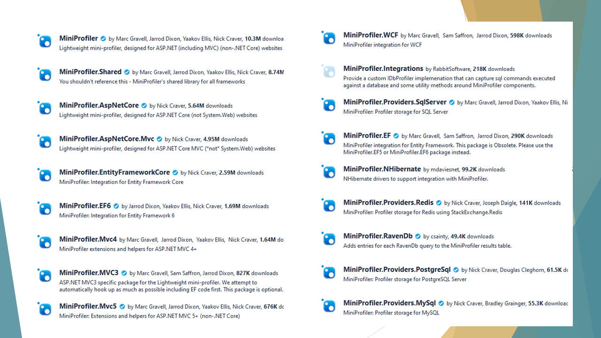

Sometimes your project does not perform well as you would expect. Bottlenecks occur, and it can be hard to understand where and why.

So, the best thing you should do is to *profile* your code and analyze the execution time to understand which are the parts that impact the most your application performance.

In this article, we will learn how to use Miniprofiler to profile code in a .NET 5 API project.

## Setting up the project

For this article, I've created a simple project. This project tells you the average temperature of a place by specifying the country code (eg: IT), and the postal code (eg: 10121, for Turin).

There is only one endpoint, `/Weather`, that accepts in input the CountryCode and the PostalCode, and returns the temperature in Celsius.

To retrieve the data, the application calls two external *free* services: [Zippopotam](http://zippopotam.us/) to get the current coordinates, and [OpenMeteo](https://open-meteo.com/en) to get the daily temperature using those coordinates.


Let's see how to profile the code to see the timings of every operation.

## Installing MiniProfiler

As usual, we need to install a Nuget package: since we are working on a .NET 5 API project, you can install the `MiniProfiler.AspNetCore.Mvc` package, and you're good to go.

MiniProfiler provides *tons* of packages you can use to profile your code: for example, you can profile *Entity Framework*, *Redis*, *PostgreSql*, and more.



Once you've installed it, we can add it to our project by updating the `Startup` class.

In the `Configure` method, you can simply add MiniProfiler to the ASP.NET pipeline:

```cs
app.UseMiniProfiler();
```

Then, you'll need to configure it in the `ConfigureServices` method:

```cs
public void ConfigureServices(IServiceCollection services)
{
    services.AddMiniProfiler(options =>
        {
            options.RouteBasePath = "/profiler";
            options.ColorScheme = StackExchange.Profiling.ColorScheme.Dark;
        });

    services.AddControllers();
    // more...
}
```

As you might expect, the king of this method is `AddMiniProfiler`. It allows you to set MiniProfiler up by configuring an object of type `MiniProfilerOptions`. There are lots of things you can configure, that you can see [on GitHub](https://github.com/MiniProfiler/dotnet/blob/main/samples/Samples.AspNet5/Startup.cs).

For this example, I've updated the color scheme to use Dark Mode, and I've defined the base path of the page that shows the results. The default is *mini-profiler-resources*, so the results would be available at */mini-profiler-resources/results*. With this setting, the result is available at */profiler/results*.

## Defining traces

Time to define our traces!

When you fire up the application, a `MiniProfiler` object is created and shared across the project. This object exposes several methods. The most used is `Step`: it allows you to define a portion of code to profile, by wrapping it into a `using` block.

```cs
using (MiniProfiler.Current.Step("Getting lat-lng info"))
{
    (latitude, longitude) = await _locationService.GetLatLng(countryCode, postalCode);
}
```

The snippet above defines a *step*, giving it a name ("Getting lat-lng info"), and profiles everything that happens within those lines of code.

You can also use **nested steps** by simply adding a *parent* step:

```cs
using (MiniProfiler.Current.Step("Get temperature for specified location"))
{
    using (MiniProfiler.Current.Step("Getting lat-lng info"))
    {
        (latitude, longitude) = await _locationService.GetLatLng(countryCode, postalCode);
    }

    using (MiniProfiler.Current.Step("Getting temperature info"))
    {
        temperature = await _weatherService.GetTemperature(latitude, longitude);
    }
}
```

In this way, you can create a better structure of traces and perform better analyses. Of course, this method doesn't know what happens inside the `GetLatLng` method. If there's another *Step*, it will be taken into consideration too.

You can also use **inline steps** to trace an operation and return its value on the same line:

```cs
var response = await MiniProfiler.Current.Inline(() => httpClient.GetAsync(fullUrl), "Http call to OpenMeteo");
```
`Inline` traces the operation and returns the return value from that method. Notice that it works even for async methods! 🤩

## Viewing the result

Now that we've everything in place, we can run our application.

To get better data, you *should* run the application in a specific way.

First of all, **use the RELEASE configuration**. You can change it in the project properties, heading to the *Build* tab:


Then, you should run the application **without the debugger attached**. You can simply hit Ctrl+F5, or head to the *Debug* menu and click *Start Without Debugging*.


Now, run the application and call the endpoint. Once you've got the result, you can navigate to the report page.

Remember the `options.RouteBasePath = "/profiler"` option? It's the one that specifies the path to this page.

If you head to */profiler/results*, you will see a page similar to this one:


On the left column, you can see the hierarchy of the messages we've defined in the code. On the right column, you can see the timings for each operation.


Noticed that _Show trivial_ button on the bottom-right corner of the report? It displays the operations that took such a small amount of time that can be easily ignored. By clicking on that button, you'll see many things, such as all the operations that the .NET engine performs to handle your HTTP requests, like the Action Filters.


Lastly, the _More columns_ button shows, well... more columns! You will see the aggregate timing (the operation + all its children), and the timing from the beginning of the request.


## The mystery of x-miniprofiler-ids

Now, there's one particular thing that I haven't understood of MiniProfiler: the meaning of `x-miniprofiler-ids`.

This value is an array of IDs that represent every time we've profiled something using by MiniProfiler during this session. 

You can find this array in the HTTP response headers:


I noticed that every time you perform a call to that endpoint, it adds some values to this array.

My question is: *so what?* What can we do with those IDs? Can we use them to filter data, or to see the results in some particular ways?

If you know how to use those IDs, please drop a message in the comments section 👇

## Additional links

If you want to run this project and play with MiniProfiler, I've shared this project on GitHub.

🔗 [ProfilingWithMiniprofiler repository | GitHub](https://github.com/code4it-dev/ProfilingWithMiniprofiler)

In this project, I've used Zippopotam to retrieve latitude and longitude given a location

🔗 [Zippopotam](http://www.zippopotam.us/)

Once I retrieved the coordinates, I used Open Meteo to get the weather info for that position.

🔗 [Open Meteo documentation | OpenMeteo](https://open-meteo.com/en/docs#api-documentation)

And then, obviously, I used MiniProfiler to profile my code.

🔗 [MiniProfiler repository | GitHub](https://github.com/MiniProfiler/dotnet)

I've already used MiniProfiler for analyzing the performances of an application, and thanks to this library I was able to improve the response time from 14 seconds (yes, seconds!) to less than 3. I've explained all the steps in 2 articles.

🔗 [How I improved the performance of an endpoint by 82% - part 1 | Code4IT](https://www.code4it.dev/blog/improving-application-performance-part1)

🔗 [How I improved the performance of an endpoint by 82% - part 2 | Code4IT](https://www.code4it.dev/blog/improving-application-performance-part2)


## Wrapping up

In this article, we've seen how we can profile .NET applications using MiniProfiler.

This NuGet Package works for almost every version of .NET, from the dear old .NET Framework to the most recent one, .NET 6.

*A suggestion*: configure it in a way that you can turn it off easily. Maybe using some environment variables. This will give you the possibility to turn it off when this tracing is no more required and to speed up the application. 

Ever used it? Any alternative tools?

And, most of all, what the f**k is that _x-miniprofiler-ids_ array??😶

Happy coding!

🐧