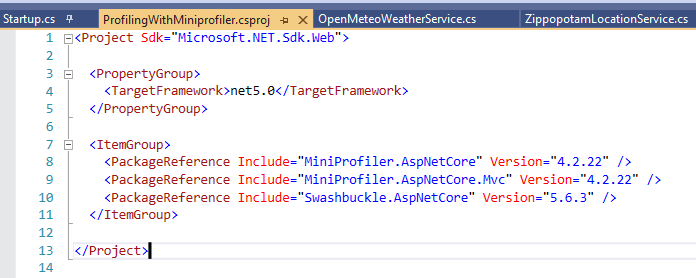

After the Log4J vulnerability, we should reflect on how open source impacts our projects, and what are the benefits and disadvantages of using such libraries.

The following article is more an opinion, just some random thoughts about what happened and what we can learn from this event.

## A recap of the Log4J vulnerability

To give some context to those who have never heard (or forgot) about the Log4J vulnerability, here's a short recap.

Log4J is a popular Java library for logging. So popular that it has been inglobed in the Apache ecosystem.

For some reason I haven't understood, the logger evaluates the log messages instead of just treating them as strings. So, a kind of SQL injection (but for logs) could be executed: by sending a specific string format to services that use Log4J, that string is evaluated and executed on the server; as a result, external scripts could be run on the server, allowing attackers to access your server. Of course, it's not a detailed and 100% accurate description: there are plenty of resources on the Internet if you want to deep dive into this topic.

Some pieces of evidence show that the earliest exploitation of this vulnerability happened on Dec 1, 2021, as stated by Matthew Prince, CEO of Cloudflare, [in this Tweet](https://twitter.com/eastdakota/status/1469800951351427073 "Matthew Prince's tweet about Log4J's vunerability"). But the vulnerability became public 9 days later.

## Benefits of OSS projects

The source code of Log4J is publicly available [on GitHub](https://github.com/apache/logging-log4j2 "Log4J repository on GitHub")

This means that:

it's free to use (yes, OSS != free, but it's rare to find paid OSS projects)
you can download and run the source code
you can inspect the code and propose changes
it saves you time: you don't have to reinvent the wheel - everything is already done by others.

## Issues with OSS projects

Given that the source code is publicly accessible, attackers can study it to find security flaws, and - of course - take advantage of those vulnerabilities before the community notices them.

Most of the time, OSS projects are created by single devs to solve their specific problems. Then, they share those repositories to help their peers and allow other devs to work on the library. All the coding is done for free and in their spare time. As you can expect, the quality is deeply impacted by this.

## What to do with OSS projects?

So, what should we do with all those OSS projects? **Should we stop using them?**

I don't think so. just because those kinds of issues can arise, it doesn't mean that they will arise so often.

Also, it's pretty stupid to build everything from scratch "just in case". Just because attackers don't know the source code, it doesn't mean that they can't find a way to access your systems.

On the other hand, we should not blindly use every library we see on GitHub. It's not true that just because it's open source, it's safe to use - as the Log4J story taught us.

So, what should we do?

I don't have an answer. But for sure we can perform some operations when working on our projects.

We should **review which external packages we're using**, and keep track of their version. Every N months, we should write a recap (even an Excel file is enough) to update the list of packages we're using. In this way, if a vulnerability is discovered for a package, and a patch is released, we can immediately apply that patch to our applications.

Finding installed dependencies for .NET projects is quite simple: you can open the _csproj_ file and see the list of NuGet packages you're using.

The problem with this approach is that you don't see the internal dependencies: if one of the packages you're using depends on another package with a known vulnerability, your application may be vulnerable too.

> How can you list all your dependencies? Are there any tools that work with your programming language? Drop a comment below, it can help other devs!

Then, before choosing a project instead of another, we should answer (at least) three questions. **Does this package solve our problem? Does the code look safe to use? Is the repository active, or is it stale?**

Spend some time skimming the source code, looking for weird pieces of code. Pay attention when they evaluate the code (possible issues like with Log4J), when they perform unexpected calls to external services (are they tracking you?), and so on.

**Look at the repository history**: is the repository still being updated? Is it maintained by a single person, or is there a community around it?

You can find this info on GitHub under the Insight tab.

In the following picture, you can see the contributions to the Log4J library (available [here](https://github.com/apache/logging-log4j2/graphs/contributors "Log4J contributors on GitHub")):

**Does this repo have tests?** Without tests (or, maybe worse, with not meaningful tests), the package should not be considered safe. Have a look at the code and at the CI pipelines, if publicly available.

Finally, a hope for a future: to define a standard and some procedures to **rate the security of a package/repository**. I don't know if it can be feasible, but it would be a good addition to the OSS world.

## Further readings

If you're interested in the general aspects of the Log4J vulnerability, you can have a look at this article by the Wall Street Journal:

🔗[What Is the Log4j Vulnerability? What to Know | The Wall Street Journal](https://www.wsj.com/articles/what-is-the-log4j-vulnerability-11639446180 "Wall Street Journal article about Log4J vulnerability")

If you prefer a more technical article, DataDog's blog got you covered. In particular, jump to the "How the Log4Shell vulnerability works" section.

🔗[Takeaways from the Log4j Log4Shell vulnerability | DataDog](https://www.datadoghq.com/blog/log4j-log4shell-vulnerability-overview-and-remediation "DataDog's article about Log4J vulnerability")

But if you prefer some even more technical info, you can head to the official vulnerability description:

🔗[CVE-2021-45046 vulnerability](https://cve.mitre.org/cgi-bin/cvename.cgi?name=CVE-2021-45046 "CVE vulnerability description")

Here's the JIRA ticket created to track it:

🔗[JNDI lookups in layout (not message patterns) enabled in Log4j2 < 2.16.0 | Jira](https://issues.apache.org/jira/browse/LOG4J2-3221 "Jira ticket to track this issue")

## Wrapping up

This was not the usual article/tutorial, it was more an opinion on the current status of OSS and on what we should do to avoid issues like those caused by Log4J.

It's not the first vulnerability, and for sure it won't be the only one.

What do you think? Should we move away from OSS?

How would you improve the OSS world?

Happy coding!

🐧
