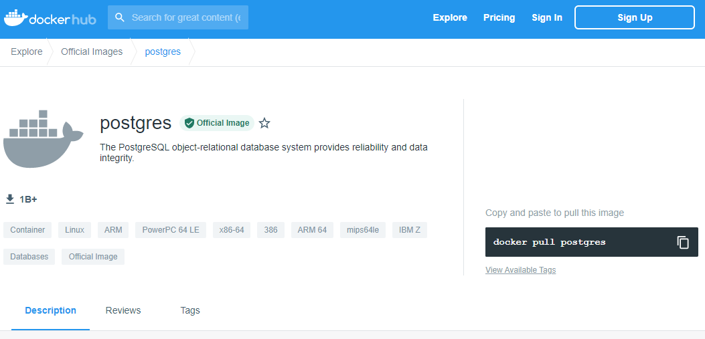
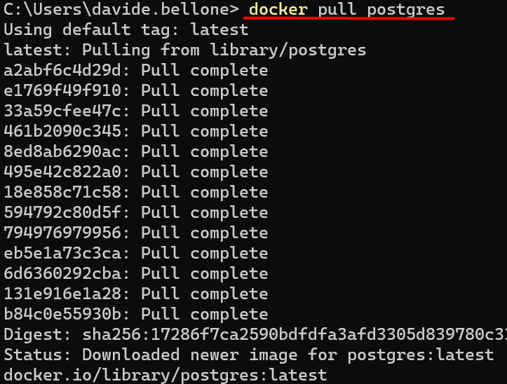
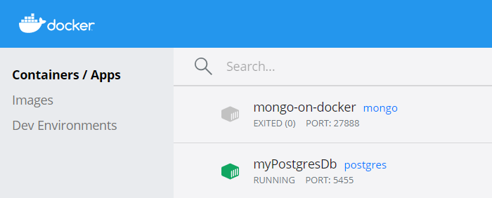
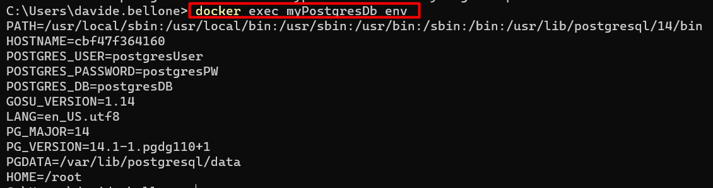
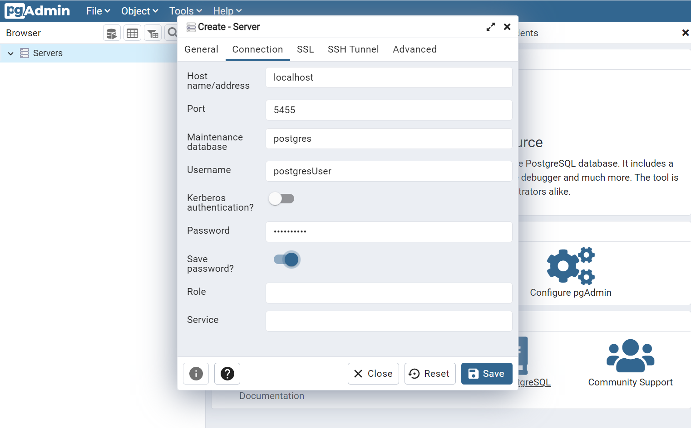

PostgreSQL is a relational database characterized for being open source and with a growing community supporting the project.

There are several ways to store a Postgres database online so that you can use it to store data for your live applications. But, for local development, you might want to spin up a Postgres database on your local machine.

In this article, we will learn how to run PostgreSQL on a Docker container for local development.

## Pull Postgres Docker Image

As you may know, Docker allows you to download images of almost everything you want in order to run them locally (or wherever you want) without installing too much stuff.

The best way to check the available versions is to head to DockerHub and search for _postgres_.



Here you'll find a description of the image, all the documentation related to the installation parameters, and more.

If you have Docker already installed, just open a terminal and run

```docker
docker pull postgres
```

to download the latest image of PostgreSQL.



## Run the Docker Container

Now that we have the image in our local environment, we can spin up a container and specify some parameters.

Below, you can see the full command.

```
docker run
    --name myPostgresDb
    -p 5455:5432
    -e POSTGRES_USER=postgresUser
    -e POSTGRES_PASSWORD=postgresPW
    -e POSTGRES_DB=postgresDB
    -d
    postgres
```

Time to explain each and every part! 🔎

`docker run` is the command used to create and run a new container based on an already downloaded image.

`--name myPostgresDb` is the name we assign to the container that we are creating.

`-p 5455:5432` is the port mapping. Postgres natively exposes the port 5432, and we have to map that port (that lives _within_ Docker) to a local port. In this case, the local 5455 port maps to Docker's 5432 port.

`-e POSTGRES_USER=postgresUser`, `-e POSTGRES_PASSWORD=postgresPW`, and `-e POSTGRES_DB=postgresDB` set some environment variables. Of course, we're defining the username and password of the admin user, as well as the name of the database.

`-d` indicates that the container run in a **detached** mode. This means that the container runs in a background process.

`postgres` is the name of the image we are using to create the container.

As a result, you will see the newly created container on the CLI (running `docker ps`) or view it using some UI tool like Docker Desktop:



If you forgot which environment variables you've defined for that container, you can retrieve them using Docker Desktop or by running `docker exec myPostgresDb env`, as shown below:



**Note: environment variables may change with newer image versions**. Always refer to the official docs, specifically to the documentation related to the image version you are consuming.

## Navigate the DB with PgAdmin

Now that we have Postgres up and running, we can work with it.

You can work with the DB using the console, or, if you prefer, using a UI.

I prefer the second approach (yes, I know, it's not cool as using the terminal, but it works), so I downloaded **pgAdmin**.

There, you can connect to the server by using the environment variable you've defined when running `docker run`. Remember that the hostname is simply _localhost_.



And we've finished! 🥳 Now you can work with a local instance of Postgres and shut it remove it when you don't need it anymore.

## Additional resources

I've already introduced Docker in another article, where I explained how to run MongoDB locally:

🔗 [First steps with Docker | Code4IT](https://www.code4it.dev/blog/run-mongodb-on-docker "First steps with Docker by Code4IT")

As usual, the best resource is the official website:

🔗 [PostgreSQL image | DockerHub](https://hub.docker.com/_/postgres "Postgres image on DockerHub")

Finally, a special mention to Francesco Ciulla, who thought me how to run Postgres with Docker while I thought him how to query it with C#. Yes, mutual help! 👏

🔗 [Francesco Ciulla's blog](https://blog.francescociulla.com/ "Francesco Ciulla's blog")

## Wrapping up

In this article, we've seen how to download and install a PostgreSQL database on our local environment by using Docker.

It's just a matter of running a few commands and paying attention to the parameters passed in input.

In a future article, we will learn how to perform CRUD operations on a PostgreSQL database using C#.

For now, happy coding!

🐧
