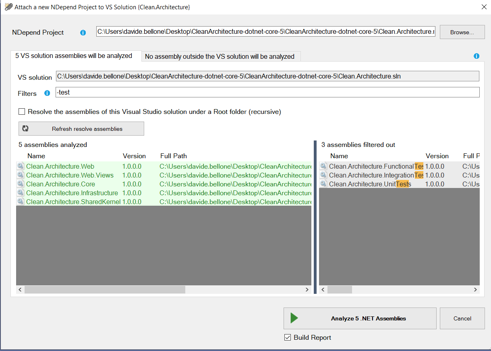
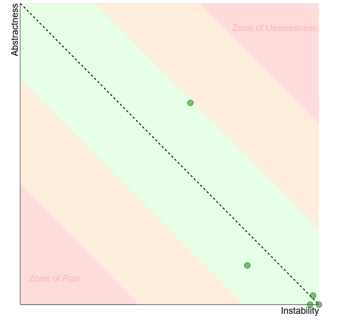

Software systems can be easy to build, but hard to maintain. The more a system will be maintained, the more updates to the code will be needed.

Structuring the code to help maintainability is crucial if your project is expected to evolve.

In this article, we will learn how to measure the maintainability of a .NET project using NDepend, a tool that can be installed as an extension in Visual Studio.

So, let's begin with the *how*, and then we'll move to the *what*.

## Introducing NDepend

NDepend is a tool that performs static analysis on any .NET project.

It is incredibly powerful and can calculate several metrics that you can use to improve the quality of your code, like Lines of Code, Cyclomatic Complexity, and Coupling. 

You can use NDepend in two ways: installing it on your local Visual Studio instance, or using it in your CI/CD pipelines, to generate reports during the build process.

In this article, I've installed it as a Visual Studio extension. Once it is ready, you'll have to create a new NDepend project and link it to your current solution.

To do that, click on the ⚪ icon on the bottom-right corner of Visual Studio, and create a new NDepend project. It will create a *ndproj* project and attach it to your solution.

When creating a new NDepend project, you can choose which of your .NET projects must be taken into consideration. You'll usually skip analyzing test projects.



Then, to run the analysis of your solution, you need to click again on that ⚪ icon and click *Run analysis and generate report*. 

Now you'll have two ways to access the results. On an HTML report, like this one:


Or as a Dashboard integrated with Visual Studio:


You will find most of the things in the HTML report.

## What is Maintainability

Maintainability is a quality of a software system (a single application or a group of applications) that describes how easy it is to maintain it.

Easy-to-maintain code has many advantages:

* it allows quicker and less expensive maintenance operations
* the system is easier to reverse-engineer
* the code is oriented to the other devs as well as to the customers
* it keeps the system easy to update if the original developers leave the company

There are some metrics that we can use to have an idea of how much it is easy to maintain our software.

And to calculate those metrics, we will need some external tools. Guess what? Like NDepend!

## Lines of code (LOC)

Typically, systems with more lines of code (abbreviated as *LOC*) are more complex and, therefore, harder to maintain. 

Of course, it’s the order of magnitude of that number that tells us about the complexity; 90000 and 88000 are similar numbers, you won’t see any difference.

Two types of LOC can be calculated: physical LOC and logical LOC.

**Physical LOC** refers to the total count of lines of your code. It's the easiest one to calculate since you can just count the lines of code as they appear. 

**Logical LOC** is about only the effectively executable lines of code. Spacing, comments, and imports are excluded from this count.

### Calculating LOC with NDepend

If you want to see the LOC value for your code, you can open the NDepend HTML report, head to *Metrics > Types Metrics* (in the left menu), and see that value.

This value is calculated based on the IL and the actual C# code, so it may happen that it's not the exact number of lines you can see on your IDE. By the way, it's a good estimation to understand which classes and methods need some attention.


### Why is LOC important?

Keeping track of LOC is useful because the more lines of code, the more possible bugs.

Also, having lots of lines of code can make refactoring harder, especially because it's probable that there is code duplication.

How to avoid it? Well, probably, you can't. Or, at least, you can't move to a lower magnitude. But, still, you can organize the code in modules with a small LOC value.

In this way, every LOC is easily maintainable, especially if focused on a specific aspect (SRP, anyone?)

The total LOC value won't change. What will change is how the code is distributed across separated and independent modules.

## Cyclomatic complexity (CC)

*Cyclomatic complexity* is the measure of the number of linear paths through a module.

This formula works for simple programs and methods:

```
CC = E-N+2
```

where *E* is the number of Edges of the graph, while *N* is the number of Nodes.

Wait! Graph?? 😱


Code can be represented as a graph, where each node is a block of code.

Take as an example this method:

```cs
public string GetItemDescription(Item item)
{
    string description;
    if (item == null)
        description = string.Empty;
    else
        description = item.Name + " - " + item.Seller;

    return description;
}
```

Here we have 4 nodes (N=4) and 4 edges (E=4).


so

```
CC = 4-4+2 = 2
```

Again, you will not calculate CC manually: we can use NDepend instead.

### Calculating Cyclomatic Complexity with NDepend

As described before, the first step to do is to run NDepend and generate the HTML report. Then, open the left menu and click on *Metrics > Type Metrics*

Here you can see the values for Cyclomatic Complexity for every class (but you cannot drill down to every method).


### Why is CC important?

Keeping track of Cyclomatic Complexity is good to understand the degree of complexity of a module or a method.

The higher the CC, the harder it will be to maintain and update the module.

**We can use Cyclomatic Complexity as a lower limit for test cases**. Since the CC of a method tells us about the number of independent execution paths, we can use that value to see the minimum number of tests to execute on that method. So, in the previous example, CC=2, and we need **at least** two tests: one for the case when `item` is null, and one for the case when `item` is not null.

## Depth of Inheritance Tree (DIT)

Depth of Inheritance Tree (DIT) is the value of the maximum length of the path between a base class and its farther subclass.

Take for example this simple class hierarchy.

```cs
public class User{}

public class Teacher : User { }

public class Student : User { }

public class AssociatedTeacher : Teacher { }
```

It can be represented as a tree, to better understand the relationship between classes:

 

Since the maximum depth of the tree is 3, the DIT value is 3.


### How to calculate DIT with NDepend

As usual, run the code analysis with NDepend to generate the HTML report.

Then, you can head to *Metrics > Type Metrics*  and navigate to the *Code Members and Inheritance* section to see the value of DIT of each class.


### Why is DIT important?

Inheritance is a good way to reduce code duplication, that's true: everything that is defined in the base class can be used by the derived classes.

But still, you should keep your eyes on the DIT value: if the depth level is greater than a certain amount (5, as stated by many devs), you're probably risking to incur on possible bugs and unwanted behaviors due to some parent classes.

Also, having such a deep hierarchy may cause your system to be hard to maintain and evolve. So, if possible, **prefer composition over inheritance**.

## Two words about NDepend

For sure, **NDepend is an amazing tool for static analysis**. All those metrics can be really useful - if you know how to use them. Luckily, not only do they give you the values of those metrics, but they also explain them.

In this article, I showed the *most boring* stuff you can see with NDepend. But you can do lots of incredible things. 

My favorites ones are:

**Instability vs Abstractness diagram**, which shows if your modules are easy to maintain. The relation between Instability and Abstractness is well explained in Uncle Bob's Clean Architecture book.



**Assemblies Dependencies**, which lists all the assemblies referenced by your project. Particularly useful to keep track of the OSS libraries you're using, in case you need to update them for whichever reason (Log4J, anyone?)


Then, the **Component Dependencies Diagram**, which is probably my fav feature: it allows you to navigate the modules and classes, and to understand which module depends on which other module.


and many more.

BUT!

There are also things I don't like.

I found it **difficult to get started with it**: installing and running it the first time was quite difficult. Even updating it is not that smooth.

Then, the navigation menu is not that easy to understand. Take this screenshot:


Where can I find the Component Dependencies Diagram? Nowhere - it is accessible only from the homepage.

So, the tool is incredibly useful, but it's difficult to use (at first, obviously).

If the NDepend team starts focusing on the usability and the UI, I'm sure it can quickly become a must-have tool for every team working on .NET. Of course, if they create a free (or cheaper) tier for their product with reduced capabilities: now it's quite expensive. 

## Additional resources

If you want to read more about how NDepend calculates those metrics, the best thing to do is to head to their documentation.

🔗 [Code quality metrics | NDepend](https://www.ndepend.com/features/code-quality#Metrics)

And, obviously, have a look at that project:

🔗 [NDepend Homepage](https://www.ndepend.com)

As I said before, you should avoid creating too many subclasses. Rather, you should compose objects to extend their behavior. A good way to do that is through the **Decorator pattern**, as I explained here.

🔗 [Decorator pattern with Scrutor | Code4IT](https://www.code4it.dev/blog/caching-decorator-with-scrutor)

To test NDepend I used an existing, and well-known, project, that you can see on GitHub: Clean Architecture, created by Steve Smith (aka Ardalis).

🔗 [Clean Architecture repository | GitHub](https://github.com/ardalis/CleanArchitecture)

## Wrapping up

In this article, we've seen how to measure metrics like Lines Of Code, Cyclomatic Complexity, and Depth of Inheritance Tree to keep an eye on the maintainability of a .NET solution.

To do that, we've used NDepend - I know, it's WAY too powerful to be used only for those metrics. It's like using a bazooka to kill a bee 🐝. But still, it was nice to try it out with a realistic project.

So, NDepend is incredibly useful for managing complex projects - it's quite expensive, but in the long run, it may help you save money.

Have you already used it? 

Do you keep track of maintainability metrics?

Happy coding!

🐧