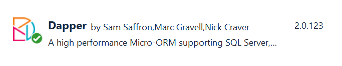

In a [previous article](https://www.code4it.dev/blog/postgres-crud-operations-npgsql), we've seen how to perform simple CRUD operations on a Postgres database by using Npgsql, a library that allows you to write and perform queries to be executed specifically on a PostgreSQL database.

In this article, we will take a step further: we will perform the same operations using Dapper, one of the most popular ORM for .NET applications, and we will see how performing those operations becomes easier.

## Introducing the project

For this article, I will reuse the project I used for the previous article.

This project performs CRUD (Create, Read, Update, Delete) operations on a Postgres database with a single table: _Games_. All those operations (plus a bunch of other additional ones) are executed by a class that implements this interface:

```cs
public interface IBoardGameRepository
{
    Task<IEnumerable<BoardGame>> GetAll();

    Task<BoardGame> Get(int id);

    Task Add(BoardGame game);

    Task Update(int id, BoardGame game);

    Task Delete(int id);

    Task<string> GetVersion();

    Task CreateTableIfNotExists();
}
```

This allows me to define and use a new class without modifying too much the project: in fact, I simply have to replace the dependency in the Startup class to use the Dapper repository.

But first...

## Dapper, a micro-ORM

In the introduction, I said that we will use Dapper, a popular ORM. Let me explain.

**ORM stands for Object-relational mapping** and is a technique that allows you to map data from one format to another. This technique simplifies developers' lives since they don't have to manually map everything that comes from the database to an object - the ORM takes care of this task.

Dapper is one of the most popular ORMs, created by the Stack Overflow team. Well, actually **Dapper is a Micro-ORM**: it performs only a subset of the operations commonly executed by other ORMs; for example, Dapper allows you to map query results to objects, but it does not automatically generate the queries.

To add Dapper to your .NET project, simply run this command:

```cmd
dotnet add package Dapper
```

Or add the NuGet package via Visual Studio:



Dapper will take care of only a part of the operations; for instance, it cannot open a connection to your DB. That's why you need to install _Npgsql_, just as we did in a previous article. We can say the whole Dapper library is a set of Extension Methods built on top of the native data access implementation - in the case of PostgreSQL, on to op Npgsql.

Now we have all the dependencies installed, so we can start writing our queries.

## Open the connection

Once we have created the application, we must instantiate and open a connection against our database.

```cs
private NpgsqlConnection connection;

public DapperBoardGameRepository()
{
    connection = new NpgsqlConnection(CONNECTION_STRING);
    connection.Open();
}
```

We will use the `connection` object later when we will perform the queries.

## CRUD operations

We are working on a table, Games, whose name is stored in a constant:

```cs
private const string TABLE_NAME = "Games";
```

The _Games_ table consists of several fields:

| Field name      | Field type        |
| --------------- | ----------------- |
| id              | INTEGER PK        |
| Name            | VARCHAR NOT NULL  |
| MinPlayers      | SMALLINT NOT NULL |
| MaxPlayers      | SMALLINT          |
| AverageDuration | SMALLINT          |

And it is mapped to the `BoardGame` class:

```cs
public class BoardGame
{
    public int Id { get; set; }
    public string Name { get; set; }
    public int MinPlayers { get; set; }
    public int MaxPlayers { get; set; }
    public int AverageDuration { get; set; }
}
```

So, the main task of Dapper is to map the result of the queries performed on the Games table to one or more BoardGame objects.

### Create

To create a new row on the Games table, we need to do something like this:

```cs
public async Task Add(BoardGame game)
{
    string commandText = $"INSERT INTO {TABLE_NAME} (id, Name, MinPlayers, MaxPlayers, AverageDuration) VALUES (@id, @name, @minPl, @maxPl, @avgDur)";

    var queryArguments = new
    {
        id = game.Id,
        name = game.Name,
        minPl = game.MinPlayers,
        maxPl = game.MaxPlayers,
        avgDur = game.AverageDuration
    };

    await connection.ExecuteAsync(commandText, queryArguments);
}
```

Since Dapper does not create any queries for us, we still need to define them explicitly.

The query contains various parameters, marked with the `@` symbol (`@id`, `@name`, `@minPl`, `@maxPl`, `@avgDur`). Those are placeholders, whose actual values are defined in the `queryArguments` anonymous object:

```cs
var queryArguments = new
{
    id = game.Id,
    name = game.Name,
    minPl = game.MinPlayers,
    maxPl = game.MaxPlayers,
    avgDur = game.AverageDuration
};
```

Finally, we can execute our query on the connection we have opened in the constructor:

```cs
await connection.ExecuteAsync(commandText, queryArguments);
```

#### Comparison with Npgsql library

Using dapper simplifies our code. In fact, when using the native Npgsql library without Dapper, we have to declare every parameter explicitly.

As a comparison, have a look at how we implemented the same operation using Npgsql:

```cs
public async Task Add(BoardGame game)
{
    string commandText = $"INSERT INTO {TABLE_NAME} (id, Name, MinPlayers, MaxPlayers, AverageDuration) VALUES (@id, @name, @minPl, @maxPl, @avgDur)";
    await using (var cmd = new NpgsqlCommand(commandText, connection))
    {
        cmd.Parameters.AddWithValue("id", game.Id);
        cmd.Parameters.AddWithValue("name", game.Name);
        cmd.Parameters.AddWithValue("minPl", game.MinPlayers);
        cmd.Parameters.AddWithValue("maxPl", game.MaxPlayers);
        cmd.Parameters.AddWithValue("avgDur", game.AverageDuration);

        await cmd.ExecuteNonQueryAsync();
    }
}
```

When using Dapper, we declare the parameter values in a single anonymous object, and we don't create a `NpgsqlCommand` instance to define our query.

### Read

As we've seen before, an ORM simplifies how you read data from a database by automatically mapping the query result to a list of objects.

When we want to get all the games stored on our table, we can do something like that:

```cs
public async Task<IEnumerable<BoardGame>> GetAll()
{
    string commandText = $"SELECT * FROM {TABLE_NAME}";
    var games = await connection.QueryAsync<BoardGame>(commandText);

    return games;
}
```

Again, we define our query and allow Dapper to do the rest for us.

In particular, `connection.QueryAsync<BoardGame>` fetches all the data from the query and converts it to a collection of BoardGame objects, performing the mapping for us.

Of course, you can also query for BoardGames with a specific Id:

```cs
public async Task<BoardGame> Get(int id)
{
    string commandText = $"SELECT * FROM {TABLE_NAME} WHERE ID = @id";

    var queryArgs = new { Id = id };
    var game = await connection.QueryFirstAsync<BoardGame>(commandText, queryArgs);
    return game;
}
```

As we did before, you define the query with a placeholder `@id`, which will have the value defined in the `queryArgs` anonymous object.

To store the result in a C# object, we map only the first object returned by the query, by using `QueryFirstAsync` instead of `QueryAsync`.

#### Comparison with Npgsql

The power of Dapper is the ability to automatically map query results to C# object.

With the plain Npgsql library, we would have done:

```cs
await using (NpgsqlDataReader reader = await cmd.ExecuteReaderAsync())
    while (await reader.ReadAsync())
    {
        BoardGame game = ReadBoardGame(reader);
        games.Add(game);
    }
```

to perform the query and open a reader on the result set. Then we would have defined a custom mapper to convert the Reader to a BoardGame object.

```cs
private static BoardGame ReadBoardGame(NpgsqlDataReader reader)
{
    int? id = reader["id"] as int?;
    string name = reader["name"] as string;
    short? minPlayers = reader["minplayers"] as Int16?;
    short? maxPlayers = reader["maxplayers"] as Int16?;
    short? averageDuration = reader["averageduration"] as Int16?;

    BoardGame game = new BoardGame
    {
        Id = id.Value,
        Name = name,
        MinPlayers = minPlayers.Value,
        MaxPlayers = maxPlayers.Value,
        AverageDuration = averageDuration.Value
    };
    return game;
}
```

With Dapper, all of this is done in a single instruction:

```cs
var games = await connection.QueryAsync<BoardGame>(commandText);
```

### Update and Delete

Update and Delete operations are quite similar: just a query, with a parameter, whose operation is executed in an asynchronous way.

I will add them here just for completeness:

```cs
public async Task Update(int id, BoardGame game)
{
    var commandText = $@"UPDATE {TABLE_NAME}
                SET Name = @name, MinPlayers = @minPl, MaxPlayers = @maxPl, AverageDuration = @avgDur
                WHERE id = @id";

    var queryArgs = new
    {
        id = game.Id,
        name = game.Name,
        minPl = game.MinPlayers,
        maxPl = game.MaxPlayers,
        avgDur = game.AverageDuration
    };

    await connection.ExecuteAsync(commandText, queryArgs);
}
```

and

```cs
public async Task Delete(int id)
{
    string commandText = $"DELETE FROM {TABLE_NAME} WHERE ID=(@p)";

    var queryArguments = new {  p = id  };

    await connection.ExecuteAsync(commandText, queryArguments);
}
```

Again: define the SQL operation, specify the placeholders, and execute the operation with `ExecuteAsync`.

## Further readings

As always, the best way to get started with a new library is by reading the official documentation:

🔗 [Dapper official documentation](https://www.learndapper.com/ "Dapper documentation")

To see the complete code for these examples, you can have a look at the related GitHub repository.

🔗 [PostgresCrudOperations repository | GitHub](https://github.com/code4it-dev/PostgresCrudOperations "Repository used for this article")

Dapper adds a layer above the data access. If you want to go a level below, to have full control over what's going on, you should use the native PostgreSQL library, Npgsql, as I explained in a previous article.

🔗[CRUD operations on PostgreSQL using C# and Npgsql | Code4IT](https://www.code4it.dev/blog/postgres-crud-operations-npgsql "CRUD operations on PostgreSQL using C# and Npgsql on Code4IT")

How to get a Postgres instance running? You can use any cloud implementation, or you can download and run a PostgreSQL instance on your local machine using Docker as I explained in this guide:

🔗 [How to run PostgreSQL locally with Docker | Code4IT](https://www.code4it.dev/blog/run-postgresql-with-docker "Article on how to run Postgres with Docker")

_This article first appeared on [Code4IT 🐧](https://www.code4it.dev/)_

## Wrapping up

In this article, we've seen how to use Dapper to simplify our data access. Dapper is useful for querying different types of RDBMS, not only PostgreSQL.

To try those examples out, download the code [from GitHub](https://github.com/code4it-dev/PostgresCrudOperations "Repository on GitHub"), specify the connection string, and make sure that you are using the `DapperBoardGameRepository` class (this can be configured in the Startup class).

In a future article, we will use Entity Framework to - guess what? - perform CRUD operations on the Games table. In that way, you will have 3 different ways to access data stored on PostgreSQL by using .NET Core.

Happy coding!

🐧
