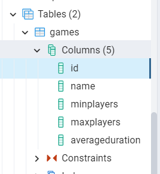

When working with relational databases, you often come across two tasks: writing SQL queries and mapping the results to some DTO objects.

.NET developers are lucky to have an incredibly powerful tool that can speed up their development: Entity Framework. Entity Framework (in short: EF) is an ORM built with in mind **simplicity and readability**.

In this article, we will perform CRUD operations with Entity Framework Core on a database table stored on PostgreSQL.

## Introduction EF Core

With Entity Framework you don't have to write SQL queries in plain text: you write C# code that gets automatically translated into SQL commands. Then the result is automatically mapped to your C# classes.

Entity Framework supports tons of database engines, such as SQL Server, MySQL, Azure CosmosDB, Oracle, and, of course, PostgreSQL.

There are a lot of things you should know about EF if you're new to it. In this case, the best resource is its [official documentation](https://docs.microsoft.com/en-us/ef/core "Entity Framework documentation").

But the only way to learn it is by getting your hands dirty. Let's go!

## How to set up EF Core

For this article, we will reuse the same .NET Core repository and the same database table we used when we performed CRUD operations [with Dapper](https://www.code4it.dev/blog/postgres-crud-dapper "Dapper and Postgres") (a lightweight OR-M) and [with NpgSql](https://www.code4it.dev/blog/postgres-crud-operations-npgsql "Dapper and NpgSql"), which is the library that performs bare-metal operations.

The first thing to do is, as usual, **install the related NuGet package**. Here we will need `Npgsql.EntityFrameworkCore.PostgreSQL`. Since I've used .NET 5, I have downloaded version _5.0.10_.


Then, we need to **define and configure the DB Context**.

### Define and configure DbContext

The idea behind Entity Framework is to create _DB Context_ objects that map database tables to C# data sets. **DB Contexts are the entry point to the tables**, and the EF way to work with databases.

So, the first thing to do is to define a class that inherits from `DbContext`:

```cs
public class BoardGamesContext : DbContext
{

}
```

Within this class we define one or more `DbSets`, that represent the collections of data rows on their related DB table:

```cs
public DbSet<BoardGame> Games { get; set; }
```

Then we can configure this specific _DbContext_ by overriding the `OnConfiguring` method and specifying some options; for example, you can specify the connection string:

```cs
protected override void OnConfiguring(DbContextOptionsBuilder optionsBuilder)
{
    optionsBuilder.UseNpgsql(CONNECTION_STRING);
    base.OnConfiguring(optionsBuilder);
}
```

**Remember to call `base.OnConfiguring`!** Otherwise some configurations will not be applied, and the system may not work.

Also, **pay attention to the Port in the connection string!** While with other libraries you can define it as

```cs
private const string CONNECTION_STRING = "Host=localhost:5455;" +
    "Username=postgresUser;" +
    "Password=postgresPW;" +
    "Database=postgresDB";
```

**Entity Framework core requires the port to be specified in a different field**:

```cs
private const string CONNECTION_STRING = "Host=localhost;"+
            "Port=5455;" + // THIS!!!!!
            "Username=postgresUser;" +
            "Password=postgresPW;" +
            "Database=postgresDB";
```

If you don't explicitly define the Port, EF Core won't recognize the destination host.

Then, **we can configure the models mapped to DB tables by overriding `OnModelCreating`**:

```cs
protected override void OnModelCreating(ModelBuilder modelBuilder)
{
    modelBuilder.Entity<BoardGame>(e => e.ToTable("games"));
    base.OnModelCreating(modelBuilder);
}
```

Here we're saying that the rows in the _games_ table will be mapped to `BoardGame` objects. _We will come back to it later_.

For now, we're done; here's the full `BoardGamesContext` class:

```cs
public class BoardGamesContext : DbContext
{
    public DbSet<BoardGame> Games { get; set; }

    protected override void OnConfiguring(DbContextOptionsBuilder optionsBuilder)
    {
        optionsBuilder.UseNpgsql(CONNECTION_STRING);
        base.OnConfiguring(optionsBuilder);
    }
    private const string CONNECTION_STRING = "Host=localhost;Port=5455;" +
                "Username=postgresUser;" +
                "Password=postgresPW;" +
                "Database=postgresDB";

    protected override void OnModelCreating(ModelBuilder modelBuilder)
    {
        modelBuilder.Entity<BoardGame>(e => e.ToTable("games"));
        base.OnModelCreating(modelBuilder);
    }
}
```

### Add the DbContext to Program

Now that we have the `BoardGamesContext` ready we have to add its reference in the `Startup` class.

In the `ConfigureServices` method, add the following instruction:

```cs
services.AddDbContext<BoardGamesContext>();
```

With this instruction, you make the `BoardGamesContext` context available across the whole application.

You can further configure that context using an additional parameter of type `Action<DbContextOptionsBuilder>`. In this example, you can skip it, since we've already configured the `BoardGamesContext` using the `OnConfiguring` method. They are equivalent.

If you don't like

```cs
protected override void OnConfiguring(DbContextOptionsBuilder optionsBuilder)
{
    optionsBuilder.UseNpgsql(CONNECTION_STRING);
    base.OnConfiguring(optionsBuilder);
}
```

you can do

```cs
services.AddDbContext<BoardGamesContext>(
    optionsBuilder => optionsBuilder.UseNpgsql(CONNECTION_STRING)
);
```

The choice is yours!

### Define and customize the DB Model

As we know, EF allows you to map DB rows to C# objects. So, we have to create a class and configure it in a way that allows EF Core to perform the mapping.

Here we have the `BoardGame` class:

```cs
public class BoardGame
{
    [System.ComponentModel.DataAnnotations.Key]
    public int Id { get; set; }

    public string Name { get; set; }

    public int MinPlayers { get; set; }

    public int MaxPlayers { get; set; }

    public int AverageDuration { get; set; }
}
```

Notice that **we've explicitly declared that `Id` is the primary key** in the table.

But it's not enough! This way the code won't work! 😣

Have a look at the table on Postgres:



Have you noticed it? **Postgres uses lowercase names**, but we are using CamelCase. **C# names must be 100% identical to those in the database**!

Now we have two ways:

➡ Rename all the C# properties to their lowercase equivalent

```cs
public class BoardGame
{
    [System.ComponentModel.DataAnnotations.Key]
    public int id { get; set; }
    public string name { get; set; }
    /// and so on
}
```

➡ decorate all the properties with the `Column` attribute.

```cs
public class BoardGame
{
    [System.ComponentModel.DataAnnotations.Key]
    [Column("id")]
    public int Id { get; set; }

    [Column("name")]
    public string Name { get; set; }

    [Column("minplayers")]
    public int MinPlayers { get; set; }

    [Column("maxplayers")]
    public int MaxPlayers { get; set; }

    [Column("averageduration")]
    public int AverageDuration { get; set; }
}
```

Using the `Column` attribute is useful also when the DB column names and the C# properties differ for more than just the case, like in:

```cs
[Column("averageduration")]
public int AvgDuration { get; set; }
```

Is it enough? Have a look again at the table definition:


Noticed the table name? It's "games", not "BoardGame"!

We need to tell EF which is the table that contains `BoardGame` objects.

Again, we have two ways:

➡ Override the `OnModelCreating` method in the `BoardGamesContext` class, as we've seen before:

```cs
protected override void OnModelCreating(ModelBuilder modelBuilder)
{
    modelBuilder.Entity<BoardGame>(e => e.ToTable("games"));
    base.OnModelCreating(modelBuilder);
}
```

➡ Add the `Table` attribute to the `BoardGame` class:

```cs
[Table("games")]
public class BoardGame
{...}
```

Again, the choice is yours.

## CRUD operations with Entity Framework

Now that the setup is complete, we can perform our CRUD operations. Entity Framework simplifies _a lot_ the way to perform such types of operations, so we can move fast in this part.

There are two main points to remember:

1. to access the context we have to create a new instance of `BoardGamesContext`, which should be placed into a `using` block.
2. When performing operations that change the status of the DB (insert/update/delete rows), you have to explicitly call `SaveChanges` or `SaveChangesAsync` to apply those changes. This is useful when performing batch operations on one or more tables (for example, inserting an order in the Order table and updating the user address in the Users table).

### Create

To add a new `BoardGame`, we have to initialize the `BoardGamesContext` context and add a new game to the `Games` DbSet.

```cs
public async Task Add(BoardGame game)
{
    using (var db = new BoardGamesContext())
    {
        await db.Games.AddAsync(game);
        await db.SaveChangesAsync();
    }
}
```

### Read

If you need a specific entity by its id you can use `Find` and `FindAsync`.

```cs
public async Task<BoardGame> Get(int id)
{
    using (var db = new BoardGamesContext())
    {
        return await db.Games.FindAsync(id);
    }
}
```

Or, if you need all the items, you can retrieve them by using `ToListAsync`

```cs
public async Task<IEnumerable<BoardGame>> GetAll()
{
    using (var db = new BoardGamesContext())
    {
        return await db.Games.ToListAsync();
    }
}
```

### Update

Updating an item is incredibly straightforward: you have to call the `Update` method, and then save your changes with `SaveChangesAsync`.

```cs
public async Task Update(int id, BoardGame game)
{
    using (var db = new BoardGamesContext())
    {
        db.Games.Update(game);
        await db.SaveChangesAsync();

    }
}
```

For some reason, EF does not provide an asynchronous way to update and remove items. I suppose that it's done to prevent or mitigate race conditions.

### Delete

Finally, to delete an item you have to call the `Remove` method and pass to it the game to be removed. Of course, you can retrieve that game using `FindAsync`.

```cs
public async Task Delete(int id)
{
    using (var db = new BoardGamesContext())
    {
        var game = await db.Games.FindAsync(id);
        if (game == null)
            return;

        db.Games.Remove(game);
        await db.SaveChangesAsync();
    }
}
```

## Further readings

Entity Framework is impressive, and you can integrate it with tons of database vendors. In the link below you can find the full list. But pay attention that not all the libraries are implemented by the EF team, some are third-party libraries (like the one we used for Postgres):

🔗 [Database Providers | Microsoft docs](https://docs.microsoft.com/en-us/ef/core/providers/?tabs=dotnet-core-cli "EF supported database providers")

If you want to start working with PostgreSQL, a good way is to download it as a _Docker_ image:

🔗 [How to run PostgreSQL locally with Docker | Code4IT](https://www.code4it.dev/blog/run-postgresql-with-docker "Postgres in a Docker image")

Then, if you don't like Entity Framework, you can perform CRUD operations using the native library, _NpgSql_:

🔗 [CRUD operations on PostgreSQL using C# and Npgsql | Code4IT](https://www.code4it.dev/blog/postgres-crud-operations-npgsql "How to query Postgres with C#")

or, maybe, if you prefer Dapper:

🔗 [PostgreSQL CRUD operations with C# and Dapper | Code4IT](https://www.code4it.dev/blog/postgres-crud-dapper "How to query Postgres with Dapper")

Finally, you can have a look at the full repository here:

🔗 [Repository used for this article | GitHub](https://github.com/code4it-dev/PostgresCrudOperations "GitHub repository used for this article")

_This article first appeared on [Code4IT 🐧](https://www.code4it.dev/)_

## Wrapping up

This article concludes the series that explores 3 ways to perform CRUD operations on a Postgres database with C#.

In the first article, we've seen how to perform bare-metal queries using NpgSql. In the second article, we've used Dapper, which helps mapping queries results to C# DTOs. Finally, we've used Entity Framework to avoid writing SQL queries and have everything in place.

Which one is your favorite way to query relational databases?

What are the pros and cons of each approach?

Happy coding!

🐧
