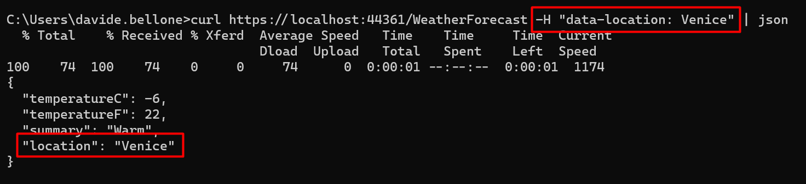

If you are building an application that is exposed on the Web, you will probably need to read some data from the current HTTP Request or set some values on the HTTP Response.

In a .NET API, all the info related to both HTTP Request and HTTP Response is stored in a global object called `HttpContext`. How can you access it?

In this article, we will learn how to get rid of the old `HttpContext.Current` and what we can do to write more testable code.

## Why not HttpContext directly

Years ago, we used to access the `HttpContext` directly in our code.

For example, if we had to access the Cookies collection, we used to do

```cs
var cookies = HttpContext.Current.Request.Cookies;
```

It worked, right. But this approach has a big problem: **it makes our tests hard to set up**.

In fact, we were using a static instance that added a direct dependency between the client class and the HttpContext.

That's why the .NET team has decided to abstract the retrieval of that class: we now need to use `IHttpContextAccessor`.

## Add IHttpContextAccessor

Now, I have this .NET project that exposes an endpoint, _/WeatherForecast_, that returns the current weather for a particular city, whose name is stored in the HTTP Header "data-location".

The real calculation (well, real... everything's fake, here 😅) is done by the WeatherService. In particular, by the `GetCurrentWeather` method.

```cs
public WeatherForecast GetCurrentWeather()
{
    string currentLocation = GetLocationFromContext();

    var rng = new Random();

    return new WeatherForecast
    {
        TemperatureC = rng.Next(-20, 55),
        Summary = Summaries[rng.Next(Summaries.Length)],
        Location = currentLocation
    };
}
```

We have to retrieve the current location.

As we said, we cannot anymore rely on the old `HttpContext.Current.Request`.

Instead, we need to inject `IHttpContextAccessor` in the constructor, and use it to access the `Request` object:

```cs
public WeatherService(IHttpContextAccessor httpContextAccessor)
{
    _httpContextAccessor = httpContextAccessor;
}
```

Once we have the instance of `IHttpContextAccessor`, we can use it to retrieve the info from the current HttpContext headers:

```cs
string currentLocation = "";

if (_httpContextAccessor.HttpContext.Request.Headers.TryGetValue("data-location", out StringValues locationHeaders) && locationHeaders.Any())
{
    currentLocation = locationHeaders.First();
}

return currentLocation;
```

Easy, right? We're almost done.

## Configure Startup class

If you run the application in this way, you will not be able to access the current HTTP request.

That's because we haven't specified that we want to add `IHttpContextAccessor` as a service in our application.

To do that, we have to update the `ConfigureServices` class by adding this instruction:

```cs
services.AddHttpContextAccessor();
```

Which comes from the `Microsoft.Extensions.DependencyInjection` namespace.

Now we can run the project!

If we call the endpoint specifying a City in the `data-location` header, we will see its value in the returned `WeatherForecast` object, in the `Location` field:



## Further improvements

Is it enough?


If we use it this way, every class that needs to access the HTTP Context will have tests quite difficult to set up, because you will need to mock several objects.

In fact, for mocking `HttpContext.Request.Headers`, we need to create mocks for `HttpContext`, for `Request`, and for `Headers`.

This makes our tests harder to write and understand.

So, my suggestion is to wrap the `HttpContext` access in a separate class and expose only the methods you actually need.

For instance, you could wrap the access to HTTP Request Headers in the `GetValueFromRequestHeader` of an `IHttpContextWrapper` service:

```cs
public interface IHttpContextWrapper
{
    string GetValueFromRequestHeader(string key, string defaultValue);
}

```

That will be the only service that accesses the `IHttpContextAccessor` instance.

```cs
public class HttpContextWrapper : IHttpContextWrapper
{
    private readonly IHttpContextAccessor _httpContextAccessor;

    public HttpContextWrapper(IHttpContextAccessor httpContextAccessor)
    {
        _httpContextAccessor = httpContextAccessor;
    }

    public string GetValueFromRequestHeader(string key, string defaultValue)
    {
        if (_httpContextAccessor.HttpContext.Request.Headers.TryGetValue(key, out StringValues headerValues) && headerValues.Any())
        {
            return headerValues.First();
        }

        return defaultValue;
    }
}
```

In this way, you will be able to write better tests both for the `HttpContextWrapper` class, by focusing on the building of the HttpRequest, and for the `WeatherService` class, so that you can write tests without worrying about setting up complex structures just for retrieving a value.

But **pay attention to the dependency lifescope**! HTTP Requests info live within - guess what? - their HTTP Request. So, when defining the dependencies in the `Startup` class, remember to inject the `IHttpContextWrapper` as _Transient_ or, even better, as _Scoped_. If you don't remember the difference, I got you covered [here](https://www.code4it.dev/blog/dependency-injection-lifetimes "Dependency Injection lifetimes in .NET | Code4IT")!

## Wrapping up

In this article, we've learned that you can access the current HTTP request by using `IHttpContextAccessor`. Of course, you can use it to update the Response too, for instance by adding an HTTP Header.

Happy coding!

🐧
