This is my 100th article 🥳 To celebrate it, I want to share with you the full process I use for writing and publishing articles.

In this article I will share all the automation and tools I use for writing, starting from the moment an idea for an article pops up in my mind to what happens weeks after an article has been published.

I hope to give you some ideas to speed up your publishing process. Of course, I'm open to suggestions to improve my own flow: perhaps (well, certainly), you use better tools and processes, so feel free to share them.

## Introducing my blog architecture

To better understand what's going on, I need a very brief overview of the architecture of my blog.

It is written in [Gatsby](https://www.gatsbyjs.com/ "GatsbyJS homepage"), a framework based on ReactJS that, in short, allows you to transform Markdown files into blog posts (it does many other things, but they are not important for the purpose of this article). 

So, all my blog is stored in a private GitHub repository. Every time I push some changes on the *master* branch, a  new deployment is triggered, and I can see my changes in a bunch of minutes on my blog.

As I said, I use Gatsby. But the key point here is that my blog is stored in a GitHub repo: this means that everything you'll read here is valid for any Headless CMS based on Git, such as Gatsby, Hugo, NextJS, and Jekyll.

Now that you know some general aspects, it's time to deep dive into my writing process.

## Before writing: organizing ideas with GitHub

My central source, as you might have already understood, is GitHub. 

There, I write all my notes and keep track of the status of my articles.

Everything is quite well organized, and with the support of some automation, I can speed up my publishing process.

### Github Projects to track the status of the articles

*GitHub Projects* are the parts of GitHub that allow you to organize GitHub Issues to track their status.

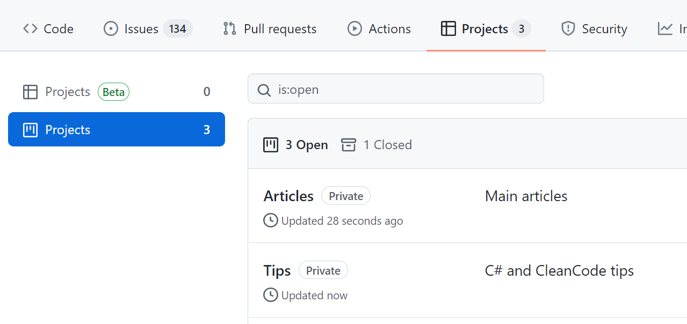

I've created 2 GitHub Projects: one for the main articles (like this one), and one for my C# and Clean Code Tips.

In this way, I can use different columns and have more flexibility when handling the status of the tasks.

### GitHub issues templates

As I said, to write my notes I use GitHub issues. 

When I add a new Issue, the first thing is to define which type of article I want to write. And, since sometimes many weeks or months pass between when I came up with the idea for an article and when I start writing it, I need to organize my ideas in a structured way. 

To do that, I use **GitHub templates**. When I create a new Issue, I choose which kind of article I'm going to write.

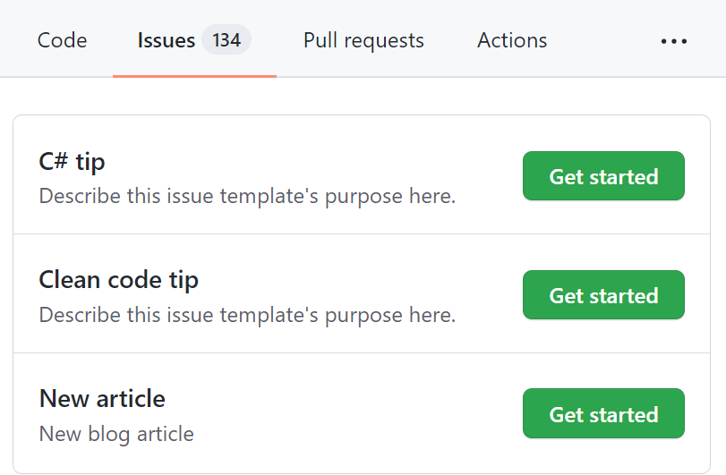

Based on the layout, I can add different info. For instance, when I want to write a new "main" article, I see this form

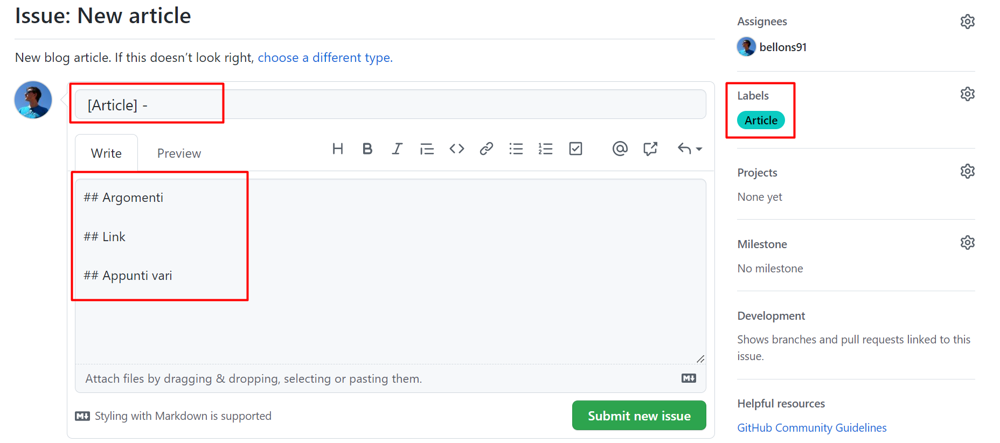

which is prepopulated with some fields: 

* *Title*: with a placeholder (`[Article]` )
* *Content*: with some sections (the titles, translated from Italian, mean Topics, Links, General notes)
* *Labels*: I automatically assign the *Article* label to the issue (you'll see later why I do that)

**How can you create GitHub issue templates?** All you need is a Markdown file under the `.github/ISSUE_TEMPLATE` folder with content similar to this one.

```md
---
name: New article
about: New blog article
title: "[Article] - "
labels: Article
assignees: bellons91
---

## Argomenti

## Link

## Appunti vari

```

And you're good to go!

### GitHub action to assign issues to a project

Now I have GitHub Projects and different GitHub Issues Templates. How can I join the different parts? Well, with **GitHub Actions**!

With GitHub Actions, you can automate almost everything that happens in GitHub (and outside) using YAML files.

So, here's mine:

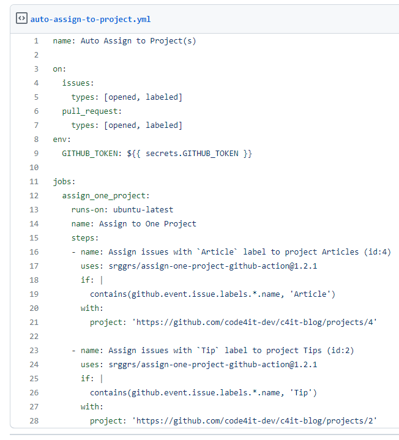

For better readability, you can find the Gist [here](https://gist.github.com/bellons91/df04f32c77c43d9222f26bb32b6a0d3a "Auto-assign to project GitHub Action").

This action looks for opened and labeled issues and pull requests, and based on the value of the label it assigns the element to the correct project.

In this way, after I choose a template, filled the fields, and added additional labels (like C#, Docker, and so on), I can see my newly created issue directly in the Articles board. Neat 😎

## Writing

Now it's the time of writing!

As I said, I'm using Gatsby, so all my articles are stored in a GitHub repository and written in Markdown.

For every article I write, I use a separate *git branch*: in this way, I'm free to update the content already online (in case of a typo) without publishing my drafts.

But, of course, I automated it! 😎

### Powershell script to scaffold a new article

Every article lives in its `/content/posts/{year}/{folder-name}/article.md` file. And they all have a cover image in a file named `cover.png`.

Also, every MD file begins with a Frontmatter section, like this:

```md
---
title: "How I automated my publishing flow with Gatsby, GitHub, PowerShell and Azure"
path: '/blog/automate-articles-creations-github-powershell-azure'
tags: ["MainArticle"]
featuredImage: "./cover.png"
excerpt: "a description for 072-how-i-create-articles"
created: 4219-11-20
updated: 4219-11-20
---
```

But, you know, I was tired of creating everything from scratch. So I wrote a *Powershell Script* to do everything for me.

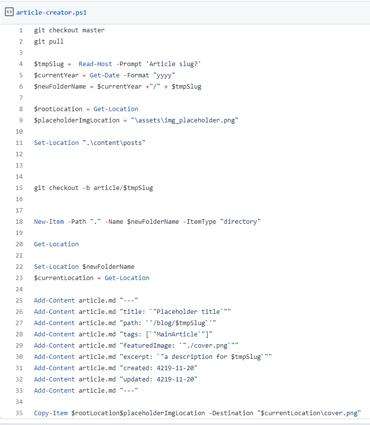

You can find the code [in this Gist](https://gist.github.com/bellons91/5f6394168651dff0d807a7a840ffbcd0
"Gist of the PowerShell script to scaffold a new article").

This script performs several actions:

1. Switches to the Master branch and downloads the latest updates
2. Asks for the article slug that will be used to create the folder name
3. Creates a new branch using the article slug as a name
4. Creates a new folder that will contain all the files I will be using for my article (markdown content and images)
5. Creates the article file with the Frontmatter part populated with dummy values
6. Copies a placeholder image into this folder; this image will be the temporary cover image

In this way, with a single command, I can scaffold a new article with all the files I need to get started.

Ok, but **how can I run a PowerShell in a Gatsby repository?**

I added this script in the *package.json* file

```
"create-article": "@powershell -NoProfile -ExecutionPolicy Unrestricted -Command ./article-creator.ps1",
```

where *article-creator.ps1* is the name of the file that contains the script.

Now I can simply run `npm run create-article` to have a new empty article in a new branch, already updated with everything published in the Master branch.


### Markdown preview on VS Code

I use Visual Studio Code to write my articles: I like it because it's quite fast and with lots of functionalities to write in Markdown (you can pick your favorites in the Extensions store).

One of my favorites is the Preview on Side. To see the result of your MarkDown on a side panel, press *CTRL+SHIFT+P* and select Open Preview to the Side.

Here's what I can see right now while I'm writing:

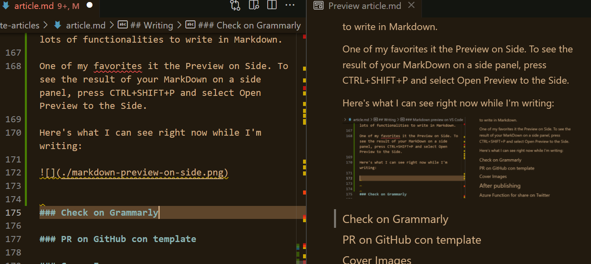

### Grammar check with Grammarly

Then, it's time for a check on the Grammar. I use Grammarly, which helps me fix lots of errors (well, in the last time, only a few: it means I've improved a lot! 😎).

I copy the Markdown in their [online editor](https://app.grammarly.com/ "Grammarly online editor"), fix the issues, and copy it back into my repo.

Fun fact: the online editor recognizes that you're using Markdown and automatically checks only the actual text, ignoring all the symbols you use in Markdown (like brackets).

### Unprofessional, but fun, cover images

One of the tasks I like the most is creating my cover images.

I don't use stock images, I prefer using less professional but more original cover images.

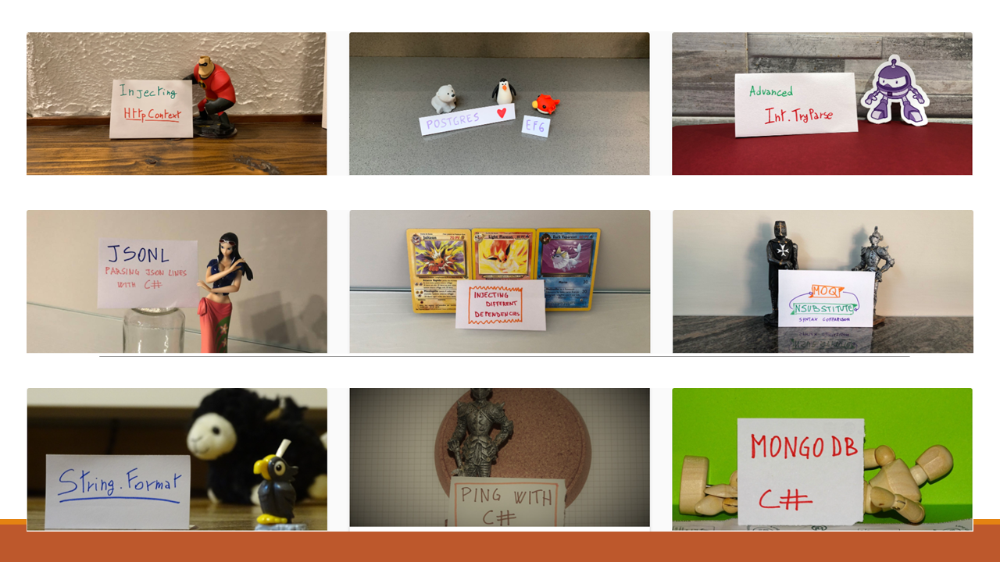

You can see all of them [here](https://www.code4it.dev/tag/mainarticle "Code4IT main articles").

### Creating and scheduling PR on GitHub with Templates and Actions

Now that my article is complete, I can set it as ready for being scheduled.

To do that, I open a Pull Request to the Master Branch, and, again, add some kind of automation!

I have created a PR template in an MD file, which I use to create a draft of the PR content.

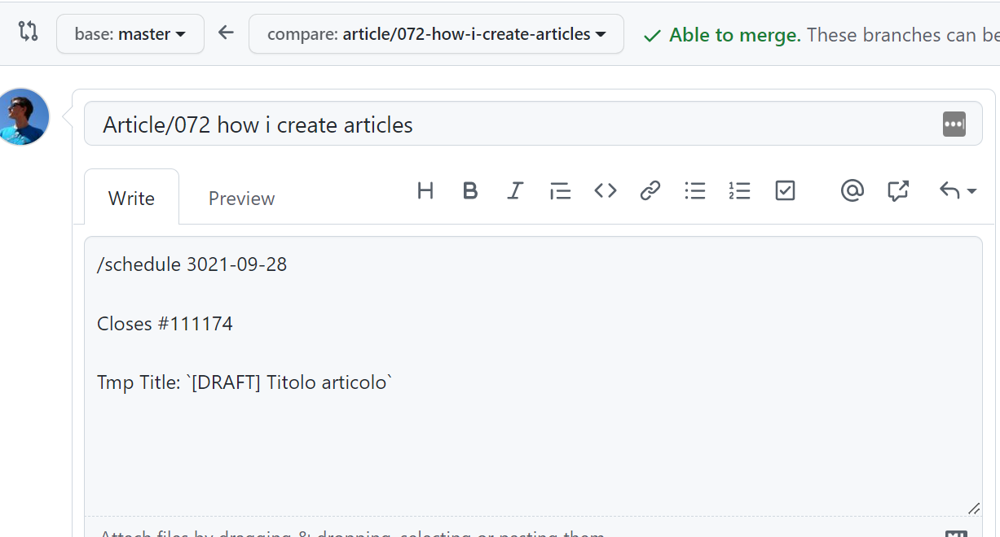

In this way, I can define which task (so, which article) is related to this PR, using the "Closes" formula ("Closes #111174" means that I'm closing the Issue with ID 111174).

Also, I can define when this PR will be merged on Master, using the `/schedule` tag.

It works because I have integrated into my workflow a GitHub Action, *merge-schedule*, that reads the date from that field to understand when the PR must be merged.

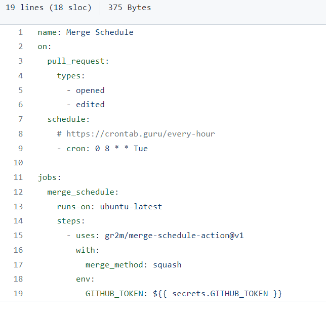

So, every Tuesday at 8 AM, this action runs to check if there are any PRs that can be merged. If so, the PR will be merged into *master*, and the CI/CD pipeline builds the site and publishes the new content.

As usual, you can find the code of this action [here](https://gist.github.com/bellons91/f713f9f2f91f56660fe70f63b826710d "Gist of Merge Schedule action")

After the PR is merged, I also receive an email that notifies me of the action.

## After publishing

Once a new article is online, I like to give it some visibility.

To do that, I heavily rely on **Azure Logic Apps**.

### Azure Logic App for sharing on Twitter

My blog exposes an RSS feed. And, obviously, when a new article is created, a new item appears in the feed.

I use it to trigger an Azure Logic App to publish a message on Twitter:

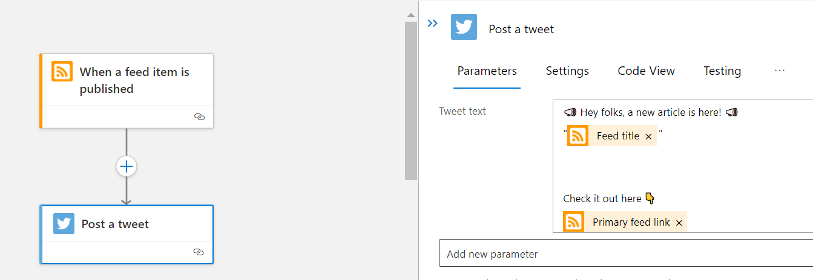

The Logic App reads the newly published feed item and uses its metadata to create a message that will be shared on Twitter.

If you prefer, you can use a custom Azure Function! The choice is yours!

### Cross-post reminder with Azure Logic Apps 

Similarly, I use an Azure Logic App to send to myself an email to remind me to cross-post my articles to other platforms.

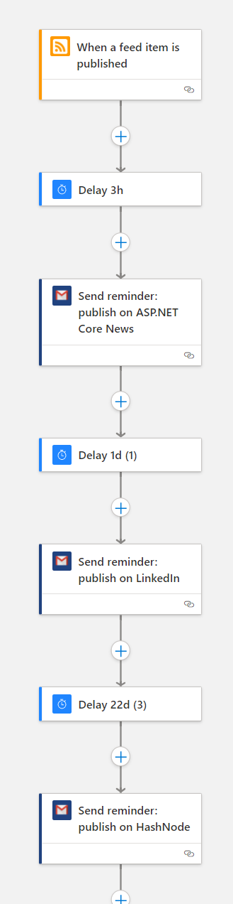

I've added a delay so that my content lives longer, and I can repost it even after weeks or months.

Unluckily, when I cross-post my articles I have to do it manually, This is quite a time-consuming especially when there are lots of images: in my MD files I use relative paths, so when porting my content to different platforms I have to find the absolute URL for my images. 

And, my friends, this is everything that happens in the background of my blog!

## What I'm still missing

I've added a lot of effort to my blog, and I'm incredibly proud of it!

But still, there are a few things I'd like to improve.

### SEO Tools/analysis

I've never considered SEO. Or, better, Keywords. 

I write for the sake of writing, and because I love it. And I don't like to stuff my content with keywords just to rank better on search engines.

I take care of everything like alt texts, well-structured sections, and everything else. But I'm not able to follow the "rules" to find the best keywords.

Maybe I should use some SEO tools to find the best keywords for me. But I don't want to bend to that way of creating content.

Also, I should spend more time thinking of the correct title and section titles.

Any idea?

### Easy upgrade of Gatsby/Migrate to other headless CMSs

Lastly, I'd like to find another theme or platform and leave the one I'm currently using.

Not because I don't like it. But because many dependencies are outdated, and the theme I'm using hasn't been updated since 2019.

## Wrapping up

That's it: in this article, I've explained **everything** that I do when writing a blog post.

Feel free to take inspiration from my automation to improve your own workflow, and contact me if you have some nice improvements or ideas: I'm all ears!

So, for now, happy coding!

🐧
