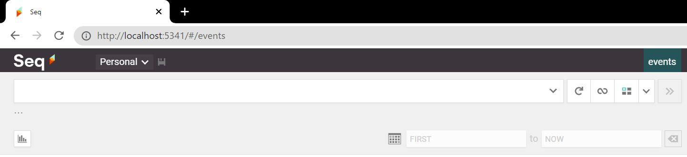
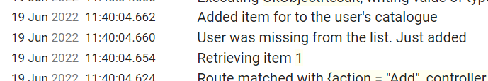
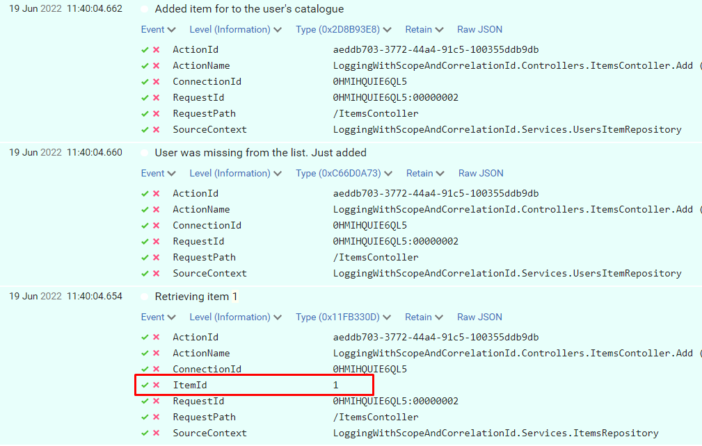
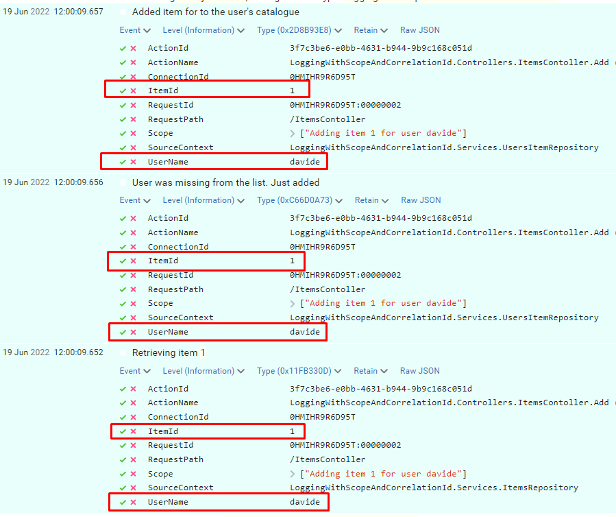
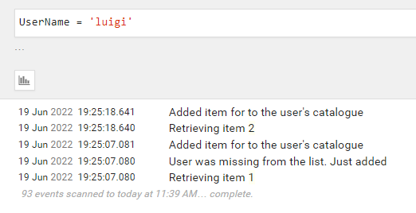
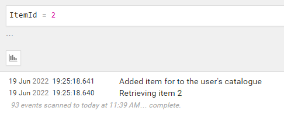

Even though it's not one of the first things we usually set up when creating a new application, logging is a real game-changer in the long run.

When an error occurred, if we have proper logging we can get more info about the context where it happened so that we can easily identify the root cause.

In this article, we will use **Scopes**, one of the functionalities of **Serilog**, to create better logs for our .NET 6 application. In particular, we're going to create a .NET 6 API application in the form of Minimal APIs.

We will also use **Seq**, just to show you the final result.

## Adding Serilog in our Minimal APIs

We've already explained what Serilog and Seq are [in a previous article](https://www.code4it.dev/blog/logging-with-serilog-and-seq).

To summarize, Serilog is an **open source** .NET library for logging. One of the best features of Serilog is that messages are in the form of a template (called **Structured Logs**), and you can enrich the logs with some value automatically calculated, such as the method name or exception details.

To add Serilog to your application, you simply have to run `dotnet add package Serilog.AspNetCore`.

**Since we're using Minimal APIs, we don't have the StartUp file** anymore; instead, we will need to add it to the Program.cs file:

```cs
builder.Host.UseSerilog((ctx, lc) => lc
    .WriteTo.Console() );
```

Then, to create those logs, you will need to add a specific dependency in your classes:

```cs
public class ItemsRepository : IItemsRepository
{
    private readonly ILogger<ItemsRepository> _logger;

    public ItemsRepository(ILogger<ItemsRepository> logger)
    {
        _logger = logger;
    }
}
```

As you can see, we're injecting an `ILogger<ItemsRepository>`: specifying the related class automatically adds some more context to the logs that we will generate.

## Installing Seq and adding it as a Sink

Seq is a logging platform that is a perfect fit for Serilog logs. If you don't have it already installed, head to their [download page](https://datalust.co/Download "Seq download page") and install it locally (you can even install it as a Docker container 🤩).

In the installation wizard, you can select the HTTP port that will expose its UI. Once everything is in place, you can open that page on your localhost and see a page like this:



On this page, we will see all the logs we write.

But wait! ⚠ We still have to add Seq as a sink for Serilog.

**A sink is nothing but a destination for the logs**. When using .NET APIs we can define our sinks both on the _appsettings.json_ file and on the _Program.cs_ file. We will use the second approach.

First of all, you will need to install a NuGet package to add Seq as a sink: `dotnet add package Serilog.Sinks.Seq`.

Then, you have to update the Serilog definition we've seen before by adding a `.WriteTo.Seq` instruction:

```cs
builder.Host.UseSerilog((ctx, lc) => lc
    .WriteTo.Console()
    .WriteTo.Seq("http://localhost:5341")
    );
```

Notice that we've specified also the port that exposes our Seq instance.

Now, every time we log something, we will see our logs both on the Console and on Seq.

## How to add scopes

The time has come: we can finally learn how to add Scopes using Serilog!

### Setting up the example

For this example, I've created a simple controller, `ItemsController`, which exposes two endpoints: `Get` and `Add`. With these two endpoints, we are able to add and retrieve items stored in an in-memory collection.

This class has 2 main dependencies: `IItemsRepository` and `IUsersItemsRepository`. Each of these interfaces has its own concrete class, each with a private logger injected in the constructor:

```cs
public ItemsRepository(ILogger<ItemsRepository> logger)
{
    _logger = logger;
}
```

and, similarly

```cs
public UsersItemRepository(ILogger<UsersItemRepository> logger)
{
    _logger = logger;
}
```

How do those classes use their own `_logger` instances?

For example, the `UsersItemRepository` class exposes an `AddItem` method that adds a specific item to the list of items already possessed by a specific user.

```cs
public void AddItem(string username, Item item)
{
    if (!_usersItems.ContainsKey(username))
    {
        _usersItems.Add(username, new List<Item>());
        _logger.LogInformation("User was missing from the list. Just added");
    }
    _usersItems[username].Add(item);
    _logger.LogInformation("Added item for to the user's catalogue");
}
```

We are logging some messages, such as "User was missing from the list. Just added".

Something similar happens in the `ItemsRepository` class, where we have a `GetItem` method that returns the required item if it exists, and `null` otherwise.

```cs
public Item GetItem(int itemId)
{
    _logger.LogInformation("Retrieving item {ItemId}", itemId);
    return _allItems.FirstOrDefault(i => i.Id == itemId);
}
```

Finally, who's gonna call these methods?

```cs
[HttpPost(Name = "AddItems")]
public IActionResult Add(string userName, int itemId)
{
    var item = _itemsRepository.GetItem(itemId);

    if (item == null)
    {
        _logger.LogWarning("Item does not exist");

        return NotFound();
    }
    _usersItemsRepository.AddItem(userName, item);

    return Ok(item);
}
```

Ok then, we're ready to run the application and see the result.

When I call that endpoint by passing "davide" as userName and "1" as itemId, we can see these logs:



We can see the 3 log messages but they are unrelated one each other. In fact, if we expand the logs to see the actual values we've logged, we can see that only the "Retrieving item 1" log has some information about the item ID we want to associate with the user.



### Using BeginScope with Serilog

Finally, it's time to define the Scope.

It's as easy as adding a simple `using` statement; see how I added the scope to the `Add` method in the Controller:

```cs
[HttpPost(Name = "AddItems")]
public IActionResult Add(string userName, int itemId)
{
    using (_logger.BeginScope("Adding item {ItemId} for user {UserName}", itemId, userName))
    {
        var item = _itemsRepository.GetItem(itemId);

        if (item == null)
        {
            _logger.LogWarning("Item does not exist");

            return NotFound();
        }
        _usersItemsRepository.AddItem(userName, item);

        return Ok(item);
    }
}
```

Here's the key!

```cs
using (_logger.BeginScope("Adding item {ItemId} for user {UserName}", itemId, userName))
```

With this single instruction, we are actually performing 2 operations:

1. we are adding a Scope to each message - "Adding item 1 for user davide"
2. we are adding ItemId and UserName to each log entry that falls in this block, in every method in the method chain.

Let's run the application again, and we will see this result:



So, now you can use these new properties to get some info about the context of when this log happened, and you can use the ItemId and UserName fields to search for other related logs.

**You can also nest scopes**, of course.

## Why scopes instead of Correlation ID?

You might be thinking

> Why can't I just use correlation IDs?

Well, the answer is pretty simple: correlation IDs are meant to correlate different logs in a specific request, and, often, across services. You generally use Correlation IDs that represent a specific call to your API and act as a Request ID.

For sure, that can be useful. But, sometimes, not enough.

Using scopes you can also "correlate" distinct HTTP requests that have something in common.

If I call 2 times the `AddItem` endpoint, I can filter both for UserName and for ItemId and see all the related logs across distinct HTTP calls.

Let's see a real example: I have called the endpoint with different values

- id=1, username="davide"
- id=1, username="luigi"
- id=2, username="luigi"

Since the scope reference both properties, we can filter for UserName and discover that Luigi has added both Item1 and Item 2.



At the same time, we can filter by ItemId and discover that the item with id = 2 has been added only once.



Ok, then, in the end, **Scopes or Correlation IDs**? The answer is simple:


## Read more

As always, the best place to find the info about a library is its documentation.

🔗 [Serilog website](https://serilog.net/ "Serilog official website")

If you prefer some more practical articles, I've already written one to help you get started with Serilog and Seq (and with Structured Logs):

🔗 [Logging with Serilog and Seq | Code4IT](https://www.code4it.dev/blog/logging-with-serilog-and-seq "First steps with Serilog and Seq")

as well as one about adding Serilog to Console applications (which is slightly different from adding Serilog to .NET APIs)

🔗 [How to add logs on Console with .NET Core and Serilog | Code4IT](https://www.code4it.dev/blog/serilog-log-on-console "How to add Serilog to .NET Console applications")

Then, you might want to deep dive into Serilog's BeginScope. Here's a neat article by Nicholas Blumhardt. Also, have a look at the comments, you'll find interesting points to consider

🔗 [The semantics of ILogger.BeginScope | Nicholas Blumhardt](https://nblumhardt.com/2016/11/ilogger-beginscope/ "Deep dive on BeginScope")

Finally, two must-read articles about logging best practices.

The first one is by Thiago Nascimento Figueiredo:

🔗 [Logs - Why, good practices, and recommendations | Dev.to](https://dev.to/tnfigueiredo/logs-why-good-practices-and-recommendations-ojd "Logging best practices")

and the second one is by Llron Tal:

🔗 [9 Logging Best Practices Based on Hands-on Experience | Loom Systems](https://www.loomsystems.com/blog/single-post/2017/01/26/9-logging-best-practices-based-on-hands-on-experience "More logging best practices")

## Wrapping up

In this article, we've added Scopes to our logs to enrich them with some common fields that can be useful to investigate in case of errors.

Remember to read the last 3 links I've shared above, they're pure gold - you'll thank me later 😎

Happy coding!

🐧
