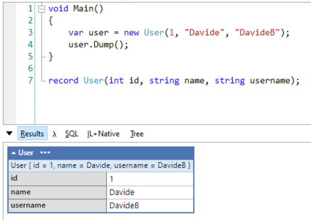
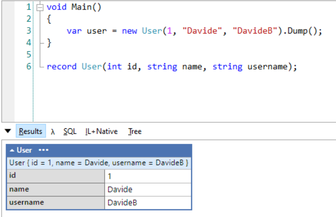
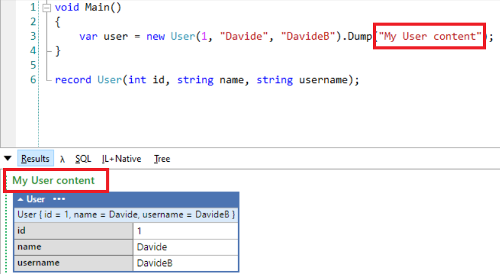
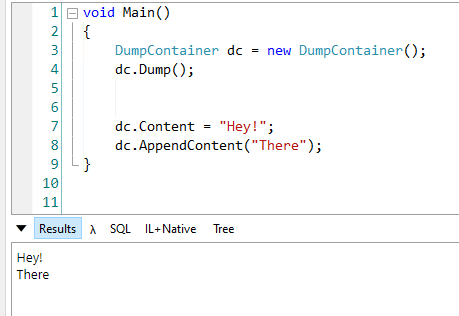
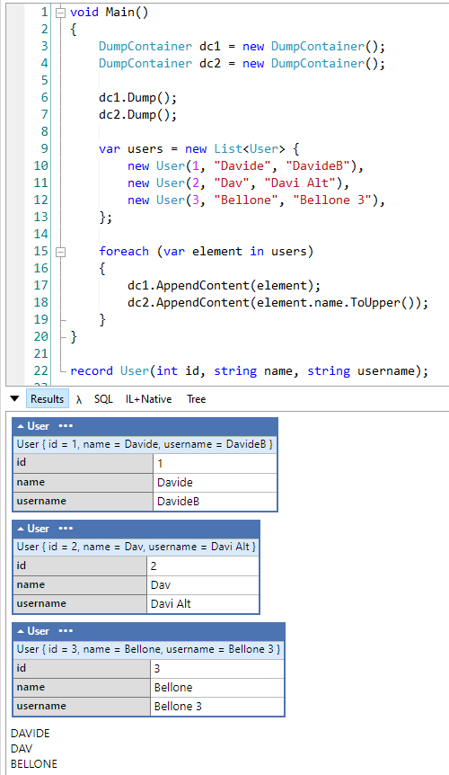
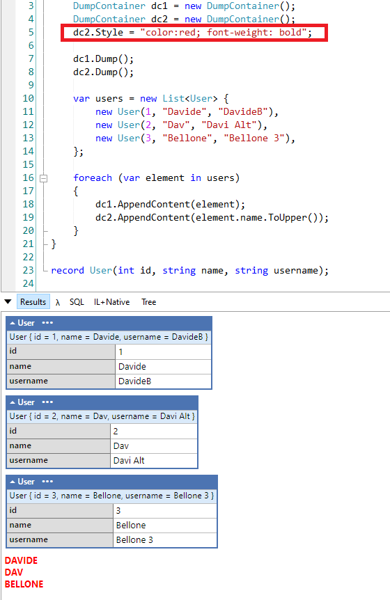
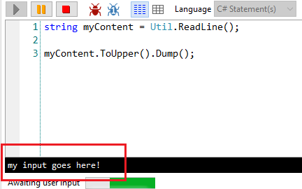
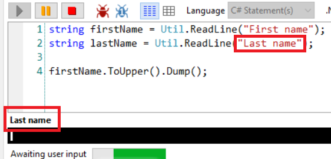
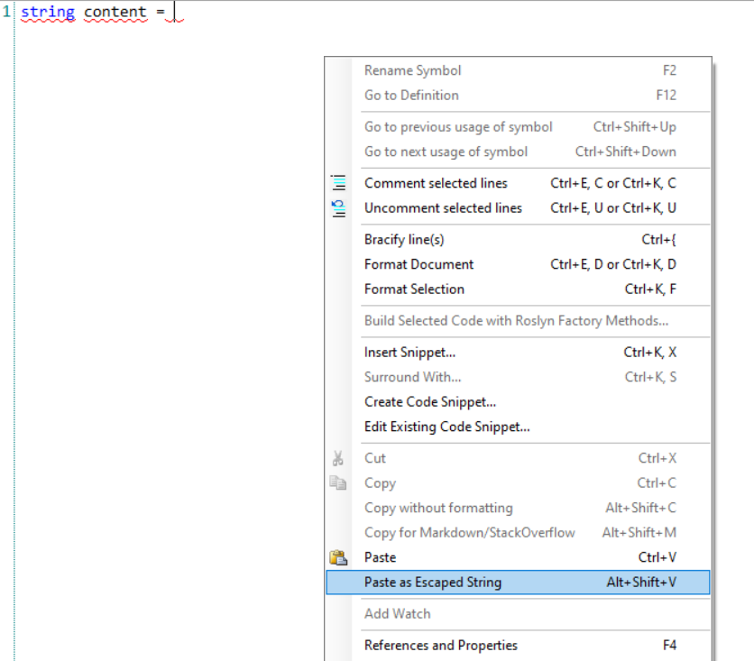
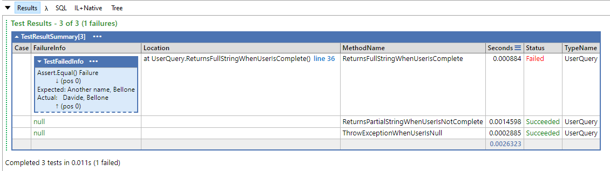

LINQPad is one of my best friends: I use it daily, and it helps me A LOT when I need to run some throwaway code.

There are many other tools out there, but I think that LINQPad (well, the full version!) is **one of the best tools on the market**.

But still, many C# developers only use just a few of its functionalities! In this article, I will show you my top 5 functionalities you should know.

## Advanced Dump()

As many of you already know, to print stuff on the console you don't have to call `Console.WriteLine(something)`, but you can use `something.Dump()`;

```cs
void Main()
{
    var user = new User(1, "Davide", "DavideB");
    user.Dump();
}
```



You can simplify it by avoiding calling the `Dump` operation in a separate step: `Dump` can print the content and return it at the same time:

```cs
var user = new User(1, "Davide", "DavideB").Dump();
```



For sure, **this simple trick makes your code easier to read!**

Ok, what if you have too many Dump calls and you don't know which operation prints which log? Lucky for us, **the `Dump` method accepts a string as a Title**: that text will be displayed in the output panel.

```cs
var user = new User(1, "Davide", "DavideB").Dump("My User content");
```

You can now see the "My User content" header right above the log of the user:



## Dump containers

We can do a step further and introduce **Dump containers**.

Dump Containers are some sort of sink for your logs (we've already [talked about sinks](https://www.code4it.dev/blog/logging-with-serilog-and-seq), do you remember?). Once you've instantiated a `DumpContainer` object, you can perform some operations such as `AppendContent` to append some content at the end of the logs, `ClearContent` to clear the content (obviously!), and `Dump` to display the content of the Container in the Results panel.

```cs
DumpContainer dc = new DumpContainer();

dc.Content = "Hey!";
dc.AppendContent("There");

dc.Dump();
```

Note: you don't need to place the `Dump()` instruction at the end of the script: you can put it at the beginning and you'll see the content as soon as it gets added. Otherwise, you will build the internal list of content and display it only at the end.

So, this is perfectly valid:

```cs
DumpContainer dc = new DumpContainer();
dc.Dump();


dc.Content = "Hey!";
dc.AppendContent("There");
```



You can even explicitly set the content of the Container: setting it will replace everything else.

Here you can see what happens when we override the content:


> Why should we even care? 🤔

My dear friend, it's easy! Because we can create more Containers to log different things!

Take this example: we want to loop over a list of items and use one Container to display the item itself, and another Container to list what happens when we perform some operations on each item. Yeeees, I know, it's hard to understand in this way: let me show you an example!

```cs
DumpContainer dc1 = new DumpContainer();
DumpContainer dc2 = new DumpContainer();

dc1.Dump();
dc2.Dump();

var users = new List<User> {
    new User(1, "Davide", "DavideB"),
    new User(2, "Dav", "Davi Alt"),
    new User(3, "Bellone", "Bellone 3"),
};

foreach (var element in users)
{
    dc1.AppendContent(element);
    dc2.AppendContent(element.name.ToUpper());
}
```

Here we're using two different containers, each of them lives its own life.



In this example I used `AppendContent`, but of course, you can replace the full content of a Container to analyze one item at a time.

I can hear you: there's another question in your mind:

> How can we differentiate those containers?

You can use the `Style` property of the `DumpContainer` class to style the output, using CSS-like properties:

```cs
DumpContainer dc2 = new DumpContainer();
dc2.Style = "color:red; font-weight: bold";
```

Now all the content stored in the `dc2` container will be printed in red:



Great stuff 🤩

## Read text from input

Incredibly useful, but often overlooked, is the ability to provide inputs to our scripts.

To do that, you can rely on the `Util.ReadLine` method already included in LINQPad:

```cs
string myContent = Util.ReadLine();
```

When running the application, you will see a black box **at the bottom of the window** that allows you to write (or paste) some text. That text will then be assigned to the `myContent` variable.



There's a nice overload that allows you to specify a sort of title to the text box, to let you know which is the current step:



## Paste as escaped string

This is one of my favorite functionalities: many times I have to escape text that contains quotes, copied from somewhere else to assign it to a `string` variable; I used to lose time escaping those values manually (well, using other tools that still are slower than this one).

Take this JSON:

```json
{
  "name": "davide",
  "gender": "male",
  "probability": 0.99,
  "count": 82957
}
```

Assigning it manually to a string becomes a mess. Lucky for us, we can copy it, get back on LINQPad, right-click, choose "Paste as escaped string" (or, if you prefer, use Alt+Shift+V) and have it already escaped and ready to be used:



That operation will generate this string:

```cs
string content = "{\n\t\"name\": \"davide\",\n\t\"gender\": \"male\",\n\t\"probability\": 0.99,\n\t\"count\": 82957\n}";
```

Not bad, isn't it? 😎

## xUnit test support

Another nice functionality that you can use to toy with classes or methods you don't know is the xUnit test support.

By clicking on the _Query > Add XUnit Test Support_, you can add xUnit to your query and write (and run, obviously) unit tests.

All those tests are placed in a region named _Tests_:

```cs
#region private::Tests
```

and can be run both by pressing _Alt+Shift+T_ or by calling `RunTests()` in the `Main` method.

After running the tests you will see a report with the list of the tests that passed and the details of the tests that failed:



_This article first appeared on [Code4IT](https://www.code4it.dev/)_

## Wrapping up

We've seen 5 amazing tricks to get the best out of LINQPad. In my opinion, every C# developer that uses this tool should know those tricks, they can really boost your productivity.

Did you already know all of them? Which are your favorites? Drop a message in the comments section or on [Twitter](https://twitter.com/BelloneDavide) 📧

Happy coding!

🐧
