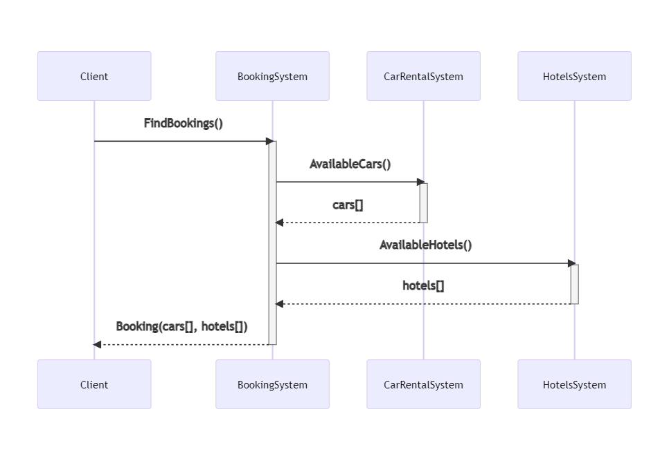
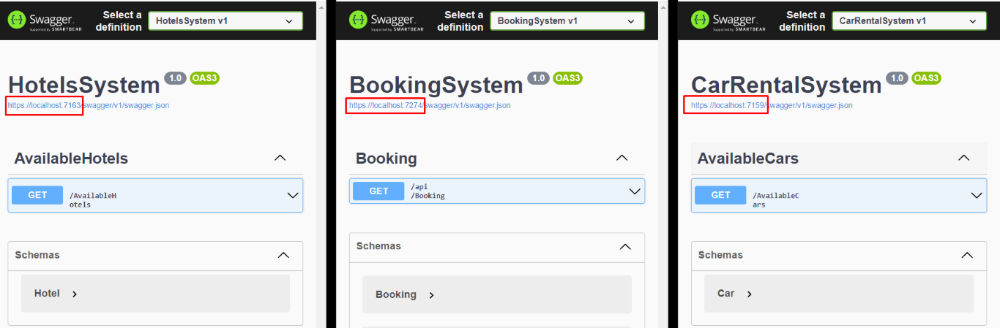
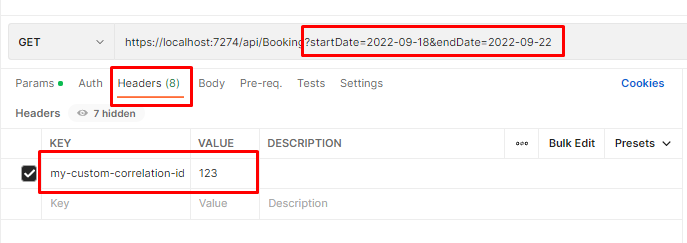
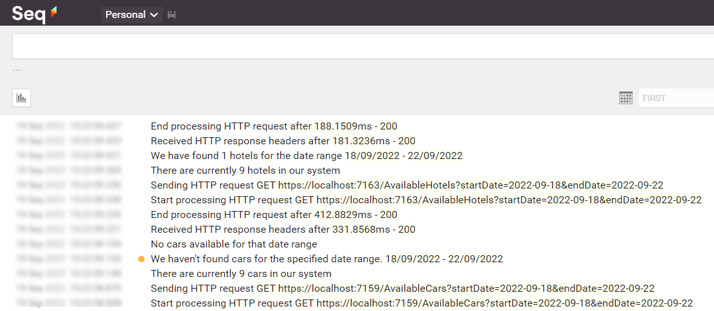
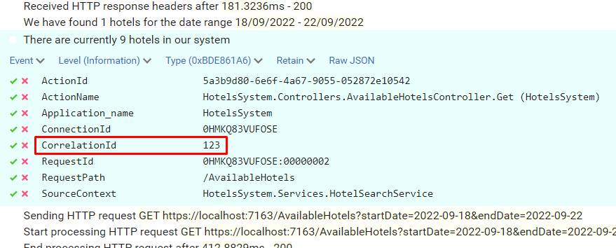
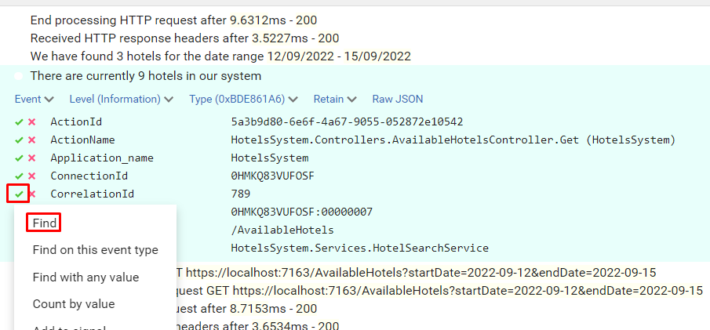
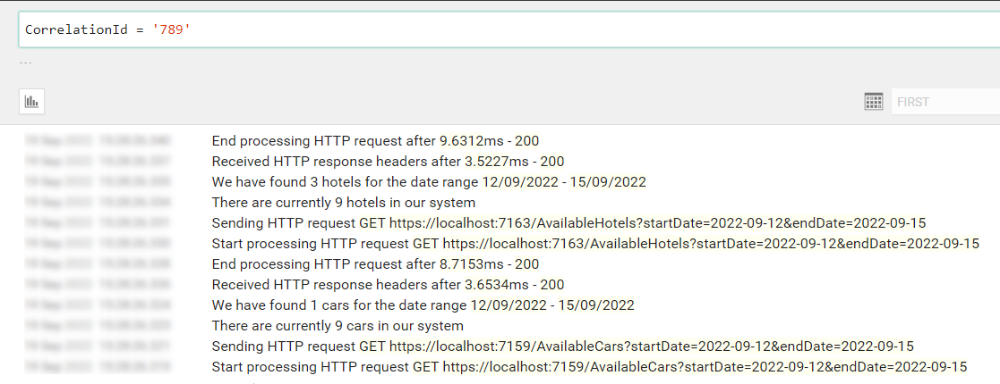

_Correlation IDs_ are values that are passed across different systems to correlate the operations performed during a "macro" operation.

Most of the time they are passed as HTTP Headers - of course in systems that communicate via HTTP.

In this article, we will learn how to log those Correlation IDs using Serilog, a popular library that helps handle logs in .NET applications.

## Setting up the demo dotNET project

This article is heavily code-oriented. So, let me first describe the demo project.

### Overview of the project

To demonstrate how to log Correlation IDs and how to correlate logs generated by different systems, I've created a simple solution that handles bookings for a trip.

The "main" project, _BookingSystem_, fetches data from external systems by calling some HTTP endpoints; it then manipulates the data and returns an aggregate object to the caller.

BookingSystem depends on two projects, placed within the same solution: CarRentalSystem, which returns data about the available cars in a specified date range, and HotelsSystem, which does the same for hotels.

So, this is the data flow:



If an error occurs in any of those systems, can we understand the full story of the failed request? No. Unless we use Correlation IDs!

Let's see how to add them and how to log them.

### How to propagate HTTP Headers using dotNET

We need to propagate HTTP Headers. You could implement it from scratch, as we've seen [in a previous article](https://www.code4it.dev/blog/propagate-httpheader-and-correlation-id). Or we could use a native library that does it all for us.

Of course, let's go with the second approach.

**For every project that will propagate HTTP headers**, we have to follow these steps.

First, we need to install `Microsoft.AspNetCore.HeaderPropagation`: this NuGet package allows us to add the .NET classes needed to propagate HTTP headers.

Next, we have to update the part of the project that we use to configure our application. For .NET projects with Minimal APIs, it's the `Program` class.

Here we need to add the capability to read the HTTP Context, by using

```cs
builder.Services.AddHttpContextAccessor();
```

As you can imagine, this is needed because, to propagate HTTP Headers, we need to know which are the incoming HTTP Headers. And they can be read from the `HttpContext` object.

Next, we need to specify, as a generic behavior, which headers must be propagated. For instance, to propagate the "my-custom-correlation-id" header, you must add

```cs
builder.Services.AddHeaderPropagation(options => options.Headers.Add("my-custom-correlation-id"));
```

Then, for every HttpClient that will propagate those headers, you have to add `AddHeaderPropagation()`, like this:

```cs
builder.Services.AddHttpClient("cars_system", c =>
    {
        c.BaseAddress = new Uri("https://localhost:7159/");
    }).AddHeaderPropagation();
```

Finally, one last instruction that tells the application that it needs to use the Header Propagation functionality:

```cs
app.UseHeaderPropagation();
```

To summarize, here's the minimal configuration to add HTTP Header propagation in a dotNET API.

```cs
public static void Main(string[] args)
{
    var builder = WebApplication.CreateBuilder(args);

    builder.Services.AddControllers();
    builder.Services.AddHttpContextAccessor();
    builder.Services.AddHeaderPropagation(options => options.Headers.Add("my-custom-correlation-id"));

    builder.Services.AddHttpClient("cars_system", c =>
    {
        c.BaseAddress = new Uri("https://localhost:7159/");
    }).AddHeaderPropagation();

    var app = builder.Build();
    app.UseHeaderPropagation();
    app.MapControllers();
    app.Run();
}
```

We're almost ready to go!

But we're missing the central point of this article: logging an HTTP Header as a Correlation ID!

## Initializing Serilog

We've already met Serilog several times in this blog, so I won't repeat how to install it and how to define logs the best way possible.

We will write our logs on Seq, and we're overriding the minimum level to skip the noise generated by .NET:

```cs
builder.Host.UseSerilog((ctx, lc) => lc    .WriteTo.Seq("http://localhost:5341")
    .MinimumLevel.Information()
    .MinimumLevel.Override("Microsoft", LogEventLevel.Warning)
    .MinimumLevel.Override("Microsoft.AspNetCore", LogEventLevel.Warning)
    .Enrich.FromLogContext();
```

Since you probably know what's going on, let me go straight to the point.

### Install Serilog Enricher for Correlation IDs

We're gonna use a specific library to log HTTP Headers treating them as Correlation IDs. To use it, you have to install the `Serilog.Enrichers.CorrelationId` package available on NuGet.

Therefore, you can simply run

```cmd
dotnet add Serilog.Enrichers.CorrelationId
```

to every .NET project that will use this functionality.

### Log HTTP Headers as Correlation IDs

Once we have that NuGet package ready, we can add its functionality to our logger by adding this line:

```cs
.Enrich.WithCorrelationIdHeader("my-custom-correlation-id")
```

This simple line tells dotnet that, when we see an HTTP Header named "my-custom-correlation-id", we should log it as a Correlation ID.

## Run it all together

Now we have everything in place - it's time to run it!

We have to run all the 3 services at the same time (you can do it with VisualStudio or you can run them separately using a CMD), and we need to have Seq installed on our local machine.

You will see 3 instances of Swagger, and each instance is running under a different port.



Once we have all the 3 applications up and running, we can call the `/Bookings` endpoint passing it a date range and an HTTP Header with key "my-custom-correlation-id" and value = "123" (or whatever we want).



If everything worked as expected, we can open Seq and see all the logs we've written in our applications:



Open one of them and have a look at the attributes of the logs: you will see a `CorrelationId` field with the value set to "123".



Now, to better demonstrate how it works, call the endpoint again, but this time set "789" as _my-custom-correlation-id_, and specify a different date range. You should be able to see another set of logs generated by this second call.

You can now apply filters to see which logs are related to a specific Correlation ID: open one log, click on the _tick_ button and select "Find".



You will then see all and only logs that were generated during the call with header my-custom-correlation-id set to "789".



## Further readings

That's it. With just a few lines of code, you can dramatically improve your logging strategy.

You can download and run the whole demo here:

🔗 [LogCorrelationId demo | GitHub](https://github.com/code4it-dev/LogCorrelationId)

To run this project you have to install both Serilog and Seq. You can do that by following this step-by-step guide:

🔗 [Logging with Serilog and Seq | Code4IT](https://www.code4it.dev/blog/logging-with-serilog-and-seq)

For this article, we've used the `Microsoft.AspNetCore.HeaderPropagation` package, which is ready to use. Are you interested in building your own solution - or, at least, learning how you can do that?

🔗 [How to propagate HTTP Headers (and Correlation IDs) using HttpClients in C# | Code4IT](https://www.code4it.dev/blog/propagate-httpheader-and-correlation-id)

Lastly, why not use Serilog's Scopes? And what are they? Check it out here:

🔗 [How to improve Serilog logging in .NET 6 by using Scopes | Code4IT](https://www.code4it.dev/blog/serilog-logging-scope)

## Wrapping up

This article concludes a sort of imaginary path that taught us how to use Serilog, how to correlate different logs within the same application using Scopes, and how to correlate logs from different services using Correlation IDs.

Using these capabilities, you will be able to write logs that can help you understand the context in which a specific log occurred, thus helping you fix errors more efficiently.

_This article first appeared on [Code4IT](https://www.code4it.dev/)_

Happy coding!

🐧
