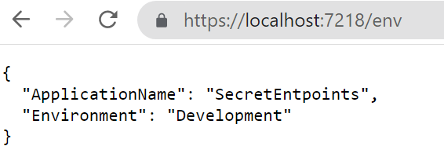
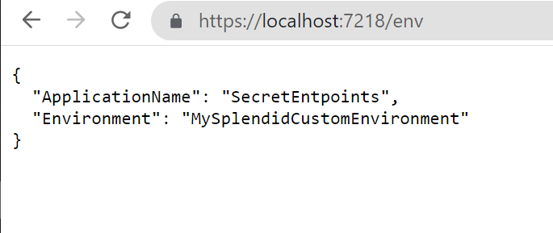
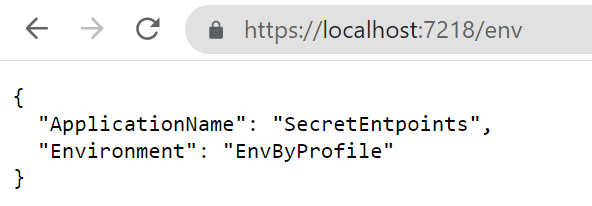
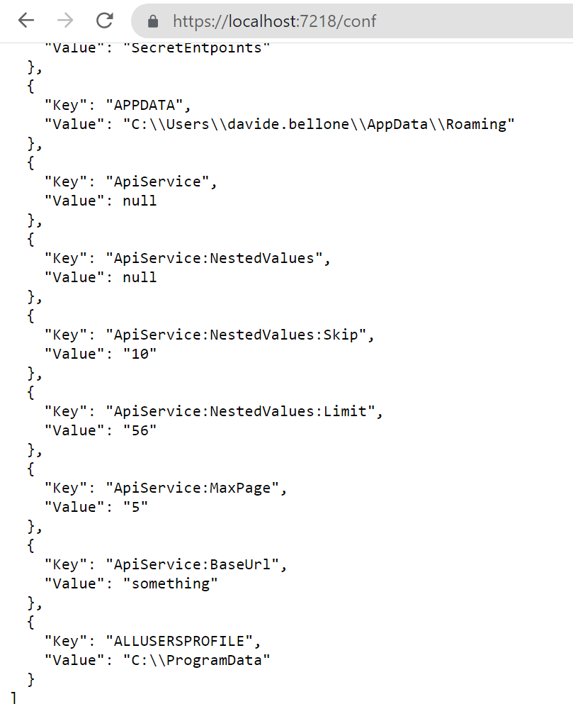

When I create Web APIs with .NET I usually add two "secret" endpoints that I can use to double-check the status of the deployment.

I generally expose two endpoints: one that shows me some info about the current environment, and another one that lists all the application settings defined after the deployment.

In this article, we will see how to create those two endpoints, how to update the values when building the application, and how to hide those endpoints.

## Project setup

For this article, I will use a simple .NET 6 API project. **We will use Minimal APIs**, and we will use the *appsettings.json* file to load the application's configuration values.

Since we are using Minimal APIs, you will have the endpoints defined in the `Main` method within the `Program` class.

To expose an endpoint that accepts the GET HTTP method, you can write

```cs
endpoints.MapGet("say-hello", async context =>
{
   await context.Response.WriteAsync("Hello, everybody!");
});
```

That's all you need to know about .NET Minimal APIs for the sake of this article. Let's move to the main topics ⏩

## How to show environment info in .NET APIs

Let's say that your code execution depends on the current Environment definition. Typical examples are that, if you're running on production you may want to hide some endpoints otherwise visible in the other environments, or that you will use a different error page when an unhandled exception is thrown.

Once the application has been deployed, how can you retrieve the info about the running environment?

Here we go:

```cs
app.MapGet("/env", async context =>
{
    IWebHostEnvironment? hostEnvironment = context.RequestServices.GetRequiredService<IWebHostEnvironment>();
    var thisEnv = new
    {
        ApplicationName = hostEnvironment.ApplicationName,
        Environment = hostEnvironment.EnvironmentName,
    };

    var jsonSerializerOptions = new JsonSerializerOptions { WriteIndented = true };
    await context.Response.WriteAsJsonAsync(thisEnv, jsonSerializerOptions);
});
```

This endpoint is quite simple.

The `context` variable, which is of type `HttpContext`, exposes some properties. Among them, the `RequestServices` property allows us to retrieve the services that have been injected when starting up the application. We can then use `GetRequiredService` to get a service by its type and store it into a variable.

> 💡 `GetRequiredService` throws an exception if the service cannot be found. On the contrary, `GetService` returns null. I usually prefer `GetRequiredService`, but, as always, it depends on what you're using it.

Then, we create an anonymous object with the information of our interest and finally return them as an indented JSON.

It's time to run it! Open a terminal, navigate to the API project folder (in my case, *SecretEndpoint*), and run `dotnet run`. The application will compile and start; you can then navigate to `/env` and see the default result:



### How to change the Environment value

While the *applicationName* does not change - it is the name of the running assembly, so any other value will make stop your application from running - you can (and, maybe, want to) change the Environment value.

When running the application using the command line, you can **use the `--environment` flag to specify the Environment value.**

So, running 

```cmd
dotnet run --environment MySplendidCustomEnvironment
```

will produce this result:



There's another way to set the environment: **update the launchSettings.json and run the application using Visual Studio**.

To do that, open the *launchSettings.json* file and update the profile you are using by specifying the Environment name. In my case, the current profile section will be something like this:

```json
"profiles": {
"SecretEntpoints": {
    "commandName": "Project",
    "dotnetRunMessages": true,
    "launchBrowser": true,
    "launchUrl": "swagger",
    "applicationUrl": "https://localhost:7218;http://localhost:5218",
    "environmentVariables": 
        {
            "ASPNETCORE_ENVIRONMENT": "EnvByProfile"
        }
    },
}
```

As you can see, the `ASPNETCORE_ENVIRONMENT` variable is set to *EnvByProfile*.

If you run the application using Visual Studio using that profile you will see the following result:



## How to list all the configurations in .NET APIs

In my current company, we deploy applications using CI/CD pipelines. 

This means that final variables definition comes from the sum of 3 sources: 

* the project's *appsettings* file
* the release pipeline
* the deployment environment

You can easily understand how difficult it is to debug those applications without knowing the exact values for the configurations. That's why I came up with these endpoints.

To print all the configurations, we're gonna use an approach similar to the one we've used in the previous example.

The endpoint will look like this:

```cs
app.MapGet("/conf", async context =>
{
    IConfiguration? allConfig = context.RequestServices.GetRequiredService<IConfiguration>();

    IEnumerable<KeyValuePair<string, string>> configKv = allConfig.AsEnumerable();

    var jsonSerializerOptions = new JsonSerializerOptions { WriteIndented = true };
    await context.Response.WriteAsJsonAsync(configKv, jsonSerializerOptions);
});
```

What's going on? We are retrieving the `IConfiguration` object, which contains all the configurations loaded at startup; then, we're listing all the configurations as key-value pairs, and finally, we're returning the list to the client.

As an example, here's my current *appsettings.json* file:

```json
{
  "ApiService": {
    "BaseUrl": "something",
    "MaxPage": 5,
    "NestedValues": {
      "Skip": 10,
      "Limit": 56
    }
  },
  "MyName": "Davide"
}
```

When I run the application and call the `/conf` endpoint, I will see the following result:



Notice how the structure of the configuration values changes. The value


```json
{
  "ApiService": {
    "NestedValues": {
      "Limit": 56
    }
}
```

is transformed into

```json
{
    "Key": "ApiService:NestedValues:Limit",
    "Value": "56"
},
```

That endpoint shows a lot more than you can imagine: **take some time to have a look at those configurations** - you'll thank me later!

### How to change the value of a variable

There are many ways to set the value of your variables.

The most common one is by creating an environment-specific appsettings file that overrides some values.

So, if your environment is called "EnvByProfile", as we've defined in the previous example, the file will be named appsettings.EnvByProfile.json.

There are actually some other ways to override application variables: we will learn them in the next article, so stay tuned! 😎

## 3 ways to hide your endpoints from malicious eyes

Ok then, we have our endpoints up and running, but they are visible to anyone who correctly guesses their addresses. And **you don't want to expose such sensitive info to malicious eyes, right?**

There are, at least, 3 simple values to hide those endpoints:

- **Use a non-guessable endpoint**: you can use an existing word, such as "housekeeper", use random letters, such as "lkfrmlvkpeo", or use a Guid, such as "E8E9F141-6458-416E-8412-BCC1B43CCB24";
- **Specify a key on query string**: if that key is not found or it has an invalid value, return a *404-not found* result
- **Use an HTTP header**, and, again, return 404 if it is not valid.


Both query strings and HTTP headers are available in the `HttpContext` object injected in the route definition.

Now it's your turn to find an appropriate way to hide these endpoints. How would you do that? Drop a comment below 📩

✒ *Edit 2022-10-10:* I thought it was quite obvious, but apparently it is not: **these endpoints expose critical information about your applications and your infrastructure, so you should not expose them unless it is strictly necessary**! If you have strong authentication in place, use it to secure those endpoints. If you don't, hide those endpoints the best you can, and show only necessary data, and not everything. **Strip out sensitive content**. And, as soon as you don't need that info anymore, remove those endpoints (comment them out or generate them only if a particular flag is set at compilation time). Another possible way is by **using feature flags**. In the end, take that example with a grain of salt: learn that you **can** expose them, but not also that you **shouldn't** expose them.

## Further readings

We've used a quite new way to build and develop APIs with .NET, called "Minimal APIs". You can read more here:

🔗 [Minimal APIs | Microsoft Learn](https://learn.microsoft.com/en-us/aspnet/core/fundamentals/minimal-apis?view=aspnetcore-6.0)


If you are not using Minimal APIs, you still might want to create such endpoints. We've talked about accessing the HttpContext to get info about the HTTP headers and query string. When using Controllers, accessing the `HttpContext` requires some more steps. Here's an article that you may find interesting:

🔗 [How to access the HttpContext in .NET API | Code4IT](https://www.code4it.dev/blog/inject-httpcontext)


*This article first appeared on [Code4IT](https://www.code4it.dev/)*

## Wrapping up

In this article, we've seen how two endpoints can help us with understanding the status of the deployments of our applications.

It's a simple trick that you can consider adding to your projects.

Do you have some utility endpoints?

Happy coding!
🐧
