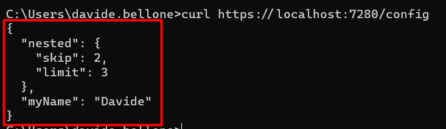
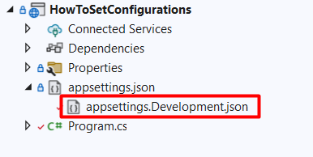
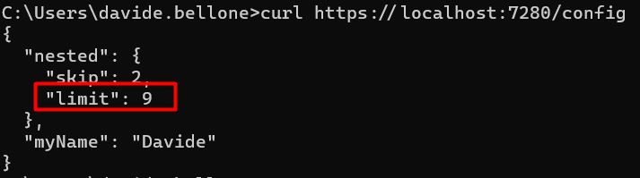
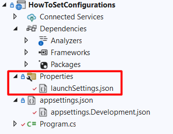
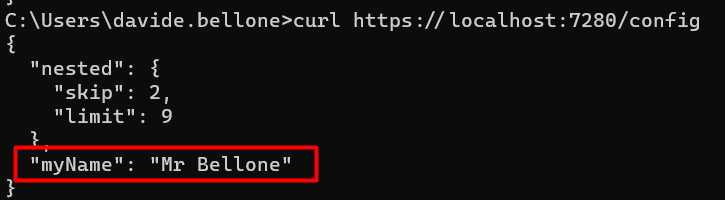
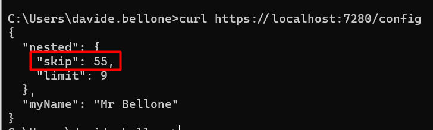

Needless to say, almost every application needs to deal with some configurations. There are tons of use cases, and you already have some of them in mind, don't you?

If you're working with .NET, you've probably already used the *appsettings.json* file. It's a good starting point, but it may be not enough in the case of complex applications (and complex deployments).

In this article, we will learn some ways to set configurations in a .NET API application. We will use the *appsettings* file, of course, and some other ways such as the dotnet CLI. Let's go! 🚀

## Project setup

First things first: let's set up the demo project.

I have created a simple .NET 6 API application using Minimal APIs. This is my whole application (yes, less than 50 lines!)

```cs
using Microsoft.Extensions.Options;

namespace HowToSetConfigurations
{
    public class Program
    {
        public static void Main(string[] args)
        {
            WebApplicationBuilder builder = WebApplication.CreateBuilder(args);

            builder.Services.Configure<MyRootConfig>(
                builder.Configuration.GetSection("RootConfig")
            );

            builder.Services.Configure<JsonOptions>(o =>
            {
                o.SerializerOptions.WriteIndented = true;
            });

            WebApplication app = builder.Build();

            app.MapGet("/config", (IOptionsSnapshot<MyRootConfig> options) =>
            {
                MyRootConfig config = options.Value;
                return config;
            });

            app.Run();
        }
    }

    public class MyRootConfig
    {
        public MyNestedConfig Nested { get; set; }
        public string MyName { get; set; }
    }

    public class MyNestedConfig
    {
        public int Skip { get; set; }
        public int Limit { get; set; }
    }
}
```

Nothing else! 🤩

In short, I scaffold the `WebApplicationBuilder`, configure that I want to map the settings section with root named *RootConfig* to my class of type `MyRootConfig`, and then run the application.

I then expose a single endpoint, */config*, which returns the current configurations, wrapped within an `IOptionsSnapshot<MyRootConfig>` object.

Where is the source of the application's configurations?

As stated on the Microsoft docs website, [here 🔗](https://learn.microsoft.com/en-us/aspnet/core/fundamentals/host/web-host?view=aspnetcore-6.0#set-up-a-host), the `WebApplicationBuilder`...

> Loads app configuration in the following order from:
>   appsettings.json.
>   appsettings.{Environment}.json.
>   User secrets when the app runs in the Development environment using the entry assembly.
>   Environment variables.
>   Command-line arguments.

So, yeah, we have several possible sources, and the order does matter.

Let's see a bunch of them.

## Define settings within the appsetting.json file

The most common way is by using the *appsettings.json* file. Here, in a **structured and hierarchical way**, you can define all the logs used as a baseline for your application.

A typical example is this one:

```json
{
  "Logging": {
    "LogLevel": {
      "Default": "Information",
      "Microsoft.AspNetCore": "Warning"
    }
  },
  "AllowedHosts": "*",
  "RootConfig": {
    "MyName": "Davide",
    "Nested": {
      "Skip": 2,
      "Limit": 3
    }
  }
}
```

With this file, all the fields within the *RootConfig* element will be mapped to the `MyRootConfig` class at startup. That object can then be returned using the */config* endpoint.

Running the application (using Visual Studio or the dotnet CLI) you will be able to call that endpoint and see the expected result.




## Use environment-specific appsettings.json

Now, you probably know that you can use other *appsettings* files with a name such as *appsettings.Development.json*.



With that file, you can override specific configurations using the same structure, but ignoring all the configs that don't need to be changed.

Let's update the *Limit* field defined in the "base" appsettings. You don't need to recreate the whole structure just for one key; you can use this JSON instead:

```json
{
  "RootConfig": {
    "Nested": {
      "Limit": 9
    }
  }
}
```

Now, if we run the application using VS we will see this result:



Ok, but **what made .NET understand that I wanted to use that file??** It's a matter of **Environment variables** and **Launch profiles**.

### How to define profiles within the launchSettings.json file

Within the Properties folder in your project, you can see a *launchSettings.json* file. As you might expect, that file describes how you can launch the application.



Here we have some Launch profiles, and each of them specifies an `ASPNETCORE_ENVIRONMENT` variable. By default, its value is set to *Development*. 

```json
"profiles": {
    "HowToSetConfigurations": {
      "commandName": "Project",
      "dotnetRunMessages": true,
      "launchBrowser": true,
      "launchUrl": "config",
      "applicationUrl": "https://localhost:7280;http://localhost:5280",
      "environmentVariables": {
        "ASPNETCORE_ENVIRONMENT": "Development"
      }
    },
}
```

Now, recall that the environment-specific *appsettings* file name is defined as *appsettings.{Environment}.json*. Therefore, by running your application with Visual Studio using the *HowToSetConfigurations* launch profile, you're gonna replace that *{Environment}* with *Development*, thus using the *appsettings.Development.json*.

*Ça va sans dire* that you can use every value you prefer - such as Staging, MyCustomEnvironmentName, and so on.

### How to define the current Environment with the CLI

**If you are using the dotnet CLI** you can set that environment variable as

```cmd
dotnet run --ASPNETCORE_ENVIRONMENT=Development
```

or, in a simpler way, you can use

```cmd
dotnet run --environment Development
```

and get the same result.

## How do nested configurations get resolved?

As we've seen [in a previous article](https://www.code4it.dev/blog/my-2-secret-endpoints#how-to-list-all-the-configurations-in-net-apis), even if we are using configurations defined in a hierarchical structure, in the end, they are transformed into key-value pairs.

The *Limit* key as defined here:

```json
{
  "RootConfig": {
    "Nested": {
      "Limit": 9
    }
  }
}
```

is transformed into

```json
{
    "Key": "RootConfig:Nested:Limit",
    "Value": "9"
},
```

**with the `:` separator**. We will use this info shortly.

## Define configurations in the launchSettings file

As we've seen before, each profile defined in the launchSettings file describes a list of environment variables:

```json
"environmentVariables": {
  "ASPNETCORE_ENVIRONMENT": "Development"
}
```

This means that we can also define our configurations here, and have them loaded when using this specific profile.

From these configurations

```json
"RootConfig": {
    "MyName": "Davide",
    "Nested": {
      "Skip": 2,
      "Limit": 3
    }
  }
```

I want to update the *MyName* field.

I can then update the current profile as such:

```json
"environmentVariables": {
  "ASPNETCORE_ENVIRONMENT": "Development",
  "RootConfig:MyName": "Mr Bellone"
}
```

so that, when I run the application using that profile, I will get this result:



Have you noticed the key `RootConfig:MyName`? 😉

🔎 Notice that now we have both *MyName = Mr Bellone*, as defined in the lauchSettings file, and *Limit = 9*, since we're still using the *appsettings.Development.json* file (because of that *"ASPNETCORE_ENVIRONMENT": "Development"* ).

### How to define the current profile with the CLI

Clearly, we can use the dotnet CLI to load the whole environment profile. We just need to specify it using the `--launch-profile` flag:

```cmd
dotnet run --launch-profile=HowToSetConfigurations
```

## Define application settings using the dotnet CLI

Lastly, we can specify config values directly using the CLI.

It's just a matter of specifying the key-value pairs as such:

```cmd
dotnet run --RootConfig:Nested:Skip=55
```

And - *TAH-DAH!* - you will see this result:




❓ A question for you! Notice that, even though I specified only the Skip value, both Limit and MyName have the value defined before. Do you know why it happens? Drop a message below if you know the answer! 📩

## Further readings

As always, there's more!

If you want to know more about how dotNET APIs load and start, you should have a look at this page:

🔗 [ASP.NET Core Web Host | Microsoft Docs](https://learn.microsoft.com/en-us/aspnet/core/fundamentals/host/web-host?view=aspnetcore-6.0)

Ok, now you know different approaches for setting configurations. 
How do you know the exact values that are set in your application?

🔗 [The 2 secret endpoints I create in my .NET APIs | Code4IT](https://www.code4it.dev/blog/my-2-secret-endpoints)

*This article first appeared on [Code4IT](https://www.code4it.dev/)*

## Wrapping up

Ok then, in this article we've seen different approaches you can use to define configurations in your .NET API projects.

Knowing what you can do with the CLI can be helpful especially when using CI/CD, in case you need to run the application using specific keys.

Do you know any other ways to define configs?

Happy coding!

🐧
 