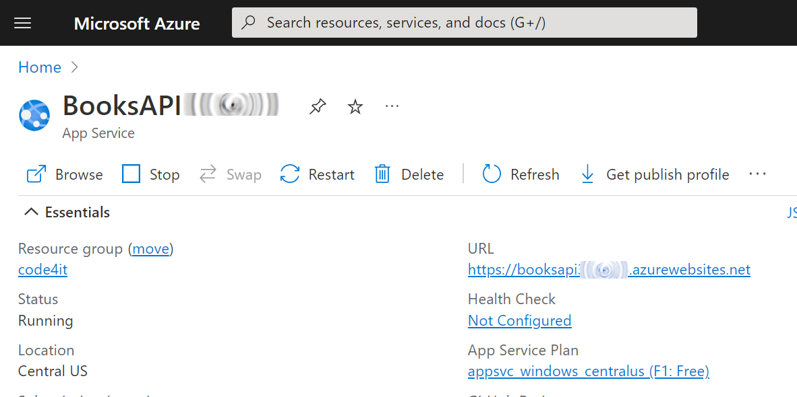
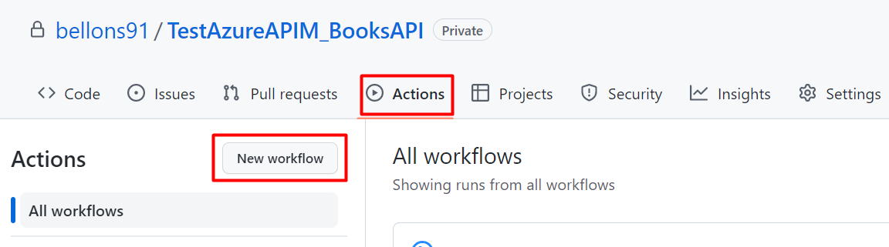
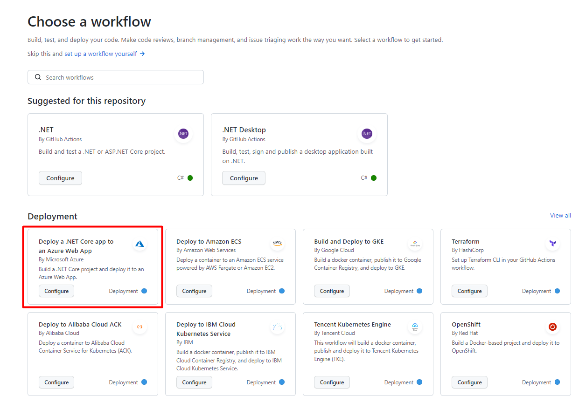
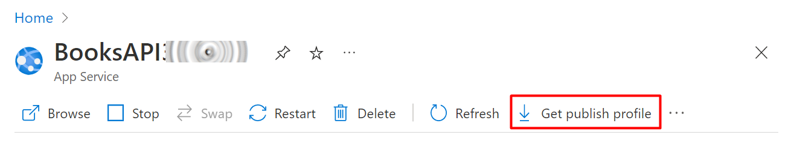
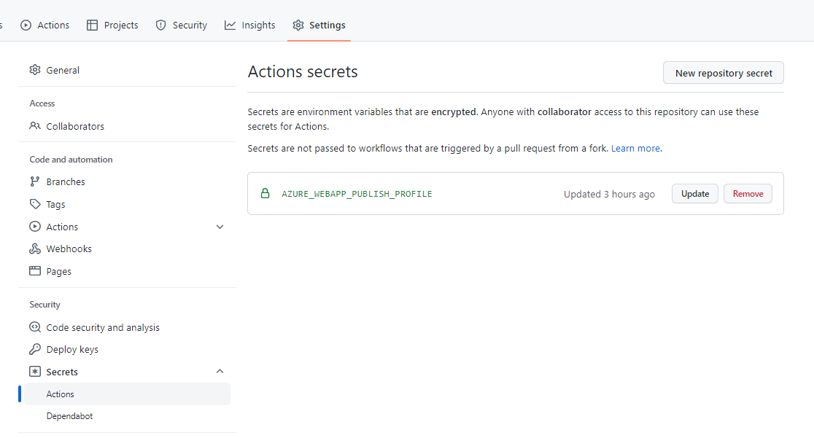
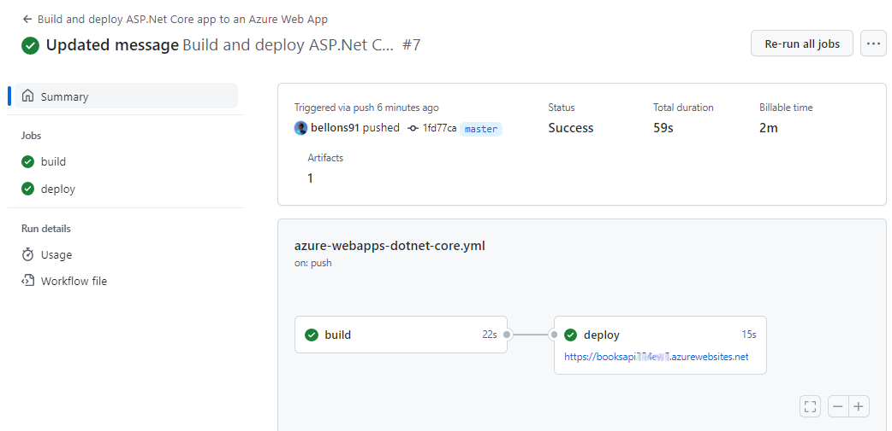
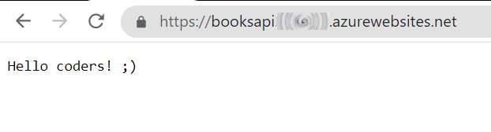

With **Continuous Delivery (CD)**, you can deploy your code in a fast-paced and stable way.

To deploy applications, you'll need workflows that run and automate the process. In that way, you don't have to perform repetitive tasks and the whole process becomes **less error-prone**.

In this article, we will learn how to implement CD pipelines using GitHub Actions. In particular, we will focus on the case of a .NET API application that will be deployed on Azure.

## Create a .NET API project

Since the focus of this article is on the deployment part, we won't create complex APIs. Just a simple Hello Word is enough.

To do that, we're gonna use dotnet Minimal API - a way to create APIs without scaffolding lots of files and configurations.

Our API, the BooksAPI, has a single endpoint: `/`, the root, simply returns "Hello World!".

All our code is stored in the `Program` file:

```cs
var builder = WebApplication.CreateBuilder(args);

var app = builder.Build();

app.UseHttpsRedirection();

app.MapGet("/", () => "Hello World!");

app.Run();
```

Nothing fancy: run the application locally, and navigate to the root. You will see the _Hello World_ message.

Lastly, **put your code on GitHub**: initialize a repository and publish it on GitHub - it can either be a public or a private repository.

## Create an App Service on Azure

Now, to deploy an application, we need to define its destination. We're going to deploy it on Azure, so you need an Azure account before moving on.

Open the [Azure Portal](https://portal.azure.com/), navigate to the _App Service_ section, and create a new one.

Configure it as you wish, and then proceed until you have it up and running.

Once everything is done, you should have something like this:



Now the application is ready to be used: we now need to deploy our code here.

## Generate the GitHub Action YAML file for deploying .NET APIs on Azure

It's time to create our Continuous Delivery pipeline.

Luckily, **GitHub already provides lots of templates for GitHub Actions**. We will need one specific for our .NET APIs.

On GitHub, navigate to your repository, head to the _Actions_ menu, and select _New workflow_.



You will see several predefined actions that allow you to do _stuff_ with your repository. **We are now interested in the one called "Deploy a .NET Core app to an Azure Web App"**:



Clicking on "Configure" you will see a template. **Read carefully the instructions**, as they will guide you to the correct configuration of the GitHub action.

In particular, you will have to **update the environment variables** specified in this section:

```yml
env:
  AZURE_WEBAPP_NAME: your-app-name # set this to the name of your Azure Web App
  AZURE_WEBAPP_PACKAGE_PATH: "." # set this to the path to your web app project, defaults to the repository root
  DOTNET_VERSION: "5" # set this to the .NET Core version to use
```

Clearly, `AZURE_WEBAPP_NAME` must match the name you've defined on Azure, while `DOTNET_VERSION` must match the version you're using to create your dotnet APIs.

For my specific project, I've replaced that section with

```yml
env:
  AZURE_WEBAPP_NAME: BooksAPI<myName> # set this to the name of your Azure Web App
  AZURE_WEBAPP_PACKAGE_PATH: "." # set this to the path to your web app project, defaults to the repository root
  DOTNET_VERSION: "6.0" # set this to the .NET Core version to use
```

🟧 `DOTNET_VERSION` requires also the minor version of dotnet. Setting _6_ will now work: you need to specify _6.0_. 🟧

Now you can save your YAML file in your repository: it will be saved under _./.github/workflows_.

So, as a reference, here's the full YAML file I'm using to deploy my APIs:

```yml
name: Build and deploy ASP.Net Core app to an Azure Web App

env:
  AZURE_WEBAPP_NAME: BooksAPI<myName>
  AZURE_WEBAPP_PACKAGE_PATH: "."
  DOTNET_VERSION: "6.0"

on:
  push:
    branches: ["master"]
  workflow_dispatch:

permissions:
  contents: read

jobs:
  build:
    runs-on: ubuntu-latest

    steps:
      - uses: actions/checkout@v3

      - name: Set up .NET Core
        uses: actions/setup-dotnet@v2
        with:
          dotnet-version: ${{ env.DOTNET_VERSION }}

      - name: Set up dependency caching for faster builds
        uses: actions/cache@v3
        with:
          path: ~/.nuget/packages
          key: ${{ runner.os }}-nuget-${{ hashFiles('**/packages.lock.json') }}
          restore-keys: |
            ${{ runner.os }}-nuget-

      - name: Build with dotnet
        run: dotnet build --configuration Release

      - name: dotnet publish
        run: dotnet publish -c Release -o ${{env.DOTNET_ROOT}}/myapp

      - name: Upload artifact for deployment job
        uses: actions/upload-artifact@v3
        with:
          name: .net-app
          path: ${{env.DOTNET_ROOT}}/myapp

  deploy:
    permissions:
      contents: none
    runs-on: ubuntu-latest
    needs: build
    environment:
      name: "Development"
      url: ${{ steps.deploy-to-webapp.outputs.webapp-url }}

    steps:
      - name: Download artifact from build job
        uses: actions/download-artifact@v3
        with:
          name: .net-app

      - name: Deploy to Azure Web App
        id: deploy-to-webapp
        uses: azure/webapps-deploy@v2
        with:
          app-name: ${{ env.AZURE_WEBAPP_NAME }}
          publish-profile: ${{ secrets.AZURE_WEBAPP_PUBLISH_PROFILE }}
          package: ${{ env.AZURE_WEBAPP_PACKAGE_PATH }}
```

As you can see, we have 2 distinct steps: _build_ and _deploy_.

In the _build_ phase, we check out our code, restore the NuGet dependencies, build the project, pack it and store the final result as an artifact.

In the _deploy_ step, we retrieve the newly created artifact and publish it on Azure.

## Store the Publish profile as GitHub Secret

As you can see in the instructions of the workflow file, you have to

> Create a secret in your repository named AZURE_WEBAPP_PUBLISH_PROFILE, paste the publish profile contents as the value of the secret.

That _Create a secret in your repository named AZURE_WEBAPP_PUBLISH_PROFILE_ statement was not clear to me: I thought you had to create that key within your .NET project. Turns out you can create secrets related to repositories on GitHub (so, it's language-agnostic).

**A Publish profile is a file that contains information and settings used to deploy applications to Azure**. It's nothing but an XML file that lists the possible ways to deploy your application, such as FTP, Web Deploy, Zip Deploy, and so on.

We have to get our publish profile and save it into GitHub secrets.

To retrieve the Publish profile, head to the Azure App Service page and click _Get publish profile_ to download the file.



Now, get back on GitHub, Head to _Settings > Security > Secrets > Actions_.

Here you can create a new secret related to your repository.

Create a new one, name it `AZURE_WEBAPP_PUBLISH_PROFILE`, and paste the content of the Publish profile file you've just downloaded.

You will then see something like this:



Notice that the secret name **must** be _AZURE_WEBAPP_PUBLISH_PROFILE_. That constraint is set because we are accessing the Publish profile by key:

```yml
- name: Deploy to Azure Web App
    id: deploy-to-webapp
    uses: azure/webapps-deploy@v2
    with:
        app-name: ${{ env.AZURE_WEBAPP_NAME }}
        publish-profile: ${{ secrets.AZURE_WEBAPP_PUBLISH_PROFILE }}
        package: ${{ env.AZURE_WEBAPP_PACKAGE_PATH }}
```

In particular, notice the `publish-profile: ${{ secrets.AZURE_WEBAPP_PUBLISH_PROFILE }}` part.

Clearly, the two names must match: nothing stops you from changing the name of the secret in both the YAML file and the GitHub Secret page.

## Final result

It's time to see the final result.

Update the application code (I've slightly modified the Hello world message), and push your changes to GitHub.

Under the Actions tab, you will see your CD pipeline run.



Once it's completed, you can head to your application root and see the final result.



## Further readings

Automating repetitive tasks allows you to perform more actions with fewer errors. Generally speaking, the more stuff you can automate, the better.

My own blog heavily relies on automation: scaffolding content, tracking ideas, and publishing online...

If you want to peek at what I do, here are my little secrets:

🔗 [From idea to publishing, and beyond: how I automated my blogging workflow with GitHub, PowerShell, and Azure | Code4IT](https://www.code4it.dev/blog/automate-blogging-workflow-github-powershell-azure)

In this article, we've only built and deployed our application. We can do more: run tests and _keep track of code coverage_. If you want to learn how you can do it using Azure DevOps, here we go:

🔗 [Cobertura, YAML, and Code Coverage Protector: how to view Code Coverage report on Azure DevOps | Code4IT](https://www.code4it.dev/blog/code-coverage-on-azure-devops-yaml-pipelines)

_This article first appeared on [Code4IT 🐧](https://www.code4it.dev/)_

## Wrapping up

I have to admit that I struggled a lot in setting up the CD pipeline. I was using the one proposed by default on Visual Studio - but it didn't work.

Using the template found on GitHub worked almost instantly - I just had to figure out what did they mean by _repository secrets_.

Now we have everything in place. Since the workflow is stored in a text file within my repository, if I have to create and deploy a new API project I can simply do that by copying that file and fixing the references.

Nice and easy, right? 😉

Happy coding!

🐧
