If you're building an application that exposes several services you might not want to expose them on different hosts. Consumers will have a hard time configuring their application with all the different hostnames, and you will be forced to maintain the same URLs even if you need to move to other platforms or, for instance, you want to transform a REST endpoint into an Azure Function.

In this case, you should mask the real endpoints beneath a _facade_: maybe... an A**PI Gateway**? 🙂

In this article, we will learn how to configure Azure API Management (from now on: _APIM_) service to create an API Gateway and "hide" our real services.

## Demo: publish .NET API services and locate the OpenAPI definition

For the sake of this article, we will work with 2 API services: _BooksService_ and _VideosService_.

They are both .NET 6 APIs, deployed on Azure using GitHub Actions (using the steps I described [in a previous article](https://www.code4it.dev/blog/deploy-api-on-azure-with-github-action)).

Both services expose their Swagger pages and a bunch of endpoints that we will gonna hide behind Azure APIM.

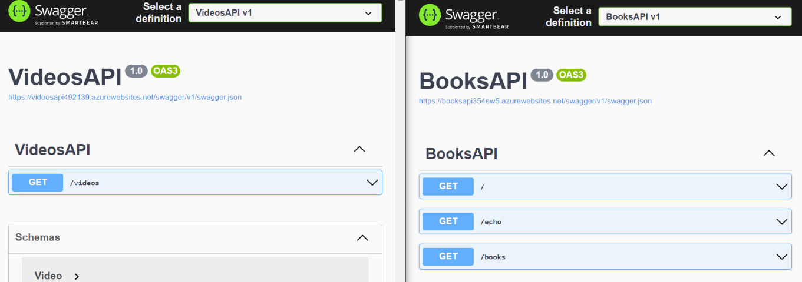

## How to create Azure API Management (APIM) Service from Azure Portal

Now, we want to hide their real endpoints. **The clients will then only know about the existence of the API Gateway**, and not of the two separate API services:

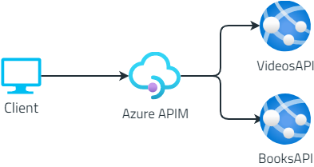

It's time to create our APIM resource.👷‍♂️

Head to the [Azure Portal](https://portal.azure.com/), and create a new API Management instance. I suggest reading the short overview of the functionalities provided by Azure API Management services as listed in the screenshot below.

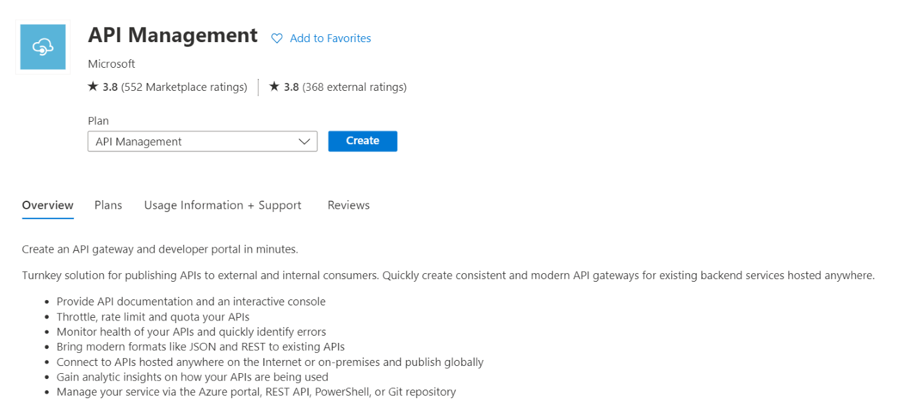

The wizard will ask you for some info, such as the resource name, the region, and an email used to send communications (honestly speaking, I still haven't figured out why they're asking for your email).

Fill in all the fields, pick your preferred pricing tier (mine is Developer: it doesn't have an SLA and is quite cheap), and then proceed with the service creation.

**After several minutes (it took 50 minutes - fifty!💢 - to scaffold my instance)**, you will have your instance ready to be used.

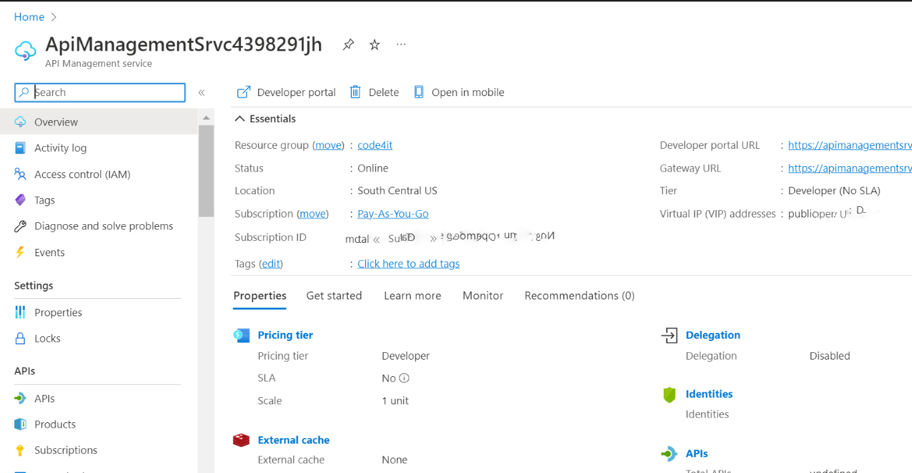

We are now ready to add our APIs and expose them to our clients.

## How to add APIs to Azure API Management using Swagger definition (OpenAPI)

As we've seen [in a previous article](https://www.code4it.dev/blog/swagger-integration), **Swagger creates a JSON file that describes the operations available in your APIs, as well as the object structures accepted as input and returned as output**.

Let me use as an example the Books API: once that API project is deployed on the cloud (it's not mandatory to use Azure: it will work the same using other cloud vendors), you will see the Swagger UI and the related JSON definition.

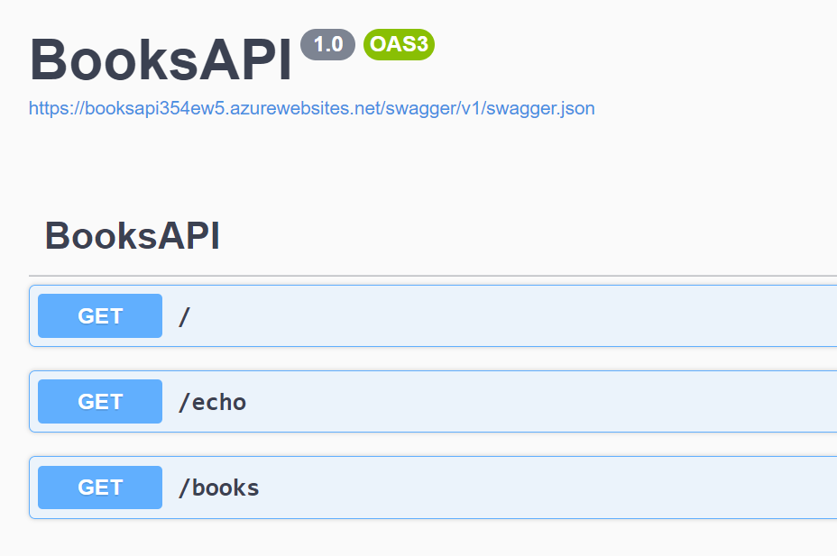

We have 3 endpoints, `/`, `/echo`, and `/books`; those endpoints are described in the _swagger.json_ file linked in the Swagger page; put that link aside: we will use it soon.

Finally, we can add our Books APIs to our Azure Management API Service! Head to the resource on Azure, locate the _APIs_ menu item on the left panel, and **create a new API definition using OpenAPI** (which is the standard used by Swagger to create its UI).

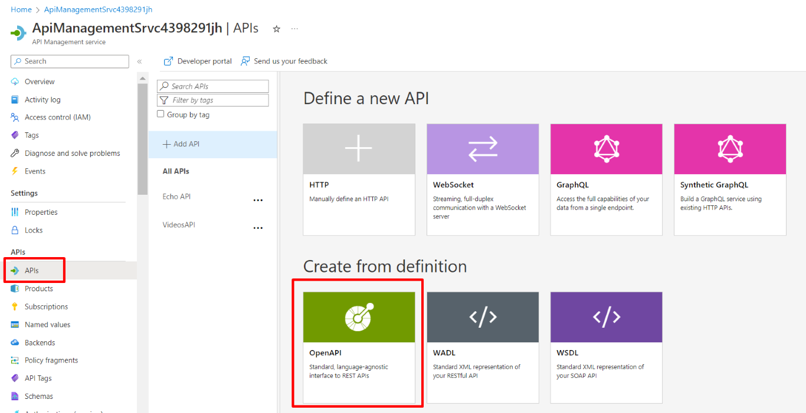

You will see a form that allows you to create new resources from OpenAPI specifications.

Paste here the link to the _swagger.json_ file you located before, populate the required fields and, if you want, add a prefix to identify these endpoints: I choose _MyBooks_.

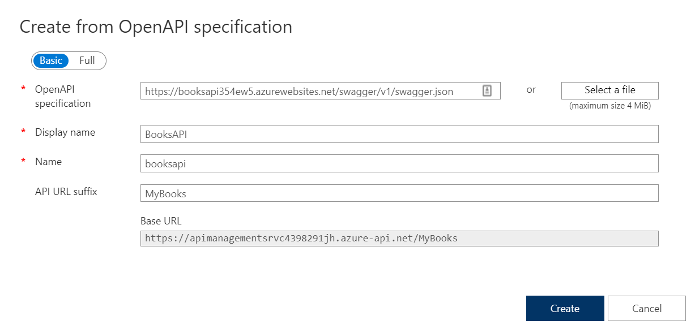

You will then see your APIs appear in the panel shown below. It is composed of different parts:

- The list of services exposed. In the screenshot below, BooksAPI, Echo API, and VideosAPI;
- The list of endpoints exposed for each service: here, BooksAPI exposes endpoints at `/`, `/echo`, and `/books`;
- A list of policies that are applied to the inbound requests before hitting the real endpoint;
- The real endpoint used when calling the facade exposed by APIM;
- A list of policies applied to the outbound requests after the origin has processed the requests.

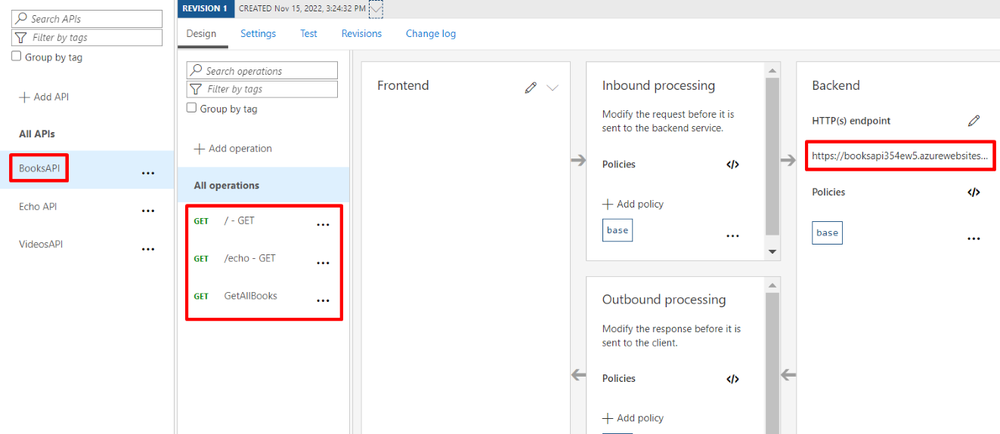

For now, we will ignore both Inbound and Outbound processing, as they will be the topic of a future article.

## Consuming APIs exposed on the API Gateway

We're ready to go! Head back to the Azure API Management service dashboard and **locate the URL of the API Gateway** under _Custom domains > Gateway URL_.

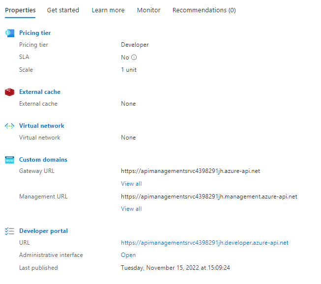

This will be the root URL that our clients will use.

We can then access Books API and Videos API both on the Origin and the Gateway (we're doing it just for demonstrating that things are working; clients will only use the APIs exposed by the API Gateway).

The Videos API maintains the exact same structure, mapping the endpoints as they are defined in Origin.

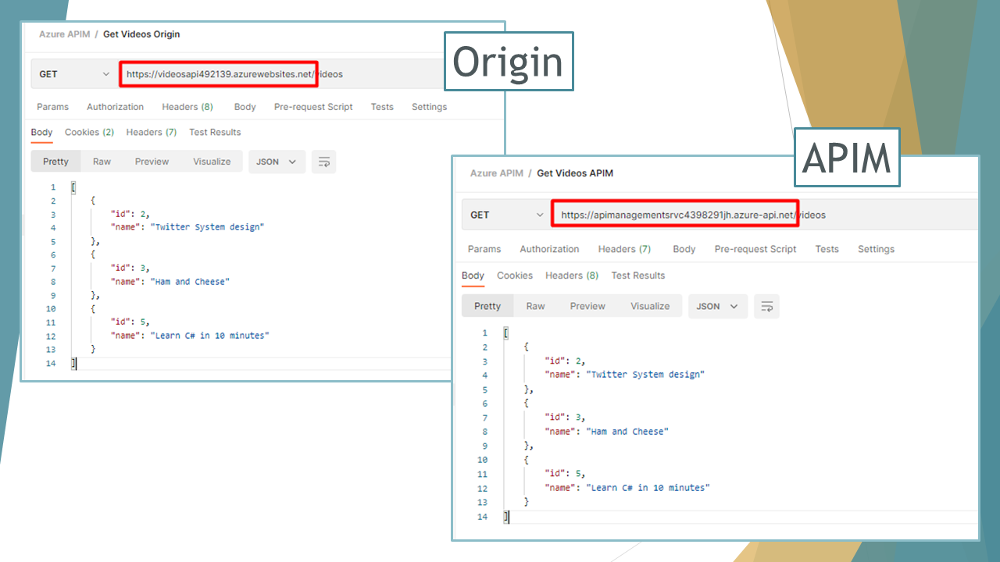

On the contrary, to access the Books APIs we have to access the `/mybooks` path (because we defined it a few steps ago when we imported the BooksAPI from OpenAPI definition: it's the _API Url Suffix_ field), as shown below:

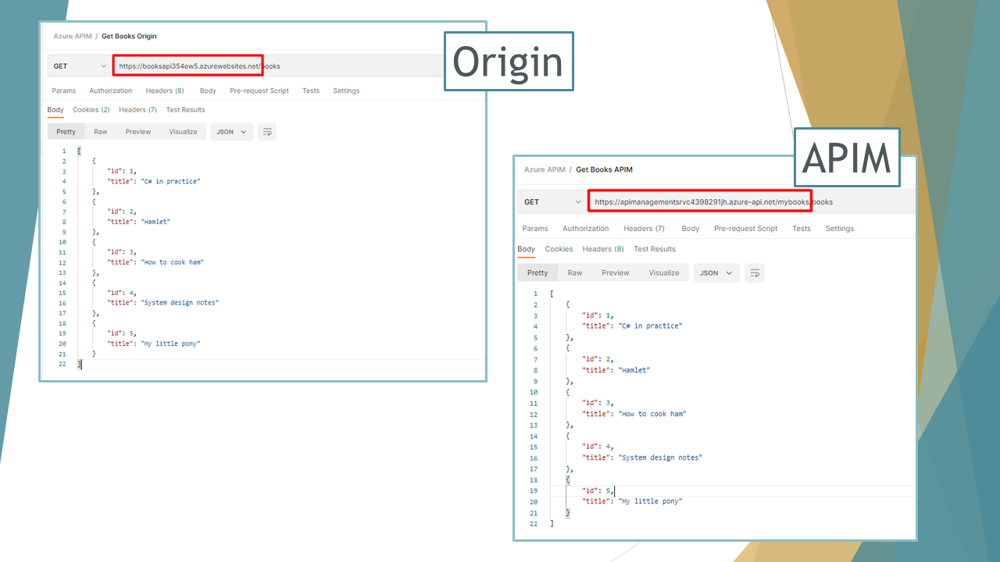

## Further readings

As usual, a bunch of interesting readings 📚

In this article, we've only scratched the surface of Azure API Management. There's way lot - and you can read about it on the Microsoft Docs website:

🔗 [What is Azure API Management? | Microsoft docs](https://learn.microsoft.com/en-us/azure/api-management/api-management-key-concepts)

To integrate Azure APIM, we used two simple dotNET 6 Web APIs deployed on Azure. If you wanna know how to set up GitHub Actions to build and deploy dotNET APIs, I recently published an article on that topic.

🔗 [How to deploy .NET APIs on Azure using GitHub actions | Code4IT](https://www.code4it.dev/blog/deploy-api-on-azure-with-github-action)

Lastly, since we've talked about Swagger, here's an article where I dissected how you can integrate Swagger in dotNET Core applications:

🔗 [Understanding Swagger integration in .NET Core | Code4IT](https://www.code4it.dev/blog/swagger-integration)

_This article first appeared on [Code4IT 🐧](https://www.code4it.dev/)_

## Wrapping up

This can be just the beginning of a long journey; APIM allows you to highly customize your API Gateway by defining API access by user role, creating API documentation using custom templates and themes, and a lot of different stuff.

We will come back to this topic soon.

Happy coding!

🐧
