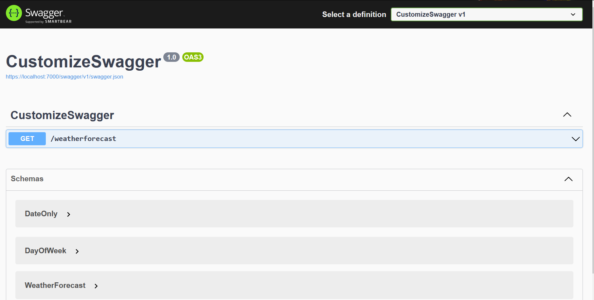
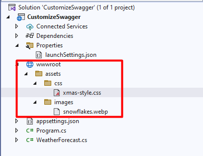
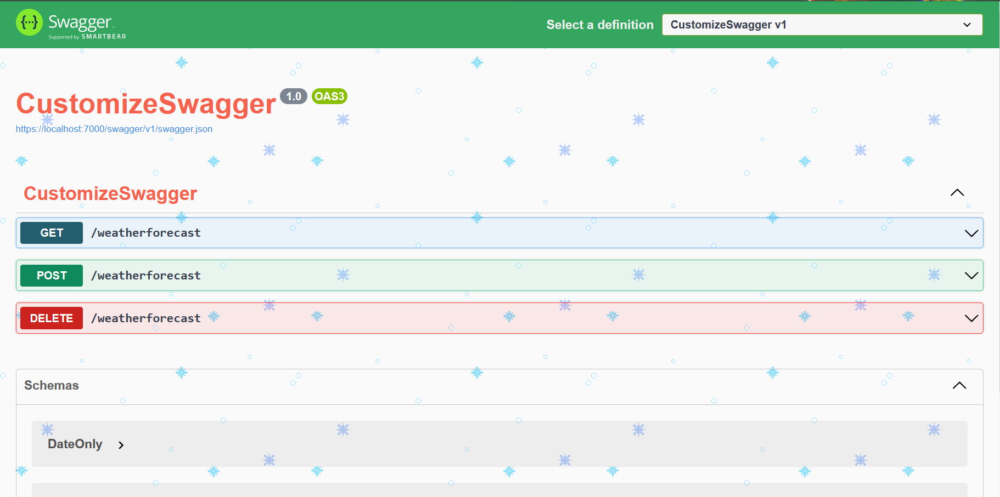

Brace yourself, Christmas is coming! 🎅 

If you want to add a more festive look to your Swagger UI, it's just a matter of creating a CSS file and injecting it.

**You should create a custom CSS for your Swagger endpoints**, especially if you are exposing them outside your company: if your company has a **recognizable color palette**, using it in your Swagger pages can make your brand stand out.

In this article, we will learn how to inject a CSS file in the Swagger UI generated using .NET Minimal APIs.

## How to add Swagger in your .NET Minimal APIs

There are plenty of tutorials about how to add Swagger to your APIs. I wrote some too, where I explained how every configuration impacts what you see in the UI.

That article was targeting older dotNET versions *without Minimal APIs*. Now everything's easier.

When you create your API project, Visual Studio asks you if you want to **add OpenAPI support (aka Swagger)**. By adding it, you will have everything in place to get started with Swagger.

You Minimal APIs will look like this:

```cs
public static void Main(string[] args)
{
    var builder = WebApplication.CreateBuilder(args);

    builder.Services.AddEndpointsApiExplorer();
    builder.Services.AddSwaggerGen();

    var app = builder.Build();

    app.UseSwagger();
    app.UseSwaggerUI();


    app.MapGet("/weatherforecast", (HttpContext httpContext) =>
    {
        // return something
    })
    .WithName("GetWeatherForecast")
    .WithOpenApi();

    app.Run();
}
```

The key parts are  `builder.Services.AddEndpointsApiExplorer()`, `builder.Services.AddSwaggerGen()`, `app.UseSwagger()`, `app.UseSwaggerUI()` and `WithOpenApi()`. Do you know that those methods do? If so, drop a comment below! 📩

Now, if we run our application, we will see a UI similar to the one below.



That's a basic UI. Quite boring, uh? Let's add some style

## Create the CSS file for Swagger theming

**All the static assets must be stored within the wwwroot folder**. It does not exist by default, so you have to create it manually. Click on the API project, add a new folder, and name it "wwwroot". Since it's a special folder, by default Visual Studio will show it with a special icon (it's a sort of blue world, similar to 🌐).

Now you can add all the folders and static resources needed.

I've created a single CSS file under */wwwroot/assets/css/xmas-style.css*. Of course, name it as you wish - as long as it is within the wwwroot folder, it's fine.

My CSS file is quite minimal:

```css
body {
    background-image: url("../images/snowflakes.webp");
}

div.topbar {
    background-color: #34A65F !important;
}

h2, h3 {
    color: #F5624D !important;
}

.opblock-summary-get > button > span.opblock-summary-method {
    background-color: #235E6F !important;
}

.opblock-summary-post > button > span.opblock-summary-method {
    background-color: #0F8A5F !important;
}

.opblock-summary-delete > button > span.opblock-summary-method {
    background-color: #CC231E !important;
}
```

There are 3 main things to notice:

1. the element selectors are taken directly from the Swagger UI - you'll need a bit of reverse-engineering skills: just open the Browser Console and find the elements you want to update;
2. unless the element does not already have the rule you want to apply, you have to add the `!important` CSS operator. Otherwise, your code won't affect the UI;
3. you can add assets from other folders: I've added `background-image: url("../images/snowflakes.webp");` to the `body` style. That image is, as you can imagine, under the wwwroot folder we created before.

Just as a recap, here's my project structure:



Of course, it's not enough: we have to tell Swagger to take into consideration that file

## How to inject a CSS file in Swagger UI

This part is quite simple: you have to update the `UseSwaggerUI` command within the Main method:

```diff
app.UseSwaggerUI(c =>
+   c.InjectStylesheet("/assets/css/xmas-style.css")
);
```

Notice how that path begins: no `wwwroot`, no `~`, no `.`. It starts with `/assets`.

One last step: we have to tell dotNET to consider static files when building and running the application. 

You just have to add `UseStaticFiles()`

```cs
app.UseStaticFiles();
```

After `builder.Build()`:

```diff
var app = builder.Build();
+ app.UseStaticFiles();

app.UseSwagger();
app.UseSwaggerUI(c =>
    c.InjectStylesheet("/assets/css/xmas-style.css")
);
```

Now we can run our APIs as admire our wonderful Xmas-style UI 🎅




## Further readings

This article is part of 2022 .NET Advent, created by [Dustin Moris 🐤](https://twitter.com/dustinmoris):

🔗 [C# Advent Calendar 2022](https://dotnet.christmas//)

CSS is not the only part you can customize, there's way more. Here's an article I wrote about Swagger integration in .NET Core 3 APIs, but it's still relevant (I hope! 😁)

🔗 [Understanding Swagger integration in .NET Core | Code4IT](https://www.code4it.dev/blog/swagger-integration)

*This article first appeared on [Code4IT](https://www.code4it.dev/)*

## Wrapping up

Theming is often not considered an important part of API development. That's generally correct: why should I bother adding some fancy colors to APIs that are not expected to have a UI?

This makes sense if you're working on private APIs. In fact, theming is often useful to improve **brand recognition** for public-facing APIs.

You should also consider using theming when **deploying APIs to different environments**: maybe Blue for Development, Yellow for Staging, and Green for Production. That way your developers can understand which environment they're exploring right easily.

Happy coding!
🐧

 