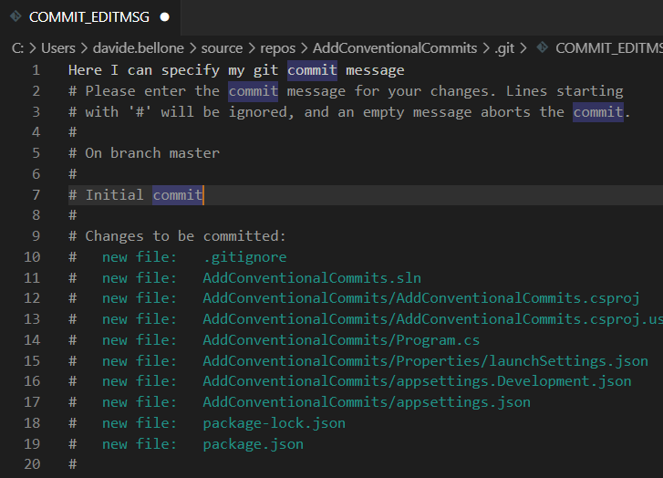
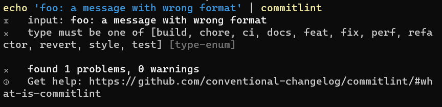
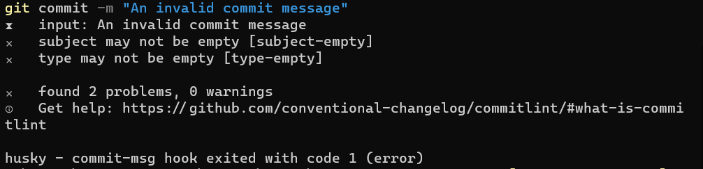
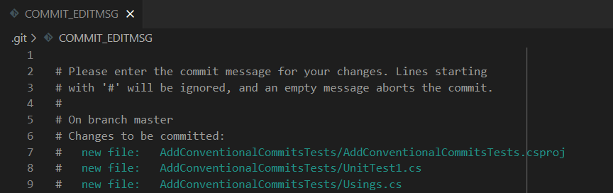
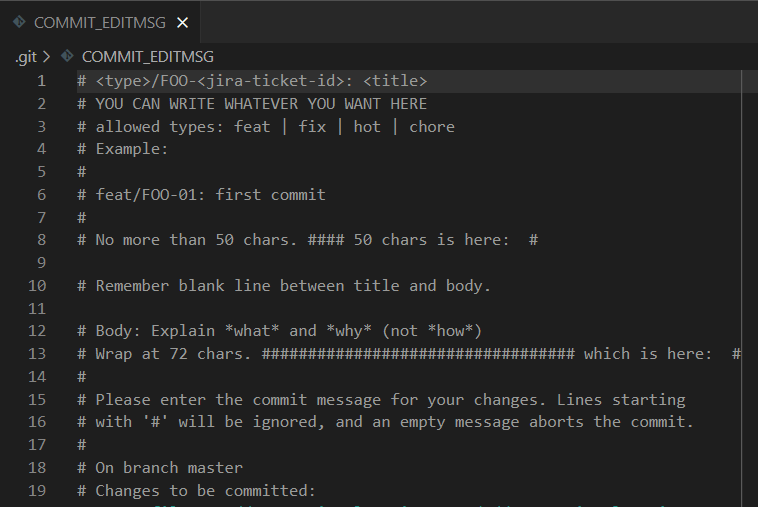
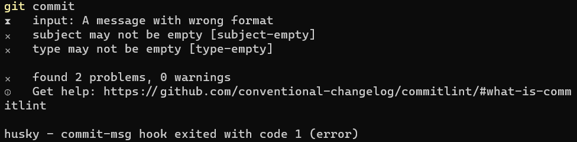

Setting teams conventions is a crucial step to have the project prepared to live long and prosper 🖖

A good way to set some clarity is by enforcing rules on GIT commit messages: you can enforce devs to specify the reason behind some code changes so that you can understand the history and the reason for each of those commits. Also, **if you have well-crafted commit messages, Pull Requests become easier to understand, leading to better code**.

Conventional Commits help you set such rules, and help you level up your commit history. In this article, we will learn how to add Conventional Commits in a .NET application.

## Conventional Commits

Conventional Commits are a set of rules that help you write commit messages using a format that has multiple purposes:

- they help developers understand the history of a git branch;
- they help PR reviewers focus on the Pull Request by understanding the changes proposed by the developer;
- using automated tools, they help versioning the application - this is useful when using Semantic Versioning;
- they allow you to create automated Changelog files.

So, what does an average Conventional Commit look like?

There's not just one way to specify such formats.

For example, you can specify that you've added a new feature (_feat_) to your APIs and describe it shortly:

```plain
feat(api): send an email to the customer
```

Or you can explain that you've fixed a bug (using _fix_) and add a full description of the scope of the commit.

```plain
fix: prevent racing condition

Introduce a request id and a reference to latest request. Dismiss
incoming responses other than from latest request.
```

There are several types of commits that you can support, such as:

- _feat_, used when you add a new feature to the application;
- _fix_, when you fix a bug;
- _docs_, used to add or improve documentation to the project;
- _refactor_, used - well - after some refactoring;
- _test_, when adding tests or fixing broken ones

All of this prevents developers write commit messages such as _"something"_, _"fixed bug"_, _"some stuff"_.


So, now, it's time to include Conventional Commits in our .NET applications.

## What is our goal?

For the sake of this article, I'm going to add Conventional Commits in a .NET 7 API project. The same approach works for all the other types of .NET projects: as long as you have a Solution to work with, I've got you covered.

Well, actually, **the following approach can be used by every project**, not only those based on .NET: the reason I wrote this article is that many dotnet developers are not confident in using and configuring NPM packages, so my personal goal with this article is to give you the basics of such tools and configurations.

For the sake of this article, I'm going to explain how to add Conventional Commits with a custom format.

Say that you want to associate each commit to a Jira task. As you may know, Jira tasks have an ID composed of a project prefix and a numeric Id. So, for a project named FOO, you can have a task with Id _FOO-123_.

The goal of this article is, then, to force developers to create Commit messages such as

```plain
feat/FOO-123: commit short description
```

or, if you want to add a full description of the commit,

```plain
feat/FOO-123: commit short description

Here we can have the full description of the task.
And it can also be on multiple lines.
```

**We are going to work at Solution level; you don't even need an IDE: just Notepad and a Terminal are fine**. Before continuing, open your solution folder and a Console pointing to the same folder.

## Install NPM in your folder

Yes, even if the main application is built with .NET, we are gonna need some NPM packages to set up our Conventional Commits.

First things first: head to the Command Line and run

```cmd
npm init
```

After specifying some configurations (Package name? Licence? Author?), you will have a brand new _package.json_ file.

Now we can move on and add a GIT Hook.

## Husky: integrate GIT Hooks to improve commit messages

**To use conventional commits we have to "intercept" our GIT actions**: we will need to run a specific tool right after having written a commit message; we have to validate it and, in case it does not follow the rules we've set, abort the operations.

We will use [Husky 🔗](https://typicode.github.io/husky/): it's a facility package that allows us to _do stuff_ with our commit messages and, in general, integrate work with Git Hooks.

Head to the terminal, and **install Husky** by running

```cmd
npm install husky --save-dev
```

This command will add a dependency to Husky, as you can see from the new item listed in the _package.json_ file:

```json
"devDependencies": {
    "husky": "^8.0.3"
}
```

Finally, to **enable Git Hooks**, we have to run

```cmd
npm pkg set scripts.prepare="husky install"
```

and notice the new section in the _package.json_.

```json
"scripts": {
    "prepare": "husky install"
},
```

Even with just these simple steps, we can see a first result: if you run `git commit` you will see a text editor open. Here you can write your commit message.



Save and close the file. The commit message has been applied, as you can see by running `git log --oneline`.

## CommitLint: a package to validate Commit messages

We need to install and configure CommitLint, the NPM package that does the dirty job.

On the same terminal as before, run

```cmd
npm install --save-dev @commitlint/config-conventional @commitlint/cli
```

to install both _commitlint/config-conventional_, which add the generic functionalities, and _commitlint/cli_, which allows us to run the scripts via CLI.

You will see both packages listed in your package.json file:

```json
"devDependencies": {
    "@commitlint/cli": "^17.4.2",
    "@commitlint/config-conventional": "^17.4.2",
    "husky": "^8.0.3"
}
```

Next step: scaffold the file that handles the configurations on how we want our Commit Messages to be structured.

On the root, **create a brand new file, _commitlint.config.js_,** and paste this snippet:

```javascript
module.exports = {
  extends: ["@commitlint/config-conventional"],
}
```

This snippet tells Commitlint to use the default conventions, such as _feat(api): send an email_.

To test the default rules without issuing any real commit, we have to install the previous packages globally, so that they can be accessed outside the scope of the git hooks:

```cmd
npm install -g @commitlint/cli @commitlint/config-conventional
```

and, in a console, we can run

```cmd
echo 'foo: a message with wrong format' | commitlint
```

and see the error messages



At this point, we still don't have CommitLint ready to validate our commit messages. In fact, if you try to commit your changes with an invalid message, you will see that the message passes the checks (because there are _no_ checks!), and your changes get committed.

We need to do some more steps.

First of all, we have to **create a folder named .husky** that will be used by Husky to understand which commands are supported.

```cmd
mkdir .husky
```

Notice: you have to keep the dot at the beginning of the folder name: it's _.husky_, not _husky_.

Then we need to add a new file within that folder to **tell Husky that it needs to run CommitLint**.

```cmd
npx husky add .husky/commit-msg  'npx --no -- commitlint --edit ${1}'
```

We're almost ready: everything is set, but we need to **activate the functionality**. So you just have to run

```cmd
npx husky install
```

to see it working:



## Commitlint.config.js: defining explicit rules on Git Messages

Now, remember that we want to enforce certain rules on the commit message.

We don't want them to be like

```plain
feat(api): send an email to the customer when a product is shipped
```

but rather like

```plain
feat/FOO-123: commit short description

Here we can have the full description of the task.
And it can also be on multiple lines.
```

This means that we have to configure the _commitlint.config.js_ file to override default values.

Let's have a look at a valid Commitlint file:

```js
module.exports = {
  extends: ["./node_modules/@commitlint/config-conventional"],
  parserPreset: {
    parserOpts: {
      headerPattern: /^(\w*)\/FOO-(\w*): (.*)$/,
      headerCorrespondence: ["type", "scope", "subject"],
    },
  },
  rules: {
    "type-enum": [2, "always", ["feat", "fix", "hot", "chore"]],
    "header-min-length": [2, "always", 10],
    "header-max-length": [2, "always", 50],
    "body-max-line-length": [2, "always", 72],
    "subject-case": [
      2,
      "never",
      ["sentence-case", "start-case", "pascal-case", "upper-case"],
    ],
  },
}
```

Time to deep dive into those sections:

### The ParserOpts section: define how CommitList should parse text

The first part tells the parser how to parse the header message:

```js
parserOpts: {
    headerPattern: /^(\w*)\/FOO-(\w*): (.*)$/,
    headerCorrespondence: ["type", "scope", "subject"],
},
```

It's a regular expression, where every matching part has its correspondence in the `headerCorrespondence` array:

So, in the message _hello/FOO-123: my tiny message_, we will have type=hello, scope=123, subject=my tiny message.

### Rules: define specific rules for each message section

The `rules` section defines the rules to be applied to each part of the message structure.

```js
rules:
{
    "type-enum": [2, "always", ["feat", "fix", "hot", "chore"]],
    "header-min-length": [2, "always", 10],
    "header-max-length": [2, "always", 50],
    "body-max-line-length": [2, "always", 72],
    "subject-case": [
        2,
        "never",
        ["sentence-case", "start-case", "pascal-case", "upper-case"],
    ],
},
```

The first value is a number that expresses the severity of the rule:

- 0: the rule is disabled;
- 1: show a warning;
- 2: it's an error.

The second value defines if the rule must be applied (using _always_), or if it must be reversed (using _never_).

The third value provides generic arguments for the related rule. For example, `"header-max-length": [2, "always", 50],` tells that the header must always have a length with <= 50 characters.

You can read more about each and every configuration on [the official documentation 🔗](https://commitlint.js.org/#/reference-rules).

## Setting the commit structure using .gitmessage

Now that everything is set, we can test it.

But not before helping devs with a simple trick! As you remember, when you run `git commit` without specifying the message, an editor appears with some hints about the structure of the commit message.



You can set your own text with hints about the structure of the messages.

You just need to create a file named .gitmessage and put some text in it, such as:

```plain
# <type>/FOO-<jira-ticket-id>: <title>
# YOU CAN WRITE WHATEVER YOU WANT HERE
# allowed types: feat | fix | hot | chore
# Example:
#
# feat/FOO-01: first commit
#
# No more than 50 chars. #### 50 chars is here:  #

# Remember blank line between title and body.

# Body: Explain *what* and *why* (not *how*)
# Wrap at 72 chars. ################################## which is here:  #
#
```

Now, we have to tell Git to use that file as a template:

```cmd
git config commit.template ./.gitmessage
```

and.. TA-DAH! Here's your message template!



## Putting all together

Finally, we have everything in place: git hooks, commit template, and template hints.

If we run `git commit`, we will see an IDE open and the message we've defined before. Now, type _A message with wrong format_, save, close the editor, and you'll see that the commit is aborted.



Now you run `git commit` again, you'll see again the IDE, and type _feat/FOO-123: a valid message_, and you'll see it working

## Further readings

Conventional Commits is a project that lists a set of specifications for writing such good messages. You can read more here:

[🔗 Conventional Commits](https://www.conventionalcommits.org/en/v1.0.0)

As we saw before, there are a lot of configurations that you can set for your commits. You can see the full list here:

[🔗 CommitLint rules](https://commitlint.js.org/#/reference-rules)

_This article first appeared on [Code4IT 🐧](https://www.code4it.dev/)_

This new kind of commit message works well with Semantic Versioning, which can be useful to publish package versions with a meaningful version number, such as 2.0.1:
[🔗 Semantic Versioning](https://semver.org)

And, to close the loop, Semantic Versioning can be easily integrated with CI pipelines. If you use .NET APIs and want to deploy your APIs to Azure using GitHub Actions, you can start from this article and add SemVer:
[🔗 How to deploy .NET APIs on Azure using GitHub actions](https://www.code4it.dev/blog/deploy-api-on-azure-with-github-action)

## Wrapping up

In this article, we've learned what are Conventional Commits, how to add them using Husky and NPM, and how to configure our folder to use such tools.

The steps we've seen before work for every type of application, even not related to dotnet.

So, to recap everything, we have to:

1. Install NPM: `npm init`;
2. Install Husky: `npm install husky --save-dev`;
3. Enable Husky: `npm pkg set scripts.prepare="husky install"`;
4. Install CommitLint: `npm install --save-dev @commitlint/config-conventional @commitlint/cli`;
5. Create the commitlint.config.js file: `module.exports = { extends: '@commitlint/config-conventional']};`;
6. Create the Husky folder: `mkdir .husky`;
7. Link Husky and CommitLint: `npx husky add .husky/commit-msg 'npx --no -- commitlint --edit ${1}'`;
8. Activate the whole functionality: `npx husky install`;

Then, you can customize the commitlint.config.js file and, if you want, create a better .gitmessage file.

I hope you enjoyed this article! Let's keep in touch on [Twitter](https://twitter.com/BelloneDavide) or on [LinkedIn](https://www.linkedin.com/in/BelloneDavide/), if you want! 🤜🤛

Happy coding!

🐧
