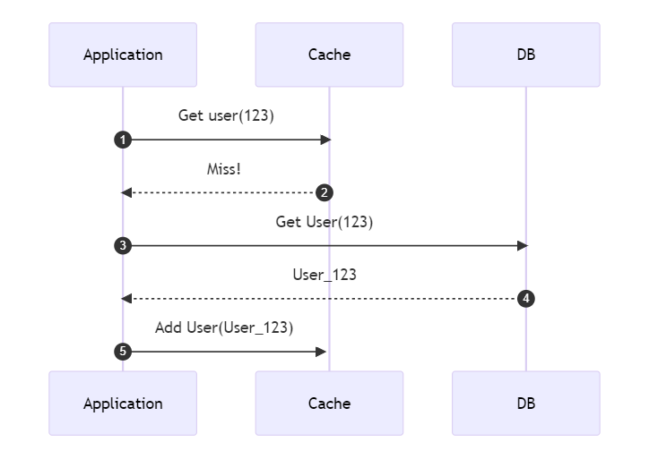
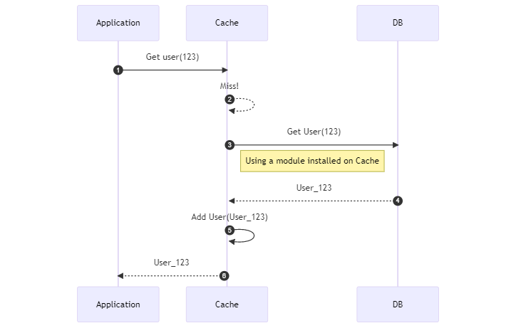
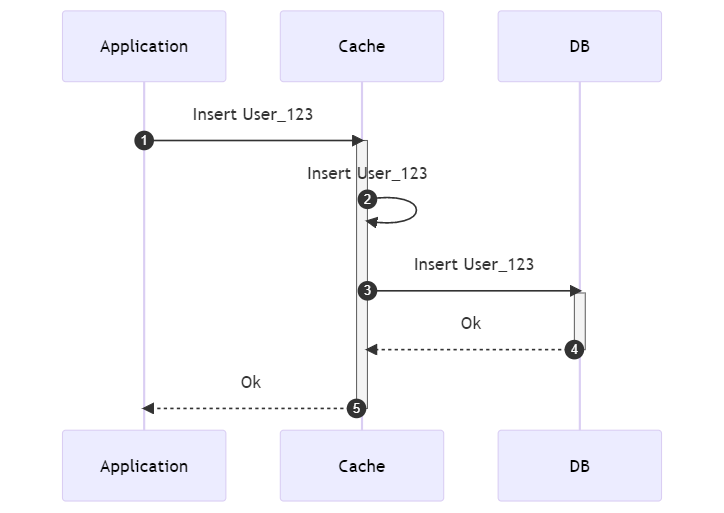
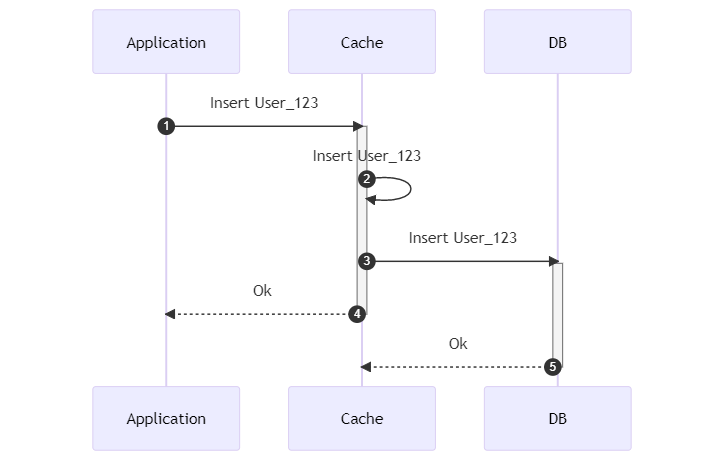

As you surely know, _caching_ is a technique that allows you to store data in a way that is incredibly efficient to access.

Faster reads bring faster applications - thus, almost every application that needs to provide high performance uses some type of cache.

In this article, we will learn 4 caching strategies used at _application level_: **Cache-aside**, **Read-through**, **Write-through**, and **Write-behind**. We will also learn the Pros and Cons of each strategy.

## Caching exists on different levels

In the previous sentence I specified that we will tackle caching at **application level**. Why did I specify it?

Well, because we tend to think of caching as server-only functionality. _It's not_.

We can cache data on the client (eg: Browser), on the infrastructure (eg: CDN), and on the Application. Each one has some reasons to exist.

You can **cache resources on the browser** to avoid excessive calls to a server. For instance, if you already have downloaded a JavaScript file, you don't need to download it every time to navigate to another page; if the content is not _stale_ you can just reuse the one you've already downloaded.

**CDN** is a way to store images and, more in general, static assets in an efficient way - browsers still have to call a server to download remote resources, but instead of calling the "main" application, they call the CDN to retrieve static assets - allowing our main application to handle requests that require dynamic data.

Then, we are finally back to the **application cache**: if you have to serve data that does not change very often, you can cache it to avoid excessive (and avoidable) accesses to the data source, which is usually a DB or an external API. We will focus on this kind of caching.

To handle data we have to pick the strategies for writing and reading. Let's see the most common strategies we have.

## Cache-aside: cache and DB do NOT interact

Cache-aside, **also known as Lazy caching**, is probably the most used strategy: read from the cache; if the item does not exist, retrieve it from the source and add it to the cache, so that the next time the application tries to retrieve the same item, it is already present in the cache.

It is called Cache-aside because the cache layer does not interact with the database directly: it is kept _aside_.



### Advantages of Cache-aside

Cache-aside is **great for read-heavy workloads**: every time there's a Cache Miss, you add the missing data on the cache, so the next time you try to access the same data it will already be available.

Also, **if the cache is unavailable, the application still works**: instead of querying the cache, you will have to access the DB every single time; the application will become slower, for sure, but at least it will remain available.

Finally, consider that not everything needs to be accessed. Using Cache-aside, you will only store on Cache data that someone required.

### Disadvantages of Cache-aside

Since the first time you require a key it will not be present in the cache, **the first access is slower** (you'll have to call both the Cache and the DB).

Also, more important, if the data on the DB changes (because, for example, another application updates the same tables), you will have **inconsistent data** - this means that you must find a way to **evict data** updated by other services.

## Read-through: the cache knows how to query the DB

It is similar to Cache-aside, but now the cache **does also know how to interact with the source** to get missing data.

The cache has a component that allows it to reach the DB and retrieve the missing data.



> Wait! How can the Cache query the DB? 😖

You have to install modules or plugins on it: for example, if you use Redis, you can install a plugin called [RedisGear 🔗](https://oss.redis.com/redisgears/) that allows you to interact with a DB.

For instance, if you're using Hibernate to access a DB, you can install a plugin called [Rghibernate🔗](https://github.com/RedisGears/rghibernate#read-through) to configure Redis to query the Database using structures defined in XML files, such as:

```xml
<?xml version="1.0" encoding="UTF-8"?>
<hibernate-mapping xmlns="http://www.hibernate.org/xsd/hibernate-mapping"
  xmlns:xsi="http://www.w3.org/2001/XMLSchema-instance"
  xsi:schemaLocation="http://www.hibernate.org/xsd/hibernate-mapping
    http://www.hibernate.org/xsd/hibernate-mapping/hibernate-mapping-4.0.xsd">

  <class entity-name="Student" table="student">
          <tuplizer entity-mode="dynamic-map" class="org.hibernate.tuple.entity.DynamicMapEntityTuplizer"/>
          <id name="id" type="integer" length="50" column="id"/>
          <property name="firstName" column="first_name" type="string"/>
          <property name="lastName" column="last_name" type="string"/>
          <property name="email" column="email" type="string" not-null="true"/>
          <property name="age" column="age" type="integer"/>
  </class>

</hibernate-mapping>
```

Other Cache vendors, such as NCache, allow you to implement such modules in your application; with NCache you can create a class that implements `IReadThruProvider` and that accesses the DB, and configure NCache to use such classes when trying to read data.

### Advantages of Read-through

Like Cache-aside, Read-through is **optimal for read-heavy workloads**: data is always available, and expired data gets updated automatically.

Also, Read-through makes your **application code smaller and easier to manage**: your code does not query the DB anymore, and everything is managed by the cache.

### Disadvantages of Read-through

Clearly, since every time you need to retrieve some data you have to pass through the cache, we've just introduced a **Single Point of Failure**: if for some reason the Cache is unavailable, your application won't be able to retrieve such data from the DB.

We've also introduced **coupling between the Cache and the DB**: if the model on the DB changes because we've added a new column or changed a data type, we have to update the way the cache queries the Database.

## Write-through: the cache can write on the DB SYNCHRONOUSLY

Data is first written on the cache, and then to the source **synchronously**.

The application asks the cache to save some data. The cache then stores that data in its internal storage and then writes on the DB using some configurations and modules (as we've seen for the Read-through pattern).

Then, when both the cache and the DB have updated the value, returns to the application to say that everything's ok.



Again, the application does not write data directly on the DB, but it's the cache itself that knows how to write data on the DB.

### Advantages of Write-through

Since all data writings pass through the cache, **we won't have stale data**, and since all read queries pass through the Cache, our application will always be in the most updated state.

### Disadvantages of Write-through

If the cache fails or is unavailable, **we will lose the data** we're trying to write. This happens because, again, we've introduced a Single Point of Failure. Of course, if the application goes down, we won't even be able to read data - everything is stuck!

Since those operations occur synchronously, we now have **increased latency**: before moving on, the application must wait for both the cache and the DB to complete their work and write the new data.

## Write-behind: the cache can write on the DB ASYNCHRONOUSLY

Write-behind is similar to Write-through, but all the writes to the source are **asynchronous**.



### Advantages of Write-behind

Since now we don't have to wait for the DB to complete its writes, we have **improved the overall performance** because we have shrunk our latency.

We can also **batch the writes to the DB**, reducing the round-trips to the data store.

### Disadvantages of Write-behind

Again, **if the cache fails, data is not stored on the DB**. And, again, we have this new Single Point of Failure.

Also, if the cache updates its internal state correctly but, for some reason, the DB cannot update the new data, we will have **inconsistent data**. And, of course, the Application does not know if the data has been correctly stored on the DB.

## Further readings

This whole article exists thanks to another interesting blog post I recently read and decided to extend a bit:

🔗 [Caching Strategies In Practice | Rajeev](https://medium.com/@raj.k9732/caching-strategies-in-practice-6dd141ef2e6)

Both AWS and Azure provide a way to use caching on their systems.

AWS's caching functionality is called ElastiCache. They have published a nice guide of best practices for using distributed cache:

🔗 [Caching Best Practices| AWS](https://aws.amazon.com/caching/best-practices/)

Similarly, Azure gives you a Redis instance. And they have also published their set of best practices:

🔗 [Caching guidance | Microsoft Docs](https://learn.microsoft.com/en-us/azure/architecture/best-practices/caching)

Then, Alachisoft, the creators of NCache, has a nice section you might want to read.

🔗 [Benefits of Read-through & Write-through over Cache-aside | Alachisoft](https://www.alachisoft.com/resources/articles/readthru-writethru-writebehind.html)

Finally, we've already talked about Caching in .NET: in particular, we've learned how to use the Decorator design pattern to add a caching layer to our applications:

🔗 [How to add a caching layer in .NET 5 with Decorator pattern and Scrutor](https://www.code4it.dev/blog/caching-decorator-with-scrutor)

_This article first appeared on [Code4IT 🐧](https://www.code4it.dev/)_

## Wrapping up

In this article, we've learned what are the 4 main caching strategies that you can implement at the application level.

Each one of these has some pros and some cons - you have to pick choose the best one for your application.

Have you ever used Read-through, Write-Through, or Write-Behind? Leave a comment below! 📩 I'm curious to hear about your experience, how you configured the cache to interact with the DB, and what were the challenges with these approaches.

I hope you enjoyed this article! Let's keep in touch on [Twitter](https://twitter.com/BelloneDavide) or on [LinkedIn](https://www.linkedin.com/in/BelloneDavide/), if you want! 🤜🤛

Happy coding!

🐧
