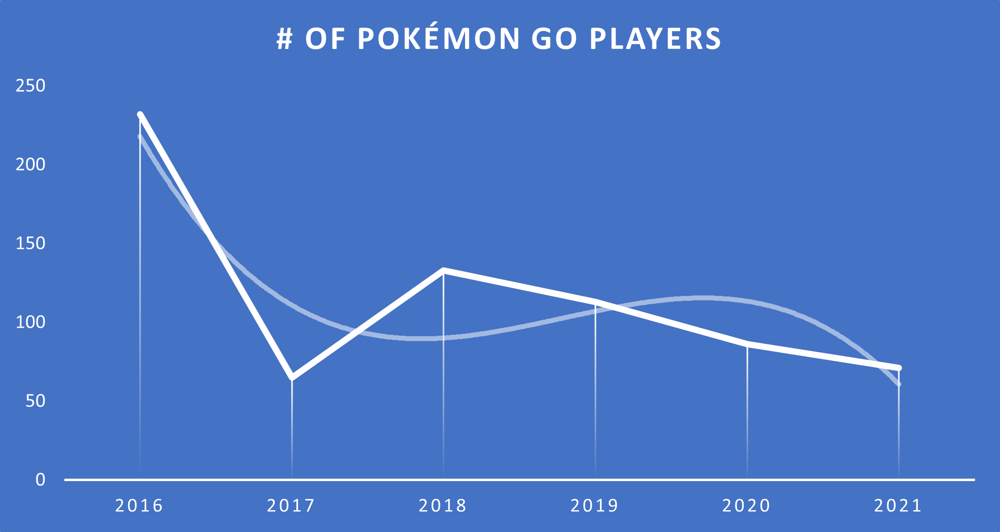
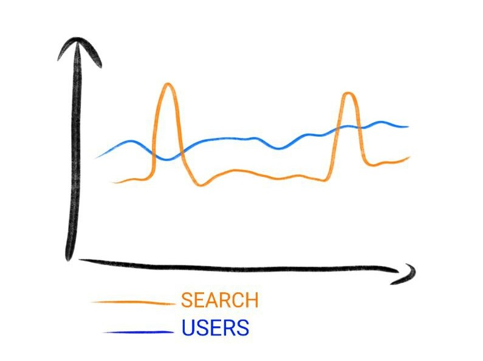

Every time I hear someone talk about microservices they talk about Scalability and Elasticity.

I've always seen them together, so I thought they were synonyms. Well, **they are not**.

In this article, we're gonna learn what Scalability and Elasticity are, why they differ, and why they solve two totally different problems.

## Scalability: handle constantly increasing workloads

Scalability is the property of a system to, well, scale and increase capacity to **be able to handle increasing, constant, workload**.

The key point is that, **when architecting for scalability, you have to plan for the long run**.

Let's see a real-ish example: TikTok.

Starting from the release date, in September 2016, TikTok continuously grew.

Have a look at this diagram found on [InsiderIntelligence.com](https://www.insiderintelligence.com/charts/global-tiktok-user-stats):

TikTok had more and more users in the last 3 years. This means that their architecture needs to be able to scale accordingly. They have a continuous flow of new users, and it brings some challenges: _can their system keep up with the incoming requests?_ Is their DB big and performant enough to deal with all those data? If they wanted to use big data to calculate some metrics on their systems, can their processes work in a reasonable time to extract such data?

As for every _-ility_ in Software Architecture, we need a way to measure it. **Scalability can be measured by the number of incoming requests the system can handle simultaneously.** The more, the better.

Ok, but **how can we increase scalability?**

There are two main approaches for achieving Scalability, and I'm pretty sure you already know them:

- **Vertical scaling**: add more resources to the existing architecture: more CPU, more RAM, more disks. From the outside, the system appears unchanged.
- **Horizontal scaling**: add more nodes to the existing one. Each node will then handle a fraction of the incoming requests. Therefore, you'll need to place such nodes behind a Load Balancer.

## Elasticity: handle peaks of load

While Scalability is all about the long run, **Elasticity is about spikes of requests**.

A system is elastic if it can handle sudden (but, most of the times, expected) spikes of requests without impacting performance.

Let's use Pokémon GO as an example. The game that _almost brought world peace_ was released in 2016. It certainly had a spike in the first months, but then more and more users stopped using it.

Clearly, now they do not need to support the same traffic load they handled when they released the game. So, the system needed to **scale in** to avoid useless expenses.

There are some approaches used to handle Elasticity:

- **Horizontal scaling with autoscale**: as we saw before, scaling horizontally means adding and removing nodes to the system. **Scale out** means adding nodes, and **scale in** means removing nodes. Clearly, **to be Elastic, a system needs to scale in and out automatically**.
- **Serverless computing**: not having to deal with computing resources is a good way to improve Elasticity. You then delegate Cloud Vendors the task of adding and removing resources based on the load.

There's one word that is the key to achieving elasticity: **automatically**. The system must be able to provision and de-provision resources automatically; otherwise, it won't be able to withstand the peak of traffic and, once it has finished, it will waste resources that are not being used.

## Scalability and Elasticity are not mutually exclusive

Can our systems be both Elastic and Scalable? Or maybe they always need to be both?

Well, **Elasticity and Scalability are independent**. You can even have part of the system highly scalable and part of the system highly elastic.

Let's use Amazon as an example. Their platform is constantly growing, thus their overall system needs to scale. But **not every part of their system needs to be elastic**.

While it's true that, on average, more and more users create an account on Amazon - forcing the systems that deal with login and user data to scale accordingly - there are parts of their system that need to be elastic as well: search and check-out. For instance, Black Friday and Cyber Monday are the days when users perform more and more searches and, in general, buy a lot of products. So, while the "user-related" system does not need to scale, the "search" and "buy" parts need to be elastic.

So, Scalability and Elasticity often go together, but since they address different problems, they must be taken into consideration only when needed. You have to carefully decide which parts must be elastic, which ones must be scalable, and to what degree.

As always, **it depends**!

## Further readings

There are tons of articles about Scalability and Elasticity.

One of the best articles that I found online is this one published by Chunting Wu:

🔗 [Scalability vs. Elasticity | Better Programming](https://betterprogramming.pub/scalability-vs-elasticity-cfae2d7a19b)

We've briefly seen what are Vertical and Horizontal scaling. If you want to dive deeper into these topics, here's an article by Mehmet Ozkaya that you might enjoy:

🔗[Fundamentals of Scalability: Vertical and Horizontal Scaling | Design Microservices Architecture with Patterns & Principles](https://medium.com/design-microservices-architecture-with-patterns/fundamentals-of-scalability-vertical-and-horizontal-scaling-2933422859de)

and another one by Israel Josué Parra Rosales:

🔗 [Vertical Scaling vs Horizontal Scaling | Dev Genius](https://blog.devgenius.io/vertical-scaling-vs-horizontal-scaling-cfad0ff2d7bf)

_This article first appeared on [Code4IT 🐧](https://www.code4it.dev/)_

We also learned that to achieve Elasticity, you can use Serverless computing. One way to achieve it is by using Azure Functions. You can write custom code using .NET, and you can also define a Startup class to define Dependency Injection and Logging.

🔗[How to add a Startup class to Azure Functions | Code4IT](https://www.code4it.dev/blog/azure-functions-startup-class)

## Wrapping up

In this short article, we've learned what Elasticity and Scalability are, why they do differ, and how to achieve them.

We've also learned that they are similar Architectural characteristics, but they actually are independent of eachother.

I hope you enjoyed this article! Let's keep in touch on [Twitter](https://twitter.com/BelloneDavide) or on [LinkedIn](https://www.linkedin.com/in/BelloneDavide/), if you want! 🤜🤛

Happy coding!

🐧
