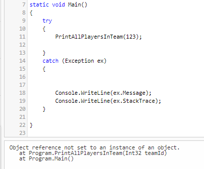

Small functions not only improve your code readability but also help to debug faster your applications in case of unhandled exceptions.

Take as an example the program listed below: what would happen if a `NullReferenceException` is thrown? Would you be able to easily understand which statement caused that exception?

```cs
static void Main()
{
	try
	{
		PrintAllPlayersInTeam(123);

	}
	catch (Exception ex)
	{
		Console.WriteLine(ex.Message);
		Console.WriteLine(ex.StackTrace);
	}

}

public static void PrintAllPlayersInTeam(int teamId) {

	Feed teamFeed = _sportClient.GetFeedForTeam(teamId);
	Team currentTeam = _feedParser.ParseTeamFeed(teamFeed.Content.ToLower());

	Feed playerFeed = _sportClient.GetPlayersFeedForTeam(currentTeam.TeamCode.ToUpper());

	var players = _feedParser.ParsePlayerFeed(playerFeed.Content.ToLower()).ToList();

	foreach (var player in players)
	{
		string report = "Player Id:" + player.Id;
		report += Environment.NewLine;
		report += "Player Name: " + player.FirstName.ToLower();
		report += Environment.NewLine;
		report += "Player Last Name: " + player.LastName.ToLower();

		Console.WriteLine(report);
	}

}
```

With one, single, huge function, we lose the context of our exception. The `catch` block intercepts an error that occurred in the `PrintAllPlayersInTeam` function. But where? Maybe in `teamFeed.Content.ToLower()`, or maybe in `player.FirstName.ToLower()`.

Even the exception's details won't help!



```
Object reference not set to an instance of an object.
   at Program.PrintAllPlayersInTeam(Int32 teamId)
   at Program.Main()
```

Yes, it says that the error occurred in the `PrintAllPlayersInTeam`. But where, exactly? Not a clue!

By putting all together inside a single function, `PrintAllPlayersInTeam`, we are losing the context of our exceptions.

So, a good idea is to split the method into smaller, well-scoped methods:

```cs
static void Main()
	{
		try
		{
			PrintAllPlayersInTeam(123);
		}
		catch (Exception ex)
		{
			Console.WriteLine(ex.Message);
			Console.WriteLine(ex.StackTrace);
		}

	}

	public static void PrintAllPlayersInTeam(int teamId)
	{
		Team currentTeam = GetTeamDetails(teamId);

		var players = GetPlayersInTeam(currentTeam.TeamCode);

		foreach (var player in players)
		{
			string report = BuildPlayerReport(player);

			Console.WriteLine(report);
		}

	}

	public static string BuildPlayerReport(Player player)
	{
		string report = "Player Id:" + player.Id;
		report += Environment.NewLine;
		report += "Player Name: " + player.FirstName.ToLower();
		report += Environment.NewLine;
		report += "Player Last Name: " + player.LastName.ToLower();

		return report;
	}

	public static Team GetTeamDetails(int teamId)
	{
		Feed teamFeed = _sportClient.GetFeedForTeam(teamId);
		Team currentTeam = _feedParser.ParseTeamFeed(teamFeed.Content.ToLower());
		return currentTeam;

	}

	public static IEnumerable<Player> GetPlayersInTeam(string teamCode)
	{
		Feed playerFeed = _sportClient.GetPlayersFeedForTeam(teamCode.ToUpper());

		var players = _feedParser.ParsePlayerFeed(playerFeed.Content.ToLower()).ToList();
		return players;
	}
```

Of course, **this is not a perfect code, but it give you the idea!**.

As you can see, I've split the `PrintAllPlayersInTeam` method into smaller ones.

If now we run the code again, we get a slightly more interesting stack trace:

```
Object reference not set to an instance of an object.
   at Program.GetTeamDetails(Int32 teamId)
   at Program.PrintAllPlayersInTeam(Int32 teamId)
   at Program.Main()
```

Now we know that the exception is thrown on the `GetTeamDetails` method, so we reduced the scope of our investigations to the following lines:

```cs
Feed teamFeed = _sportClient.GetFeedForTeam(teamId);
Team currentTeam = _feedParser.ParseTeamFeed(teamFeed.Content.ToLower());
return currentTeam;
```

It's easy to understand that the most probable culprits are `teamFeed` and `teamFeed.Content`!

**Of course, you must not exaggerate!** Don't create a method for every single operation you do: in that way, you'll just clutter the code without adding any value.

## Downsides

Yes, adding new functions can slightly impact the application performance. In fact, every time we call a function, a stack operation is performed. This means that the more nested methods we call, the more stack operations we perform. But does it really impact the application performance? Or is it better to write cleaner code, even if we lose some nanoseconds? If you want to see the different standpoints, head to my article [Code opinion: performance or clean code?](./clean-code-vs-performance "Code opinion: performance or clean code? | Code4IT")

## Conclusion

Writing smaller functions not only boosts the code readability but also helps us debug faster (and smarter). As usual, we must not move every statement in its own function: just find the right level of readability that works for you.

👉 Let's discuss it [on Twitter](https://twitter.com/BelloneDavide/status/1342528534443646978) or on the comment section below!

🐧
